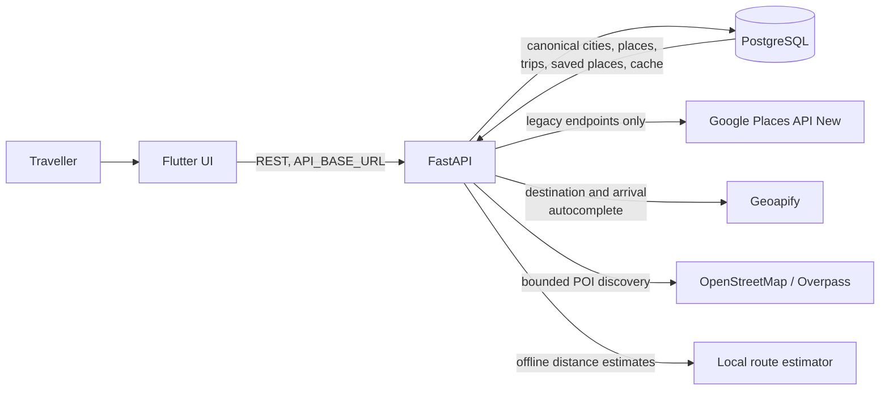
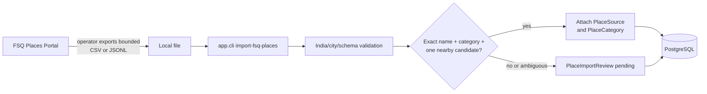
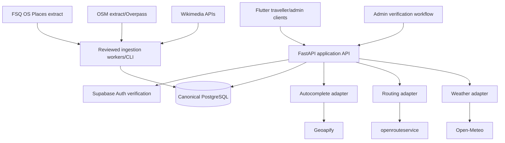

# YatraCanvas architecture

Last reviewed: 2026-09-04 (audit by chore/project-audit-cleanup)

Status labels are defined in [Project context](PROJECT_CONTEXT.md). This document separates
repository reality from the intended provider architecture.

## Current architecture

### Flutter

`[IMPLEMENTED]` `lib/main.dart` starts the traveller application and `lib/main_admin.dart`
starts a separate admin shell. Screens call small `http` service classes using the base URL in
`lib/config/api_config.dart`. Models are local Dart value objects. Navigation and state are
widget-local; there is no dependency-injection, router, persistence, or global state layer.

`[IMPLEMENTED]` The trip-building screens share a `TripDraft`. After Preferences, `TripService`
posts the existing city/date/arrival/purpose/preference values to the backend, retains the
returned `trip_id` in that draft, and passes it plus the saved trip purposes and route-start
readiness to Place Discovery. The saved purposes automatically fetch the initial recommendation
categories. Derived categories are presented as trip context, not as manually selected optional
chips; a collapsed, neutral extra-interest panel can add per-request refinements without becoming
a second preference source. Recommendation results appear before the saved-place/route builder.
Submission has loading, validation/network/backend/malformed-response handling and a
duplicate-tap guard.

`[IMPLEMENTED]` Destination selection searches canonical `City` rows first and then calls the
provider-neutral `/locations/autocomplete` endpoint with an India/city filter. A selected
Geoapify result is normalized through `/cities/resolve`; selecting an existing city performs no
provider call. `[PARTIAL]` The canonical city row does not yet retain the Geoapify place ID.

`[IMPLEMENTED]` Arrival-point search also uses the provider-neutral Geoapify-backed location
endpoint so an arrival used as the route origin has coordinates. The Flutter query is enriched
from the selected transport (for example, `Guwahati railway station`) and does not apply the
hotel/amenity-only result filter used by hotel search. Suggestions remain selectable after the
field loses focus. Selecting a different destination clears the previous city's arrival/start
fields, and Place Discovery disables route optimization when the current in-memory draft has no
coordinate-backed start.

`[PARTIAL]` `TripDraft` and its `trip_id` remain widget-local and in memory; they do not survive
an app restart. Trip listing/editing and authenticated ownership are absent. The admin shell
uses hard-coded metrics and rows and has no admin API client.

`[IMPLEMENTED]` `flutter_map: ^8.3.2` provides an interactive OpenStreetMap tile map in
`trip_map_screen.dart`. It renders start/place markers, day-filtered road-following
`PolylineLayer` geometry from `RouteGeometryService`, and camera bounds fitting. No proprietary
platform Maps SDK is required.

### FastAPI

`[IMPLEMENTED]` `backend/app/main.py` assembles routers for:

| Area | Current endpoints |
| --- | --- |
| Status | `GET /` |
| Cities | create/list/get/search; Google autocomplete, details, and resolve |
| Locations | Geoapify-backed `GET /locations/autocomplete` |
| Places | create/list; legacy Google discovery; OpenStreetMap recommendations |
| Saved places | list/create/update/reorder/delete under a trip |
| Trips | create a trip; get/update start location |
| Routing | optimize an existing trip using cached travel-time matrix and Google OR-Tools VRPTW solver with opening hours, visit durations, multi-day vehicle partitioning, lunch breaks, locked places, and priority/must-visit rules; attaches final route geometry |
| Route geometry | `GET /trips/{trip_id}/route-geometry` using OSRM or openrouteservice |
| Weather advisories | `GET /trips/{trip_id}/weather-advisories`, `GET /trips/{trip_id}/weather-alternatives`, `POST /trips/{trip_id}/rearrange-preview`, `POST /trips/{trip_id}/apply-itinerary-adjustment`, `POST /trips/{trip_id}/ignore-weather` |
| Smart re-planning | `GET /trips/{trip_id}/replan-impact`, `POST /trips/{trip_id}/replan-preview`, `POST /trips/{trip_id}/replan-apply` |

Provider errors are translated into safe HTTP failures by routers. Settings are read from
`backend/.env` or the process environment. Secrets use `SecretStr` and are unwrapped only at a
provider boundary.

`[IMPLEMENTED]` Smart re-planning invalidation engine (`SmartReplanningService`) enforces centralized change impact rules:
- `UPDATE_NOTES`: zero invalidation, saves immediately without running the optimizer.
- `ADD_PLACE`, `REMOVE_PLACE`, `REORDER_PLACES`, `UPDATE_PRIORITY`, `UPDATE_MUST_VISIT`, `UPDATE_LOCKED`: marks itinerary stale, preserves existing valid pairwise legs in `RouteMatrixCache` (requesting only missing pairs), generates a non-persisted preview diff, and applies atomically upon user confirmation.
- `UPDATE_START_LOCATION`: selectively purges only start-related directional legs (`start_only`), keeping all place-to-place matrix rows intact.
- `UPDATE_DATES`: marks weather advisories stale and realigns schedule dates without discarding route matrix rows or geometry.
- `UPDATE_CITY`: purges all route matrix cache and itinerary rows for the trip (`all`).

`[IMPLEMENTED]` Place Discovery & Recommendation Quality Pipeline (`RecommendationService`):
- Candidate Retrieval: multi-category queries across stored POIs and bounded OpenStreetMap discovery.
- Canonical & Spatial Deduplication (`deduplicate_places`): identity resolution hierarchy using canonical `Place.id`, provider namespace keys (`source:external_id`), and spatial proximity ($\le 75$m distance threshold with normalized tokenized name similarity). Genuinely separate branches of the same chain (e.g. 4 km apart) are strictly preserved as distinct venues.
- Traveller-Suitability & Access Confidence (`is_traveller_suitable`): general context-based evaluation classifying venues into `PUBLIC_LIKELY`, `UNKNOWN`, `RESTRICTED_LIKELY`, and `RESTRICTED`. Automatically excludes student messes, institutional canteens, staff cafeterias, and restricted-access venues without blacklisting individual university/company names.
- Scoring & Diversity: deterministic scoring combining category match, access confidence, verified ratings/reviews, and city center proximity without fabricated data; generates explainable recommendation reasons and flags saved places.

`[IMPLEMENTED]` OR-Tools VRPTW Itinerary Optimization Pipeline (`RouteOptimizationService`, `VrptwSolverService`):
- **Problem Formulation**: Multi-vehicle Vehicle Routing Problem with Time Windows where vehicles represent trip days ($1 \dots \text{days}$). The depot (index 0) is the trip start location (hotel/station).
- **Opening Hours**: Modeled as node time windows on the Time dimension $[\max(\text{start}, open), \min(\text{end}, close - visit\_duration)]$ with day-of-week closure constraints removing invalid vehicles.
- **Visit Durations**: Service times per node based on category heuristics (`estimate_visit_duration`).
- **Multiple Days**: Partitioned across daily touring hours (`09:00–19:00`) respecting daily time budgets.
- **Lunch Breaks**: Midday break intervals (`12:30–14:00`, 60 min) scheduled via vehicle break intervals.
- **Locked Places**: Pinned positions (e.g. first stop) and relative order constraints enforced across days and slots.
- **Priorities & Must-Visit Rules**: Disjunctions with scaled drop penalties (must-visit places have $100,000,000$ penalty and cannot be dropped; low-priority places dropped first under budget constraints) and active-conditional Big-M priority precedence.
- **Route Geometry**: Automatically triggers `RouteGeometryService` to prefetch and attach road-following geometry to the optimization response.

`[PARTIAL]` `LocationAutocompleteProvider`, `RouteGeometryProvider`, and `WeatherProvider` are
provider-neutral protocols. Normal recommendations use bounded OpenStreetMap/Overpass discovery,
road geometry uses keyless OSRM (or openrouteservice), and weather advisories use Open-Meteo with
in-memory caching and deterministic indoor/outdoor place environment classification.
Legacy Google-specific city/discovery and route client code remains but is not called by the normal Flutter flow.
There are no auth, user-profile, trip read/update/list/delete, admin,
ingestion-job, or observability endpoints.

### Database and schema changes

`[IMPLEMENTED]` SQLModel entities represent cities, canonical places and provenance, import
reviews, trips/preferences, saved places, route-matrix cache rows, and itinerary rows. PostgreSQL
is required by configuration; tests substitute in-memory SQLite where supported.

`[PARTIAL]` Startup calls `SQLModel.metadata.create_all`. Standalone forward SQL scripts in
`backend/sql/` handle changes to existing databases; only the FSQ/Geoapify foundation currently
has a tracked rollback script. There is no Alembic/Supabase migration history or automated
schema-version check. No migration was applied during this documentation audit.

## Current runtime flow

No provider key belongs in Flutter. The backend may start with only `DATABASE_URL`; a missing
optional key disables only its provider-backed path. Stored reads and unrelated providers can
continue.

## Current offline import flow

`[IMPLEMENTED]` The importer streams a bounded local extract, matches conservatively, retains
FSQ IDs and source metadata, and does not call the proprietary Foursquare Places API. There is
no scheduler or remote Iceberg client in this repository. Operators obtain/export the dataset
outside the importer, so portal access-token handling is `[UNKNOWN]` here and is not an app
environment variable.

## Caching and fallback today

- `[IMPLEMENTED]` `CityCategoryCache` gives OpenStreetMap/Audiala-backed place discovery a
  configurable expiry (`PLACE_DISCOVERY_CACHE_TTL_HOURS`, default 24h).
  Canonical `Place`, `PlaceSource`, and `PlaceTag` records remain stored after refresh.
- `[IMPLEMENTED]` Geoapify autocomplete uses an in-process TTL cache. It disappears on restart,
  is not shared across replicas, and returns a recoverable provider/configuration error when it
  cannot serve a request.
- `[IMPLEMENTED]` `RouteMatrixCache` stores coordinate-based local estimates under the
  `local_estimate` mode. These are approximate straight-line-derived distances/times, not road
  directions or live traffic.
- `[IMPLEMENTED]` `RouteGeometryService` caches real road-following geometry polylines in memory
  using a coordinate fingerprint (`trip_id:day_number:coords_hash`) with a configurable TTL
  (`ROUTE_GEOMETRY_CACHE_TTL_MINUTES`, default 60 min). This avoids repeated external routing
  calls during map interactions and day filtering without altering `RouteMatrixCache`.
- `[IMPLEMENTED]` Route geometry is served through a provider-neutral abstraction
  (`RouteGeometryProvider`) supporting both the target openrouteservice directions API
  (`OpenRouteServiceGeometryProvider`) and keyless open-data OSRM (`OSRMGeometryProvider`).
- `[IMPLEMENTED]` OpenStreetMap discovery serves previously persisted category results when an
  expired/missing cache refresh is temporarily unavailable. A category with no stored results
  still returns the provider's explicit retryable failure.
- `[IMPLEMENTED]` A multi-category recommendation refresh combines all uncached category filters
  into one bounded Overpass request, then classifies and persists the returned POIs per category.
  This keeps request time bounded by one provider call instead of one call per selected chip.
- `[PARTIAL]` Place freshness is represented at city/category and source levels, but there is no
  general refresh queue, purge policy, or source deletion/tombstone workflow.
- `[PLANNED]` Target adapters must define timeout, retry/backoff, cache TTL, stale-data behavior,
  and user-visible degradation consistently. No silent cross-provider substitution is allowed.

## Target architecture

Target responsibilities:

- Flutter renders flows, handles safe device permissions, and consumes application-owned API
  schemas. It does not become a collection of provider clients.
- FastAPI authenticates requests, enforces ownership/authorization, exposes stable schemas, and
  owns provider adapters, cache policy, orchestration, and safe error translation.
- Supabase Auth is the intended identity provider; PostgreSQL remains canonical for application
  and curated place data. Direct-client database access is allowed only after reviewed RLS.
- Batch ingestion stages open provider records with provenance before canonical merge. Human
  review resolves ambiguity and corrections.
- Geoapify handles runtime autocomplete/geocoding, not POI discovery, maps, and routing by
  default. openrouteservice handles directions/matrices. FSQ OS/OSM/Wikimedia are ingestion and
  enrichment sources. Open-Meteo and Frankfurter are narrowly scoped feature providers.
- Google Places and Routes remain temporary current adapters until replacements, data backfill,
  attribution, and rollback behavior pass acceptance tests. Map rendering is a separate decision.

## Provider-adapter boundary

Each new adapter should accept application-owned request types and return application-owned
results. Provider response objects must stop at the adapter. A production adapter needs:

1. typed configuration and backend-only secret handling;
2. explicit timeouts and classified errors;
3. tests with representative provider payloads owned by the test suite;
4. provenance and provider identifiers for persisted data;
5. cache/freshness and deletion/update semantics;
6. licensing and attribution behavior documented in
   [APIs and data sources](API_AND_DATA_SOURCES.md).

Changing the selected provider must not silently change a REST contract or canonical record.

## Security boundaries

- Flutter's `API_BASE_URL` is public configuration. Database and provider credentials are
  backend secrets. No real value belongs in source control, docs, URLs in logs, or test fixtures.
- `[PLANNED]` Authenticate users and derive ownership from verified tokens. Current trip creation
  rejects client-supplied identity and assigns a server-owned development-only placeholder UUID;
  this is isolated scaffolding, not an implemented authorization boundary.
- `[UNKNOWN]` RLS status cannot be inferred from SQLModel. Before any Supabase client accesses
  exposed tables, track and test grants and RLS policies as migrations.
- Imports and admin corrections are privileged operations. They need authentication,
  authorization, audit history, bounded input, dry-run, and reviewed execution before production.
- Preserve legacy identifiers and constraints through reversible migrations and tested backfills.

## Observability expectations

`[PLANNED]` Add structured logs and metrics for endpoint latency, provider latency/status,
cache hit/miss/stale use, import counts/rejections/reviews, and itinerary outcomes. Correlation IDs
must not expose tokens, precise private trip data, or provider keys. Define alerting and retention
only with the deployment architecture; both are currently `[UNKNOWN]`.

## Major gaps between current and target

| Concern | Current | Target |
| --- | --- | --- |
| Identity/authorization | `[PLANNED]` login UI only | Supabase Auth, server verification, ownership tests, reviewed RLS |
| Trip lifecycle | `[PARTIAL]` create flow and downstream single-session ID handoff; no read/edit/resume/auth | persisted creation through multi-day itinerary lifecycle |
| Place acquisition | Google runtime refresh plus local FSQ importer | reviewed FSQ/OSM ingestion and optional Wikimedia enrichment |
| Routing | `[IMPLEMENTED]` pairwise matrix estimates, constraint-aware optimizer; real road geometry via openrouteservice/OSRM | provider-neutral openrouteservice directions/matrix and multi-day planning |
| Map | `[IMPLEMENTED]` FlutterMap with OpenStreetMap tiles, markers, and real road-route PolylineLayer | explicit renderer/tiles decision with attribution and offline policy |
| Admin | mock UI plus review table | authorized, audited review/dedupe/correction workflow |
| Migrations | `create_all` plus SQL scripts | ordered, reversible, tested migration history |
| Operations | `[UNKNOWN]` | documented deployment, health, metrics, backup, and incident behavior |
