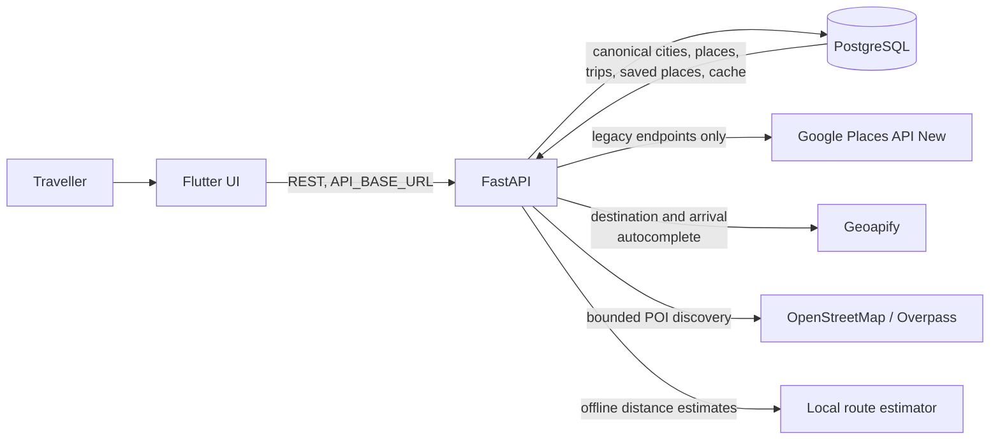
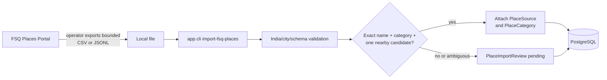
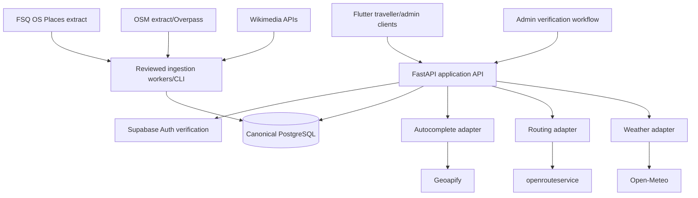

# YatraCanvas architecture

Last reviewed: 2026-09-07

Status labels are defined in [Project context](PROJECT_CONTEXT.md). This document separates
repository reality from the intended provider architecture.

## Current architecture

### Flutter

`[IMPLEMENTED]` `lib/main.dart` starts the traveller application and `lib/main_admin.dart`
starts a separate admin shell. Screens call small `http` service classes using the base URL in
`lib/config/api_config.dart`. Models are local Dart value objects. Navigation and state are
widget-local; there is no dependency-injection, router, persistence, or global state layer.

`[IMPLEMENTED]` The trip-building screens share a `TripDraft`. After Preferences, `TripService`
posts the existing city/date/arrival/purpose/preference values to the backend, retains the
returned `trip_id` in that draft, and passes it plus the saved trip purposes and route-start
readiness to Place Discovery. The saved purposes automatically fetch the initial recommendation
categories. Derived categories are presented as trip context, not as manually selected optional
chips; a collapsed, neutral extra-interest panel can add per-request refinements without becoming
a second preference source. Recommendation results appear before the saved-place/route builder.
Submission has loading, validation/network/backend/malformed-response handling and a
duplicate-tap guard.

`[IMPLEMENTED]` Destination selection searches canonical `City` rows first and then calls the
provider-neutral `/locations/autocomplete` endpoint with an India/city filter. A selected
Geoapify result is normalized through `/cities/resolve`; selecting an existing city performs no
provider call. `[PARTIAL]` The canonical city row does not yet retain the Geoapify place ID.

`[IMPLEMENTED]` Arrival-point search also uses the provider-neutral Geoapify-backed location
endpoint so an arrival used as the route origin has coordinates. The Flutter query is enriched
from the selected transport (for example, `Guwahati railway station`) and does not apply the
hotel/amenity-only result filter used by hotel search. Suggestions remain selectable after the
field loses focus. Selecting a different destination clears the previous city's arrival/start
fields, and Place Discovery disables route optimization when the current in-memory draft has no
coordinate-backed start.

`[PARTIAL]` `TripDraft` and its `trip_id` remain widget-local and in memory; they do not survive
an app restart. Trip listing/editing and authenticated ownership are absent. The admin shell
uses hard-coded metrics and rows and has no admin API client.

`[IMPLEMENTED]` `flutter_map: ^8.3.2` provides an interactive OpenStreetMap tile map in
`trip_map_screen.dart`. It renders start/place markers, day-filtered road-following
`PolylineLayer` geometry from `RouteGeometryService`, and camera bounds fitting. No proprietary
platform Maps SDK is required. Progressive map rendering architecture pre-passes known trip state
from `PlaceDiscoveryScreen` (`initialStartLocation`, `initialSavedPlaces`, `initialOptimizedRoute`,
`initialRouteGeometry`, `initialDurationDays`), rendering the base map and markers immediately on
Frame 1 without blocking on route recalculation, while fetching missing route polylines asynchronously.
The day filter exposes every logical day in the trip ($1 \dots N$), displaying clear non-destructive empty
notices on unassigned days.

### FastAPI

`[IMPLEMENTED]` `backend/app/main.py` assembles routers for:

| Area | Current endpoints |
| --- | --- |
| Status | `GET /` |
| Cities | create/list/get/search; Google autocomplete, details, and resolve |
| Locations | Geoapify-backed `GET /locations/autocomplete` |
| Places | create/list; legacy Google discovery; OpenStreetMap recommendations; staged background prefetch (`POST /places/prefetch`, `GET /places/prefetch/{city_id}`); destination-scoped search (`GET /cities/{city_id}/places/search`); canonical resolution (`POST /cities/{city_id}/places/resolve`) |
| Saved places | list/create/update/reorder/delete under a trip |
| Trips | create a trip; get/update start location; list trip days (`GET /trips/{trip_id}/days`); configure individual trip day (`PATCH /trips/{trip_id}/days/{day_number}`) |
| Routing | optimize an existing trip using cached travel-time matrix and Google OR-Tools VRPTW solver with opening hours, visit durations, multi-day vehicle partitioning, lunch breaks, locked places, and priority/must-visit rules; returns `total_days` and attaches final route geometry |
| Route geometry | `GET /trips/{trip_id}/route-geometry` using OSRM or openrouteservice |
| Weather advisories | `GET /trips/{trip_id}/weather-advisories`, `GET /trips/{trip_id}/weather-alternatives`, `POST /trips/{trip_id}/rearrange-preview`, `POST /trips/{trip_id}/apply-itinerary-adjustment`, `POST /trips/{trip_id}/ignore-weather` |
| Smart re-planning | `GET /trips/{trip_id}/replan-impact`, `POST /trips/{trip_id}/replan-preview`, `POST /trips/{trip_id}/replan-apply` |

Provider errors are translated into safe HTTP failures by routers. Settings are read from
`backend/.env` or the process environment. Secrets use `SecretStr` and are unwrapped only at a
provider boundary.

`[IMPLEMENTED]` Smart re-planning invalidation engine (`SmartReplanningService`) enforces centralized change impact rules:
- `UPDATE_NOTES`: zero invalidation, saves immediately without running the optimizer.
- `ADD_PLACE`, `REMOVE_PLACE`, `REORDER_PLACES`, `UPDATE_PRIORITY`, `UPDATE_MUST_VISIT`, `UPDATE_LOCKED`: marks itinerary stale, preserves existing valid pairwise legs in `RouteMatrixCache` (requesting only missing pairs), generates a non-persisted preview diff, and applies atomically upon user confirmation.
- `UPDATE_START_LOCATION`: selectively purges only start-related directional legs (`start_only`), keeping all place-to-place matrix rows intact.
- `UPDATE_DATES`: marks weather advisories stale and realigns schedule dates without discarding route matrix rows or geometry.
- `UPDATE_CITY`: purges all route matrix cache and itinerary rows for the trip (`all`).

`[IMPLEMENTED]` Trip Day Planning Foundation (`TripDayService`):
- **Concept**: A trip consists of a sequence of configurable days (`Trip` -> `TripDay[]`). A 5-day trip does not necessarily mean 5 sightseeing days; each day has a specific `DayType` (`FULL_DAY`, `HALF_DAY`, `REST`, `TRAVEL`) and daily touring window (`start_time`, `end_time`).
- **Automatic Generation**: Newly created trips automatically generate sequential `TripDay` records defaulting to `FULL_DAY` with default touring windows (`DEFAULT_DAY_START_TIME` 09:00, `DEFAULT_DAY_END_TIME` 19:00).
- **Individual Day Configuration**: Travelers can configure days individually (`FULL_DAY` -> `REST`, `HALF_DAY`, or `TRAVEL`), adjust touring start/end times, or configure `REST` days with no sightseeing window.
- **Safe Date & Duration Reconciliation**: Updating trip dates or duration reconciles `TripDay` records safely. Expanding duration adds newly required days; shifting dates realigns day calendar dates while preserving configured day types and touring windows. If reducing trip duration would destroy existing `TripItinerary` visits or remove days that have locked places assigned to them, the operation is explicitly rejected with a clear validation error to prevent silent data destruction.
- **Optimization Role**: `[IMPLEMENTED]` TripDay windows and active-day boundaries feed VRPTW.

`[IMPLEMENTED]` Selected Place Day Assignment Foundation (`UserSavedPlace`, `SavedPlaceService`):
- **Architecture**:
  ```text
  Trip
   ├── TripDay[]
   │    ├── day_number
   │    ├── date
   │    ├── day_type
   │    ├── start_time
   │    └── end_time
   │
   └── SelectedPlace[] (UserSavedPlace)
        ├── assignment_mode = AUTO | LOCKED
        └── assigned_day_id = nullable (foreign key to TripDay)
  ```
- **Assignment Modes**:
  - `AUTO`: `assigned_day_id` is null. The place will be scheduled onto an appropriate sightseeing day by YatraCanvas during optimization.
  - `LOCKED`: `assigned_day_id` is required. The place is pinned to a specific `TripDay` belonging to the same trip that is not a `REST` day and has a usable sightseeing window.
- **Switching**: Users can freely switch places from `LOCKED` to `AUTO` (which clears `assigned_day_id` to null without deleting the place or re-running optimization) or from `AUTO` to `LOCKED`.
- **Integrity Protections**:
  - A `TripDay` update to `REST` or removal of its touring window is rejected with a 422 error if places are locked to it ("Day X cannot be changed to REST because N places are locked to this day. Move or unlock those places first.").
  - A trip duration reduction is rejected with a 422 error if places are locked to any day being eliminated.
  - Deleting a saved place never corrupts or cascades into `TripDay` records.
  - Database check constraints enforce valid modes (`ck_user_saved_places_assignment_mode`) and consistency (`ck_user_saved_places_assignment_consistency`).
- **Optimizer Integration**: `[IMPLEMENTED]` Native vehicle domains enforce assigned-day locks.

`[IMPLEMENTED]` Place Discovery & Canonical Identity Architecture:
- Canonical Multi-Source Place Identity Resolver (`CanonicalPlaceService`): Central resolution layer resolving place identity across multiple providers (OpenStreetMap, Audiala) into a single canonical `Place` database entity while maintaining complete provider-specific provenance, licensing, and metadata in `PlaceSource` records:
  - **Rule 1 (Existing Provider Identity)**: Deterministic lookup by `(source, external_place_id)` ensures 100% idempotency during repeated ingestions from the same provider.
  - **Rule 2 (Shared Global Identifier)**: Cross-provider deterministic matching via shared Wikidata QID (from Overpass `wikidata` tag or Audiala `external_place_id`) links both provider sources (e.g. OSM and Audiala) to one canonical `Place` row.
  - **Rule 3 (Conservative Fallback Matching)**: For candidates lacking strong global IDs, conservative matching requires spatial distance $\le 100$m, category compatibility (`{heritage, tourism}`, `{heritage, religious}`, `{food, cafes}`, `{food, markets}`), and strict tokenized name match with only recognized benign variants (e.g. Indian honorifics "Devi", "Mandir"). Disqualifying specifiers (e.g. "Gate 1" vs "Gate 2", "North" vs "South") and incompatible categories never merge. Prefers false negatives over incorrect merges.
  - **Rule 4 (New Place Creation)**: Creates canonical `Place` with initial `PlaceSource` provenance and category `PlaceTag`.
  - **Provenance Preservation**: Full attribution and licensing (`ODbL-1.0` for OSM, `CC BY 4.0` for Audiala) and provider URLs/contact data are fully preserved on `PlaceSource`.
- Recommendation-Level Deduplication (`deduplicate_places` in `RecommendationService`): Operates downstream of database identity as a presentation-layer filter, clustering any unmerged ambiguous items ($\le 75$m distance threshold with normalized tokenized name similarity and Levenshtein typo tolerance $\le 2$) and capping multi-outlet commercial chain brands to at most 1 representative instance so travelers never see duplicate cards or 10 identical fast-food outlets while database provenance remains completely intact.
- Traveller-Suitability & Access Confidence (`is_traveller_suitable`): general context-based evaluation classifying venues into `PUBLIC_LIKELY`, `UNKNOWN`, `RESTRICTED_LIKELY`, and `RESTRICTED`. Evaluates explicit OSM access tags, institutional `operator` values, `building` context, and non-tourist facility patterns (corporate offices, retail bank branches, ATMs). Automatically excludes student messes, institutional canteens, staff cafeterias, and restricted-access venues without blacklisting individual university/company names.
- Scoring & Diversity: deterministic scoring combining category match, access confidence, verified ratings/reviews, and bounded POI prominence scoring (`PlaceImportanceScorer` using log-normalized sitelinks & PageRank from Wikidata/Audiala, weighted at 15.0 pts within relevant candidates) without fabricated data; generates explainable recommendation reasons and flags saved places. Mixed-interest category balancing interleaves strongly requested categories without prohibitive cross-tier score dropoffs, preventing category starvation.
- `[IMPLEMENTED]` Progressive POI Prefetch & Cache-First Live Discovery Reliability (`ProgressivePrefetchCoordinator`, `CityPlacePrefetchService`, `OpenStreetMapDiscoveryService`, `GeoapifyPlacesProvider`, `ProviderCircuitBreaker`):
  - **3-Tier Cache Semantics**: Queries evaluate category coverage into `FRESH` ($\le 24$h / `PLACE_DISCOVERY_CACHE_TTL_HOURS`), `STALE_USABLE` ($\le 168$h / `DISCOVERY_STALE_USABLE_HOURS`), and `MISSING`. A completed fresh destination query is authoritative even when a small city has fewer results than the request limit, preventing perpetual refetch. Cache keys are `(city_id, PLACE_DISCOVERY_CACHE_VERSION, category)`; incrementing the configured version invalidates an incompatible query strategy without deleting rows manually.
  - **Stale Cache Behavior**: Stale-usable categories immediately return cached places without a foreground provider call. A durable background refresh queue is not implemented.
  - **In-Memory Concurrency Deduplication**: the process-wide `ProgressivePrefetchCoordinator` maintains active tasks keyed by `(city_id, category)`. Overlapping prefetch triggers reuse categories already being refreshed rather than duplicating external network requests. `CityPlacePrefetchService` also guards duplicate category refreshes within one service instance.
  - **Provider Hierarchy & Circuit Breaker**: Discovery first serves stored DB cache, then merges `AudialaPlacesProvider` (local enriched POI dataset), `GeoapifyPlacesProvider` (hosted Geoapify `/v2/places` API with bounded coordinate radius), and `OpenStreetMapPlacesService` (Overpass OSM) for missing categories. Speculative destination prefetch uses the fast local/Geoapify layers and leaves genuinely missing categories for foreground fallback. Foreground discovery skips Overpass for categories where those layers already meet `DISCOVERY_MIN_USABLE_CANDIDATES_PER_CATEGORY`. Remaining Overpass work is protected by an in-memory circuit breaker and a 12-second default phase budget.
  - **Background Dispatch**: `POST /places/prefetch` returns HTTP 202 after enqueueing work. Database lookup, normalization, and provider work run in a worker thread with an independent session, so remote database stalls cannot freeze FastAPI's event loop. The process-wide coordinator deduplicates active `(city_id, category)` tasks; foreground recommendations join matching tasks before reading the cache. `GET /places/prefetch/{city_id}` reports coarse state (`idle`, `fetching`, `partially_ready`, `ready`, `failed`), completed/failed stages, normalized POI count, and loaded categories.
  - **Remote Database Efficiency**: Cache metadata, category coverage, stored places, and existing provider identities are loaded in batches rather than one query per category or POI. When a city has no stored places and all discovery categories are requested, provider candidates are canonicalized in memory and inserted as one cold-city batch while preserving provider provenance, category tags, and opening hours. This avoids a remote-database identity query for every candidate.
  - **Progressive Lifecycle**: destination confirmation enqueues a bounded pool across all seven supported discovery categories before immediate navigation; dates and start location record readiness without premature weather, image, route, or matrix calls; interests reuse fresh coverage and enrich only deficient categories. Final recommendations use the same `CityCategoryCache` and normalized `Place` rows.
  - **Start-aware Ranking**: Once a persisted trip supplies start coordinates, recommendation scoring adds a bounded proximity signal. It uses straight-line filtering only and does not build an NxN route matrix.
  - **Durability**: `[PARTIAL]` POI/cache rows are durable, but queued tasks and progress state are process-local and are lost on backend restart. A durable multi-process worker queue remains `[PLANNED]`.
  - **Partial Provider Success**: Individual category failures (e.g. Overpass food timeout) do not fail the request; available categories are merged, scored, and returned. Full blocking error screens appear only when genuinely 0 usable places exist across all sources.

`[IMPLEMENTED]` Place Opening Hours Ingestion & Normalization (`OpeningHoursParser`, `CanonicalPlaceService`, `PlaceOpeningHours`):
- **Architecture**:
  ```text
  Provider (OSM Overpass / Geoapify)
     ↓
  raw opening_hours string preserved
     ↓
  OpeningHoursParser
     ↓
  NormalizedOpeningHours
     ├── status (KNOWN | CLOSED | UNKNOWN)
     └── days[0..6] (day_of_week, status, intervals[])
     ↓
  Canonical Place
   └── PlaceOpeningHours (7 normalized rows per place)
        ├── day_of_week (0=Monday..6=Sunday)
        ├── status (KNOWN, CLOSED, UNKNOWN)
        └── intervals: [{"open": "09:00", "close": "11:00"}, {"open": "14:00", "close": "22:00"}]
  ```
- **Provider Extraction**:
  - OpenStreetMap: raw `opening_hours` tag is extracted and preserved in `PlaceSource.raw_opening_hours` and `Place.raw_opening_hours`.
  - Geoapify: raw `properties.opening_hours` is mapped into `tags["opening_hours"]` and preserved.
  - Providers without opening hours: no additional network calls are made automatically; status is set to `UNKNOWN` and intervals remain empty.
- **Normalization Capabilities**:
  - Single interval: `Mo-Fr 09:00-17:00`
  - Split schedules: `Mo 09:00-11:00,14:00-22:00` (supports multiple opening windows in a single day)
  - Weekday ranges: `Mo-Sa 10:00-19:00`
  - Closed / off days: `Sa-Su off` or global `closed`
  - Overnight hours: `18:00-02:00` is partitioned into `18:00-24:00` on Day $D$ and `00:00-02:00` on Day $(D+1)\%7$.
  - 24/7 hours: `24/7`, `open 24/7` normalized to `00:00-24:00` across all 7 days.
  - Malformed or invalid input: safely handled without crashing; status is marked `UNKNOWN` while preserving raw string.
- **Critical Semantic: UNKNOWN is NOT Open**:
  - `UNKNOWN` status indicates missing or unverified schedule information. It is strictly distinguished from `CLOSED` and `KNOWN`.
  - Helper functions (`isOpenAt`, `canVisitBetween`) return an indeterminate `null`/`None` result for `UNKNOWN`, never assuming open all day.
- **Public API Contract**:
  - Endpoints returning `PlaceRead` expose `opening_hours_status`, `raw_opening_hours`, and a normalized `opening_hours` dictionary mapping weekday names (`monday`..`sunday`) to lists of intervals `[{"open": "HH:MM", "close": "HH:MM"}]`.
- **Optimizer Integration**:
  - `[IMPLEMENTED]` Normalized weekday rows feed the tested day-aware solver.

`[IMPLEMENTED]` Day-aware OR-Tools VRPTW pipeline (verified 2026-09-07):

```text
TripDays
  -> Active OR-Tools routes
       |-- configured day time window and original day_number/date
       |-- AUTO / LOCKED native vehicle-domain restrictions
       |-- existing category visit duration
       |-- normalized weekday opening intervals (closed gaps retained)
       `-- existing travel-time matrix
              -> OR-Tools -> Scheduled + Unscheduled
```

- `planner_inputs.load_planner_inputs` reads TripDays and normalized `PlaceOpeningHours`
  once for optimization and full-trip replan previews. No opening-hour enrichment calls.
  Legacy trips with no TripDays use in-memory default days; partially configured trips do
  not have missing/null windows silently filled. Previews do not write TripDays.
- REST always has no route. FULL_DAY, HALF_DAY and TRAVEL require both times and end > start.
  Vehicle indices enumerate active days, while output retains original day numbers.
- Each vehicle has a separate 1,440-minute coordinate band in the Time dimension, enabling
  exact weekday-specific unions of valid start intervals on one node per selected place.
  Start/end cumuls stay inside the configured window. Travel plus origin service duration
  is the transit; closing minus visit duration bounds the last valid start.
- CLOSED removes a day; UNKNOWN applies only the sightseeing window and returns
  `is_opening_hours_known=false`. A missing normalized weekday is unverified, even when
  other weekdays are known. `24:00` interval boundaries are represented as 1,440 minutes.
- `assignment_mode=LOCKED` permits only the route matching `assigned_day_id` using native
  `VehicleVar.RemoveValue` restrictions (the OR-Tools 9.15 Windows SetAllowedVehiclesForIndex
  Python binding rejects ordinary lists). Dropping remains allowed; locks never migrate.
  Legacy `is_locked` first-position and relative ordering are conditional on activity;
  explicit day assignment takes precedence over the legacy ordering flag.
- Existing priority penalties remain 50,000 + priority * 10,000; must-visit remains
  100,000,000; locks add 1,000,000,000. These are retention preferences, not hard priority
  visit precedence. All visits remain optional to support feasible partial itineraries.
- Travel/service cost plus a soft span penalty above 75% of each individual day's capacity
  discourages heavily utilized days. The coefficient scales inversely with capacity.
  A small 100-unit route activation cost allows underfilled trips to use fewer days.
  No POI-count quotas or equal-duration constraints are imposed.
- Lunch uses the existing 60-minute duration and 12:30–14:00 start range only when a full
  break fits inside the day's window. Break transit metadata includes service times so
  lunch cannot overlap a visit. Empty routes do not emit breaks.
- Existing start node and matrix cache are reused. As in the previous solver, the synthetic
  end-depot arc is zero cost/time: return-to-hotel travel is not charged.
- PATH_CHEAPEST_ARC and GUIDED_LOCAL_SEARCH retain the five-second default solve budget;
  fractional test limits are honored in milliseconds. No optimality proof is promised.
- Responses and replan previews add `unscheduled_places` with place ID/name, structured
  reason and optional assigned day ID. Scheduled rows retain times, leg metrics and known-hours
  state. `total_days=trip.days` preserves empty logical days. The selection cap is now 50;
  there is no minimum-place-per-day requirement. No recommendations fill empty days.
- Scheduled rows alone are persisted in `TripItinerary`; saved selections are never deleted.
  Unscheduled reasons and known-hours state are generation-response metadata, not durable
  snapshots. No schema migration is introduced. Full-trip preview and apply share inputs;
  existing staleness detection still flags intentionally unscheduled places (technical debt).
- Geometry attachment remains best-effort after persistence. Flutter consumes optional
  unscheduled lists and existing known-hours booleans; no final itinerary UI redesign.

See [planner implementation report](PLANNER_IMPLEMENTATION.md) and
[actual synthetic five-day example](PLANNER_EXAMPLE.md).

`[IMPLEMENTED]` Live Itinerary Status Handling & Partial Day Replanning (verified 2026-09-07):

```text
Existing itinerary
Day 1
  ├── completed prefix (immutable)
  └── remaining route
Missed place
      ↓
User selects target day
      ↓
Validate target (REST check, window check)
      ↓
Replan affected day(s) only (OR-Tools single-day suffix)
      ↓
Save updated itinerary
```

- **Stop Status Lifecycle**:
  - `TripItinerary.status` persisted in PostgreSQL with check constraint `ck_trip_itinerary_status IN ('PLANNED', 'COMPLETED', 'MISSED', 'SKIPPED')` and default `'PLANNED'`.
  - Immediate atomic status transition endpoints: `PATCH /trips/{trip_id}/itinerary/stops/{stop_id}` and `PATCH /trips/{trip_id}/itinerary/places/{place_id}`.
  - Marking a stop as `MISSED` records traveller execution history in place without auto-mutating future stops or days. Marking `SKIPPED` excludes the stop from subsequent route optimization while preserving its historical record.
- **Single-Day Partial Replanning**:
  - Endpoint: `POST /trips/{trip_id}/itinerary/move-place` moving a place to a user-selected target `TripDay` (by `target_day_number` or `target_day_id`).
  - **Pre-Validation**: Ensures target day exists in the same trip, is not a `REST` day, and possesses a usable sightseeing window (`end_time > start_time`). Completed and skipped places cannot be moved; moving to the same day is rejected.
  - **Target Day Feasibility Guard**: Evaluates target day insertion using an OR-Tools single-day suffix solver. If the target day's sightseeing window, opening hours, or capacity cannot accommodate all existing places plus the moved place, the request returns a structured non-destructive failure (`{"success": false, "reason": "TARGET_DAY_INFEASIBLE"}`) leaving database records completely untouched.
  - **Immutable Completed Prefix**: On both target and source days, stops with `status == 'COMPLETED'` ($1 \dots K$) are strictly preserved. Suffix re-optimization starts from `RouteNode.for_place(last_completed_place)` with `effective_start_time = max(day.start_time, last_completed_departure)`.
  - **Source Day Cleanup**: Removes the moved place from the source day and re-optimizes any remaining planned suffix stops on the source day.
  - **Locking**: Sets `assignment_mode = LOCKED` and `assigned_day_id = target_day.id` in `UserSavedPlace`.
  - **Zero Provider Spillage**: Reuses cached legs in `RouteMatrixCache` and respects unaffected days (Day 3+) byte-for-byte without triggering unnecessary route recalculations or external network calls.

`[IMPLEMENTED]` Destination-Scoped Manual Place Search & Progressive Map Performance:
- **Debounced Destination-Scoped Search**: Replaces discovery placeholders with 350ms debounced search (`GET /cities/{city_id}/places/search`). Queries local repository matches and concurrent Geoapify Autocomplete bounded to 50km destination radius, deduplicating against stored places.
- **Canonical Place Resolution**: `POST /cities/{city_id}/places/resolve` runs candidates through `CanonicalPlaceService` to link or create canonical `Place` entities before adding to `UserSavedPlace`. Deduplication protects against re-adding already-saved places.
- **Progressive Map Rendering**: Decouples base map initialization from route geometry requests. Pre-passes trip state to `TripMapScreen` to achieve Frame 1 base map and marker render, accompanied by non-blocking asynchronous route polyline loading. Route optimization is invalidated on place add/remove and reused when state is unchanged.

`[PARTIAL]` `LocationAutocompleteProvider`, `RouteGeometryProvider`, and `WeatherProvider` are
provider-neutral protocols. Normal recommendations use bounded OpenStreetMap/Overpass discovery,
road geometry uses keyless OSRM (or openrouteservice), and weather advisories use Open-Meteo with
in-memory caching and deterministic indoor/outdoor place environment classification.
Legacy Google-specific city/discovery and route client code remains but is not called by the normal Flutter flow.
There are no auth, user-profile, trip read/update/list/delete, admin,
ingestion-job, or observability endpoints.

### Database and schema changes

`[IMPLEMENTED]` SQLModel entities represent cities, canonical places and provenance, import
reviews, trips/preferences, saved places, route-matrix cache rows, and itinerary rows. PostgreSQL
is required by configuration; tests substitute in-memory SQLite where supported.

`[PARTIAL]` Startup calls `SQLModel.metadata.create_all`. Standalone forward SQL scripts in
`backend/sql/` handle changes to existing databases; only the FSQ/Geoapify foundation currently
has a tracked rollback script. There is no Alembic/Supabase migration history or automated
schema-version check. No migration was applied during this documentation audit.

## Current runtime flow



No provider key belongs in Flutter. The backend may start with only `DATABASE_URL`; a missing
optional key disables only its provider-backed path. Stored reads and unrelated providers can
continue.

## Current offline import flow



`[IMPLEMENTED]` The importer streams a bounded local extract, matches conservatively, retains
FSQ IDs and source metadata, and does not call the proprietary Foursquare Places API. There is
no scheduler or remote Iceberg client in this repository. Operators obtain/export the dataset
outside the importer, so portal access-token handling is `[UNKNOWN]` here and is not an app
environment variable.

## Caching and fallback today

- `[IMPLEMENTED]` `CityCategoryCache` gives OpenStreetMap/Audiala-backed place discovery a
  configurable expiry (`PLACE_DISCOVERY_CACHE_TTL_HOURS`, default 24h).
  Canonical `Place`, `PlaceSource`, and `PlaceTag` records remain stored after refresh.
- `[IMPLEMENTED]` Geoapify autocomplete uses an in-process TTL cache. It disappears on restart,
  is not shared across replicas, and returns a recoverable provider/configuration error when it
  cannot serve a request.
- `[IMPLEMENTED]` `RouteMatrixCache` stores coordinate-based local estimates under the
  `local_estimate` mode. These are approximate straight-line-derived distances/times, not road
  directions or live traffic.
- `[IMPLEMENTED]` `RouteGeometryService` caches real road-following geometry polylines in memory
  using a coordinate fingerprint (`trip_id:day_number:coords_hash`) with a configurable TTL
  (`ROUTE_GEOMETRY_CACHE_TTL_MINUTES`, default 60 min). This avoids repeated external routing
  calls during map interactions and day filtering without altering `RouteMatrixCache`.
- `[IMPLEMENTED]` Route geometry is served through a provider-neutral abstraction
  (`RouteGeometryProvider`) supporting both the target openrouteservice directions API
  (`OpenRouteServiceGeometryProvider`) and keyless open-data OSRM (`OSRMGeometryProvider`).
- `[IMPLEMENTED]` OpenStreetMap discovery serves previously persisted category results when an
  expired/missing cache refresh is temporarily unavailable. A category with no stored results
  still returns the provider's explicit retryable failure.
- `[IMPLEMENTED]` A multi-category recommendation refresh keeps category-specific radii and quotas
  through independent Overpass queries, launched in waves of at most three. The shared circuit
  breaker stops later waves after repeated failure, and a 12-second default phase budget cancels
  outstanding work before fallback results are returned.
- `[PARTIAL]` Place freshness is represented at city/category and source levels, but there is no
  general refresh queue, purge policy, or source deletion/tombstone workflow.
- `[PLANNED]` Target adapters must define timeout, retry/backoff, cache TTL, stale-data behavior,
  and user-visible degradation consistently. No silent cross-provider substitution is allowed.

## Target architecture



Target responsibilities:

- Flutter renders flows, handles safe device permissions, and consumes application-owned API
  schemas. It does not become a collection of provider clients.
- FastAPI authenticates requests, enforces ownership/authorization, exposes stable schemas, and
  owns provider adapters, cache policy, orchestration, and safe error translation.
- Supabase Auth is the intended identity provider; PostgreSQL remains canonical for application
  and curated place data. Direct-client database access is allowed only after reviewed RLS.
- Batch ingestion stages open provider records with provenance before canonical merge. Human
  review resolves ambiguity and corrections.
- Geoapify handles runtime autocomplete/geocoding, not POI discovery, maps, and routing by
  default. openrouteservice handles directions/matrices. FSQ OS/OSM/Wikimedia are ingestion and
  enrichment sources. Open-Meteo and Frankfurter are narrowly scoped feature providers.
- Google Places and Routes remain temporary current adapters until replacements, data backfill,
  attribution, and rollback behavior pass acceptance tests. Map rendering is a separate decision.

## Provider-adapter boundary

Each new adapter should accept application-owned request types and return application-owned
results. Provider response objects must stop at the adapter. A production adapter needs:

1. typed configuration and backend-only secret handling;
2. explicit timeouts and classified errors;
3. tests with representative provider payloads owned by the test suite;
4. provenance and provider identifiers for persisted data;
5. cache/freshness and deletion/update semantics;
6. licensing and attribution behavior documented in
   [APIs and data sources](API_AND_DATA_SOURCES.md).

Changing the selected provider must not silently change a REST contract or canonical record.

## Security boundaries

- Flutter's `API_BASE_URL` is public configuration. Database and provider credentials are
  backend secrets. No real value belongs in source control, docs, URLs in logs, or test fixtures.
- `[PLANNED]` Authenticate users and derive ownership from verified tokens. Current trip creation
  rejects client-supplied user identity and assigns a server-owned development-only placeholder UUID.
  It accepts a client-generated `request_id` solely as the new trip primary key for idempotent retries;
  this is isolated scaffolding, not an implemented authorization boundary.
- `[UNKNOWN]` RLS status cannot be inferred from SQLModel. Before any Supabase client accesses
  exposed tables, track and test grants and RLS policies as migrations.
- Imports and admin corrections are privileged operations. They need authentication,
  authorization, audit history, bounded input, dry-run, and reviewed execution before production.
- Preserve legacy identifiers and constraints through reversible migrations and tested backfills.

## Observability expectations

`[PLANNED]` Add structured logs and metrics for endpoint latency, provider latency/status,
cache hit/miss/stale use, import counts/rejections/reviews, and itinerary outcomes. Correlation IDs
must not expose tokens, precise private trip data, or provider keys. Define alerting and retention
only with the deployment architecture; both are currently `[UNKNOWN]`.

## Major gaps between current and target

| Concern | Current | Target |
| --- | --- | --- |
| Identity/authorization | `[PLANNED]` login UI only | Supabase Auth, server verification, ownership tests, reviewed RLS |
| Trip lifecycle | `[PARTIAL]` create flow and downstream single-session ID handoff; no read/edit/resume/auth | persisted creation through multi-day itinerary lifecycle |
| Place acquisition | Google runtime refresh plus local FSQ importer | reviewed FSQ/OSM ingestion and optional Wikimedia enrichment |
| Routing | `[IMPLEMENTED]` pairwise matrix estimates, constraint-aware optimizer; real road geometry via openrouteservice/OSRM | provider-neutral openrouteservice directions/matrix and multi-day planning |
| Map | `[IMPLEMENTED]` FlutterMap with OpenStreetMap tiles, markers, and real road-route PolylineLayer | explicit renderer/tiles decision with attribution and offline policy |
| Admin | mock UI plus review table | authorized, audited review/dedupe/correction workflow |
| Migrations | `create_all` plus SQL scripts | ordered, reversible, tested migration history |
| Operations | `[UNKNOWN]` | documented deployment, health, metrics, backup, and incident behavior |
# Core-flow reliability note (2026-09-07)

`[IMPLEMENTED]` The integrated trip execution path is verified in
[`CORE_TRIP_FLOW_RELIABILITY.md`](CORE_TRIP_FLOW_RELIABILITY.md). Map entry reads the persisted itinerary
and never invokes full optimization as a side effect. TripDay data supplies POI weekday context and valid
move targets. Status and partial-move responses are published from the map to the parent itinerary so both
screens share the backend response as their source of truth.
