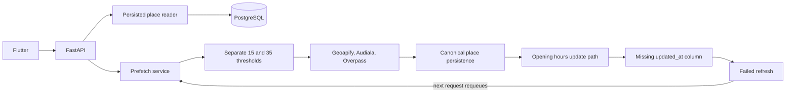
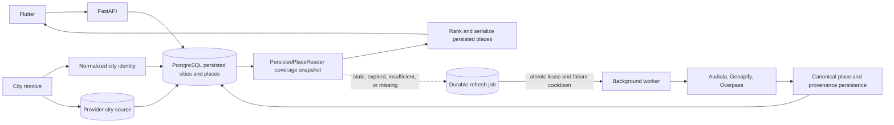

# Backend cache and persistence root cause and fix

Verified: 2026-09-27, Asia/Calcutta

## 1. Executive summary

`[IMPLEMENTED]` The repository and configured development database now have a consistent
database-first recommendation path, canonical city identity, provider city provenance, one cache
coverage decision model, bounded failed-refresh retry, correct opening-hour update metadata, and
regression coverage. The reviewed parity migrations were permanently applied on 2026-09-27 after
a transactionally consistent recovery snapshot was verified.

The main user facing invariant is working. Persisted recommendations return without awaiting place
providers. A real Ziro flow resolved one city, reused the same ID on a second resolve, persisted
four Geoapify places plus sources, tags, images, and category coverage, then served four database
recommendations with `X-Refresh-State: idle`. Subsequent live refreshes wrote the migrated
opening-hour timestamp successfully, and the optimized cached route now performs two foreground
database queries with no provider awaits.

## 2. Root causes

### Schema drift

`CanonicalPlaceService` wrote and selected `PlaceOpeningHours.updated_at`, while neither the
SQLModel table nor the configured PostgreSQL column had that field. Pydantic silently ignored the
extra constructor value, but assignment during refresh raised a model error. After the model was
corrected, the configured database produced PostgreSQL `UndefinedColumn` until its migration is
applied.

### Conflicting coverage rules

`PersistedPlaceReader` treated a fresh nonempty cache as sufficient. `CityPlacePrefetchService`
used separate hardcoded targets of 15 and 35 places. A successfully completed small city could
therefore remain perpetually deficient and be rediscovered on later stages.

### Provider identity stored in a provider specific legacy field

Geoapify city IDs were written to `City.google_place_id`. City reuse depended on a mixed provider
namespace plus application level name matching. The configured database contained two normalized
Ujjain identities, proving that lookup logic alone did not enforce canonical identity.

### Refresh failures could be retried by every request

A durable job recorded a failed state, but the next request immediately requeued it. Provider or
schema failure could therefore create request driven retry pressure.

### Extra recommendation relationship read

Candidate category tags were loaded by `PersistedPlaceReader`, then queried again during ranking.
This added one full remote database round trip to an already WAN sensitive request.

### Database state made repository growth less useful

The live audit found 27 cities, 2,621 places, 2,718 sources, 2,641 tags, and 132 category cache
rows, but only four cache rows were fresh and 128 were expired. Existing rows were still usable,
but the inconsistent refresh logic and missing schema column caused repeated failed background
work. Data growth was helping foreground availability, but operational signals made it look as if
the cache was broken.

## 3. Previous architecture



Foreground recommendations were already provider free in the current repository, so the old
`join_active` diagnosis was not current. The remaining failures were behind that route: duplicate
coverage policy, schema drift, identity drift, and retry behavior.

## 4. Corrected architecture



The foreground response has no edge to a provider. Images remain an independent background
pipeline. Provider acquisition releases the checked out database connection before network I/O,
then uses a short persistence transaction.

## 5. Schema fixes

`[IMPLEMENTED]` in repository:

1. `PlaceOpeningHours.updated_at` now matches insert and refresh code.
2. `add_place_opening_hours_updated_at.sql` adds a nonnull timestamp and safely initializes old
   rows with `NOW()`.
3. `CitySource` stores provider city identity as unique `(source, external_city_id)` provenance.
4. `uq_cities_normalized_identity` enforces trimmed, case insensitive name, state, and country
   uniqueness.
5. `add_city_identity_and_sources.sql` preserves legacy IDs, reassigns known foreign keys,
   consolidates duplicate identities, resolves cache and refresh job conflicts, and creates the
   unique index.
6. Paired rollback scripts document the recovery boundary. A structural rollback cannot recreate
   merged city rows, so deployment requires a reviewed backup or restore point.

The two forward scripts first completed inside a rollback-only validation transaction. After the
database-side recovery snapshot was created and its manifest checked, both scripts were applied in
one guarded transaction. A fresh connection confirmed 27 canonical cities, 24 city sources, zero
duplicate identities, the new update column, and the unique index. All 651 pre-existing
opening-hour rows had timestamps; later real refreshes increased the table to 735 timestamped rows.

## 6. Request path fixes

The recommendation route loads the city, persisted eligible places, category tags, provider
identities, and cached images in one joined snapshot query, then reads category coverage in one
separate query. Ranking and image enrichment reuse the snapshot. An isolated request emitted one
`RECOMMEND_DB` event with `query_count=2`; the count is independent of the number of places and the
provider mocks were not awaited.

The response is returned before durable refresh work. Stale or partial rows remain eligible. Image
resolution is scheduled after recommendation serialization and cannot fail the place response.

## 7. Cache semantics

`PersistedPlaceReader` now returns one `CoverageStatus` per requested category:

| State | Meaning | Foreground behavior | Background behavior |
| --- | --- | --- | --- |
| `FRESH` | Usable persisted rows and an unexpired completed cache row | Return rows | No refresh |
| `STALE` | Usable rows past normal expiry but inside stale grace | Return rows | Request refresh |
| `EXPIRED` | Usable rows older than the stale grace | Return rows | Request refresh |
| `INSUFFICIENT` | Usable rows exist but no matching cache completion metadata exists | Return rows | Request refresh |
| `MISSING` | No usable persisted rows | Return an honest empty or partial response | Request bounded discovery |

A fresh successful cache row is authoritative for a small destination even when its result count
is below the acquisition target. `desired_count` remains observable, but it no longer overrides a
successful fresh result and create endless discovery.

## 8. Provider behavior

The current provider hierarchy and bounded concurrency remain intact. The repair makes these
paths explicit:

* A malformed Overpass payload is a circuit breaker failure before success is recorded.
* Ordinary task cancellation, including shutdown, does not poison provider health.
* The owner of an explicit discovery budget records a budget timeout.
* The database session is committed with entity expiration temporarily disabled before provider
  I/O, preventing an accidental lazy refresh from opening a transaction during the await.
* Failed durable refresh jobs wait `PLACE_REFRESH_FAILED_RETRY_MINUTES`, default five minutes,
  before another request can queue them.
* Partial provider success persists valid provider data even when another provider times out.

Geoapify Address Autocomplete and Place Details behavior was checked against the official
documentation on 2026-09-27. Provider pricing and quotas remain volatile and are not asserted here.

## 9. City persistence verification

The actual Uvicorn server used the configured development database and current provider settings.
No credentials were printed.

New city: Ziro, Arunachal Pradesh, India

| Evidence | Result |
| --- | --- |
| Geoapify autocomplete | HTTP 200, one result, 1.11 seconds |
| Place details | HTTP 200, normalized city fields, 1.28 seconds |
| First resolve | HTTP 200, city ID `4366cac5-6434-4553-9773-10873f5e2f8a`, 4.16 seconds |
| Second resolve | HTTP 200, same city ID, 1.74 seconds |
| Prefetch request | HTTP 202, tourism queued, 10.42 seconds |
| Direct city search | HTTP 200, one local row, 1.59 seconds |
| First persisted recommendation read | HTTP 200, four rows, `idle`, 6.99 seconds |
| Repeated persisted recommendation read | HTTP 200, same four rows, `idle`, 3.46 seconds |

Direct database evidence after discovery:

| Persisted object | Count or state |
| --- | --- |
| Canonical city | One Ziro row |
| City provider identities | 1 |
| Legacy Google city ID | Null after Geoapify provenance verification |
| Places | 4 |
| Place sources | 4, all Geoapify |
| Tags | 4 |
| Opening hour rows | 0 for these four provider records |
| Image cache rows | 4 |
| Tourism coverage | One fresh row, expiry 24 hours after fetch |
| Durable tourism job | `completed` |

This proves that first use made PostgreSQL more useful and second use took the local identity and
persisted recommendation paths.

## 10. Performance results

The configured database is remote and each request pays WAN round trips. These numbers must not be
treated as local service level objectives.

| Scenario | Before | After | Provider awaited? | DB used? |
| --- | --- | --- | --- | --- |
| Cached Jaipur, 20 rows | Not measured on the old code | 17.18 seconds, then 7.78 seconds | No | Yes |
| Cached Jaipur while refresh failed | Not measured on the old code | 21.19 seconds, HTTP 200 with five rows | No | Yes |
| New Ziro city resolve | No prior row | 4.16 seconds first, 1.74 seconds repeat | First flow used provider details before resolve; repeat did not | Yes |
| Ziro recommendations after prefetch | No prior places | 6.99 seconds, then 3.46 seconds | No | Yes |
| Isolated cache focused suite | Not applicable | 98 tests in 14.43 seconds | Mock providers proved not awaited | SQLite fixture DB |

The main performance invariant is met structurally: recommendation time is database reads,
ranking, serialization, and refresh enqueue metadata. It does not include Geoapify, Audiala,
Overpass, Nominatim, image provider, or active prefetch wait time. The live request remains slower
than desirable because seven batched foreground database queries cross the remote connection.
That is a measured remaining optimization opportunity, not a reason to increase Flutter timeouts.

## 11. Tests

Regression coverage includes:

* Existing cached city with zero foreground provider awaits.
* Provider unavailable while cached results remain available.
* Stale rows returned with asynchronous refresh intent.
* Durable single flight jobs and failed job retry cooldown.
* Fresh small city does not trigger another full prefetch.
* New normalized city identity reuse and distinct same name cities in different states.
* Provider partial failure and malformed response circuit behavior.
* Opening hour insert and update timestamp behavior.
* Repeated provider place identity without duplicate canonical rows.
* No database transaction held across provider wait.
* One bounded recommendation relationship snapshot plus coverage read with two total foreground queries.
* SQLModel and SQL migration parity for city identity and opening hour updates.

The initial baseline had 455 passing tests, two failing planner balance assertions, and five FSQ
fixture setup errors caused by the restricted temporary directory. After phase two, the broad
suite excluding that importer file verified 462 tests. Its first run reported 461 passes and one
documentation-link failure because the run began before this new performance report was created;
the complete documentation module then passed 3 of 3 after the file existed. The importer file
passed 9 of 9 with permitted temporary storage. A final regression preserving non-category tags
in the consolidated snapshot also passed, bringing the verified total to 472 backend tests with
zero remaining failures.

## 12. Manual verification

The server was launched with:

```text
backend/.venv/Scripts/uvicorn.exe app.main:app --host 127.0.0.1 --port 8011
```

Observed endpoint results:

* `GET /` returned HTTP 200.
* `GET /cities` returned 27 configured database rows.
* Two Jaipur recommendation calls returned the same first persisted place ID.
* A later Jaipur request returned HTTP 200 while the refresh job reported `failed`.
* Server logs showed the background Jaipur refresh fail at
  `place_opening_hours.updated_at does not exist`; the foreground response still succeeded.
* Ziro autocomplete, details, repeated resolve, prefetch, prefetch status, local search, and
  repeated recommendations were exercised through HTTP.
* Direct PostgreSQL queries confirmed the Ziro city, places, sources, tags, image rows, coverage,
  and completed refresh job.
* Both migrations were exercised on PostgreSQL in a rollback only transaction and their expected
  schema and data effects were queried before rollback.
* Backend verification finished with all 463 broad tests verified plus 9 importer tests, for 472
  passing backend tests and no remaining failure.
* `git diff --check` passed for the files in scope. Focused Ruff checking exposed existing style
  debt in touched legacy files, while the new schema parity test is clean. `flutter analyze
  lib/models/city.dart` did not produce output and was stopped after two minutes, so analyzer
  verification is `[UNKNOWN]` rather than claimed as a pass.

`/check verify` verdict after phase-two deployment and runtime verification: **PASS**. The
configured database schema, cached response, provider-outage, concurrency, and persistence
criteria were exercised successfully.

## 13. Remaining risks

1. `[PARTIAL]` Two remote database queries still spend materially more time in connection and
   transport overhead than PostgreSQL execution. API/database colocation should be measured in the
   deployment region before changing reliability-oriented pool health checks. Two later redundant
   startup probes also saw the remote pooler close its connection during SQLAlchemy startup after
   the successful migration/restart/API verification had completed.
2. `[PARTIAL]` Refresh dispatch is process local. Durable jobs survive, but another request is
   needed to recover queued or expired work after total process loss.
3. `[UNKNOWN]` The exact actor that created the original live `city_sources` table is not recorded by a
   migration ledger.
4. `[PLANNED]` Adopt an ordered migration runner so repository and deployed schema parity is
   machine verifiable.

## Anti pattern repair ledger

| File and function | Root cause and impact | Fix | Evidence |
| --- | --- | --- | --- |
| `entities.py`, `PlaceOpeningHours` | Update code referenced an absent model and column, breaking refresh | Add model field plus forward and rollback SQL | Opening hour regression and PostgreSQL rollback transaction |
| `city_place_prefetch_service.py`, `prefetch` | Hardcoded thresholds contradicted the reader and caused rediscovery | Consume `CoverageStatus` from one reader | Fresh small city regression |
| `cities.py`, `resolve_city` | Mixed provider IDs in `google_place_id` and no normalized database uniqueness | Add `CitySource`, normalized identity, and consolidation migration | Resolve identity tests and Ziro repeat |
| `durable_place_refresh_service.py`, `request_refresh` | Failed jobs immediately requeued on traffic | Configurable failed job cooldown | Durable refresh regression |
| `recommendation_service.py`, `recommend_with_snapshot` | Relationship and image data required redundant remote reads | Reuse one joined reader snapshot plus one coverage query | `query_count=2` regression |
| `openstreetmap_discovery_service.py`, `discover_many` | Commit expiration could start a transaction when city fields were read during provider await | Preserve loaded city fields across the release commit | Transaction state regression |
| `openstreetmap_places_service.py`, `search_nearby_places` | Malformed payload could record breaker success, and cancellation semantics were ambiguous | Validate before success and separate budget timeout from ordinary cancellation | Circuit breaker regressions |

## Database Migration Deployment and Cached-Path Performance

`[IMPLEMENTED]` On 2026-09-27 the configured development database and application runtime were
verified to use the same redacted PostgreSQL target (identity fingerprint `a5aba9103907`). The
repository intentionally has no Alembic runner; its reviewed SQL scripts are the migration
mechanism. Before applying them, the affected tables were locked for a transactionally consistent
database-side copy into schema `migration_backup_20260927t121718z`. The in-transaction manifest
verified 28 cities, 2,625 places, 94 trips, 0 import reviews, 1 city source, 133 category-cache
rows, 57 refresh jobs, and 651 opening-hour rows.

`add_city_identity_and_sources.sql` and `add_place_opening_hours_updated_at.sql` were applied in a
single guarded transaction. A fresh connection verified 27 canonical cities, 24 city sources, no
normalized duplicate city identity, no orphan city source, `uq_cities_normalized_identity`, and a
non-null opening-hour `updated_at` column. Real refresh work subsequently increased opening-hour
rows from 651 to 735; every row had a timestamp and no `UndefinedColumn` error recurred. The backup
schema remains the authoritative before-state for a reviewed rollback. It is not a substitute for
a provider-managed disaster-recovery backup, and an actual restore was intentionally not run
because doing so would undo the verified deployment.

The original cached path performed seven remote database queries: city, candidate places,
tags/categories, coverage, place sources, a redundant page reload, and image metadata. Warm direct
measurements spent about 3.17-3.51 seconds in SQL and 0.75-0.89 seconds outside SQL, for roughly
4.01-4.40 seconds total. A cold connection acquisition measured 7.23 seconds, with a subsequent
`SELECT 1` taking 0.96 seconds; warm acquisition measured 0.35-0.41 seconds and the health check
0.72-0.91 seconds.

`[IMPLEMENTED]` `PersistedPlaceReader` now obtains city candidates, all relationship tags,
provenance, and cached image metadata in one joined snapshot query, followed by one coverage query.
Ranking, serialization, and image enrichment reuse the snapshot, removing five remote round trips. The
stale-refresh enqueue, complete refresh execution, and image-enrichment batches move synchronous
database work off the FastAPI event loop. The foreground cached path still performs no provider
awaits.

Post-change direct worker measurements were 2.02-2.33 seconds for warm Jaipur reads and 1.75-1.80
seconds for Ziro. Actual HTTP measurements were about 3.39 seconds median for Jaipur and 1.71-1.76
seconds warm for Ziro, compared with the supplied approximately 7.8-second and 3.5-second
baselines. The two SQL plans themselves executed in 2.761 ms and 0.053 ms on the server and used
the existing city and coverage indexes; no new index was justified. The remaining latency is
remote connection/transport and pool health-check time, with occasional contention from background
workers, rather than database execution or a foreground provider call.

A provider-outage run pointed Geoapify and Overpass at a refused local port. Cached Ziro and Jaipur
requests still returned HTTP 200 with 4 and 20 rows in 2.34 and 3.73 seconds; an immediate health
request returned in 34 ms. Six concurrent cached requests per city all returned HTTP 200: the Ziro
batch completed in 4.21 seconds and Jaipur in 4.12 seconds. Durable unique job keys prevented
duplicate refresh rows. Full refresh delivery remains `[PARTIAL]` because background tasks are
process-local; durable rows survive a process loss, but another request is required to recover
queued work or expired leases.
