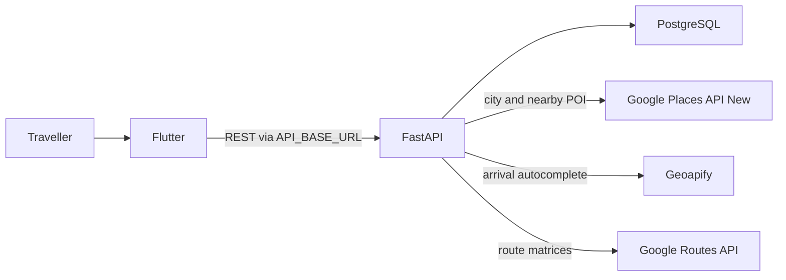
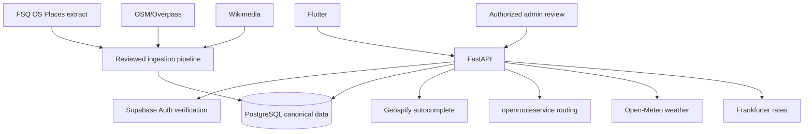

# YatraCanvas complete ChatGPT project handoff

Last reviewed: 2026-09-01

> **2026-09-01 provider update:** Normal recommendations now use bounded, cached
> OpenStreetMap/Overpass discovery and normal route optimization uses labelled local coordinate
> estimates; neither flow requires Google keys. Google Places/Routes adapters are legacy
> `[DEPRECATED]` paths. Geoapify remains the freemium destination/arrival autocomplete dependency.
> The modular architecture, API/data-source, environment, and decisions documents are
> authoritative where older provider descriptions remain later in this snapshot.

## How to use this file

Upload this file to a new ChatGPT conversation. It is a self-contained snapshot of the product,
repository, architecture, integrations, configuration, known gaps, risks, and recommended next
work. It contains no real credentials.

If ChatGPT also has repository access, the modular documents under `docs/` and the current code
remain authoritative when newer than this snapshot. ChatGPT must verify code before making a new
architectural claim.

Use this prompt with the uploaded file:

```text
You are helping me continue the YatraCanvas project. Read the complete attached handoff before
suggesting or changing anything.

Rules:
1. Use the status labels IMPLEMENTED, PARTIAL, PLANNED, DEPRECATED, and UNKNOWN exactly as
   defined in the handoff.
2. Do not describe a partial or planned feature as complete.
3. Base project claims on the handoff or inspected repository code.
4. Do not invent API fields, provider capabilities, environment variables, quotas, or schemas.
5. Keep API and database secrets out of Flutter, logs, source control, examples, and responses.
6. Preserve legacy identifiers and data through reversible migrations.
7. Do not introduce or change a provider without explaining licensing, attribution, provenance,
   caching, fallback, configuration, and tests.

First:
- summarize the current project stage;
- identify the single best next milestone;
- list the decisions I need to make before implementation;
- produce a small, ordered implementation plan with acceptance criteria;
- identify files likely to change, migrations required, API keys required, risks, and tests;
- stop for my approval before performing destructive database or production actions.
```

## 1. Snapshot and status vocabulary

Project: **YatraCanvas**

Stage: **pre-alpha functional prototype; not ready for public or production use**

Primary market direction: travel planning for Indian destinations.

Repository stack: Flutter/Dart client, Python FastAPI backend, SQLModel, and PostgreSQL. A
Supabase PostgreSQL connection is supported, but Supabase Auth, the Supabase Flutter SDK, and
tracked Row Level Security policies are not implemented.

Status labels:

- `[IMPLEMENTED]`: a working code path exists in the repository and has supporting evidence.
- `[PARTIAL]`: code or UI exists, but an essential part of the real flow is missing.
- `[PLANNED]`: intended direction without a complete repository implementation.
- `[DEPRECATED]`: retained temporarily or explicitly avoided in the target architecture.
- `[UNKNOWN]`: the repository and verified documentation do not provide enough evidence.

## 2. Product purpose

YatraCanvas is intended to help a traveller:

1. authenticate and maintain a profile;
2. choose an Indian destination city;
3. select trip dates, purpose, and interests;
4. enter an arrival airport, railway station, bus station, hotel, or address;
5. discover attractions and useful places;
6. save, prioritize, lock, and reorder places;
7. generate an optimized multi-day itinerary;
8. view places and routes on an interactive map;
9. see weather and, where relevant, currency information;
10. receive data that administrators can verify and correct.

Target users are independent travellers and small groups. Data reviewers/administrators are a
secondary user group. Bookings, ticket sales, payments, travel-agent commerce, and a global
social network are not current scope.

## 3. Current readiness verdict

The application is **not ready for normal public use**.

It can be used as a development prototype for individual screens, provider-backed endpoints,
place importing, and seeded-trip tests. It is not yet a complete private alpha because the normal
Flutter journey does not persist a new trip or establish an authenticated user.

Critical launch blockers:

- `[PARTIAL]` The phone login screen does not authenticate anyone.
- `[PARTIAL]` The normal create-trip flow never calls a trip-create endpoint and never receives a
  real `trip_id`.
- `[PARTIAL]` Saved places, start-location persistence, and route optimization require an already
  existing trip, so they do not work end-to-end for a normal newly created trip.
- `[PARTIAL]` The optimizer writes only day 1, not a genuine multi-day itinerary.
- `[PARTIAL]` Database evolution uses `create_all` plus standalone SQL scripts rather than an
  ordered, versioned migration system.
- `[UNKNOWN]` Supabase RLS, production deployment, backups, monitoring, privacy operations, and
  incident recovery are not represented in the repository.
- `[PARTIAL]` Admin pages use mock values and do not call authorized admin APIs.
- `[PLANNED]` There is no interactive map, weather, or currency feature.

## 4. Current Flutter application

### Application structure

- `[IMPLEMENTED]` `lib/main.dart` starts the traveller app.
- `[IMPLEMENTED]` `lib/main_admin.dart` starts a separate admin shell.
- `[IMPLEMENTED]` Material widgets, `http`, `geolocator`, and `flutter_svg` are used.
- `[IMPLEMENTED]` Navigation uses `Navigator` and `MaterialPageRoute` directly.
- `[IMPLEMENTED]` State is mainly local `StatefulWidget` state and a shared in-memory `TripDraft`.
- No router package, dependency-injection system, global state-management package, local database,
  secure token storage, or Supabase SDK is installed.
- External services are called through Dart REST service classes using `API_BASE_URL`.

### Traveller screens

| Screen/flow | Status | Reality |
| --- | --- | --- |
| Splash | `[IMPLEMENTED]` | Starts the app and advances to welcome. |
| Welcome | `[IMPLEMENTED]` | Entry UI and navigation. |
| Phone login | `[PARTIAL]` | Input/validation UI only; no OTP or session. |
| Personal-interests onboarding | `[PARTIAL]` | Multi-step visual onboarding in one screen; not persisted to a user profile. |
| Home | `[PARTIAL]` | Layout and navigation exist; content includes mock/local data. |
| Destination selection | `[PARTIAL]` | Stored and Google city lookup exist; no final persisted trip. |
| Date selection | `[PARTIAL]` | Updates in-memory draft only. |
| Arrival details | `[PARTIAL]` | Geoapify, device, and custom input paths exist; saving requires an existing trip ID. |
| Trip purpose | `[PARTIAL]` | Captured in the draft but not persisted by the normal flow. |
| Trip preferences | `[PARTIAL]` | Captured in the draft but not persisted by the normal flow. |
| Place discovery | `[PARTIAL]` end-to-end | Discovery/recommendation APIs work, but save/route actions depend on a trip ID. |
| Interactive map | `[PLANNED]` | Decorative map artwork is present, but no actual map SDK/widget exists. |

### Admin UI

The admin shell has Overview, Trips, Destinations, Travellers, Reports, and Management pages.
It is `[PARTIAL]`: visual structure exists, but metrics/rows are hard-coded, callbacks do not
perform real work, and no authenticated admin API exists.

### Flutter services

- `CityService`: stored city search, Google city autocomplete/details, city resolution.
- `LocationService`: backend Geoapify location autocomplete.
- `PlaceService`: city place discovery.
- `RecommendationService`: place recommendations.
- `SavedPlaceService`: list/add/update/reorder/delete saved trip places.
- `RouteOptimizationService`: optimize a seeded/existing trip.
- `TripService`: get/update start location only.
- `DeviceLocationService`: device geolocation through `geolocator`.

## 5. Current FastAPI backend

`backend/app/main.py` creates missing SQLModel tables at startup and includes the application
routers. `create_all` does not upgrade an existing database schema.

### Current endpoints

| Method | Path | Status/purpose |
| --- | --- | --- |
| `GET` | `/` | `[IMPLEMENTED]` backend status |
| `POST` | `/cities` | `[IMPLEMENTED]` create canonical city |
| `GET` | `/cities` | `[IMPLEMENTED]` list stored cities |
| `GET` | `/cities/search` | `[IMPLEMENTED]` search stored cities |
| `GET` | `/cities/{city_id}` | `[IMPLEMENTED]` get one city |
| `GET` | `/cities/autocomplete` | `[IMPLEMENTED]` Google Places city predictions |
| `GET` | `/cities/place-details/{google_place_id}` | `[IMPLEMENTED]` Google city details |
| `POST` | `/cities/resolve` | `[IMPLEMENTED]` find/create normalized Google or non-Google city |
| `GET` | `/locations/autocomplete` | `[IMPLEMENTED]` Geoapify destination and arrival autocomplete |
| `POST` | `/places` | `[IMPLEMENTED]` create a canonical place |
| `GET` | `/cities/{city_id}/places` | `[IMPLEMENTED]` list stored places |
| `GET` | `/cities/{city_id}/discover-places` | `[IMPLEMENTED]` cache-aware discovery/Google refresh |
| `POST` | `/cities/{city_id}/recommendations` | `[IMPLEMENTED]` preference-based recommendations |
| `GET` | `/trips/{trip_id}/saved-places` | `[IMPLEMENTED]` for an existing trip |
| `POST` | `/trips/{trip_id}/saved-places` | `[IMPLEMENTED]` for an existing trip |
| `PATCH` | `/trips/{trip_id}/saved-places/reorder` | `[IMPLEMENTED]` reorder all selected places |
| `PATCH` | `/trips/{trip_id}/saved-places/{place_id}` | `[IMPLEMENTED]` update priority/lock/must-visit/notes |
| `DELETE` | `/trips/{trip_id}/saved-places/{place_id}` | `[IMPLEMENTED]` remove saved place |
| `GET` | `/trips/{trip_id}/start-location` | `[IMPLEMENTED]` get existing trip start point |
| `PATCH` | `/trips/{trip_id}/start-location` | `[IMPLEMENTED]` update existing trip start point |
| `POST` | `/trips/{trip_id}/optimize-route` | `[PARTIAL]` Google matrix plus day-1 itinerary |

Important missing endpoints:

- authentication/session/profile endpoints;
- create/list/update/delete trip endpoints;
- trip-purpose/preference persistence as a complete workflow;
- real multi-day itinerary generation;
- map/route-geometry endpoints;
- weather and currency endpoints;
- admin review, merge, correction, and audit endpoints;
- ingestion-job status endpoints.

## 6. Current runtime architecture



Provider keys belong only on the backend. Flutter consumes YatraCanvas-owned response schemas.

Current provider-neutrality is limited: location autocomplete has a provider protocol, while
place discovery and route matrices instantiate Google-specific services directly.

## 7. Database model

The current canonical database models are:

| Entity | Purpose |
| --- | --- |
| `City` | Destination name/state/country, coordinates, nullable legacy `google_place_id` |
| `Place` | Canonical POI, category, coordinates, optional rating/reviews and feature flags |
| `CityCategoryCache` | City/category discovery freshness and expiry |
| `PlaceTag` | Application tag unique per place |
| `PlaceSource` | Provider namespace/ID, license, URL, address/contact, lifecycle dates, flags and timestamps |
| `PlaceCategory` | Provider-specific category identity/label |
| `PlaceImportReview` | Pending/resolved/ignored ambiguous-import review with match evidence |
| `Trip` | User UUID, city, name, days/date, arrival/start location and provider identifiers |
| `TripPreference` | Weighted preference unique within a trip |
| `UserSavedPlace` | Selected place, order, priority, lock, must-visit, and notes |
| `RouteMatrixCache` | Directed trip pair/mode, coordinates, distance, static/traffic durations and expiry |
| `TripItinerary` | Day/order/place and optional visit/travel timing |

Important facts:

- `Trip.user_id` is a UUID but is not a foreign key to a tracked user or Supabase Auth table.
- `City.google_place_id` is nullable and protected by `uq_cities_google_place_id`. It must remain
  as a legacy identifier until a verified backfill and reversible migration are complete.
- Google POI identities are stored in `PlaceSource`, not directly on `Place`.
- Provider records are candidates; they are not automatically trusted canonical truth.
- `PlaceImportReview` has review status, but canonical `Place` has no overall verification status,
  reviewer, field-level provenance, or audit trail.
- The current optimizer writes `TripItinerary.day_number = 1` only.
- There are no profile, weather, currency, media-license, admin-audit, or ingestion-run tables.

## 8. Place ingestion and provenance

`[IMPLEMENTED]` A local CLI imports bounded FSQ Open Source Places exports in CSV, JSONL, or
NDJSON form. It does not call the proprietary Foursquare Places API.

The importer:

- validates configured Indian city/locality boundaries;
- streams input and commits in configurable batches;
- updates repeated FSQ external IDs without creating a duplicate source;
- preserves FSQ lifecycle dates, contact fields, categories, source URL, Apache-2.0 identifier,
  and unresolved quality flags;
- skips a new source already marked closed while retaining closure information for known sources;
- attaches a source automatically only when normalized name/category match and exactly one nearby
  canonical candidate exists;
- creates a `PlaceImportReview` for ambiguous or conflicting candidates;
- does not overwrite manually curated canonical place values.

The current official FSQ access flow uses the Places Portal and an Iceberg catalog. An operator
must export a bounded file outside the app. Portal token automation is not implemented and no
portal token is an application environment variable.

## 9. Provider status and target responsibility

| Provider | Current status | Current/target responsibility | Key now? |
| --- | --- | --- | --- |
| PostgreSQL | `[IMPLEMENTED]` | Canonical application/place data | `DATABASE_URL` required |
| Supabase Auth | `[PLANNED]` | Target authentication/identity | No configured variable yet |
| FSQ Open Source Places | `[IMPLEMENTED]` local import | Batch open-POI candidates | No runtime key |
| Geoapify | `[IMPLEMENTED]` | Runtime autocomplete/geocoding only | `GEOAPIFY_API_KEY` optional by feature |
| Google Places API (New) | `[IMPLEMENTED]`, target `[DEPRECATED]` | Current cities and nearby discovery | `GOOGLE_PLACES_API_KEY` optional by feature |
| Google Routes API | `[IMPLEMENTED]`, replacement planned | Current route matrix | `GOOGLE_ROUTES_API_KEY` optional by feature |
| OpenStreetMap/Overpass | `[PLANNED]` | Supplemental batch geographic/POI data | None defined |
| Wikimedia/Wikipedia/Wikidata | `[PLANNED]` | Descriptions, context, licensed images | None defined |
| openrouteservice | `[PLANNED]` | Target directions and route matrices | None defined |
| Open-Meteo | `[PLANNED]` | Weather forecasts | None defined; commercial decision required |
| Frankfurter | `[PLANNED]` | Dated reference exchange rates | Public API requires no key currently |
| Interactive map provider/SDK | `[PLANNED]` decision | Map rendering and tiles | None defined |
| Proprietary Foursquare Places API | `[DEPRECATED]`/not integrated | No approved responsibility | Not required |

Provider policies, pricing, quotas, and licenses are volatile and must be rechecked using official
documentation before implementation or launch.

## 10. Exact current environment contract

### Required

- `DATABASE_URL`: backend-only PostgreSQL connection secret. This is the only setting required
  for the backend process to start.

### Optional implemented provider keys

- `GOOGLE_PLACES_API_KEY`: backend secret for current city and nearby-place paths.
- `GOOGLE_ROUTES_API_KEY`: backend secret for current route matrices.
- `GEOAPIFY_API_KEY`: backend secret for location autocomplete/geocoding.

### Optional backend configuration

- `GEOAPIFY_BASE_URL`
- `GEOAPIFY_TIMEOUT_SECONDS`
- `GEOAPIFY_AUTOCOMPLETE_CACHE_TTL_SECONDS`
- `FSQ_OS_PLACES_PATH`
- `FSQ_DEDUPE_DISTANCE_METERS`
- `FSQ_IMPORT_BATCH_SIZE`
- `ROUTE_MATRIX_TRAFFIC_TTL_MINUTES`
- `PLACE_DISCOVERY_CACHE_TTL_HOURS`
- `GOOGLE_NEARBY_RADIUS_METERS`
- `PLACE_POPULAR_MIN_RATING`
- `PLACE_POPULAR_MIN_REVIEW_COUNT`

### Flutter build configuration

- `API_BASE_URL`: safe public backend origin supplied with `--dart-define` when overriding the
  emulator-friendly development default.

Do not request or add Supabase, openrouteservice, Open-Meteo, Frankfurter, Wikimedia, Overpass,
or provider-selection variables until corresponding code actually reads them. Do not place
provider/database secrets in Flutter.

## 11. Caching and failure behavior

- Place discovery uses `CityCategoryCache` and `PLACE_DISCOVERY_CACHE_TTL_HOURS`. Canonical place
  and provenance rows remain stored after the refresh expires.
- Geoapify autocomplete uses a short in-process cache. It is lost at restart and is not shared
  across multiple backend replicas.
- Route matrices persist distance, static duration, optional traffic duration, calculation time,
  and traffic expiry. When Google is unavailable, a complete static cached matrix may be used.
  If any required pair is absent, optimization fails rather than inventing a duration.
- Missing optional provider keys produce safe provider-configuration failures while unrelated
  backend features remain available.
- No general ingestion scheduler, deletion/tombstone processor, cache purge job, retry queue, or
  production observability layer exists.

## 12. Google dependency assessment

Currently used:

- **Google Places API (New):** autocomplete, place details, city resolution, and nearby discovery.
- **Google Routes API:** `computeRouteMatrix` for optimizer legs.

Not found in the repository:

- Google Maps SDK for Android/iOS/JavaScript;
- Google Places platform SDK;
- Google Geocoding API;
- Google Directions API;
- legacy Google Distance Matrix API.

Google Places and Routes cannot be disabled yet without breaking implemented features. Google
Maps is a separate product decision and must not be added or removed solely because Places is
being migrated. External consumers in the same Google Cloud project are `[UNKNOWN]`, so repository
evidence alone cannot authorize disabling a Cloud API.

## 13. Target architecture



Target principles:

- PostgreSQL is canonical; Supabase Auth is the intended identity provider.
- FastAPI owns authentication verification, authorization, provider secrets, adapters, caching,
  safe error translation, and stable application schemas.
- Flutter normally calls FastAPI instead of external providers directly.
- FSQ OS, OSM, and Wikimedia are ingestion/enrichment sources with provenance and review.
- Geoapify stays narrowly focused on runtime autocomplete/geocoding.
- openrouteservice replaces Google Routes only after parity and fallback tests.
- Google Places is removed only after city and POI backfill is verified.
- Map rendering is selected independently with explicit tile/SDK attribution and offline policy.

## 14. Security and migration state

- Provider and database secrets use backend Pydantic `SecretStr` values and are unwrapped only at
  provider boundaries.
- No real `.env` or real secret value should be committed, pasted, logged, or shipped to Flutter.
- There is no implemented authentication or authorization boundary today.
- The backend currently trusts database `Trip.user_id`; it is not derived from a verified token.
- Supabase RLS/grant status is `[UNKNOWN]` because policies are not tracked in this repository.
- New databases use SQLModel `create_all`; existing schemas require standalone SQL scripts.
- Only the FSQ/Geoapify foundation SQL change has a dedicated tracked rollback script.
- No migration was applied to production during the architecture audit.

Before production, adopt ordered migrations and treat RLS/grants as versioned schema code. Every
database change needs preconditions, backup/restore considerations, forward verification,
backfill behavior, and rollback or roll-forward recovery. Additive nullable migrations should
precede backfill and legacy-field retirement.

## 15. Testing status and known technical debt

Most recent validation of this snapshot:

- Backend tests: **82 passed**, with one dependency deprecation warning.
- Flutter analysis: **no issues**.
- Flutter tests: **22 passed**.
- New documentation/config test: Black, Ruff, and mypy clean.
- Documentation local links and environment-variable consistency checks passed.
- Git whitespace check passed.
- Safe name-only secret-pattern scan found no likely live credentials; history contains known
  placeholders and a dummy Flutter toolchain TLS fixture, not evidence of a production key.

Existing unrelated repository-wide debt:

- Black would reformat 18 backend files.
- Ruff reports 18 existing issues.
- Mypy reports 31 existing errors across 8 files when checking all app/tests.
- Dart formatting reports the untouched login screen would be reformatted.
- No CI workflow, Docker setup, or deployment configuration is tracked.

Do not mix broad formatting/type-debt cleanup into an unrelated product feature without a
separate reviewed change.

## 16. Recommended next milestone

The next milestone should be: **a persisted, authenticated trip lifecycle suitable for a private
alpha**.

This should come before maps, weather, currency, new POI providers, or visual expansion. The
existing discovery, saved-place, and optimizer work cannot form a normal end-to-end journey until
the app creates an authenticated trip and retains its ID.

### Decisions required before implementation

1. Confirm Supabase Auth as the identity provider and select the first sign-in method (phone OTP
   versus email/password or email OTP). The current phone UI does not decide the backend policy.
2. Select the versioned migration workflow (for example Alembic or Supabase CLI migrations) and
   define how existing standalone SQL scripts are baselined.
3. Decide whether Flutter calls only FastAPI for trip data or also uses Supabase directly. Direct
   access requires tracked/tested RLS; FastAPI-only is the simpler first private-alpha boundary.
4. Define the minimal trip-create request: city, name, dates/days, arrival/start location,
   purpose, and preferences.
5. Define token verification, user/profile linkage, logout/session expiry, and authorization
   error behavior.

### Ordered implementation plan

#### Step 1 — Establish versioned migrations

- Baseline the current SQLModel schema in a local/test database.
- Import or supersede existing forward SQL scripts without rerunning applied changes.
- Add migration commands and tests to backend setup documentation.
- Add no destructive production action.

Acceptance criteria:

- A fresh test database and an upgraded test database reach the same expected schema.
- Migration status is inspectable and repeat runs are safe.
- Rollback/roll-forward notes exist for each migration.

#### Step 2 — Implement authentication verification

- Configure Supabase Auth only after defining exact variables and key ownership.
- Flutter obtains a user session; FastAPI verifies the JWT using the approved mechanism.
- FastAPI derives the current user ID from the verified token.
- Add authorization dependencies and safe 401/403 behavior.

Acceptance criteria:

- Valid session succeeds; missing, expired, malformed, and wrong-user tokens fail in tests.
- No service-role or provider secret is bundled in Flutter.
- Logout/session-expiry behavior is tested.

#### Step 3 — Add the trip lifecycle API

- Add create, list, get, and update endpoints for owned trips.
- Persist dates/days, purpose, preferences, arrival point, and start location transactionally.
- Do not accept an arbitrary `user_id` from the client.
- Define deletion/archive behavior separately; avoid destructive delete until product policy exists.

Acceptance criteria:

- A user can create and retrieve their trip.
- A different user cannot access or modify it.
- Validation covers coordinate pairs, positive days, date consistency, and provider identifiers.
- Existing seeded-trip endpoints remain compatible or receive a documented migration.

#### Step 4 — Connect Flutter to the persisted trip

- Replace fake login completion with the real session flow.
- Submit `TripDraft` through the create-trip API.
- Store the returned `trip_id` in the current session/state and recover it after navigation or
  app restart using an owned-trip lookup.
- Show recoverable loading, validation, authentication, and network errors.

Acceptance criteria:

- A new user completes login and trip creation without seeded database data.
- Arrival/start location, purpose, and preferences survive reload/restart.
- No downstream screen is entered with a silently missing trip ID.

#### Step 5 — Prove existing downstream features end-to-end

- Save, update, reorder, and remove places for the newly created trip.
- Optimize the newly created trip using current Google Routes/cached fallback.
- Add an integration test covering authentication → trip creation → arrival → place selection →
  route optimization.

Acceptance criteria:

- The whole flow works on a local/test PostgreSQL database.
- Ownership is enforced at every trip-scoped endpoint.
- Provider outage behavior is explicit and does not lose saved trip data.

#### Step 6 — Implement true multi-day planning

- Define daily time budgets, place duration assumptions, start/end behavior, and locked/must-visit
  rules before changing the algorithm.
- Allocate visits across `Trip.days` rather than writing only day 1.
- Keep the routing-provider replacement separate until multi-day behavior is deterministic.

Acceptance criteria:

- Tests cover one-day and multi-day trips, infeasible must-visits, locked order, empty days,
  deterministic output, and partial matrix failure.
- Itinerary rows have valid unique day/order values and can be regenerated transactionally.

### Private-alpha exit criteria

- Real authentication and per-user authorization.
- Versioned and locally verified database migrations.
- A complete persisted trip-create/reopen journey.
- Saved places and itinerary generation work without seeded trip IDs.
- True multi-day output or an explicitly limited single-day alpha scope.
- Restricted provider keys and no secrets in Flutter/source control.
- Tested backup/restore procedure for the alpha database.
- Basic structured logs, provider/cache failure visibility, and a documented deployment.
- Privacy policy/data-deletion decisions appropriate to stored user/location data.

Meeting these criteria supports controlled private testing; it does not by itself prove readiness
for a public production launch.

## 17. Later roadmap, after the next milestone

1. Complete provider-neutral place ingestion and source lifecycle handling.
2. Add compliant bounded OSM/Overpass ingestion.
3. Add Wikimedia enrichment with item-level creator/license/attribution.
4. Complete Geoapify-based destination resolution and Google Places exit readiness.
5. Add an openrouteservice adapter and migrate matrices after parity tests.
6. Add weather only after an Open-Meteo commercial/self-host licensing decision.
7. Add Frankfurter dated reference rates.
8. Implement authorized admin review, corrections, dedupe, and audit history.
9. Retire Google Places and Routes independently after verified backfill/parity.
10. Select and implement an interactive map renderer/tiles independently.

## 18. Non-negotiable constraints for future work

- Inspect code, migrations, and tests before changing a status label.
- Never claim planned work is production-ready.
- Never invent API schemas, quotas, fields, keys, or provider behavior.
- Verify changing external facts against current official documentation.
- Keep provider and database secrets on the backend.
- Do not silently introduce a provider or change a provider's responsibility.
- Preserve source IDs, licensing, attribution, timestamps, provenance, and review evidence.
- Do not infer ratings or popularity from FSQ OS Places; those fields are not in the selected open
  schema.
- Preserve nullable Google legacy identifiers until a tested backfill and reversible migration.
- Never apply repository migrations/imports directly to production without review and backup.
- Architecture, provider, environment, endpoint, and schema changes must update documentation in
  the same change.
- New environment variables must be added to `backend/.env.example`, documented, validated, and
  tested.
- Run relevant backend and Flutter tests before declaring completion.

## 19. Authoritative repository documents

When repository access is available, read these before implementation:

- `AGENTS.md`
- `docs/PROJECT_CONTEXT.md`
- `docs/ARCHITECTURE.md`
- `docs/API_AND_DATA_SOURCES.md`
- `docs/DATA_MODEL.md`
- `docs/ENVIRONMENT_VARIABLES.md`
- `docs/ROADMAP.md`
- `docs/DECISIONS.md`
- `docs/api-key-audit.md`
- `backend/README.md`

Historical screenshots and `docs/PROJECT_DOCUMENTATION.md` are UI references, not the current
architecture source of truth.

## 20. Questions ChatGPT should ask only when needed

The following product choices cannot be safely inferred from the repository:

- Which real sign-in method should launch first?
- Is Supabase-hosted PostgreSQL already in use, or only planned?
- Will Flutter access only FastAPI, or also Supabase data APIs under RLS?
- What existing database environments/data must the first migration preserve?
- Is a single-day private alpha acceptable before true multi-day planning?
- Which Indian launch cities and minimum POI quality/coverage thresholds are required?
- Is YatraCanvas commercial? This affects Open-Meteo and other provider terms.
- What deployment platform, backup objective, logging retention, and privacy requirements apply?
- Which map renderer/tile provider is acceptable for cost, attribution, and platform support?

If these choices materially change implementation, ChatGPT should present options and wait for a
decision instead of guessing.
