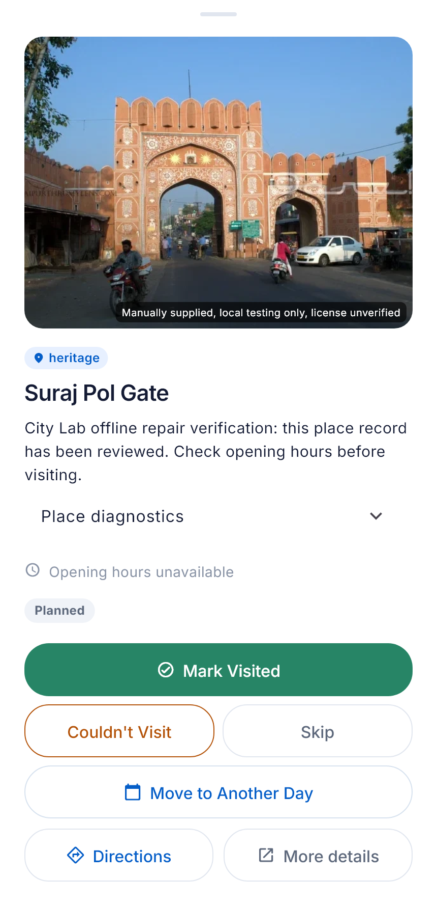

# City-data loop implementation report

Verified 2026-10-04. `[IMPLEMENTED]` repository vertical slice and rebuilt APK.
`[PARTIAL]` physical-phone airplane-mode acceptance: `adb devices -l` lists no connected device.

## Architecture delivered

```text
DataFactory canonical release
  → validated indexed SQLite + selected WebP media + checksummed manifest
  → one-command YatraCanvas asset sync → APK → local discovery and trips
  → City Lab human overlays → base-bound repair ZIP
  → DataFactory dry-run → new immutable release → sync → corrected APK
```

`[IMPLEMENTED]` The repositories remain separate. Selection/export/install use city metadata, not
Jaipur-specific branches. Unsupported cities and existing server trips retain the current providers.
No production migration, new environment variable, paid API, or pipeline paid-AI call was introduced.
Home and Explore were not redesigned. Source-of-truth documents were updated surgically.

## DataFactory and packaged data

`[IMPLEMENTED]` The original source was
`releases/india/rajasthan/jaipur/v3-research-jaipur-manual-01`. Repair application published the new head
`releases/india/rajasthan/jaipur/v4-citylab-offline-01`. The old release's five-file source fingerprint
still exactly matches the repair's recorded baseline. Publication preserves field/media provenance.

The app projection is at
`C:\Users\girir\Documents\YatraCanvas-DataFactory\releases\app_packs\jaipur\v4-citylab-offline-01-test-media`.
The Flutter asset copy is `C:\Users\girir\Documents\YatraCanvas\assets\citypacks\jaipur`.

| Pack measurement | Verified value |
| --- | ---: |
| Version / runtime schema | `v4-citylab-offline-01` / `1` |
| Places | 684 |
| Specific primary photos / thumbnails | 18 / 18 |
| Strict selected photos / opt-in test photos | 17 / 1 |
| Places with recorded hours | 90 (13.2%) |
| Verified hours / unverified hours / unknown hours | 28 / 62 / 594 |
| Places with descriptions | 108 |
| SQLite | 1,425,408 bytes |
| Media | 4,770,556 bytes |
| City directory including manifest | 6,202,055 bytes |

`[IMPLEMENTED]` SQLite integrity/count checks passed. Every one of the 37 declared payload hashes
was verified both in workspace assets and inside the final APK. The database extracted from the APK
contains the repaired row. The manifest is also byte-equivalent after JSON parsing.

`[PARTIAL]` This is an explicitly opted-in development/test media projection: `production_release=false`
and `strict_source_ready=false`. Test-only coverage does not improve strict licensed-source readiness.
Other POIs use the app's existing fallback images; incomplete hours/details do not block integration.

## Consumer behavior

`[IMPLEMENTED]` The asset installer verifies the inventory, writes SQLite through a temporary file,
opens it read-only and removes the previous installed copy after successful validation. A damaged copy
is reinstalled. The installed path is:

```text
<getDatabasesPath()>/citypacks/jaipur/96b9e18ac9fccc2cb1ee6334a38d5b50098f667376f71eae6c7a9bc6d7900c94.sqlite
```

`[UNKNOWN]` The absolute app-private directory on a physical phone has not been observed.

`[IMPLEMENTED]` Prepared-city selection, paginated discovery, alias/name FTS search, categories,
details, selections, local trip creation, TripDays and itinerary persistence use local data. All 684
rows are reachable through pagination. Bundled media wins; cached media fills missing images; existing
fallbacks display immediately while network images load or fail. Field enrichment cannot replace
canonical identity, coordinates, reviewed description or known hours. It uses the existing backend,
four-second request timeouts, a separate 24-hour success cache and 15-minute failed-attempt cache.

`[IMPLEMENTED]` Preparation installs/opens the pack, warms a small query and preloads up to three
thumbnails without an artificial hold or foreground network wait. Trips/cache are separate databases.
Pack upgrades refresh saved places and mark an old itinerary stale for explicit replanning. Debug
details expose stable IDs, version/source, media class, hours and enrichment; release UI omits this.

`[IMPLEMENTED]` Verified weekly hours constrain the whole visit, including split intervals. Unverified
hours are soft preferences. Unknown weekdays stay usable and never become implicitly closed.
Trip windows, REST days, day assignments, priorities and execution history are retained locally.

`[PARTIAL]` The offline planner is bounded to 50 selections and estimates coordinate travel. It is
not the backend OR-Tools/road-routing solver. Seasonal, holiday, appointment and overnight rules remain
unknown where the simple projection cannot represent them. Live weather, road geometry and basemap
tiles require their existing online providers. POI coordinates are local; physical map rendering is
still part of phone acceptance.

## City Lab workflow

`[IMPLEMENTED]` The existing editor supports stable-ID/name/alias/category search, normal ID display,
names/aliases/descriptions/websites/categories/coordinates, local photo upload/replacement/removal,
and missing-place creation. A new place requires actual coordinates and evidence; the wizard no longer
prefills a city-center location or invented hours. DataFactory assigns its canonical stable ID and
reviews nearby name/alias/identifier collisions before accepting an addition.

`[IMPLEMENTED]` Weekly hours editing offers Unknown, Closed, 24 hours and split intervals, evidence
and verification. Uploaded photographs bake orientation and produce bounded WebP/thumbnail assets.
Test uploads require explicit exact-place/real-photo confirmation. Strict licensing checks remain.
Places filters use effective saved repairs for media/hours/description gaps; duplicate/location and
review workflows remain available. Canonical alias/review sidecars leave the baseline DB unchanged.

`[IMPLEMENTED]` **Export repair patch** produces a checksummed ZIP independently of production
certification, optionally scoped to stable IDs. Per-field baseline values and review versions prevent
silent stale edits. In particular, changing a description does not rebase an unchanged old name/photo.
Deletion/exclusion is omitted and reported; explicit deletion requires dependency review. ZIP traversal,
tampering, invalid fields/media, wrong city and changed stale fields are rejected or sent to REVIEW.
Apply requires all APPLY decisions and a new immutable version. Lab sync preserves human overlays.

`[PLANNED]` Audited canonical POI deletion is deliberately outside this field-repair loop. Paste/clipboard
photo retrieval is not implemented; local upload and source-page attribution are available.

## Exact vertical slice

`[IMPLEMENTED]` The real Place Editor and Photo Curator widgets repaired
`yc_in_rj_jaipur_suraj_pol_gate` (Suraj Pol Gate, Jaipur's old walled city). A separate durable Lab
working copy at `YatraCanvas-CityPack-Lab/artifacts/offline-acceptance-01` preserved prior curator work.
The existing exact-identity photograph was uploaded as `TEST_ONLY_REAL`, with source information and
manual photo/identity confirmation. The description is an explicit QA marker, not invented venue facts:

> City Lab offline repair verification: this place record has been reviewed. Check opening hours before visiting.

`[IMPLEMENTED]` The resulting ZIP is
`YatraCanvas-CityPack-Lab/artifacts/patches/jaipur-offline-acceptance-01.zip`, patch ID
`citylab-6db7e0c018124349bc3c7747636e8136`: one repair and one media payload. Its dry-run returned APPLY;
application created `v4-citylab-offline-01`; sync bundled it; the APK was rebuilt; its extracted SQLite
and media checksums prove the repair reached the binary. The local detail sheet was rendered and
visually inspected. Reapplying this already-consumed patch requires REVIEW rather than overwriting.



## Commands and phone verification

`[IMPLEMENTED]` Full copyable commands for export, sync, Lab export, dry-run/apply, re-sync, APK build,
Flutter run and phone installation are in [CITY_DATA_DEV_LOOP.md](CITY_DATA_DEV_LOOP.md). The current
acceptance assets can be recreated from YatraCanvas with:

```powershell
..\YatraCanvas-DataFactory\.venv\Scripts\python.exe tools\sync_city_pack.py --city Jaipur --version v4-citylab-offline-01 --allow-test-media
flutter build apk --flavor regular --release
```

`[PARTIAL]` No physical phone was connected. Desktop tests used the real SQLite/media and local
gateway with network unavailable or disallowed, including discovery/search/details, selection,
trip/TripDays, persisted itinerary, known/unknown hours, pack upgrades and fallbacks. Unsupported-city
HTTP forwarding was verified. Radio airplane-mode, phone latency and platform map rendering were not
claimed as tested. Follow the guide's seven phone steps with airplane mode ON and Wi-Fi/mobile data OFF.

## Performance and APK size

`[IMPLEMENTED]` A focused Windows/FFI test measured the following single-run times. These are host
measurements, not Android performance claims. A simultaneous full-suite run was slower (install
727 ms and thumbnail 44 ms), demonstrating load sensitivity rather than a phone benchmark.

| Local operation | Focused host time |
| --- | ---: |
| Verified first installation/copy | 94.916 ms |
| DB open | 6.898 ms |
| First places query (500 rows) | 4.517 ms |
| Local search | 1.571 ms |
| Category query | 0.716 ms |
| Place details | 0.608 ms |
| Thumbnail asset load/decode | 23.539 ms |

`[IMPLEMENTED]` Sizes below use decimal MB. The pack occupies 5,172,223 compressed bytes in the APK
(5.17 MB, excluding ZIP entry overhead/index metadata). The existing baseline APK was 82,306,349 bytes;
the rebuilt APK is 105,279,241 bytes (105.28 MB), a 22,972,892-byte increase. The pack accounts for only
part of that difference; baseline/toolchain/build comparability is not established. The final build
completed in 64.5 seconds. Existing debug signing is retained, so this is a local install artifact.

## Tests

`[IMPLEMENTED]` Existing tests were retained. Commands were run in their respective checkouts with
isolated scratch test directories where needed.

| Checkout / command | Result |
| --- | ---: |
| YatraCanvas: `flutter test --no-pub --dart-define=CAPTURE_CITY_LOOP=true` | 297 passed |
| YatraCanvas: `..\YatraCanvas-DataFactory\.venv\Scripts\python.exe -m unittest tools.test_sync_city_pack` | 1 passed |
| DataFactory: `.\.venv\Scripts\python.exe -m pytest tests -q --basetemp C:\Users\girir\Documents\YatraCanvas\scratch\city-loop\factory-complete` | 410 passed |
| City Lab: `flutter test --no-pub` | 96 passed |
| City Lab: `..\YatraCanvas-DataFactory\.venv\Scripts\python.exe -m pytest tools/tests -q --basetemp C:\Users\girir\Documents\YatraCanvas\scratch\city-loop\lab-python-qa` | 20 passed |
| YatraCanvas/backend: `.\.venv\Scripts\python.exe -m pytest tests -q --basetemp C:\Users\girir\Documents\YatraCanvas\scratch\city-loop\backend-tests` | 472 passed |
| YatraCanvas and City Lab: `flutter analyze --no-pub` | No issues |

The backend suite reported five existing dependency/cache warnings. The Android build also reported
the existing future Kotlin migration warning; the current build succeeded. Logs are in ignored
`YatraCanvas/scratch/city-loop/*-final.log` and `backend-tests.log`. Structured verified bytes/hashes
are in [verification/city-pack-artifacts.json](verification/city-pack-artifacts.json).

## Files changed by this work

`[IMPLEMENTED]` Generated assets/releases are grouped below. Pre-existing unrelated dirty Factory
files and the consumer's baseline pytest scratch deletions were preserved, not attributed to this work.

**YatraCanvas**

- `lib/services/{city_pack_repository,local_first_client,local_itinerary_planner}.dart` and default
  transports in city/location/place/prefetch/recommendation/trip/saved-place/route/geometry/replan/weather services.
- `lib/models/{place,place_image,recommendation}.dart`; `lib/widgets/{place_image,place_card,poi_bottom_sheet}.dart`.
- `lib/screens/create_trip/{destination_selection_screen,city_preparation_screen}.dart` and
  `lib/screens/place_discovery/place_discovery_screen.dart`.
- `tools/{sync_city_pack,test_sync_city_pack}.py`; `test/{offline_city_pack_test,place_image_test}.dart`;
  `assets/citypacks/index.json`, Jaipur SQLite/manifest/media; `pubspec.yaml`, lockfile, analyzer/ignore rules.
- Seven source-of-truth docs, the architecture/developer/report documents and verification artifacts.

**YatraCanvas-DataFactory**

- `datafactory/{app_pack,citylab_patch}.py`, CLI commands in `datafactory/cli.py`, surgical new-release
  count reconciliation in `datafactory/pipeline/offline_export.py`, `tests/test_citylab_app_pack.py`.
- New immutable `v4-citylab-offline-01`, its research-head registration, app projection, import receipt/provenance.
- Architecture/handoff documents plus the shared architecture/developer/report guides.

**YatraCanvas-CityPack-Lab**

- `tools/{export_citylab_patch,sync_city_packs,city_lab_operations}.py` and export tool regressions.
- Curation service/image importer/override model, loader/database/AppState, details/Places/release screen,
  and details/image/hours/addition editor dialogs.
- Acceptance fixture/UI test, image-curator regression, hours/addition/repair-filter regressions;
  Jaipur baseline/receipts/alias-review sidecars/media, asset declarations, isolated acceptance ZIP/workspace.
- Lab architecture/contributor/schema documents plus shared architecture/developer/report guides.

## Remaining acceptance limits

`[PARTIAL]` The remaining acceptance step is a connected physical Android phone running the built APK
in airplane mode, including coordinate markers and measured cold/warm interactions. Basemap tiles,
live weather, road geometry and advanced scheduling require the existing online functionality or
future offline support. The current data remains incomplete and test-only licensing remains explicit;
strict certification was not weakened to hide those facts.

## Subsequent starting point correction (2026-10-04)

`[IMPLEMENTED]` Android verification exposed missing FTS5 support in system SQLite and missing
fields in the local location-result contract. The corrected release includes portable local
search, optional travel method and direct point selection. The updated suite passes 302 tests.
The release APK was exercised in airplane mode through station search, custom-point selection,
trip creation and local recommendations. Physical-phone performance remains `[PARTIAL]`.
See [the correction report](OFFLINE_START_LOCATION_FIX.md) for the latest APK hash, size and
screenshots; the original measurements above describe the earlier city-data-loop build.

## Subsequent route and transport correction, 2026-10-04

`[IMPLEMENTED]` The newer `v5-offline-startpoints-01` release adds Jaipur Junction through a
reviewed source-backed ADD and preserves the prior release. It has 685 places and the same 18
photos. Contextual suggestions, visible offline route connections, explicit map planning and
non-photographic missing-photo placeholders are included in the rebuilt APK. The original
measurements above remain historical. See [current verification and limitations](OFFLINE_ROUTE_SEARCH_FIX.md).
