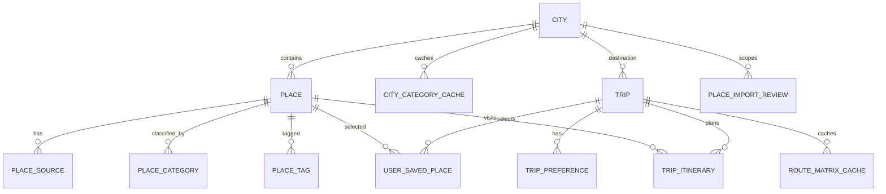

# Data model

Last reviewed: 2026-09-01

The source of truth for the current schema is `backend/app/models/entities.py`. This document
describes those SQLModel tables and the tracked SQL scripts; it does not assert what exists in
an uninspected production database.

## Current relationship map

SQLModel relationship properties are not declared; the diagram reflects explicit foreign keys.
Deletion/cascade behavior is not specified by these models and must not be assumed.

## Canonical and supporting entities

| Table/model | Status | Purpose and important constraints |
| --- | --- | --- |
| `cities` / `City` | `[IMPLEMENTED]` | Canonical destination name/state/country and coordinates. Nullable indexed `google_place_id` has unique constraint `uq_cities_google_place_id`; coordinate checks apply. |
| `places` / `Place` | `[IMPLEMENTED]` | Canonical curated POI tied to a city, with category, coordinates, optional rating, review count, feature flags, `last_fetched_at`, and `created_at`. Rating/review and coordinate checks apply. |
| `city_category_cache` / `CityCategoryCache` | `[IMPLEMENTED]` | One row per city/category with `last_fetched_at` and required `expires_at`; prevents unnecessary nearby refresh. |
| `place_tags` / `PlaceTag` | `[IMPLEMENTED]` | Application tags unique per place/tag pair. |
| `place_sources` / `PlaceSource` | `[IMPLEMENTED]` | Provider provenance and external identity. Unique per place/source and globally per source/external ID. Stores source URL, licence identifier, address/contact/social fields, provider lifecycle dates, unresolved flags, fetch/import timestamps. |
| `place_categories` / `PlaceCategory` | `[IMPLEMENTED]` | Provider-specific category ID/label, unique for place/source/external category. |
| `place_import_reviews` / `PlaceImportReview` | `[IMPLEMENTED]` schema, `[PARTIAL]` workflow | One review per provider/external place ID. Status is `pending`, `resolved`, or `ignored`; stores candidates, match evidence, and a source snapshot. No connected admin endpoint/UI action exists. |
| `trips` / `Trip` | `[IMPLEMENTED]` schema and create API, `[PARTIAL]` lifecycle | `POST /trips` persists destination, server-owned development UUID `user_id`, name, inclusive days/start date, and arrival/start-location fields. The model has no `end_date`; the request validates it and persists the equivalent `start_date + days`. Read/update/list/delete and authentication remain absent. |
| `trip_preferences` / `TripPreference` | `[IMPLEMENTED]` schema/create path | The trip-create transaction stores unique purposes, pace, budget, and transport choices as generic weighted preference rows, unique per trip/preference. |
| `user_saved_places` / `UserSavedPlace` | `[IMPLEMENTED]` API | Unique trip/place selection with custom order, priority, locked, must-visit, notes. Requires an existing trip. |
| `route_matrix_cache` / `RouteMatrixCache` | `[IMPLEMENTED]` | Per-trip directed pair/mode cache with place IDs or coordinate snapshots, canonical non-null pair keys, distance, static/traffic duration, calculation and expiry times. |
| `trip_itinerary` / `TripItinerary` | `[IMPLEMENTED]` schema, `[PARTIAL]` planner | Unique visit order per trip/day, optional times and prior-leg metrics. Current optimizer writes only `day_number = 1`. |

There is no application `User`/`Profile`, weather, currency, media, audit-log, map, or provider-job
table. These are `[PLANNED]` only where called for by the roadmap.

Authentication is not implemented. `Trip.user_id` is required by the current model but is not a
foreign key. The create service currently supplies one fixed, server-owned development-only UUID;
the request schema forbids `user_id`, `trip_id`, timestamps, and other unknown fields. Replace
this isolated identity dependency with an authenticated principal before multi-user deployment.

## Canonical place and provenance rules

`Place` is the application-owned canonical record. `PlaceSource` stores a provider identity and
raw-source-aligned metadata without forcing provider columns onto `Place`. A canonical place may
have multiple sources, but no source/external ID may attach to two canonical places.

The FSQ importer currently auto-attaches only when normalized name and broad category agree and
there is exactly one nearby candidate inside the configured distance. Ambiguous, conflicting, or
multiple candidates produce a `PlaceImportReview`; importing does not overwrite curated canonical
fields. Repeat FSQ IDs update source metadata. This is a conservative first-pass deduplication
strategy, not a general entity-resolution system.

`PlaceSource.licence_identifier`, `source_url`, provider lifecycle dates, `unresolved_flags`,
`last_fetched_at`, and `imported_at` must be preserved when extending ingestion. New providers
must not reuse another provider's identifier namespace.

## Verification state

`[PARTIAL]` Import ambiguity has explicit review status in `PlaceImportReview`, but `Place` has
no overall verification state, reviewer, review timestamp, correction history, or field-level
provenance. The mock admin UI does not change database data. Until a reviewed model is added,
do not describe canonical places as human-verified merely because an import record matched.

Planned verification additions must define whether verification applies to an entire place or
individual fields, keep an audit history, and reference the supporting sources. They require a
forward migration, rollback/data-preservation plan, admin authorization, and tests.

## Legacy Google identifiers

- `City.google_place_id` is nullable but current city resolution depends on it. Preserve both the
  column and `uq_cities_google_place_id` until Geoapify/canonical city identifiers are backfilled,
  duplicate handling is reviewed, and rollback is tested.
- Google POI IDs belong in `PlaceSource(source="google", external_place_id=...)`, not a new
  canonical `Place` column.
- Start-location provider IDs are stored on `Trip` with their provider name. They are not a
  canonical place foreign key.

Removing a Google integration does not authorize dropping historical IDs. Retain them as legacy
provenance unless policy requires deletion and a reviewed migration defines it.

## Timestamp and expiry semantics

| Field | Current meaning |
| --- | --- |
| `Place.last_fetched_at` | Last provider-backed refresh applied to that canonical place when the service sets it; nullable and not a universal verification timestamp. |
| `PlaceSource.last_fetched_at` | When YatraCanvas last fetched/imported that source representation. |
| `PlaceSource.imported_at` | When the source link was first represented in this schema; importer updates do not redefine provider creation time. |
| `PlaceSource.source_date_*` | Provider-declared creation/refresh/closure dates, not YatraCanvas timestamps. |
| `CityCategoryCache.last_fetched_at` | Last successful refresh attempt recorded for that city/category. |
| `CityCategoryCache.expires_at` | When the discovery cache should be refreshed. Stored canonical rows are not automatically deleted at expiry. |
| `RouteMatrixCache.calculated_at` | When the matrix leg was written from a route calculation. |
| `RouteMatrixCache.expires_at` | Current traffic-duration freshness boundary. Static distance/duration may still be used during an outage when every required leg exists. |
| `PlaceImportReview.updated_at` | Last importer update to the review row; it is not a human-review audit trail. |

Geoapify's autocomplete cache is in memory and therefore has no table timestamp.

## Current migration state

`[PARTIAL]` New databases receive SQLModel metadata through `create_all`. Existing databases need
reviewed SQL changes because `create_all` does not alter columns or constraints. Tracked scripts:

| Script | Direction / rollback state |
| --- | --- |
| `backend/sql/add_cities_google_place_id_unique.sql` | Forward; no dedicated rollback script |
| `backend/sql/add_place_sources_external_id_unique.sql` | Forward; no dedicated rollback script |
| `backend/sql/add_fsq_geoapify_foundation.sql` | Forward |
| `backend/sql/rollback_fsq_geoapify_foundation.sql` | Reviewed rollback paired with the FSQ/Geoapify foundation |
| `backend/sql/add_route_matrix_priorities_start_location.sql` | Forward; no dedicated rollback script |
| `backend/sql/repair_current_schema_parity.sql` | Transactional forward parity repair; recovery is roll-forward or verified backup restore after new-column writes |

No ordered/versioned runner records which scripts ran. A read-only 2026-09-01 audit found the
configured remote catalog compatible with current model metadata, but its environment
classification, migration actor, backup status, write behavior, and RLS parity remain `[UNKNOWN]`.
See `docs/CURRENT_SYSTEM_VERIFICATION.md` for the before/after mismatch inventory.

## Migration and rollback expectations

1. Introduce an ordered migration tool before the next schema feature; include an immutable
   version identifier and local/test execution path.
2. Every database change must document preconditions, data backfill, indexes/constraints,
   forward verification, rollback or roll-forward recovery, and data-loss risk.
3. Additive nullable changes are preferred during provider migration. Backfill and verify before
   making fields required or removing legacy data.
4. A destructive rollback must never be automatic. Take a reviewed backup and prove restore in
   a non-production environment.
5. RLS/grants are schema code and must be versioned and tested if Supabase clients are introduced.
6. Keep SQLModel metadata and migration DDL synchronized in the same change.

`[PLANNED]` Likely future entities include an application profile linked to Supabase Auth,
field/source verification or correction history, ingestion runs, and provider-aware weather/rate
caches. Their exact schemas are deliberately not invented here.
