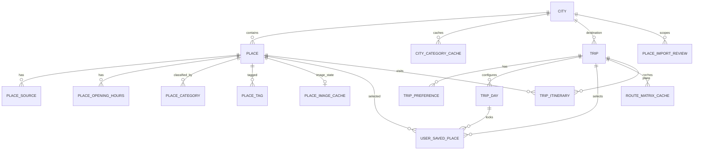

# Data model

Last reviewed: 2026-09-19

The source of truth for the current schema is `backend/app/models/entities.py`. This document
describes those SQLModel tables and the tracked SQL scripts; it does not assert what exists in
an uninspected production database.

## Current relationship map

SQLModel relationship properties are not declared; the diagram reflects explicit foreign keys.
Deletion behavior must not be assumed except where an `ondelete` action is explicitly declared.

## Canonical and supporting entities

| Table/model | Status | Purpose and important constraints |
| --- | --- | --- |
| `cities` / `City` | `[IMPLEMENTED]` | Canonical destination name/state/country and coordinates. Destination flags `is_enabled`, `is_featured`, `is_popular`, `display_order`, nullable `image_url`, and `description` govern destination promotion and availability. Nullable indexed `google_place_id` has unique constraint `uq_cities_google_place_id`; coordinate checks apply. |
| `places` / `Place` | `[IMPLEMENTED]` | Canonical curated POI tied to a city, with category, coordinates, optional rating, review count, feature flags, `wikidata_id`, `importance_score`, `moderation_status` (`ACTIVE`, `HIDDEN`, `RESTRICTED`, `DUPLICATE`, `INVALID` with check constraint `ck_places_moderation_status`), `opening_hours_status` (`KNOWN`, `CLOSED`, `UNKNOWN` with check constraint `ck_places_opening_hours_status`), preserved `raw_opening_hours`, `last_fetched_at`, and `created_at`. Rating/review and coordinate checks apply. Moderation status filters out ineligible places from candidate discovery, recommendation scoring, and manual search. |
| `users` / `User` | `[IMPLEMENTED]` | Registered user account storing unique lowercase `email`, `name`, salted `password_hash` (bcrypt), `role` (`USER`, `ADMIN` with check constraint `ck_users_role`), `is_active` boolean, `created_at`, and `updated_at`. Governs JWT bearer authentication and role-based endpoint authorization. |
| `place_reports` / `PlaceReport` | `[IMPLEMENTED]` | User/traveler place issue reports tied to `places.id` and optional `users.id`. Stores issue `reason` (`permanently_closed`, `restricted_facility`, `duplicate`, `wrong_category`, etc.), optional `details`, workflow `status` (`OPEN`, `REVIEWING`, `RESOLVED`, `REJECTED` with check constraint `ck_place_reports_status`), optional `admin_notes`, `created_at`, and `updated_at`. |
| `place_opening_hours` / `PlaceOpeningHours` | `[IMPLEMENTED]` | Normalized daily opening hours tied to `places.id` with `ondelete="CASCADE"`. Stores `day_of_week` (0=Monday .. 6=Sunday), `status` (`KNOWN`, `CLOSED`, `UNKNOWN`), and `intervals` JSON array (`[{"open": "HH:MM", "close": "HH:MM"}]`). Check constraints enforce `0 <= day_of_week <= 6` (`ck_place_opening_hours_day`) and valid status (`ck_place_opening_hours_status`). Unique constraint `uq_place_opening_hours_place_day` guarantees one schedule row per day per canonical place. Feeds exact weekday interval domains in the day-aware optimizer. |
| `city_category_cache` / `CityCategoryCache` | `[IMPLEMENTED]` | One row per city/category with `last_fetched_at` and required `expires_at`; prevents unnecessary nearby refresh. |
| `place_tags` / `PlaceTag` | `[IMPLEMENTED]` | Application tags unique per place/tag pair. |
| `place_sources` / `PlaceSource` | `[IMPLEMENTED]` | Provider provenance and external identity. Unique per place/source and globally per source/external ID. Stores `wikidata_id`, source URL, licence identifier, address/contact/social fields, preserved `raw_opening_hours`, provider lifecycle dates, unresolved flags, fetch/import timestamps. |
| `place_image_cache` / `PlaceImageCache` | `[IMPLEMENTED]` schema and service; migration not applied by repository work | One durable normalized image-resolution row per canonical place, keyed by unique `place_id`. Stores provider/place ID, normalized category, URL/thumbnail, source/attribution/author/license metadata, `resolved`/`not_found`/`failed` status, fetch/expiry timestamps, and bounded failure reason. Provider/status checks and unique `place_id` prevent ambiguous active cache rows. New provider/media identity on `PlaceSource` invalidates the row so an earlier negative result can be retried. UI fallback graphics are never stored as authentic URLs. |
| `place_categories` / `PlaceCategory` | `[IMPLEMENTED]` | Provider-specific category ID/label and creation timestamp, unique for place/source/external category. |
| `place_import_reviews` / `PlaceImportReview` | `[IMPLEMENTED]` schema, `[PARTIAL]` workflow | One review per provider/external place ID. Status is `pending`, `resolved`, or `ignored`; stores candidates, match evidence, and a source snapshot. No connected admin endpoint/UI action exists. |
| `trips` / `Trip` | `[IMPLEMENTED]` schema, create, get, and patch APIs, `[PARTIAL]` lifecycle | `POST /trips` persists destination, server-owned development UUID `user_id`, name, inclusive days/start date, and arrival/start-location fields. An optional client-generated `request_id` becomes `trips.id`; replaying the same ID and payload returns the existing trip, while reuse with different data is rejected. `GET /trips/{trip_id}` returns the complete application trip representation, and `PATCH /trips/{trip_id}` supports partial updates with date/coordinate/preference validation and downstream cache invalidation. List/delete and authentication remain absent. |
| `trip_days` / `TripDay` | `[IMPLEMENTED]` schema, create, get, and patch APIs | Individual configurable trip days tied to `trips.id` with `ondelete="CASCADE"`. Stores `day_number`, `date`, `day_type` (`FULL_DAY`, `HALF_DAY`, `REST`, `TRAVEL`), optional touring window (`start_time`, `end_time`), and `created_at`. Unique constraint `uq_trip_days_trip_day_number` enforces unique `day_number` per trip. Check constraints enforce `day_number > 0` and valid `day_type`. Automatically generated on trip creation and date updates. Protected against changing to `REST` or removing the sightseeing window when places are locked to the day. Protected against destructive duration reduction when scheduled `TripItinerary` visits exist or when places are locked to eliminated days. Active records supply optimizer route windows and original output day numbers. |
| `trip_preferences` / `TripPreference` | `[IMPLEMENTED]` schema/create/edit path | The trip-create and trip-edit transactions store unique purposes with weight 2.0 and secondary preferences (pace, budget, transport, extra interests) with weight 1.0 as generic weighted preference rows, unique per trip/preference. These weights inform recommendation relevance scoring and ranking. Also stores `ignore_weather_advisories` to suppress future weather advisories for the trip. |
| `user_saved_places` / `UserSavedPlace` | `[IMPLEMENTED]` API | Unique trip/place selection with `custom_order`, `priority`, `is_locked` (ordering/solver lock), `must_visit`, `notes`, `assignment_mode` (`AUTO` \| `LOCKED`), and nullable `assigned_day_id` (foreign key to `trip_days.id`). Database check constraints enforce `assignment_mode IN ('AUTO', 'LOCKED')` (`ck_user_saved_places_assignment_mode`) and consistency (`ck_user_saved_places_assignment_consistency`): `AUTO` requires null `assigned_day_id`, while `LOCKED` requires non-null `assigned_day_id`. In `AUTO` mode, itinerary optimization chooses an active sightseeing day. In `LOCKED` mode, the place is pinned to a specific active non-`REST` day with a usable sightseeing window belonging to the same trip. Native vehicle-domain constraints enforce assignments; infeasible locks become explicit unscheduled results. |
| `route_matrix_cache` / `RouteMatrixCache` | `[IMPLEMENTED]` | Per-trip directed pair/mode cache with place IDs or coordinate snapshots. The normal path stores approximate offline costs under `local_estimate`; legacy Google rows remain distinguishable by mode. Selectively purged: start-location edits purge only start-related pairs (`start_only`), preserving valid place-to-place legs; destination edits purge all rows (`all`). |
| `trip_itinerary` / `TripItinerary` | `[IMPLEMENTED]` | Unique visit order per trip/day, calculated planned arrival/departure times, prior-leg metrics, and execution lifecycle status (`status`: `PLANNED`, `COMPLETED`, `MISSED`, `SKIPPED`, default `'PLANNED'`, governed by check constraint `ck_trip_itinerary_status`). Populated by `RouteOptimizationService` with default `'PLANNED'`. Visit duration is derived by the shared category estimator; known-hours state and unscheduled reasons are response metadata, not persisted columns. Status updates (`PATCH /trips/{trip_id}/itinerary/stops/{stop_id}` or `places/{place_id}`) persist immediately. Moving a place (`POST /trips/{trip_id}/itinerary/move-place`) validates target feasibility, re-optimizes affected suffixes while keeping completed prefixes strictly immutable, and leaves unrelated days untouched. |

`place_image_cache` is the media-resolution cache; there is no separate provider-job or map table.
Currency has been removed from the roadmap. Weather forecasts use in-memory TTL caching and do
not require persistent database tables.

Authentication and role authorization `[IMPLEMENTED]` are supported via JWT tokens and bcrypt password hashing on `User` accounts (`USER` and `ADMIN` roles). Trip creation continues to accept legacy anonymous calls with server-owned default user identities for backward compatibility.

The FSQ importer currently auto-attaches only when normalized name and broad category agree and
there is exactly one nearby candidate inside the configured distance. Ambiguous, conflicting, or
multiple candidates produce a `PlaceImportReview`; importing does not overwrite curated canonical
fields. Repeat FSQ IDs update source metadata. This is a conservative first-pass deduplication
strategy, not a general entity-resolution system.

`PlaceSource.licence_identifier`, `source_url`, provider lifecycle dates, `unresolved_flags`,
`last_fetched_at`, and `imported_at` must be preserved when extending ingestion. New providers
must not reuse another provider's identifier namespace.

## Verification state

`[PARTIAL]` Import ambiguity has explicit review status in `PlaceImportReview`, but `Place` has
no overall verification state, reviewer, review timestamp, correction history, or field-level
provenance. The mock admin UI does not change database data. Until a reviewed model is added,
do not describe canonical places as human-verified merely because an import record matched.

Planned verification additions must define whether verification applies to an entire place or
individual fields, keep an audit history, and reference the supporting sources. They require a
forward migration, rollback/data-preservation plan, admin authorization, and tests.

## Legacy Google identifiers

- `City.google_place_id` is nullable. The normal destination flow can resolve a city without it
  by exact normalized name/state/country matching, while legacy Google endpoints still use it.
  Preserve both the column and `uq_cities_google_place_id` until Geoapify/canonical city
  identifiers are backfilled, duplicate handling is reviewed, and rollback is tested.
- Google POI IDs belong in `PlaceSource(source="google", external_place_id=...)`, not a new
  canonical `Place` column.
- OpenStreetMap POIs use `PlaceSource(source="openstreetmap", external_place_id="type/id")`
  with their element URL and `ODbL-1.0` licence identifier.
- Audiala POIs use `PlaceSource(source="audiala", external_place_id="Q...")` with their Wikipedia
  URL and `CC BY 4.0` licence identifier.
- Both `Place` and `PlaceSource` support an optional indexed `wikidata_id` for deterministic
  cross-provider canonical place identity resolution.
- Start-location provider IDs are stored on `Trip` with their provider name. They are not a
  canonical place foreign key.

Removing a Google integration does not authorize dropping historical IDs. Retain them as legacy
provenance unless policy requires deletion and a reviewed migration defines it.

## Timestamp and expiry semantics

| Field | Current meaning |
| --- | --- |
| `Place.last_fetched_at` | Last provider-backed refresh applied to that canonical place when the service sets it; nullable and not a universal verification timestamp. |
| `PlaceSource.last_fetched_at` | When YatraCanvas last fetched/imported that source representation. |
| `PlaceSource.imported_at` | When the source link was first represented in this schema; importer updates do not redefine provider creation time. |
| `PlaceSource.source_date_*` | Provider-declared creation/refresh/closure dates, not YatraCanvas timestamps. |
| `CityCategoryCache.last_fetched_at` | Last successful refresh attempt recorded for that city/category. |
| `CityCategoryCache.expires_at` | When the discovery cache should be refreshed. Stored canonical rows are not automatically deleted at expiry. |
| `RouteMatrixCache.calculated_at` | When the matrix leg was written from a route calculation. |
| `RouteMatrixCache.expires_at` | Current traffic-duration freshness boundary. Static distance/duration may still be used during an outage when every required leg exists. |
| `PlaceImportReview.updated_at` | Last importer update to the review row; it is not a human-review audit trail. |
| `PlaceImageCache.fetched_at` | Last completed provider-chain resolution attempt for the place. |
| `PlaceImageCache.expires_at` | Refresh boundary: successful rows use the long TTL; not-found and failed rows use shorter configured TTLs. A stale resolved image may still be served while refresh is scheduled. |

Geoapify's autocomplete cache is in memory and therefore has no table timestamp.

## Flutter recommendation snapshot cache

`[IMPLEMENTED]` This is device-local cache data, not canonical PostgreSQL schema. Flutter uses a
SQLite `recommendation_snapshots` table keyed by a stable city/trip-profile hash. Each row stores a
renderable recommendation JSON payload, `saved_at`, `last_validated_at`, and `schema_version`.
Entries are fresh for 24 hours, stale-usable for seven days, and removed after 30 days; incompatible
schema versions are discarded. Selected trip places remain authoritative backend records and are
not owned by this snapshot.

## Current migration state

`[PARTIAL]` New databases receive SQLModel metadata through `create_all`. Existing databases need
reviewed SQL changes because `create_all` does not alter columns or constraints. Tracked scripts:

The authoritative dependency order and the latest configured-database audit are recorded in
[`backend/sql/README.md`](../backend/sql/README.md). Do not execute this directory alphabetically.

| Script | Direction / rollback state |
| --- | --- |
| `backend/sql/add_cities_google_place_id_unique.sql` | Forward; no dedicated rollback script |
| `backend/sql/add_place_sources_external_id_unique.sql` | Forward; no dedicated rollback script |
| `backend/sql/add_fsq_geoapify_foundation.sql` | Forward |
| `backend/sql/rollback_fsq_geoapify_foundation.sql` | Reviewed rollback paired with the FSQ/Geoapify foundation |
| `backend/sql/add_route_matrix_priorities_start_location.sql` | Forward; no dedicated rollback script |
| `backend/sql/repair_current_schema_parity.sql` | Transactional forward parity repair; recovery is roll-forward or verified backup restore after new-column writes |
| `backend/sql/add_places_canonical_wikidata.sql` | Forward; adds `wikidata_id` columns, indices, and non-destructive backfill for Audiala places/sources |
| `backend/sql/add_places_importance_score.sql` | Forward; adds `importance_score` column, range check constraint (0..1), and index on places |
| `backend/sql/add_trip_days_foundation.sql` | Forward; adds `trip_days` table, foreign key cascade, unique constraint, check constraints, and safe backfill for existing trips |
| `backend/sql/rollback_trip_days_foundation.sql` | Reviewed rollback paired with the trip_days foundation |
| `backend/sql/add_places_opening_hours.sql` | Forward; adds `place_opening_hours` table, `opening_hours_status` & `raw_opening_hours` columns to `places` and `place_sources`, check constraints, indexes, and unique constraint |
| `backend/sql/rollback_places_opening_hours.sql` | Reviewed rollback paired with the opening hours foundation |
| `backend/sql/add_trip_itinerary_status.sql` | Forward; adds `status` VARCHAR(20) NOT NULL DEFAULT 'PLANNED' to `trip_itinerary`, backfill, and check constraint `ck_trip_itinerary_status` |
| `backend/sql/rollback_trip_itinerary_status.sql` | Reviewed rollback paired with the itinerary status migration |
| `backend/sql/add_admin_auth_and_moderation.sql` | Forward; adds `users`, `place_reports` tables, destination promotion columns to `cities`, `moderation_status` column and check constraint to `places` |
| `backend/sql/rollback_admin_auth_and_moderation.sql` | Reviewed rollback paired with admin auth, moderation, and destination management |
| `backend/sql/add_place_image_cache.sql` | Forward; adds the durable normalized positive/negative/failure image cache and indexes |
| `backend/sql/rollback_place_image_cache.sql` | Destructive reviewed rollback paired with the image cache; drops cached metadata only, not canonical places |

No ordered/versioned runner records which scripts ran. A read-only 2026-09-01 audit found the
configured remote catalog compatible with current model metadata, but its environment
classification, migration actor, backup status, write behavior, and RLS parity remain `[UNKNOWN]`.
See `docs/CURRENT_SYSTEM_VERIFICATION.md` for the before/after mismatch inventory.

### Configured database re-audit — 2026-09-07

`[PARTIAL]` A read-only transaction confirmed that the historical route, provider, canonical-place,
importance, TripDay, saved-place assignment, opening-hours, and itinerary-status changes are present.
All 22 trips have their expected 80 TripDay rows, and all 100 saved-place rows satisfy assignment
consistency. The three opening-hours source/canonical columns, their checks, the opening-hours foreign-key
cascade, and the `trip_itinerary.status` column/check match the current models. All 1,265 existing places
have the safe `UNKNOWN` opening-hours default, and all 92 existing itinerary rows have the `PLANNED`
status backfill.

The target is a remote Supabase database containing application data. Its development/staging/production
classification and recovery point remain `[UNKNOWN]`; the execution actor for the now-applied final two
migrations cannot be attributed from repository evidence. RLS is
enabled on every public application table, no public policies exist, and the configured `postgres` role
bypasses that boundary. The repository model maps both the established `PlaceCategory.label` contract
and the historical `place_categories.created_at` timestamp, matching the live catalog, original
migration, and importer.

## Migration and rollback expectations

1. Introduce an ordered migration tool before the next schema feature; include an immutable
   version identifier and local/test execution path.
2. Every database change must document preconditions, data backfill, indexes/constraints,
   forward verification, rollback or roll-forward recovery, and data-loss risk.
3. Additive nullable changes are preferred during provider migration. Backfill and verify before
   making fields required or removing legacy data.
4. A destructive rollback must never be automatic. Take a reviewed backup and prove restore in
   a non-production environment.
5. RLS/grants are schema code and must be versioned and tested if Supabase clients are introduced.
6. Keep SQLModel metadata and migration DDL synchronized in the same change.

`[PLANNED]` Likely future entities include an application profile linked to Supabase Auth,
field/source verification or correction history, ingestion runs, and provider-aware weather/rate
caches. Their exact schemas are deliberately not invented here.
# Core-flow integrity verification (2026-09-07)

`[IMPLEMENTED]` End-to-end tests verify Trip, TripDay, UserSavedPlace, TripItinerary, Place,
PlaceOpeningHours, and RouteMatrixCache together. COMPLETED and SKIPPED are terminal itinerary states;
MISSED may become SKIPPED or be moved. A successful move atomically updates the affected source and target
days, preserves completed prefixes and unrelated days, and updates the saved-place day lock. A rejected
move leaves all persisted rows unchanged. Full evidence and remote-schema caveats are recorded in
[`CORE_TRIP_FLOW_RELIABILITY.md`](CORE_TRIP_FLOW_RELIABILITY.md).
