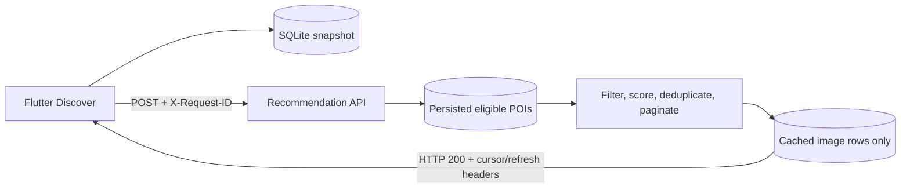
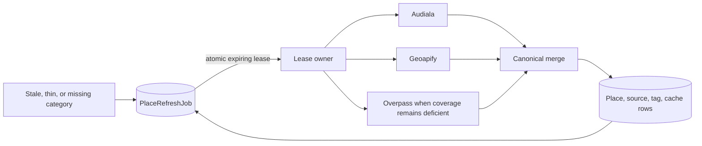
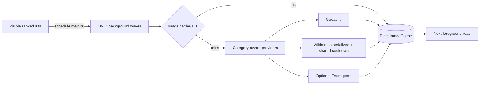
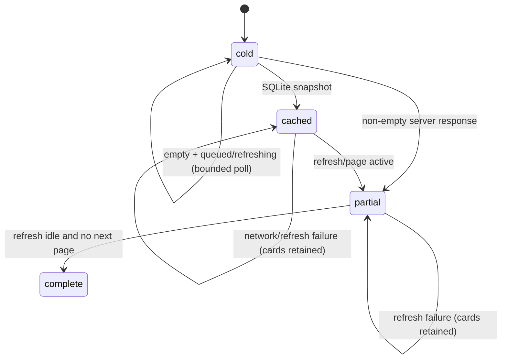

# YatraCanvas Discover Pipeline Implementation Report

Last verified against repository: 2026-09-21

## 1. Executive Summary

`[IMPLEMENTED]` Discover Places is now a cache-first read. The foreground recommendation endpoint
reads eligible persisted POIs, ranks them, attaches already-cached image metadata, and returns. It
does not wait for place providers, image providers, prefetch, or refresh. Cache age now decides when
background refresh is requested, never whether a valid persisted POI can display.

`[IMPLEMENTED]` Prefetch and Discover converge on one durable category-refresh identity and atomic
lease. Images remain optional, Wikimedia 429 responses create a shared cooldown, provider traffic
is bounded, and the final Flutter fallback is local. Flutter paints a durable device snapshot or
any partial server result without waiting for completeness and treats refresh activity as a
separate state.

`[IMPLEMENTED]` One non-identifying `X-Request-ID` follows the trip/Discover flow through the HTTP
response, cache diagnostics, durable refresh, provider categories, image scheduling, cooldown, and
completion/failure logs. `[PARTIAL]` Always-on external task delivery, configured-PostgreSQL timing,
and physical-device verification remain open; none changes the foreground provider-I/O invariant.

## 2. Root Causes Fixed

| Root cause | Before | After | Status |
| --- | --- | --- | --- |
| Provider I/O in recommendations | `RecommendationService` could enter `discover_many()` and wait for Geoapify/Overpass | Recommendations use `PersistedPlaceReader`; provider discovery is background-only | `[IMPLEMENTED]` |
| Cache age controlled display | Rows beyond the stale-usable cutoff could disappear after refresh failure | Every otherwise eligible persisted row remains displayable; age only schedules refresh | `[IMPLEMENTED]` |
| Refresh failure destroyed availability | Failed acquisition could replace usable category data with `[]` or 5xx | Existing rows survive; empty cities return HTTP 200 + `[]` + refresh metadata | `[IMPLEMENTED]` |
| Foreground joined prefetch | Active process-local work could be awaited | Foreground requests durable work and return without joining it | `[IMPLEMENTED]` |
| Duplicate refresh ownership | Process-local keys could not coalesce independent workers or overlapping category sets | One job/lease exists per `(city_id, versioned_category)` | `[IMPLEMENTED]` |
| Image enrichment amplification | Navigation could schedule broad work; concurrent Wikimedia 429s could cascade | One schedule is capped at 20 IDs in 10-item waves; process serialization plus durable cooldown bounds 429 traffic | `[IMPLEMENTED]` |
| Remote/semantically wrong fallback risk | A failed image could select an unrelated photographic fallback | Correct bundled category assets are used when present, otherwise a guaranteed local neutral gradient/icon | `[IMPLEMENTED]` |
| One blocking Flutter loading state | Usable local/partial cards could be hidden behind skeleton/error state | Data and refresh are independent; any non-empty cards render immediately and survive refresh failure | `[IMPLEMENTED]` |
| Unbounded/ambiguous empty refresh UX | Empty active refresh could look terminal or poll indefinitely | Preparation state polls at most three times and respects lifecycle/navigation | `[IMPLEMENTED]` |
| No end-to-end correlation | Foreground and detached work could not be followed safely | Validated/generated request context is copied to refresh/image tasks and returned to Flutter | `[IMPLEMENTED]` |

## 3. Final Architecture

### Foreground recommendation



The solid path performs zero external place or image provider I/O.

### Background refresh



Job intent, state, outcome, and lease are durable. `[PARTIAL]` The local dispatcher is not an
always-on external queue; after total process loss a later request recovers queued/expired work.

### Image enrichment



Image absence or failure never changes POI availability.

### Flutter progressive loading



Data state (`cold`, `cached`, `partial`, `complete`) and refresh state (`idle`, `queued`,
`refreshing`, `refreshFailed`) are orthogonal.

## 4. Phase 0 — Correctness

Commit: `e277003 fix(discover): separate persisted reads from refresh`.

Key files:

- `backend/app/services/persisted_place_reader.py`
- `backend/app/services/recommendation_service.py`
- `backend/app/services/openstreetmap_discovery_service.py`
- `backend/app/routers/places.py`
- `backend/tests/test_discover_cache_first.py`

Before, an over-age category could force synchronous provider discovery and lose usable rows on
failure. After, the recommendation service receives a DB-only candidate snapshot. Freshness is
calculated separately, empty and partial reads return HTTP 200, and stale/expired rows remain
eligible. The Shillong fixture, three-row fixture, empty-city contract, first-page cursor, and
provider spies cover the behavior.

## 5. Phase 1 — Refresh Coordination

Commit: `a917d76 fix(prefetch): coordinate durable category refresh jobs`.

Key files:

- `backend/app/services/durable_place_refresh_service.py`
- `backend/app/services/city_place_prefetch_service.py`
- `backend/app/models/entities.py`
- `backend/sql/add_place_refresh_jobs.sql`
- `backend/sql/rollback_place_refresh_jobs.sql`
- `backend/tests/test_durable_place_refresh.py`

`PlaceRefreshJob` has one unique `(city_id, versioned_category)` row, explicit queued/running/
completed/failed state, an owner, lease deadline, attempts, timestamps, and bounded error type.
Atomic lease acquisition means two workers can dispatch the same category but only one executes
providers. Expired leases are recoverable. Requests for `{food, cafes}` and `{cafes, markets}`
produce one provider execution each for food, cafes, and markets. Provider failure records the job
outcome and preserves canonical POIs.

## 6. Phase 2 — Images

Commit: `b700f40 fix(images): bound provider requests and local fallbacks`.

Key files:

- `backend/app/services/place_image_service.py`
- `backend/app/services/provider_rate_control.py`
- `backend/app/services/wikimedia_image_provider.py`
- `backend/sql/add_provider_cooldowns.sql`
- `lib/widgets/place_image.dart`
- `lib/utils/place_image_fallbacks.dart`
- image provider/cache/rate-control and Flutter widget tests

One image schedule preserves ranked order, accepts at most 20 IDs, and runs 10-ID waves with
bounded concurrency and timeouts. Wikimedia Action requests are serialized per process, transient
network/5xx failures retry once, and HTTP 429 persists `Retry-After` as a cross-worker cooldown.
The 60-concurrent-ID immediate-429 regression made exactly one HTTP request; another batch during
the durable cooldown made zero.

Flutter attempts a valid resolved image, then a semantically correct bundled category asset, then
a local neutral gradient/icon. `null`, not-found, malformed, offline, and provider-failed images
leave cards usable and stable.

## 7. Phase 3 — Progressive UX

Commit: `4de3e24 fix(discover-ui): support progressive recommendation states`.

Key files:

- `lib/screens/place_discovery/place_discovery_screen.dart`
- `lib/services/recommendation_cache.dart`
- `lib/services/recommendation_service.dart`
- `test/place_discovery_progressive_state_test.dart`
- `test/place_discovery_test.dart`

The screen renders SQLite and backend cards non-destructively, writes only non-empty snapshots,
and preserves selection and scroll identity while merging/paginating by canonical place ID. Any
non-empty result—including three cards—ends the full skeleton. Empty queued/refreshing data shows a
preparation state and polls every two seconds for at most three attempts while mounted and resumed.
Refresh/network failure with cards is a non-blocking warning; without cards it becomes explicit
retry UI. Pixel 10 / Android 17 verification completed trip setup and rendered 10 Jaipur cards at
1080 × 2424.

## 8. Phase 4 — Observability

Commit subject: `chore(observability): trace discover and refresh pipeline` (this report is part of
that commit).

`backend/app/core/request_context.py` validates an incoming 1–128 character safe request ID or
generates a UUID, binds it in a `ContextVar`, adds it to every response, and resets context after
the request. Concurrent requests are isolated. Background refresh and image tasks receive an
explicit copy rather than relying on a request context that has already ended.

Recommendation, DB/cache, enqueue, lease, provider category, completion/failure, image schedule,
and provider-cooldown logs include useful bounded fields such as request/city/category/job/worker,
counts, state, elapsed time, and error type. Middleware logs method/path/status, not raw headers;
the authorization-secret regression confirms the token is absent.

Flutter reuses `TripDraft.creationRequestId` for trip creation, staged prefetch, recommendation
sync, and image warming. The value contains no user data. Architecture, API, project, roadmap,
decision, and data-loading documents were reconciled.

Cleanup after repository-wide call-site search:

- removed unused Flutter `RecommendationService.prefetchCityPlaces`; active screens use
  `PlacePrefetchService`;
- removed `ProgressivePrefetchCoordinator.join_active`; the production route uses durable refresh;
- marked `PlaceService.discoverPlaces` / `/discover-places` `[DEPRECATED]` and retained it for API
  compatibility;
- updated the legacy route regression to seed provider data before asserting DB-only
  recommendations.

## 9. Shillong Regression

| Evidence | Result |
| --- | --- |
| Fixture row count | 73 eligible persisted POIs |
| Category metadata age | approximately 229 hours |
| Provider state | all place providers mocked unavailable / forbidden on foreground |
| HTTP result | 200 |
| First-page result | 10 recommendations + next cursor |
| Foreground provider calls | **0** |

**FOREGROUND PROVIDER CALL COUNT = 0**

This is isolated fixture evidence. The real configured Shillong database was not mutated.

## 10. Request Amplification Before vs After

| Operation | Before | After |
| --- | --- | --- |
| Recommendation place-provider calls | Could enter live multi-category discovery; exact calls were provider/data dependent | **0** |
| Recommendation Overpass calls | Could reach Overpass on the foreground critical path | **0** |
| Recommendation Geoapify POI calls | Could run as foreground discovery/fallback | **0** |
| Recommendation image-provider calls awaited | Images were intended as background but scheduling was broader | **0 awaited**; cache read only, background schedule max 20 IDs |
| Prefetch provider execution | Process-local deduplication could duplicate another worker | At most one lease owner per city/versioned category |
| Overlapping refresh `{food,cafes}` + `{cafes,markets}` | `cafes` could execute twice across workers | food once, cafes once, markets once |
| Immediate Wikimedia 429 with 60 concurrent IDs | Could amplify into many requests/retries | 1 HTTP request, then shared cooldown |
| New Wikimedia batch during cooldown | Could retry provider immediately | 0 HTTP requests |
| Duplicate refresh execution | Non-zero was possible across processes; exact historical count `[UNKNOWN]` | 0 duplicate executions in controlled concurrency tests |

Successful image-provider request counts remain data/cache/fallback dependent and are therefore
`[UNKNOWN]` for a representative production trip. The enforced schedule, wave, concurrency,
timeout, retry, and cooldown bounds are deterministic.

## 11. Scenario A-L Results

| Scenario | Result | Evidence |
| --- | --- | --- |
| A — populated city | PASS | persisted endpoint tests return immediately with provider spies untouched |
| B — Shillong / over-age cache | PASS | 73 rows, ~229 hours, 10 returned, 0 foreground calls |
| C — Wikimedia failure | PASS | provider/cache plus Flutter fallback tests retain cards |
| D — Overpass failure | PASS | persisted recommendation and durable failure tests retain rows |
| E — no image/offline | PASS | bundled-category and guaranteed-neutral widget tests |
| F — only three stored POIs | PASS | exact HTTP 200 / three-item regression |
| G — Wikimedia 429 | PASS | one request for immediate 429; durable cooldown suppresses next batch |
| H — empty new city | PASS | HTTP 200 + `[]` + queued/refresh state and bounded preparation UX |
| I — two workers, same refresh | PASS | one provider execution under atomic lease test |
| J — overlapping category sets | PASS | food/cafes/markets each execute once |
| K — refresh failure + device cache | PASS | cached/partial Flutter cards remain with non-blocking warning |
| L — all external providers disabled | PASS | persisted endpoint works with provider methods forbidden |

These are controlled automated scenarios (plus the Jaipur emulator UX run), not configured
production-database timing evidence. Manali production timings remain `[UNKNOWN]`.

## 12. Existing Tests

Actual verification on 2026-09-21:

```text
python -m pytest tests/test_live_discovery_reliability.py
  tests/test_live_discovery_resilience.py
  tests/test_progressive_prefetch_coordinator.py
  tests/test_place_image_cache.py
  tests/test_wikimedia_image_provider.py
  tests/test_discover_cache_first.py
  tests/test_durable_place_refresh.py
  tests/test_wikimedia_rate_control.py
  tests/test_request_correlation.py -q
Result: 68 passed, 4 warnings

The final expanded Discover/provider/image/correlation run also included
`tests/test_openstreetmap_discovery_service.py`: 75 passed, 4 warnings.

python -m pytest tests -q --basetemp ../.pytest_tmp_full_postlog -p no:cacheprovider
Result: 462 passed, 4 warnings (313.86s)

flutter analyze
Result: no issues found (final run 54.6s)

flutter test test/place_discovery_test.dart
flutter test test/recommendation_cache_test.dart
flutter test test/prefetch_live_discovery_test.dart
flutter test test/place_image_test.dart
flutter test test/place_discovery_progressive_state_test.dart
Result: 49 passed across the five required individual files

flutter test test/place_image_prefetch_service_test.dart
Result: 3 passed
```

The first unredirected backend suite run reported 456 passed, one legacy test failure, and five
FSQ importer setup errors. The errors were a Windows permission failure under
`AppData/Local/Temp/pytest-of-girir`; the same importer files passed with a workspace basetemp. The
legacy test expected recommendations to populate provider cache, was updated to seed via the
deprecated provider route first, and then passed while asserting both recommendation reads add
zero provider calls.

The broad Flutter suite has unrelated pre-existing account, onboarding/route, and golden-baseline
failures; targeted Discover/core-flow tests are the acceptance set for these changes.

## 13. New Tests

Important regressions added or materially changed across the phases:

- over-age 73-row Shillong returns 10 with zero foreground provider calls;
- explicit zero calls to Audiala, Geoapify, Overpass, Wikimedia/Foursquare-relevant image paths;
- three over-age rows return exactly three; empty city returns HTTP 200 and refresh metadata;
- same category across two workers executes one provider; overlapping sets coalesce per category;
- active lease is observed without waiting; expired lease recovers; failure preserves rows;
- 60 concurrent Wikimedia resolutions with immediate 429 make one request and persist cooldown;
- a new batch during cooldown makes zero HTTP requests;
- image schedule priority/cap, local semantic assets, neutral fallback, failure and stable layout;
- cold/cached/partial/complete state matrix, refresh failure, local-cache network failure, three-card
  skeleton exit, preparation state, and bounded polling;
- incoming request ID retention, invalid/missing replacement, response header, concurrent context
  isolation, refresh/image background propagation, and authorization-secret omission;
- Flutter trip creation, prefetch, recommendation, and image warming propagate one flow ID.

## 14. Migrations

Two additive manual SQL migrations were added under repository convention:

- `backend/sql/add_place_refresh_jobs.sql` creates the job table, unique city/category identity,
  state/attempt checks, lease/outcome timestamps, and indexes.
- `backend/sql/add_provider_cooldowns.sql` creates provider-wide cooldown deadline/retry metadata and
  indexes.

Both preserve all canonical POIs and image rows. Corresponding rollback scripts drop only the new
coordination table. They are destructive only to job/cooldown history, are documented for reviewed
manual execution in a transaction, and were **not applied to production** during repository work.

## 15. API Changes

All normal recommendation changes are backward-compatible and additive:

- `POST /cities/{city_id}/recommendations` accepts existing payload plus optional opaque cursor;
- response may include `X-Next-Cursor`, `X-Refresh-State`, and `X-Stale-Categories`;
- every endpoint accepts an optional safe `X-Request-ID` and returns the resolved ID;
- partial or empty valid reads return HTTP 200; image fields remain optional;
- `/discover-places` remains available but is `[DEPRECATED]` and is not Flutter's normal flow.

## 16. Remaining Risks

- `[PARTIAL]` Local background task delivery is not an always-on queue. Durable refresh intent and
  leases survive, but a later request is required after total process loss; image dispatch remains
  process-local.
- `[UNKNOWN]` Configured PostgreSQL `EXPLAIN`, query counts, and cold/warm/active-prefetch Manali
  timings were not run. No index was invented without that evidence.
- `[PARTIAL]` Pixel emulator verification passed, but physical-device/offline acceptance and a
  full-motion recording remain open.
- `[PARTIAL]` Flutter SQLite caching has no equivalent web durable adapter.
- `[PARTIAL]` Cursor pagination is opaque but offset-backed, not a durable ranked snapshot token.
- `[PARTIAL]` Wikimedia serialization is process-local; durable cooldown is cross-worker.
- `[PARTIAL]` Bundled Audiala data is thin for Manali and Shillong.
- `[DEPRECATED]` The compatibility `/discover-places` endpoint can still perform synchronous live
  discovery; the production Flutter recommendation flow never calls it.
- `[UNKNOWN]` Central log collection, retention, access controls, metrics, and alerting depend on
  deployment architecture.

## 17. Design Decisions Requiring Review

1. Approve/apply the two manual additive migrations through the controlled deployment process.
2. Select an always-on external worker/queue before relying on refresh completion without later
   traffic.
3. Decide whether to remove the deprecated `/discover-places` contract in a versioned API change.
4. Approve correlation/log retention, sampling, access, and redaction policy.
5. Run configured PostgreSQL plans/timings before considering any composite index.
6. Decide whether production web needs a durable recommendation cache and whether cursor pages need
   server-side snapshot semantics.

## 18. Deferred Work

DataFactory ingestion remains `[UNKNOWN]`. No verified runtime DataFactory release ingestion path
was found, and none was invented. Broader source update/deletion reconciliation, always-on workers,
Wikimedia description ingestion, web cache, physical-device validation, and production metrics are
separate work.

## 19. Git Commits

- `e277003 fix(discover): separate persisted reads from refresh`
- `a917d76 fix(prefetch): coordinate durable category refresh jobs`
- `b700f40 fix(images): bound provider requests and local fallbacks`
- `4de3e24 fix(discover-ui): support progressive recommendation states`
- `chore(observability): trace discover and refresh pipeline` (this commit; hash assigned on commit)

No push was performed.

## 20. Final Invariant Check

| # | Question | Answer |
| --- | --- | --- |
| 1 | Do foreground recommendations make zero provider calls? | YES |
| 2 | Can 229-hour-old valid POIs still display? | YES |
| 3 | Does provider failure preserve persisted recommendations? | YES |
| 4 | Are partial recommendations returned? | YES |
| 5 | Is refresh durable across workers? | YES for job intent/state/lease/outcome; delivery is `[PARTIAL]` |
| 6 | Are duplicate category refreshes coalesced? | YES |
| 7 | Can Wikimedia failure affect POI availability? | NO |
| 8 | Is Wikimedia 429 handling rate-limit aware? | YES |
| 9 | Is the final image fallback fully local? | YES |
| 10 | Does Flutter render cached/partial data before refresh completes? | YES |
| 11 | Can empty new cities return 200 while refresh happens? | YES |
| 12 | Does one correlation ID connect the major pipeline stages? | YES |
| 13 | Did Home/Explore remain untouched except any strictly necessary compatibility change? | YES; neither was changed |
| 14 | Are there any remaining foreground recommendation call paths into `discover_many()`? | NO; only the explicitly `[DEPRECATED]` compatibility discovery route can invoke live discovery |
