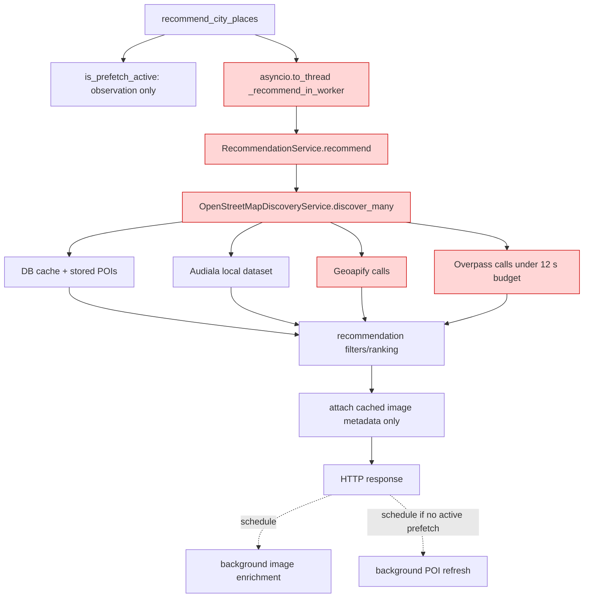
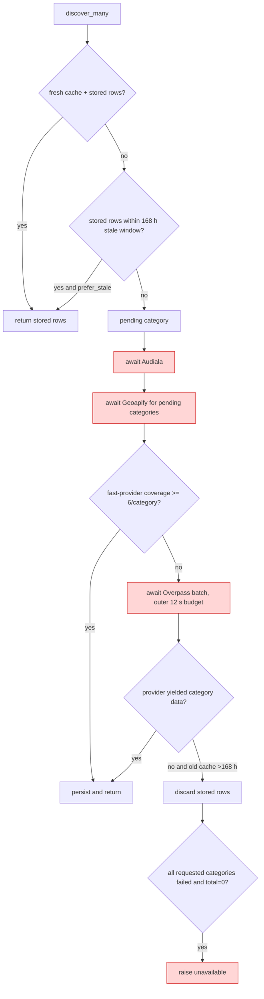
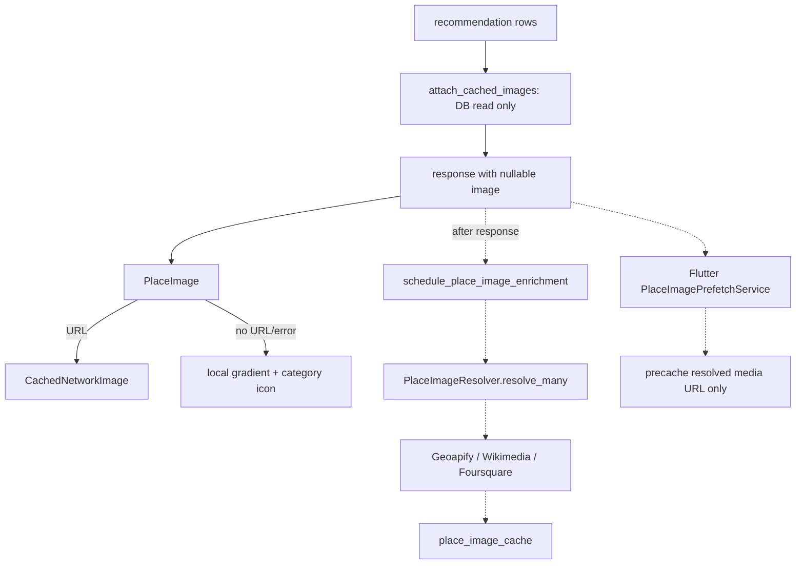

# YatraCanvas Discover Pipeline Root Cause Audit

Audit date: 2026-09-20  
Scope: Flutter Discover Places, staged POI prefetch, FastAPI recommendations, provider discovery, backend/device caches, image enrichment, and fallbacks.  
Method: runtime call-site tracing, current source inspection, read-only queries against the configured database, and controlled existing tests. No application code, timeout, retry, provider, UI, image, or database state was changed.

Status labels in this report follow the repository convention: `[IMPLEMENTED]`, `[PARTIAL]`, `[PLANNED]`, `[DEPRECATED]`, and `[UNKNOWN]`.

## 1. Executive Summary

Discover Places is not cache-only or provider-independent. The endpoint no longer joins the explicit prefetch task, but the request still calls `RecommendationService.recommend()`, which awaits `OpenStreetMapDiscoveryService.discover_many()`. That method synchronously calls Audiala, Geoapify, and, when coverage is below six places per requested category, Overpass. The 12-second Overpass budget is therefore still inside the HTTP request. Evidence: `backend/app/routers/places.py:378-424`, `backend/app/services/recommendation_service.py:326-356`, and `backend/app/services/openstreetmap_discovery_service.py:80-170,207-348`.

Shillong is not missing POIs. The configured database contained 73 places, all 73 active, named, geocoded, tagged, and sourced. The seven category cache rows were approximately 229 hours old. The configured stale-usable window is 168 hours, so the discovery service classifies those categories as pending, performs providers, and then explicitly discards those stored rows when refresh fails. With every requested category failed and zero remaining “usable” rows, it raises `OpenStreetMapPlacesUnavailableError`. Evidence: live read-only database audit plus `backend/app/core/config.py:255-289` and `backend/app/services/openstreetmap_discovery_service.py:119-170,448-500`.

The exact Flutter message in the observation is emitted only for Dart `TimeoutException`. The recommendation client waits up to 45 seconds. On a cold/profile-mismatched device snapshot, there are no cards to preserve, so the timeout becomes the full-page error. If a usable device snapshot exists, the screen does preserve it and shows the refresh failure as a snackbar. Evidence: `lib/services/recommendation_service.dart:16,71-80` and `lib/screens/place_discovery/place_discovery_screen.dart:232-348,1579-1585,2137-2168`.

Top three root causes:

1. **P0 — foreground recommendations still own live discovery.** Removing `join_active()` did not remove `await discover_many()`. Provider latency and failure remain on the user-visible request.
2. **P0 — the stale policy converts valid persisted POIs into zero usable POIs.** Shillong’s 73 rows are discarded after seven days when provider refresh fails, even though they pass recommendation filters.
3. **P1 — prefetch and foreground discovery are not one coordinated job.** The coordinator observes active prefetch but recommendation discovery neither joins nor reuses its future; it launches its own provider work. Coordination is process-local and not shared across workers.

Wikimedia 429s are a separate amplification/resilience defect. They do not directly cause the recommendation timeout or invalidate POI DTOs, but they create heavy independent background work and yield no real images. The current card still renders an offline gradient/icon fallback, not one of the registered category photo assets.

## 2. Actual Runtime Architecture

Red nodes are synchronous on the Discover HTTP/UI critical path. Background work is dashed conceptually.

### Flutter

```mermaid
flowchart TD
    A[DestinationSelectionScreen._continue] -->|unawaited| B[PlacePrefetchService.prefetchCity]
    B -. POST /places/prefetch .-> C[backend prefetch]
    A --> D[dates / arrival / purpose / preferences]
    D --> E[TripPreferencesScreen._finish]
    E --> F[createTrip or updateTrip]
    F --> G[PlaceDiscoveryScreen]
    G --> H[RecommendationCache.read]
    G --> I[RecommendationService.getRecommendations]
    I --> J[POST /cities/{id}/recommendations]
    H -->|usable snapshot| K[render cards while refreshing]
    H -->|miss/expired/empty| L[keep skeleton]
    J --> M{success?}
    M -->|yes| N[parse + render + cache write]
    M -->|TimeoutException and no local cards| O[full-page timeout error]
    M -->|error and local cards| P[keep cards + snackbar]
    style I fill:#ffd6d6,stroke:#c00
    style J fill:#ffd6d6,stroke:#c00
```

Evidence: `lib/screens/create_trip/destination_selection_screen.dart:277-295`, `lib/screens/create_trip/trip_preferences_screen.dart:79-130`, `lib/screens/place_discovery/place_discovery_screen.dart:232-348`, and `lib/services/recommendation_service.dart:25-99`.

### Backend recommendation request



Evidence: `backend/app/routers/places.py:84-127,378-467`, `backend/app/services/recommendation_service.py:326-368`, and `backend/app/services/openstreetmap_discovery_service.py:80-170,207-356`.

### POI discovery



Evidence: `backend/app/services/openstreetmap_discovery_service.py:119-180,207-356,430-500` and `backend/app/core/config.py:267-289`.

### Image loading



Evidence: `backend/app/services/recommendation_service.py:688-690`, `backend/app/routers/places.py:425-427`, `backend/app/services/place_image_service.py:152-283,471-515`, `lib/widgets/place_image.dart:31-95`, and `lib/services/place_image_prefetch_service.dart:25-79`.

## 3. Expected Architecture vs Actual Architecture

| Component | Expected | Actual | Evidence | Impact |
|---|---|---|---|---|
| Recommendation endpoint | `[PLANNED]` DB/cache-only response | `[PARTIAL]` Does not join prefetch, but still awaits `recommend()` → `discover_many()` → providers | `backend/app/routers/places.py:390-424`; `backend/app/services/recommendation_service.py:326-356` | Live providers remain critical-path dependencies |
| Stored POI fallback | `[PLANNED]` Any valid stored places remain displayable | `[PARTIAL]` Stored data older than 168 hours is dropped after failed refresh | `openstreetmap_discovery_service.py:448-500` | Shillong becomes zero despite 73 valid rows |
| Prefetch reuse | `[PLANNED]` Discover consumes the same in-flight result | `[PARTIAL]` Same DB/cache keys, different tasks; only an extra post-response refresh is suppressed | `places.py:408-455`; `progressive_prefetch_coordinator.py:230-272` | Duplicate provider work during navigation |
| Device cache | `[IMPLEMENTED]` Show usable snapshot while refreshing | `[IMPLEMENTED]` Read occurs while network future is in flight; data is rendered first when present | `place_discovery_screen.dart:267-304` | Works only after a prior successful identical profile |
| Image independence | `[IMPLEMENTED]` POIs serialize without images | `[IMPLEMENTED]` Image is nullable; recommendation attaches cached metadata and schedules enrichment later | `recommendation.py:62-79`; `recommendation_service.py:688-690`; `places.py:425-427` | Wikimedia does not directly invalidate POIs |
| Image rate control | `[PLANNED]` Shared bounded rate limiting | `[PARTIAL]` Semaphore is per resolver instance/batch; no cross-batch/worker limiter | `place_image_service.py:171-218` | Concurrent jobs/workers multiply Wikimedia traffic |
| Photo fallback | `[PLANNED]` Local category image | `[PARTIAL]` Assets and mapping exist but active widget never calls them; it uses a local gradient/icon | `place_image_fallbacks.dart:1-65`; `place_image.dart:31-95,117-194` | Offline visual exists, category photograph does not |
| Correlation | `[PLANNED]` One ID across Flutter, request, prefetch, providers, images | `[PARTIAL]` Random recommendation ID exists only in two router log records | `places.py:392-400,456-461`; `main.py:43-78` | One trip cannot be reconstructed reliably from logs |

The source-of-truth documents conflict with the implementation. ADR-020 says recommendations return canonical rows immediately and deepen separately (`docs/DECISIONS.md:5-20`); Architecture says the endpoint reads PostgreSQL rows immediately (`docs/ARCHITECTURE.md:5-15`) and later says foreground recommendations join active prefetch (`docs/ARCHITECTURE.md:230-240`). Current code does neither consistently: it does not join, but it does await a new `discover_many()` call. Those documentation claims are `[PARTIAL]`, not `[IMPLEMENTED]`, until the read and refresh paths are actually separated.

## 4. Complete Call Graph

```text
Flutter trip flow
DestinationSelectionScreen._continue
  -> unawaited PlacePrefetchService.prefetchCity(destinationConfirmed)
  -> SelectDatesScreen._continue
       -> unawaited prefetchCity(datesConfirmed)
  -> ArrivalDetailsScreen
       -> unawaited prefetchCity(startLocationConfirmed)
  -> TripPurposeScreen._continue
       -> unawaited prefetchCity(interestsConfirmed, categoriesForPurposes)
  -> TripPreferencesScreen._finish
       -> TripService.createTrip/updateTrip
       -> PlaceDiscoveryScreen

Flutter Discover
PlaceDiscoveryScreen._loadRecommendations
  -> RecommendationService.getRecommendations (future starts immediately)
       -> POST /cities/{city_id}/recommendations (45 s Dart timeout)
  -> RecommendationCache.read(profileKey)
       -> SQLite recommendation_snapshots
       -> render usable, non-empty snapshot if present
  -> await backend future
       -> merge/render/write snapshot
       -> unawaited PlaceImagePrefetchService.prefetchRecommendations
  -> on TimeoutException with no cards: full-page error

Backend prefetch
POST /places/prefetch
  -> places.prefetch_city_places
  -> ProgressivePrefetchCoordinator.enqueue
  -> worker CityPlacePrefetchService.prefetch
       -> DB coverage + CityCategoryCache
       -> OpenStreetMapDiscoveryService.discover_many(force_refresh=True)
       -> Audiala -> Geoapify -> optional Overpass
       -> canonical Place/PlaceTag/PlaceSource/CityCategoryCache writes
  -> on completion select up to 60 Place IDs
  -> schedule_place_image_enrichment

Backend Discover
POST /cities/{city_id}/recommendations
  -> places.recommend_city_places
  -> coordinator.is_prefetch_active (read-only check)
  -> asyncio.to_thread(_recommend_in_worker)
  -> asyncio.run(RecommendationService.recommend)
  -> OpenStreetMapDiscoveryService.discover_many
       -> CityCategoryCache + stored Place rows
       -> await Audiala
       -> await Geoapify
       -> await Overpass when fast coverage < 6/category
       -> persist or discard over-age stale rows on failure
  -> moderation/dedup/suitability/relevance/ranking/pagination
  -> attach_cached_images (no provider)
  -> return JSON
  -> schedule image enrichment
  -> optionally enqueue a further background POI refresh
```

Evidence: `destination_selection_screen.dart:277-295`, `select_dates_screen.dart:114-140`, `arrival_details_screen.dart:400-421`, `trip_purpose_screen.dart:60-79`, `trip_preferences_screen.dart:79-130`, `place_discovery_screen.dart:232-348`, `places.py:84-127,378-585`, and `recommendation_service.py:326-368`.

## 5. Prefetch Audit

### When and what starts

- `[IMPLEMENTED]` Destination Continue starts fire-and-forget `destination_confirmed` prefetch: `lib/screens/create_trip/destination_selection_screen.dart:277-295`.
- `[IMPLEMENTED]` Date, start-location, and purpose screens emit their stages: `select_dates_screen.dart:114-140`, `arrival_details_screen.dart:400-421`, and `trip_purpose_screen.dart:60-79`.
- `[IMPLEMENTED]` Flutter posts to `/places/prefetch`, times out its own acknowledgement after 15 seconds, and swallows all failures: `lib/services/place_prefetch_service.dart:33-45,92-123`.
- `[IMPLEMENTED]` Backend returns 202 after enqueueing. Only destination and interests stages request categories; date and start-location stages record state without provider work: `backend/app/routers/places.py:501-585`.

### Data fetched and stored

- POIs, provider identities, category tags, canonical metadata, and available opening-hours fields are persisted through the discovery/canonicalization path. The data lands in `places`, `place_sources`, `place_tags`/`place_categories`, opening-hours structures when providers supply them, and `city_category_cache`.
- Images are not resolved inside the POI discovery transaction. After a prefetch completes, the router selects up to 60 city place IDs and schedules independent image enrichment: `backend/app/routers/places.py:558-568`.
- Destination prefetch targets 15 candidates per category; later enrichment targets 35: `backend/app/services/city_place_prefetch_service.py:49-50,102-107`.

### Keys and reuse

- Backend prefetch and Discover use the same `city.id` and versioned category key (`category.value` for version 1): `openstreetmap_discovery_service.py:53-57,103-117`. There is no city-name/slug/state/country mismatch in this path.
- The Flutter snapshot is a different cache: `cityId + sorted purposes + sorted categories + categoryFilter`, hashed and stored in SQLite. It is not written by POI prefetch and does not include trip ID: `lib/services/recommendation_cache.dart:44-60,119-170`.
- Therefore **prefetch data is reusable at the backend DB level**, but **prefetch does not create a device-renderable recommendation snapshot**.

### Implementation gaps

1. `has_fast_prefetch_provider` is true whenever an Audiala provider object exists, not when that dataset covers the selected city. Destination prefetch can therefore skip Overpass after Audiala returns zero for Shillong: `openstreetmap_discovery_service.py:59-64` and `city_place_prefetch_service.py:239-250`.
2. `ProgressivePrefetchCoordinator` deduplicates `(city_id, category)` only inside one process: `progressive_prefetch_coordinator.py:53-140`. It has no durable/shared job state.
3. The recommendation request checks `is_prefetch_active()` but does not reuse that task or its partial result. It independently calls discovery: `places.py:408-424`.
4. The prefetch coverage query counts city/category rows before the recommendation moderation filter; hidden rows can satisfy prefetch coverage and later be rejected. Evidence: `city_place_prefetch_service.py:114-196` versus `recommendation_service.py:362-366`. This did not cause Shillong’s failure because all 73 rows were active.

## 6. Cache Audit

### Backend POI cache

| Property | Actual implementation |
|---|---|
| Durable data | PostgreSQL `Place` plus category/source tables and `CityCategoryCache` |
| Key | `(city_id, versioned category)` |
| Fresh TTL | 24 hours default |
| Stale usable | 168 hours from `last_fetched_at` |
| Minimum provider coverage | 6 per category for deciding whether Overpass is needed |
| Fresh low count | Returned immediately if a fresh cache row and at least one stored place exist |
| Stale within 7 days | Returned immediately when `prefer_stale=True` |
| Stale older than 7 days | Treated as pending; discarded if provider refresh fails |

Evidence: `backend/app/core/config.py:255-289` and `backend/app/services/openstreetmap_discovery_service.py:103-170,266-348,448-500`.

The six-place threshold does **not** reject a fresh cache hit. It controls whether fast-provider coverage is sufficient before Overpass during a pending refresh. Therefore 3–5 fresh places return; 3–5 stale-within-window places return; 3–5 rows older than the stale window trigger providers and can become an error if all requested categories fail.

### Flutter recommendation snapshot

| Property | Actual implementation |
|---|---|
| Storage | `sqflite` database `yatracanvas_recommendations.db` |
| Table | `recommendation_snapshots` |
| Key | city ID + purposes + categories + active filter; trip ID excluded |
| Fresh | 24 hours |
| Stale usable | 7 days |
| Eventual deletion | 30 days |
| Write | Only after a successful backend recommendation response |
| Read | At screen load, while network future is already running |

Evidence: `lib/services/recommendation_cache.dart:28-170` and `lib/screens/place_discovery/place_discovery_screen.dart:254-319`.

The caches solve different problems. Backend POI prefetch can populate PostgreSQL but cannot prevent a full-page error on a first device visit unless the endpoint itself returns those POIs. A previous successful response for the exact Flutter profile is required for immediate local cards.

### Backend image cache

`place_image_cache` is durable and keyed one-to-one by canonical `place_id`; it stores `resolved`, `not_found`, and `failed`. Defaults are 720 hours positive, 24 hours negative, and 30 minutes provider failure. Evidence: `backend/app/models/entities.py:211-251`, `backend/app/core/config.py:87-115`, and `backend/app/services/place_image_service.py:152-283`.

A Wikimedia 429 becomes `failed`, so the same place is suppressed for 30 minutes. After expiry, reopening/rescheduling can call providers again. Negative caching is present; its short failure TTL and repeated large scheduling batches allow recurrent bursts.

### Flutter media cache

`CachedNetworkImage`/`CachedNetworkImageProvider` supplies the media memory/disk cache. Flutter SQLite stores recommendation JSON, including image metadata returned at that moment, but it is not a separate image-resolution cache. Evidence: `lib/widgets/place_image.dart:44-74` and `lib/services/place_image_prefetch_service.dart:25-79`.

## 7. Overpass Investigation

- The outer interactive budget is `DISCOVERY_INTERACTIVE_TIMEOUT_SECONDS`, default 12.0 seconds: `backend/app/core/config.py:267-272`.
- It wraps the multi-category Overpass phase for one `discover_many()` call, not each individual category. Evidence: `backend/app/services/openstreetmap_discovery_service.py:266-348`.
- The Overpass client has its own default HTTP timeout of 25 seconds and query timeout derived as `timeout - 2`, but the outer 12-second budget wins for foreground discovery: `backend/app/services/openstreetmap_places_service.py:119-148`.
- Categories execute in waves of at most three, with categories in a wave gathered concurrently: `openstreetmap_places_service.py:273-352`.
- When the outer budget expires, asyncio cancels outstanding category calls. That produces the observed per-category “cancelled … 12.01s” logs: `openstreetmap_places_service.py:190-210`.
- The discovery layer catches outer `TimeoutError`, logs that cached/provider results will be used, and continues: `openstreetmap_discovery_service.py:338-348`.
- It then marks categories without new provider candidates as failed. Stored rows are retained only if their category cache is still inside the 168-hour stale window; otherwise they are set to `[]`: `openstreetmap_discovery_service.py:448-470`.
- If every requested category failed and total retained results are zero, it raises `OpenStreetMapPlacesUnavailableError`: `openstreetmap_discovery_service.py:492-500`.
- The recommendation router maps explicit discovery timeout to 504 and unavailable to 503: `backend/app/routers/places.py:473-492`. In the observed exact Flutter wording, the client’s own 45-second `TimeoutException` fired before it received a usable response.

Overpass also implements two attempts for 429/502/503/504 and network request errors, including a bounded `Retry-After`/three-second delay: `openstreetmap_places_service.py:503-550`. This retry already exists; this audit does not recommend adding another retry layer.

## 8. Wikimedia Investigation

### Concurrency and limiting

- Resolver concurrency defaults to four: `backend/app/core/config.py:93-98`.
- `PlaceImageResolver.resolve_many()` creates `asyncio.Semaphore(4)` inside that resolver call: `backend/app/services/place_image_service.py:171-218`.
- The semaphore is not global. Separate batches and separate backend worker processes each get their own four slots.
- `_background_place_ids` deduplicates overlapping place IDs only in one Python process and only while a job is active: `place_image_service.py:471-515`.
- Requests are not batched at Wikimedia. Each place is resolved independently.
- User-Agent is `YatraCanvas/0.1 (place-image attribution resolver)`: `place_image_service.py:172-183`.

### Per-place request chain

`WikimediaImageProvider.resolve()` checks, in order:

1. Wikimedia Commons identifier → Commons imageinfo request.
2. Wikidata ID → Wikidata entity request → optional Commons P18 request.
3. Wikipedia identifier → Wikipedia pageimage request → optional Commons request.
4. Fuzzy Wikipedia search by place/city/category → up to four accepted candidate Commons lookups.

Evidence: `backend/app/services/wikimedia_image_provider.py:75-243`.

OSM-style tags/identifiers enter the provider through the persisted place context; the provider uses Commons, Wikidata, and Wikipedia identifiers when present and otherwise text search. It does not batch multiple POIs.

### 429 behavior

- The outer provider loop retries the entire Wikimedia provider call once for a timeout, 429, or 5xx: two attempts total: `place_image_service.py:299-361`.
- It sleeps a fixed 0.1 seconds.
- It does not honor `Retry-After`, does not use exponential backoff, and does not add jitter.
- After the second failure it moves to the next configured image provider and ultimately writes a 30-minute `failed` cache record if none resolves.

### 30-place fan-out

- Immediate 429 on the first Wikimedia request: `30 places × 2 attempts = 60 Wikimedia API requests`.
- A full no-exception miss can traverse up to 10 Wikimedia API calls per place (direct Commons, Wikidata and P18 Commons, direct Wikipedia and Commons, fuzzy search, and up to four Commons candidates): up to 300 for 30 places.
- A retryable failure late in that chain restarts the provider once, so the code-level upper bound is approximately `30 × 10 × 2 = 600` Wikimedia API calls, plus up to 30 candidate media validation GETs. This is an upper-bound path, not a measured Shillong count.
- Prefetch completion schedules up to 60 place IDs, so an immediate first-call 429 can produce approximately 120 Wikimedia requests for that batch alone.

The 429 burst is fully explained by per-place lookup, whole-provider retry, per-batch rather than global concurrency, and batches of up to 60. Multiple application workers multiply those values.

## 9. Image Fallback Investigation

The active rendering chain is:

```text
nullable backend image metadata
  -> Flutter PlaceImageData.bestUrl
  -> CachedNetworkImage when URL exists
  -> _NeutralPlaceFallback on URL error
  -> _NeutralPlaceFallback when URL is absent
```

Evidence: `lib/widgets/place_image.dart:31-95`.

`_NeutralPlaceFallback` is a local gradient plus icon. It handles religious/worship, museum/heritage, cafe/restaurant/food, market/shopping, and park/forest/nature; all others get a location icon: `lib/widgets/place_image.dart:117-194`. This fallback is genuinely offline and does not depend on a URL.

The repository also has local WebP category assets and `placeFallbackAsset()`, but the production `PlaceImage` widget never calls that function and never calls `Image.asset`. Repository call-site search found its use only in tests. Thus the category-photo fallback is dead in the active runtime.

The dormant mapping contains proven semantic defects:

| Input/category | Dormant mapped asset | Evidence |
|---|---|---|
| `museum` | `museum.webp` | `place_image_fallbacks.dart:6` |
| `heritage` | alias → `landmark` → `mountain.webp` | `place_image_fallbacks.dart:11,58` |
| `tourism` | alias → `landmark` → `mountain.webp` | `place_image_fallbacks.dart:11,59` |
| `cafe` | `cafe.webp` | `place_image_fallbacks.dart:4,49` |
| `food` | alias → `restaurant.webp` | `place_image_fallbacks.dart:17,50` |
| `park` | alias → `park_garden.webp` | `place_image_fallbacks.dart:7,41` |
| `nature` | no direct alias; falls to name terms or generic | `place_image_fallbacks.dart:33-64` |
| `religious`/`temple` | `temple.webp` | `place_image_fallbacks.dart:5,35-37` |
| `market` | `market.webp` | `place_image_fallbacks.dart:12,47` |
| `waterfall` | `waterfall.webp` | `place_image_fallbacks.dart:15,55` |
| `viewpoint` | `hill_viewpoint.webp` | `place_image_fallbacks.dart:10,46` |
| `entertainment` | `hotel.webp` | `place_image_fallbacks.dart:19` |

Museum → mountain is explainable when the input is broad `heritage`/`tourism` rather than normalized `museum`. The current source does **not** map park to cafe and contains no hash/random fallback selection; the historical park → cafe observation is `[UNKNOWN]` from current code. It could only be established from the exact historical response/build or a remote misresolved image. In the current build, category photo assets are not used at all.

## 10. Discover UI Error Investigation

The observed string is returned only here:

```dart
if (error is TimeoutException) {
  return 'Place data took longer than expected. Your trip choices are safe—try again.';
}
```

Evidence: `lib/screens/place_discovery/place_discovery_screen.dart:1579-1585`.

The service creates that Dart timeout after 45 seconds around the POST: `lib/services/recommendation_service.dart:16,71-77`. A backend 503/504 response instead becomes `RecommendationServiceException` with the backend `detail`, so it would not produce the exact quoted wording: `recommendation_service.dart:79-110`.

The state transition is deterministic:

1. Start backend request.
2. Read device snapshot.
3. If a usable non-empty snapshot exists, render it.
4. Await backend.
5. On error, set `_error` only when `_recommendations.isEmpty`; otherwise preserve cards and show a snackbar.

Evidence: `place_discovery_screen.dart:267-348`.

Therefore cached cards were absent because there was no usable device recommendation snapshot for that exact city/purpose/category/filter profile. Backend POIs alone do not populate Flutter SQLite; only a prior successful recommendation response does. Once the list is empty, `_buildResults()` switches from skeleton to full `_DiscoveryError`: `place_discovery_screen.dart:2137-2168`.

The current state model is not a formal state machine. It combines `_isLoading`, `_recommendations`, `_error`, `_hasRequested`, and profile keys. It supports cached-data-plus-refresh and data-plus-warning, but has no explicit `cached`, `refreshing`, `partial`, or `offline` state. On a cold cache, only `loading → success/error` is visible.

## 11. Data Availability Investigation

### Shillong live database snapshot

Read-only queries against the configured database on 2026-09-20 returned:

| Measure | Count |
|---|---:|
| Total places | 73 |
| Active places | 73 |
| Places with coordinates | 73 |
| Places with valid names | 73 |
| Active places tagged for discovery | 73 |
| Places with at least one source | 73 |
| Image cache rows | 68 |
| Resolved images | 0 |
| Places without a resolved image | 73 |
| Duplicate provider identities | 0 |
| Duplicate normalized-name + rounded-coordinate groups | 0 |

Category field counts:

| Category | Count |
|---|---:|
| cafes | 14 |
| food | 15 |
| heritage | 2 |
| markets | 3 |
| nature | 9 |
| religious | 14 |
| tourism | 16 |

Discovery-tag counts were cafes 14, food 15, heritage 4, markets 3, nature 9, religious 14, tourism 16. A place can carry multiple discovery tags, so tag counts need not equal the category-field counts.

Source membership: Audiala 1, Geoapify 70, OpenStreetMap 4. Two places have more than one source; there were no duplicate `(source, external_place_id)` identities. The image rows were 49 `failed` and 19 `not_found`; no row contained a resolved URL.

All seven `CityCategoryCache` rows existed but were approximately 228.8–228.9 hours old and expired on 2026-09-11. That exceeds the 168-hour stale-usable policy.

### Filter funnel

A provider-free execution of the actual recommendation filtering logic for the latest Shillong Mixed Trip produced:

```text
75 category-tag rows
  -> 73 unique raw candidates
  -> 73 after moderation/dedup
  -> 73 after suitability
  -> 61 after relevance/preference evaluation
  -> 10 on the requested page
  -> 10 without resolved images, still valid recommendation DTOs
```

Images are not a filter. Missing popularity, ratings, opening-hours detail, or image metadata did not remove all candidates. The collapse from 73 to zero happens earlier in discovery’s over-age stale handling, not in recommendation quality filtering.

### Comparison cities

The same database query returned:

| City | Places | Active | Sourced | Image rows | Resolved images |
|---|---:|---:|---:|---:|---:|
| Jaipur | 192 | 192 | 192 | 107 | 3 |
| Shillong | 73 | 73 | 73 | 68 | 0 |
| Udaipur | 179 | 179 | 179 | 0 | 0 |
| Varanasi | absent | — | — | — | — |

Shillong is not structurally empty. Udaipur also has no image rows, proving image population is not a prerequisite for POI rows. Varanasi’s absence in this configured database is direct evidence that generated/release material is not automatically present at runtime.

## 12. DataFactory Integration

Repository-wide call-site and filename searches found no DataFactory client, release manifest consumer, ingestion command, startup loader, migration, or runtime reference to “DataFactory.” No code path connects a DataFactory release to `Place`, `PlaceSource`, `PlaceTag`, or `CityCategoryCache` rows.

The actual bundled static provider is Audiala. `AudialaPlacesProvider` resolves and loads `backend/app/data/audiala_places.json` into memory and searches it by coordinates/categories: `backend/app/services/audiala_places_provider.py:80-165`. That is a separate local dataset path, not a discovered DataFactory release integration.

Current result:

```text
DataFactory release file
  -> [UNKNOWN / no repository ingestion path]
  -> does not automatically become runtime database rows

Audiala JSON
  -> AudialaPlacesProvider
  -> discovery candidates
  -> canonical persistence when discovery runs
```

Jaipur, Shillong, and Udaipur rows in the live database are sourced from Audiala/Geoapify/OpenStreetMap. Varanasi was absent. The source counts therefore do not support an automatic DataFactory-to-runtime pipeline. If DataFactory releases exist outside this repository, their deployment/import mechanism is `[UNKNOWN]`; it is not implemented in the audited codebase.

## 13. Async Failure Cascades

| Location | Primitive | Failure behavior | Can one child poison POI display? |
|---|---|---|---|
| Overpass categories | `asyncio.gather` in bounded waves | Provider-domain errors are caught per category; outer 12 s cancellation cancels outstanding work | Yes indirectly: all pending categories can end empty, then over-age stored rows are discarded |
| Geoapify categories | `asyncio.gather` | `_query_cat` catches each exception and returns empty | Not by exception propagation; empty coverage can cause Overpass |
| Image resolver | `asyncio.gather(..., return_exceptions=True)` | One place exception is logged and skipped | No |
| Flutter media prefetch | `Future.wait` batches of four | `prefetchPlace` catches thrown/onError failures and returns `false` | No under the current wrapper |
| Prefetch coordinator dependencies | `asyncio.gather` | A coordinator task can fail/stage can become failed/partial | No direct UI blocking; recommendation starts separate discovery |

Evidence: `openstreetmap_places_service.py:292-352`, `geoapify_places_provider.py:222-253`, `place_image_service.py:199-236`, `place_image_prefetch_service.dart:25-79`, and `progressive_prefetch_coordinator.py:142-201`.

The failure cascade responsible for the full page is semantic rather than an uncaught image future: provider categories become failed → stale policy deletes their fallback eligibility → all results total zero → backend unavailable or client timeout → no device snapshot → full error.

## 14. Legacy Architecture

| Implementation | Status | Call-site finding |
|---|---|---|
| `POST /cities/{id}/recommendations` + Flutter `RecommendationService.getRecommendations` | `[IMPLEMENTED]` active | Used by `PlaceDiscoveryScreen` |
| `POST /places/prefetch` + `PlacePrefetchService` | `[IMPLEMENTED]` active | Called from four trip setup screens |
| `RecommendationService.prefetchCityPlaces` in Flutter | `[DEPRECATED]` effectively dead | Repository search found only tests; active screens use `PlacePrefetchService` |
| `GET /cities/{id}/discover-places` + Flutter `PlaceService` | `[IMPLEMENTED]` legacy/single-category path | Exists and has tests, but Discover recommendation screen does not call it |
| `ProgressivePrefetchCoordinator.join_active` | `[DEPRECATED]` for recommendation route | Method remains, but active route only calls `is_prefetch_active` |
| `placeFallbackAsset` + category WebPs | `[PARTIAL]` dormant | Production widget has no call site; tests call it |
| Audiala local JSON | `[IMPLEMENTED]` active provider | Instantiated as discovery provider and loaded at runtime |

Evidence: repository call-site search plus `lib/services/place_service.dart:31`, `lib/services/recommendation_service.dart:25-142`, `backend/app/routers/places.py:322-467`, and `lib/widgets/place_image.dart:31-95`.

Discover is not accidentally calling the old `/discover-places` Flutter service. It is calling the intended recommendation route. The defect is inside the new route’s service composition: the new “cache-first” wrapper still invokes the old live-discovery behavior synchronously.

## 15. Request Amplification

For one trip requesting all seven discovery categories:

```text
1 destination Continue
  -> 1 POST /places/prefetch (all 7 categories)
     -> 1 Audiala in-memory scan
     -> up to 7 concurrent Geoapify category requests
     -> destination Overpass often skipped because Audiala object makes
        has_fast_prefetch_provider=true, even with no city coverage

1 interests Continue
  -> 1 POST /places/prefetch (up to 7 categories)
     -> 1 Audiala scan
     -> up to 7 Geoapify category requests
     -> up to 7 Overpass category requests, in waves of 3

1 Discover open while prefetch is active/stale
  -> 1 POST /cities/{id}/recommendations
     -> independent 1 Audiala scan
     -> up to 7 Geoapify category requests
     -> up to 7 Overpass category requests, in waves of 3

POI-provider upper-bound for the common duplicated path
  -> 3 Audiala scans (local, no network)
  -> up to 21 Geoapify network calls
  -> up to 14 Overpass network calls
  -> existing Overpass retry can double retryable category calls

Image work
  -> each POI-prefetch completion schedules up to 60 place IDs
  -> recommendation schedules up to 10 first-page IDs
  -> same-process overlap is deduped; sequential batches/other workers are not
  -> immediate Wikimedia 429: up to 2 requests/place
  -> one 60-place batch: about 120 Wikimedia requests
  -> 30-place theoretical late-failure bound: about 600 API calls
```

Geoapify categories are all gathered concurrently: `backend/app/services/geoapify_places_provider.py:206-253`. Overpass uses waves of three: `openstreetmap_places_service.py:273-352`. The number of actual calls falls when a cache becomes fresh, a provider is unconfigured, the coordinator overlaps identical prefetch work in the same process, or a negative image cache is still valid. The upper bound demonstrates why a single user flow can create burst traffic without assuming every run reaches it.

## 16. Failure Matrix

| Failure | Current behavior | Desired architecture behavior |
|---|---|---|
| Overpass timeout | Foreground waits up to 12 s; over-age stored rows can be discarded; request can return 503/504 or continue until Flutter times out | Return any valid DB rows immediately; refresh independently |
| Wikimedia 429 | Whole provider call retried once after 0.1 s per place; failed cached 30 min; cards still support no-image state | POIs unaffected; globally rate-limited enrichment and durable backoff |
| Wikimedia unavailable | Image resolver falls through providers, writes failed state; POI DTO remains valid | Same POI independence, with controlled enrichment |
| Image missing | Nullable image; gradient/icon fallback | Guaranteed local fallback, optionally a wired category asset |
| Partial fresh cache | Returned immediately | Return immediately |
| Partial cache within 7 days | Returned immediately | Return immediately |
| Partial cache older than 7 days | Provider refresh blocks; rows discarded on failure | Display rows and mark stale; never erase display eligibility because refresh failed |
| All providers unavailable | 503 when discovery returns zero “usable” categories | Return persisted eligible rows; error only when database truly has none |
| Offline mode, prior device snapshot | Cards render, refresh warning shown | Same |
| Offline mode, backend rows but no device snapshot | Network error/full page; device cannot read backend DB | Endpoint/device durable snapshot must provide previously known data |
| Slow connection | 45-second skeleton on cold device cache, then full timeout | Cached/DB data first; bounded background refresh |

## 17. Root Causes Ranked by Severity

### P0 — Foreground recommendation synchronously performs live provider discovery

**File:** `backend/app/routers/places.py:84-127,378-424`; `backend/app/services/recommendation_service.py:326-356`  
**Function:** `recommend_city_places`, `_recommend_in_worker`, `RecommendationService.recommend`  
**Evidence:** The HTTP handler awaits a worker that runs `recommend()`, and `recommend()` awaits `discover_many()`.  
**Runtime consequence:** Geoapify/Overpass latency and failure directly determine the Discover response. The “does not join active prefetch” change removed one wait but not provider work.

### P0 — Over-age stale policy discards valid persisted POIs after failed refresh

**File:** `backend/app/services/openstreetmap_discovery_service.py:119-170,448-500`; `backend/app/core/config.py:279-289`  
**Function:** `OpenStreetMapDiscoveryService.discover_many`  
**Evidence:** Shillong’s seven caches were ~229 hours old; stale allowance is 168 hours. Lines 457-459 replace stored places with `[]`; lines 492-500 raise when all fail.  
**Runtime consequence:** 73 valid rows become zero. This is the direct data-loss-in-read-policy cause of the observed full-page failure.

### P1 — Prefetch does not coordinate with foreground discovery

**File:** `backend/app/routers/places.py:408-455`; `backend/app/services/progressive_prefetch_coordinator.py:53-140,230-272`  
**Function:** `recommend_city_places`, `ProgressivePrefetchCoordinator.is_prefetch_active/join_active`  
**Evidence:** Active state only suppresses a later background refresh. The recommendation’s own discovery does not consult or reuse the coordinator task.  
**Runtime consequence:** Navigation can trigger a second provider pipeline while the first is running; multiple workers have independent coordinators.

### P1 — Destination prefetch incorrectly equates provider presence with city coverage

**File:** `backend/app/services/openstreetmap_discovery_service.py:59-64`; `backend/app/services/city_place_prefetch_service.py:239-250`  
**Function:** `has_fast_prefetch_provider`, `CityPlacePrefetchService.prefetch`  
**Evidence:** A non-null Audiala provider makes the flag true even if its dataset returns no Shillong rows. Destination stage then sets `include_overpass=False`.  
**Runtime consequence:** The earliest prefetch window can fail to deepen a new/weak city, leaving costly work for the interest/foreground stage.

### P1 — Image request limiting is local to each batch/worker

**File:** `backend/app/services/place_image_service.py:152-218,299-361,471-515`  
**Function:** `PlaceImageResolver.resolve_many`, `_resolve_context`, `schedule_place_image_enrichment`  
**Evidence:** A new semaphore of four is constructed per resolver call; the active-ID set is process-local; 429 retries restart the provider after 0.1 s.  
**Runtime consequence:** Batches of 60 and multiple workers can produce Wikimedia bursts and repeated 429s.

### P1 — Cold device cache has no progressively displayable representation of backend POIs

**File:** `lib/services/recommendation_cache.dart:44-140`; `lib/screens/place_discovery/place_discovery_screen.dart:267-348`  
**Function:** `RecommendationCache.read/write`, `PlaceDiscoveryScreen._loadRecommendations`  
**Evidence:** The snapshot is written only after successful recommendation responses. POI prefetch does not write it.  
**Runtime consequence:** First visit or profile change remains skeleton-only until the network call completes; timeout becomes full-page error.

### P2 — Category photo fallback assets are disconnected and their dormant map has semantic errors

**File:** `lib/widgets/place_image.dart:31-95`; `lib/utils/place_image_fallbacks.dart:1-65`  
**Function:** `PlaceImage.build`, `placeFallbackAsset`  
**Evidence:** The widget never invokes `placeFallbackAsset`/`Image.asset`; `heritage` and `tourism` map to `mountain.webp`, and entertainment maps to hotel.  
**Runtime consequence:** Users see a gradient/icon rather than the expected photo fallback; older/alternate callers can show misleading imagery.

### P2 — End-to-end correlation is absent

**File:** `backend/app/routers/places.py:392-400,456-461`; `backend/app/main.py:43-78`; Flutter service/screen logs  
**Function:** recommendation logging and application setup  
**Evidence:** Router-local UUID is not a request header, not returned to Flutter, and not passed to discovery, prefetch, or image jobs. No request-ID middleware exists.  
**Runtime consequence:** Logs cannot prove which provider/image bursts belong to one trip or distinguish duplicate work across workers.

### P3 — Duplicate/dead public APIs obscure the active architecture

**File:** `lib/services/recommendation_service.dart:113-142`; `lib/services/place_service.dart:31`; `backend/app/routers/places.py:322-376`  
**Function:** legacy prefetch helper and single-category discovery endpoint  
**Evidence:** Active screens use `PlacePrefetchService` and recommendation POST; old helpers remain.  
**Runtime consequence:** Maintenance and tests can validate inactive paths while the active composition remains untested.

## 18. Recommended Fix Order

No fix was implemented during this audit.

### Phase 0 – correctness blockers

1. Make recommendation candidate retrieval read persisted eligible POIs without synchronously invoking providers.
2. Stop using cache age to erase display eligibility of otherwise valid rows. Cache freshness should govern refresh scheduling, not whether persisted POIs may render.
3. Add an integration test for “over-age cache + providers unavailable + existing valid POIs” and require the stored rows to be returned.

### Phase 1 – provider decoupling

1. Separate a DB-only recommendation query from provider discovery.
2. Make provider refresh a job with durable/shared identity and explicit state.
3. Have Discover observe/enqueue that job without joining or independently duplicating it.
4. Coordinate across backend workers, not only in process memory.

### Phase 2 – caching

1. Define stale-for-refresh separately from invalid-for-display.
2. Align prefetch coverage with the exact eligibility predicate used by recommendations.
3. Record per-category last successful refresh/failure without invalidating existing POIs.
4. Decide how a first-device/offline session obtains a renderable snapshot; keep backend and device cache responsibilities explicit.

### Phase 3 – image pipeline

1. Add one shared/global host-aware limiter and cooldown for Wikimedia across batches/workers.
2. Honor provider rate-limit metadata and avoid restarting the full lookup chain after a late failure.
3. Keep existing durable positive/negative cache, but make failure cooldown prevent repeated screen-open bursts.
4. Wire or remove the dormant category-photo asset system; correct semantic mappings before wiring.

### Phase 4 – progressive UX

1. Preserve the current data-plus-warning behavior.
2. Represent cold, cached, refreshing, partial, complete, and refresh-failed states explicitly.
3. Ensure any non-empty persisted result can leave the skeleton immediately, independent of images.

### Phase 5 – resilience/observability

1. Propagate one correlation ID from Flutter through recommendation, prefetch, discovery categories, and image jobs.
2. Log cache state, stored count, returned count, refresh state, worker identity, and external call count under that ID.
3. Add end-to-end tests for every scenario in Section 19, including multiple worker/process coordination.

## 19. Things That Should NOT Be Fixed

- Do not simply increase the 12-second Overpass budget. That extends the synchronous defect.
- Do not increase Flutter’s 45-second timeout or leave the skeleton up longer.
- Do not add aggressive Wikimedia retries. One retry already exists and contributes to amplification.
- Do not block POI cards until images resolve.
- Do not make `image_url` required in backend or Flutter DTOs.
- Do not clear POI/device/image caches on provider errors; that removes the only degraded-mode data.
- Do not discard old-but-valid POIs solely because refresh failed.
- Do not treat `is_prefetch_active()` logging as actual task reuse.
- Do not assume adding more generated static files changes runtime data; a verified ingestion path is required.
- Do not “fix” the visible fallback by pointing it at another remote placeholder URL; guaranteed fallback must remain local.

### Controlled tests performed

Existing backend tests were run without production changes:

```text
python -m pytest
  tests/test_live_discovery_reliability.py
  tests/test_live_discovery_resilience.py
  tests/test_progressive_prefetch_coordinator.py
  tests/test_place_image_cache.py
  tests/test_wikimedia_image_provider.py -q

46 passed in 3.95s
```

The suite validates warm cache, stale-within-window fallback, partial category failure, total Overpass budget, coordinator dedupe, durable image cache, negative cache, and provider fall-through. It does not test the production failure combination: cache older than `DISCOVERY_STALE_USABLE_HOURS`, stored valid rows, concurrent staged prefetch, and a foreground recommendation that independently invokes discovery.

Scenario results:

| Scenario | Audit result | Basis |
|---|---|---|
| A — known populated city | `[IMPLEMENTED]` Warm-cache tests pass; Jaipur has 192 active rows | Executed tests + live DB query |
| B — Shillong/weak cache | **Fails current desired behavior**: 73 valid rows are over-age and can become zero | Live DB query + exact stale code path |
| C — Wikimedia disabled/fails | POI model/response remains valid; image becomes failed/no-image | Passing image-cache fall-through tests + nullable schemas |
| D — Overpass fails | Passes only with fresh/stale-usable stored data; fails after 168-hour display cutoff | Passing isolated tests + Shillong stale path |
| E — no image | Card widget renders local gradient/icon; category photo asset is not used | Widget code + passing backend image tests |
| F — only 3 cached places | Fresh or ≤7-day stale returns 3 immediately; >7-day stale can block/fail | Cache classification code; no end-to-end three-row production test |
| G — Wikimedia 429 | Card remains usable; resolver retries once and caches failure 30 minutes | Resolver code + nullable DTO/widget path |

The focused Flutter command for `place_discovery_test.dart`, `recommendation_cache_test.dart`, `prefetch_live_discovery_test.dart`, and `place_image_test.dart` did not produce test-runner output in two attempts and was interrupted after the runner remained active. Its result is **inconclusive**, not a pass or fail. No source files were modified to work around the runner.

## 20. Final Verdict

1. **Is Discover Places truly cache-first?** **NO.** `[PARTIAL]` It checks caches first, but synchronously enters providers when the cache is missing, forced, or older than the stale-usable window.
2. **Is Overpass currently on the critical user path?** **YES.** It is awaited by `discover_many()` inside the recommendation HTTP request when fast-provider coverage is below six per category.
3. **Can Wikimedia failure prevent POIs from appearing?** **NO, not directly.** Image fields are nullable, cached image attachment is read-only, and provider enrichment is scheduled after the response. Its load can amplify system contention, but it is not the proven cause of Shillong’s zero-card response.
4. **Is image prefetch generating excessive calls?** **YES.** Up to 60 places per POI-prefetch completion, per-place multi-call resolution, whole-provider retry, and per-batch/per-worker limiting explain the 429 bursts.
5. **Are fallback images genuinely offline/local?** **PARTLY.** The active fallback is a guaranteed local gradient/icon. The category WebP photo fallbacks are local assets but are not connected to the production widget.
6. **Is prefetch writing to the same source Discover reads?** **YES at the backend DB/cache layer.** It does not populate the separate Flutter recommendation snapshot. Same-source storage does not mean in-flight work is reused.
7. **Is the Flutter screen rendering cached results before network refresh?** **YES when a usable non-empty snapshot exists.** The network future starts first, but SQLite is awaited and rendered before the future is awaited. Cold/profile-mismatched/expired snapshots provide nothing.
8. **Are static DataFactory releases being used by runtime?** **NO implementation was found.** Audiala JSON is wired; DataFactory release ingestion is absent from the repository.
9. **Are partial POI results being discarded?** **YES when their category cache is older than 168 hours and refresh fails.** Fresh and stale-within-window partial results are returned.
10. **What is the single biggest architectural defect remaining?** The recommendation read path and provider refresh path are still the same awaited operation. Until those responsibilities are separated, external discovery remains a prerequisite for rendering persisted POIs under common stale-cache conditions.

### Console summary

```text
ROOT CAUSE #1: Foreground recommendations still await live provider discovery.
ROOT CAUSE #2: The 168-hour stale policy discards Shillong's 73 valid persisted POIs after refresh failure.
ROOT CAUSE #3: Prefetch and foreground discovery do not share one coordinated job/result.

OVERPASS ON CRITICAL PATH: YES
WIKIMEDIA BLOCKS POI DISPLAY: NO
PREFETCH ACTUALLY REUSED: NO (in-flight work is not reused; persisted DB rows are shared)
LOCAL FALLBACK GUARANTEED: YES (local gradient/icon only; category photo is not wired)
PARTIAL RESULTS SUPPORTED: NO (not reliably across an over-age refresh failure)
```
