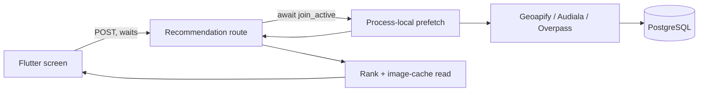
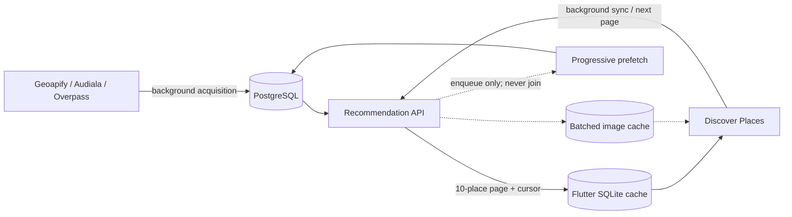

# Discover Places data-loading architecture

Last verified against repository: 2026-09-19

Status: `[IMPLEMENTED]` in repository and Flutter tests; backend runtime-test execution is
`[PARTIAL]` because the local Python test process was blocked by the host workspace spend cap.
Python syntax compilation passed. Real-device and configured-PostgreSQL Manali timings remain
`[UNKNOWN]` and must not be inferred from unit tests.

## Architecture before



The foreground request could wait for every matching background provider task. Flutter had no
durable recommendation snapshot, so a repeat visit still depended on an HTTP round trip.

## Architecture after



## Phase 0 audit

- `CURRENT_REQUEST_FLOW`: `[IMPLEMENTED]` Flutter calls
  `POST /cities/{city_id}/recommendations`. The endpoint now inspects prefetch state without
  awaiting it, runs database/ranking work in a worker thread, returns the available page, and
  separately enqueues selected-category deepening.
- `CURRENT_CACHE_LAYERS`: `[IMPLEMENTED]` PostgreSQL canonical places,
  `CityCategoryCache`, `PlaceImageCache`, process-local coordinator/circuit state,
  `cached_network_image`, and a versioned Flutter SQLite recommendation snapshot.
- `CURRENT_PREFETCH_FLOW`: `[IMPLEMENTED]` destination confirmation starts a seven-category
  shallow pass; interest confirmation deepens selected categories. Fresh but thin categories are
  `PARTIAL`, usable in the foreground, and still eligible for background deepening.
- `CURRENT_IMAGE_FLOW`: `[IMPLEMENTED]` API serializers batch-read image rows. External image
  providers run only in background. Flutter reserves the image region, shows a pulse while loading,
  fades authentic images in, and uses a neutral icon fallback for not-found/error states.
- `CURRENT_DB_QUERY_FLOW`: `[IMPLEMENTED]` the SQLAlchemy engine is process-cached and pooled.
  Recommendation work batch-loads cache rows, places, sources, tags, and image rows. Per-request
  query count and elapsed time are logged as `RECOMMEND_DB`; no index was added without a measured
  PostgreSQL plan.

## Foreground and background isolation

`[IMPLEMENTED]` The route does not call `join_active`. It calls the coordinator's non-blocking
`is_prefetch_active`/`active_categories` inspection, reads/ranks what is available, and returns it.
If matching work is already active, that work continues independently. If no matching work is
active, the response path enqueues an interest-stage coverage check/deepening job after the read.

## Cache states

The following logical states are derived rather than stored as one database enum:

| State | Foreground use | Background behavior |
| --- | --- | --- |
| `FRESH` | Return immediately | Skip when target coverage is met |
| `STALE_USABLE` | Return immediately within the seven-day stale policy | Refresh |
| `PARTIAL` | Return the available rows | Deepen toward the stage target |
| `INSUFFICIENT` | Do not block on completion | Acquire/deepen |
| `MISSING` | Run bounded provider acquisition | Persist any partial success |
| `REFRESHING` | Return current rows | Reuse existing task |

Foreground usability and prefetch sufficiency are separate. A category with five usable places can
render those five while remaining below its 15-place shallow or 35-place deep target.

## Prefetch

- Destination confirmation starts a shallow pass across all seven discovery categories, targeting
  15 usable rows per category.
- Interest confirmation prioritizes the selected categories and deepens them toward 35 usable rows.
- Existing matching work is reused. The recommendation route only observes active work and never
  joins it; refresh/deepening continues after the foreground response.
- Provider failure preserves the previous usable snapshot. A thin fresh snapshot remains usable but
  is still scheduled for deepening.

## Flutter local cache

`[IMPLEMENTED]` Storage uses `sqflite`, already present in the dependency graph and now declared
directly. Table `recommendation_snapshots` contains:

```text
cache_key primary key
city_id
payload JSON
saved_at
last_validated_at
schema_version
```

The key is a stable hash of city, purposes, selected categories/interests, and active category
filter. Snapshots are fresh for 24 hours, stale-usable for seven days, and physically removed after
30 days. An incompatible `schema_version` is discarded. Cached cards render while backend sync is
still pending; new data merges by canonical place ID and does not clear existing selected-place
state or reset the scrollable widget.

## Pagination and progressive rendering

`[IMPLEMENTED]` Recommendation requests accept an opaque `cursor` in addition to `limit`. The
initial Flutter batch is 10 cards. A full page returns `X-Next-Cursor`; the next request appends and
deduplicates another 10 cards. Loaded cards remain visible while two card-shaped pulse placeholders
show that more results are being fetched.

## Images and Overpass

- `[IMPLEMENTED]` `PlaceImageCache` remains keyed by canonical `place_id`; diagnostic provider
  identity uses provider plus external ID, with name/city/rounded coordinates as fallback context.
- `[IMPLEMENTED]` recommendation serialization uses batched image-cache reads, not per-place SQL.
- `[IMPLEMENTED]` only the first two ranked screenfuls (8 + 8) are eagerly precached. Precaching
  records success only after completion and logs debug-only start/success/failure timing.
- `[IMPLEMENTED]` an Overpass request cancelled by the outer interactive time budget records a
  circuit-breaker failure before propagating cancellation. Open circuits skip later category waves.

## Offline behavior

- Network working: SQLite snapshot -> backend cache -> background refresh.
- Slow network: usable SQLite cards remain rendered while sync continues.
- Network unavailable: usable SQLite cards remain rendered; a sync failure is non-blocking.
- No local snapshot and no network: the existing local Audiala dataset is a `[PARTIAL]` static
  baseline. It currently contains Jaipur (16), Varanasi (18), and Udaipur (12) entries; Manali (2)
  and Shillong (1) remain thin. If neither local nor backend data is usable, the retry state is shown.

## UI states

| State | Rendering behavior |
| --- | --- |
| Fresh | Render cached or returned cards immediately |
| Stale | Keep stale cards visible and revalidate in the background |
| Partial | Render available cards; allow deepening/next-page loading |
| Loading | Show dimension-matched pulse cards only when no usable cards exist |
| Refreshing | Keep cards and selections; show additional card-shaped pulse placeholders |
| Error | Keep usable cards with a non-blocking failure; otherwise show the retry state |

## Database performance and index audit

- Observed before this change (provided diagnostic): cache-only Manali about 5.97 seconds; active
  prefetch about 16.93 seconds; 30 recommendations.
- `[IMPLEMENTED]` instrumentation now reports city lookup, recommendation work, total database
  elapsed time, and `query_count` for every recommendation worker.
- After timing/query count: `[UNKNOWN]` until the configured PostgreSQL Manali scenarios are run.
- Index changes: none. Existing indexes cover `places.city_id`, `places.category`, moderation,
  `place_tags.place_id/tag`, cache city/category uniqueness, source identity, and image `place_id`.
  A composite-index proposal requires `EXPLAIN (ANALYZE, BUFFERS)` from the target database first.

## Verification

- Flutter: 43 distinct tests across discovery, core flow, pagination, image prefetch, image states,
  and skeleton motion passed. The discovery plus core-flow regression run passed 26 tests;
  targeted static analysis reported no issues.
- Backend: Python syntax compilation passed for all changed application/tests files. Runtime pytest
  is `[PARTIAL]`/blocked by the host workspace spend cap, not by an observed test failure.
- Real Manali scenarios A-F: `[UNKNOWN]` / not run because no approved configured backend/device run
  was available. The repository now emits the measurements needed for that run.

## Real Manali timings

| Scenario | After-change result |
| --- | --- |
| First cold visit | `[UNKNOWN]` — configured backend/device run not available |
| Warm visit | `[UNKNOWN]` — configured backend/device run not available |
| Active-prefetch visit | `[UNKNOWN]` — configured backend/device run not available |
| Slow-Overpass visit | `[UNKNOWN]` — configured backend/device run not available |

The only measured baseline supplied before the change was approximately 5.97 seconds for a
cache-only Manali request and 16.93 seconds while prefetch was active. These values are not presented
as after-change measurements.

## Files changed

Task-related files in the repository change set are listed below. Other user-owned changes that were
already present in the working tree are not attributed to this work.

- `backend/app/routers/places.py` — remove foreground prefetch joins, add timing/query logs, and emit
  the next-page cursor header.
- `backend/app/schemas/recommendation.py` — validate/decode the optional opaque cursor.
- `backend/app/services/recommendation_service.py` — rank enough candidates for the requested page,
  then slice and batch-enrich only that page.
- `backend/app/services/progressive_prefetch_coordinator.py` — expose non-blocking active-work state.
- `backend/app/services/city_place_prefetch_service.py` — formalize cache states and coverage targets.
- `backend/app/services/openstreetmap_discovery_service.py` — support forced deepening and enforce the
  seven-day stale-use policy.
- `backend/app/services/openstreetmap_places_service.py` — count outer-time-budget cancellation as a
  circuit-breaker failure.
- `backend/tests/test_openstreetmap_places_service.py` — cover cancellation/circuit behavior.
- `lib/models/recommendation.dart` — serialize recommendations for durable snapshots.
- `lib/services/recommendation_cache.dart` — add the versioned SQLite recommendation cache.
- `lib/services/recommendation_service.dart` — send cursors and capture `X-Next-Cursor`.
- `lib/services/place_image_prefetch_service.dart` — bound eager image warming to two screenfuls and
  log completion-aware timings.
- `lib/screens/place_discovery/place_discovery_screen.dart` — cache-first rendering, stable-ID merges,
  non-destructive refresh, mixed skeletons, and next-page loading.
- `lib/models/place_image.dart`, `lib/widgets/place_image.dart`, and `lib/widgets/yc_skeleton.dart` —
  explicit image/loading states, neutral fallbacks, pulse motion, and fades.
- `pubspec.yaml` and `pubspec.lock` — declare and resolve `sqflite` directly.
- `test/place_discovery_test.dart` and `test/core_trip_flow_hardening_test.dart` — update service fakes
  and cover the recommendation cursor contract without regressing trip flow.
- `test/place_image_prefetch_service_test.dart`, `test/place_image_test.dart`, and
  `test/yc_skeleton_test.dart` — verify bounded prefetch, image states, and skeleton behavior.
- `docs/PROJECT_CONTEXT.md`, `docs/ARCHITECTURE.md`, `docs/API_AND_DATA_SOURCES.md`,
  `docs/DATA_MODEL.md`, `docs/ROADMAP.md`, and `docs/DECISIONS.md` — update source-of-truth status,
  contracts, schema, roadmap, and ADRs.
- `docs/DISCOVER_PLACES_DATA_LOADING.md` — record this audit, implementation, evidence, unknowns, and
  remaining bottlenecks.

## Remaining bottlenecks

- Process-local prefetch and image jobs are lost on backend restart and are not shared across workers.
- SQLite caching is implemented for Flutter mobile; a web-specific durable adapter is not included.
- Cursor pagination is offset-backed and opaque. It preserves deterministic page ordering for one
  snapshot but is not a durable server-side snapshot token if ranking data changes between pages.
- The recommendation pipeline still ranks the available candidate pool before slicing a page.
- Manali and Shillong have thin bundled Audiala baselines.
- Configured PostgreSQL query plans, after timings, physical-device offline behavior, and full-motion
  simulator recording remain to be verified.
