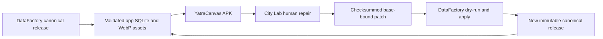

# Offline city packs

Verified in repository: 2026-10-06. Physical-device acceptance remains `[PARTIAL]`.

`[IMPLEMENTED]` The three checkouts remain separate. DataFactory owns immutable canonical releases;
City Pack Lab owns durable human overlays and repair bundles; YatraCanvas consumes a compact SQLite
projection. No production database migration is part of this workflow.

## Repository ownership

`[IMPLEMENTED]` The handoff has three explicit boundaries:

| Repository | Source of truth | It must not do |
| --- | --- | --- |
| [DataFactory](https://github.com/rohanxgiri/YatraCanvas-DataFactory) | Canonical place records, provenance, immutable releases, and app-pack exports | Rewrite an existing release in place |
| [CityPack Lab](https://github.com/rohanxgiri/YatraCanvas-CityPack_lab) | Human overlays, evidence, manual QA, release gates, and repair ZIPs | Edit the baseline SQLite database or certify unreviewed data |
| [YatraCanvas](https://github.com/rohanxgiri/yatra_canvas) | Prepared-city consumption, local search, and offline trip state | Treat the app projection as canonical data |

Repair publication is deliberately a dry-run then apply operation that writes a new DataFactory
release. App sync and certification are separate steps. No production database migration is part
of this workflow. `[PARTIAL]` The final physical-device acceptance step is still outstanding.

## Runtime data

`[IMPLEMENTED]` `assets/citypacks/index.json` identifies prepared cities. Each city directory contains
`manifest.json`, `city_pack.sqlite`, and `media/<stable-place-id>/{primary,thumbnail}.webp`.
The manifest records schema/version, canonical source release and fingerprint, city metadata,
place/media counts, file checksums, bytes, and explicit test-media policy. Flutter asset declarations
include each directory because asset directory declarations are not recursive.

`[IMPLEMENTED]` DataFactory reuses its canonical SQLite exporter and adds a small indexed runtime
projection: English name, aliases, normalized name, normalized schedule, hours state, image metadata,
media class, and runtime category. `place_search` uses FTS5 Unicode tokenization for names, English
names, aliases and descriptions. Existing stable IDs, tier, scores, coordinates, descriptions,
contacts, durations and source identifiers remain available. Canonical provenance stays in DataFactory.

`[IMPLEMENTED]` `CityPackRepository` validates the manifest and SHA-256 inventory before installing
the SQLite asset into `<getDatabasesPath()>/citypacks/<city-id>/<manifest-sha256>.sqlite`. It copies via
a temporary file, verifies the installed DB, opens read-only, checks integrity/counts, and removes
older installed copies after successful open. Later sessions reuse and verify the installed DB.
Per-city futures coalesce concurrent installation. There is no startup load of a canonical JSON array.

`[IMPLEMENTED]` `LocalFirstClient` is the existing service layer's default transport. Prepared-city
discovery/search/details and `offline_` trips dispatch to local repositories. Explicit injected HTTP
clients remain intact. Unsupported cities and existing server trips retain their HTTP paths.
Home and Explore have no new source-selection controls.

`[IMPLEMENTED]` Enrichment lives in `yatracanvas_enrichment.sqlite`, separate from immutable packs,
with stable ID, JSON field payload and expiry. Queries merge only missing description, website,
image and unknown hours. Provider data cannot replace packaged name, ID, coordinates, reviewed
description or known hours. Provider hours remain unverified. Optional existing backend requests
run in the background with four-second request timeouts, a 24-hour success cache and a 15-minute
failed-attempt cache. They never block prepared-city first paint. Image-cache notifications refresh visible
place images; downloaded images use the existing image-cache package.

`[IMPLEMENTED]` Media resolves bundled real/specific photo, cached image, existing category/place
fallback, then neutral fallback. A fallback remains visible while a remote image loads or fails.
`TEST_ONLY_REAL` is opt-in, separately recorded and excluded from licensed-source readiness.
The acceptance bundle is a development/test bundle, not a certified production data release.

## Trips and hours

`[IMPLEMENTED]` `yatracanvas_offline_trips.sqlite` stores local trip state independently: request
identity, trip, TripDays, saved stable IDs, assignments, ordering, execution statuses, and itinerary.
Creation is idempotent; changed reuse of a request ID is rejected. Local selections, days, route
generation, status edits, moves and replanning use the existing frontend response models.
Pack upgrades refresh saved place fields and mark a generated itinerary stale for explicit replanning;
execution history is retained.

`[IMPLEMENTED]` The local planner uses packaged durations, coordinates, TripDay windows, day locks,
priorities and visit history. Verified simple weekly schedules impose hard visit windows; split
intervals require the entire visit to fit. Explicit closed weekdays remain closed. Unknown weekdays
are usable; unverified schedules are preferences with an advisory. No missing schedule is invented.

`[PARTIAL]` Local scheduling is a bounded greedy scheduler, with approximate distance/travel time,
not the backend OR-Tools solver or a road-routing engine. At most 50 selections are planned. Simple
weekly rules, split hours, closed days and 24/7 are projected locally. Unsupported seasonal,
holiday, appointment and overnight syntax remains unknown rather than being guessed. Offline road
geometry, map tiles and live weather are unavailable; POI coordinates remain local and the existing
map now shows labelled coordinate route overviews and markers. The existing online solver/provider architecture remains available.

`[IMPLEMENTED]` City preparation installs/opens the DB, warms a small query and starts decoding up
to three thumbnails. There is no artificial minimum screen time and no blocking provider wait.
Debug place diagnostics expose stable ID, city, pack version, source, media class, hours and enrichment.

## Repair integrity

`[IMPLEMENTED]` City Lab exports `manifest.json`, `changes.json`, `media/` and a README in a ZIP.
Operations are ADD, UPDATE and MEDIA_UPDATE. Changes carry stable ID, per-field base values, author,
source release and canonical fingerprint. The inventory contains hashes for every payload file.
Exclusions are reported and omitted from a normal export; explicitly selecting an excluded POI is
rejected because deletion requires dependency review. Optional stable-ID selection scopes the patch.
Per-field review versions prevent a fresh description edit from promoting an old unreconciled photo.

`[IMPLEMENTED]` DataFactory validates ZIP paths, duplicates, symlinks, inventory, hashes, city,
base fingerprint, current per-field conflicts, coordinates, hours, schema, duplicate additions,
media decoding and explicit identity/photo confirmation. Stale changed fields yield REVIEW; invalid
inputs yield REJECT. Apply requires every decision to be APPLY and a new output version. Existing
releases remain untouched. Field audit provenance records old/new value, patch, author and timestamp.
Head changes during review reject publication. Paid AI/provider calls in this path: zero.

`[IMPLEMENTED]` Lab uploads bake orientation, produce WebP and thumbnail assets, and preserve
contributor/source/classification metadata. Test uploads may omit licensing information and require
explicit real-photo/exact-place confirmation; strict uploads retain licensing/attribution checks.
The hours editor supports explicit unknown, closed, 24-hour and split weekly entries, evidence,
and a verified checkbox. Patch export validates schedule syntax through DataFactory's mature parser.
The existing Places workspace filters effective saved repairs for missing/fallback/test-only media,
missing/unknown/unverified hours, missing descriptions, potential duplicates and location issues.
Small canonical alias/review sidecars support QA without modifying its byte-identical baseline DB.

`[IMPLEMENTED]` Sync uses the canonical research head or explicitly requested version, not alphabetic
ordering. It verifies source/export inventory, stages the replacement, rolls back metadata and
the previous pack on failure, and removes stale files only from the replaced city directory.
City Lab's sync prefers registered heads, then generation metadata; it preserves curator overlays.

See [developer loop](CITY_DATA_DEV_LOOP.md) and [measured verification](CITY_DATA_IMPLEMENTATION_REPORT.md).

`[IMPLEMENTED]` The 2026-10-04 follow-up bundles Jaipur Junction in a new 685-place release and
adds contextual starting suggestions and visible approximate routes. [Current verification](OFFLINE_ROUTE_SEARCH_FIX.md).
