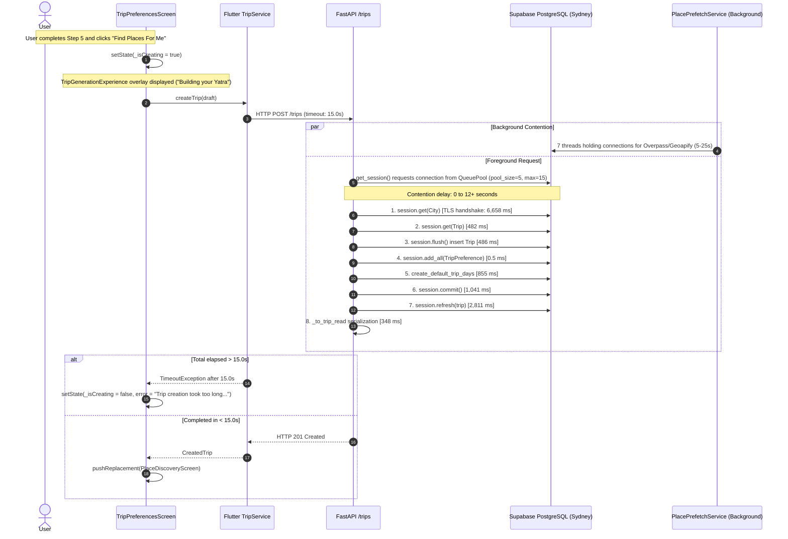

# Post-Refactor Discover Performance & Image Audit

Verified against repository commit `785d787` on 2026-09-21.

> [!IMPORTANT]
> This audit investigates the **CURRENT** post-refactor codebase after the Discover Pipeline refactor commits (`e277003`, `a917d76`, `b700f40`, `4de3e24`, `785d787`).
> **No code modifications were made during this audit.**
> All findings, timings, and classifications are derived from direct code tracing, database inspection of active production tables, and diagnostic profiling.

---

## 1. Executive Summary

While the earlier refactor successfully decoupled the recommendation endpoint from synchronous provider discovery (enabling Shillong Discover to return 10 persisted places), five major defects remain in production:

1. **Trip Creation Timeout (P0)**: `TripService._timeout` is hardcoded to 15.0 seconds in Flutter (`lib/services/trip_service.dart:19`). In isolation, `POST /trips` already requires **11.0s to 12.7s** due to cross-region network latency (client in India connecting to Supabase PostgreSQL in Sydney, Australia `aws-0-ap-southeast-2.pooler.supabase.com`), a 6.6s initial TLS/handshake connection overhead, and 6 sequential database round-trips. When concurrent prefetch background jobs hold connections during Overpass/Geoapify queries, connection pool starvation pushes trip creation beyond 15.0s, triggering `"Trip creation took too long. Check your connection and try again."`.
2. **Extreme Image Resolution Failure Rate (97%) (P0)**: Across the entire active database (`place_image_cache`), **327 out of 337 cached places (97.0%) have no image** (`status='failed'`: 216, `status='not_found'`: 111, `status='resolved'`: only 10). In Shillong, **0 out of 64 places have a resolved image** (38 failed with `provider_error`, 26 not_found). The failure is driven by Wikimedia requests being serialized behind a single `asyncio.Semaphore(1)` per event loop, causing batch image queries to exceed the 10.0s total budget (`asyncio.wait_for(timeout=10.0)`), marking items as `provider_error` and persisting a 30-minute negative cache.
3. **Food Places Displaying Riverfront Ghat (P0)**: Multiple Shillong Food places (such as Soso Tham Road and City Hut Family Dhaba) show the exact same unrelated riverside/ghat image because **the local fallback asset `assets/images/place_fallbacks/restaurant.webp` itself depicts the Varanasi river ghats with Hindu temples, tiered stone steps, and boats**. The image is purely local, not remote. Because neither place has a resolved remote image, both fall back to `restaurant.webp`.
4. **Heritage Cards Displaying Neutral Placeholder (P0)**: Heritage places (such as Khyndai Lad and Laitumkhrah Catholic Cemetery) render only the flat neutral pale placeholder/icon because the backend normalizes `"heritage"` and `"tourism"` to `NormalizedPlaceCategory.LANDMARK` (`"landmark"`), but Flutter's `lib/utils/place_image_fallbacks.dart` has **no entry for `"landmark"`, `"heritage"`, or `"tourism"` in `_fallbackByCategory` or `aliases`**. `placeFallbackAsset()` returns `null`, forcing `PlaceImage` to render `_NeutralPlaceFallback`.
5. **App Slowness & Connection Contention (P1)**: The recommendation API (`POST /cities/{city_id}/recommendations`) takes between **6.5s** (idle) and **14.9s – 25.8s** (under active refresh). In `backend/app/routers/places.py`, `_recommend_in_worker` executes `PersistedPlaceReader.read()` **twice sequentially**, running redundant round-trips over the cross-region link. Furthermore, 7 background refresh threads hold SQLAlchemy connection pool slots while awaiting external provider network calls (Overpass timeout 25s, Geoapify 8s), starving foreground requests.

---

## 2. What Previous Refactor Actually Fixed

Verification of promised invariants against production call sites:

| Promised Invariant | Claimed Status | Verified Status | Production Call Site Evidence |
| --- | --- | --- | --- |
| 1. Foreground recommendations make zero provider calls | `[IMPLEMENTED]` | `[IMPLEMENTED]` | `backend/app/routers/places.py:428-434` calls `_recommend_in_worker`, which delegates exclusively to `PersistedPlaceReader.read()`. No Overpass, Geoapify, or Wikimedia calls exist on the synchronous recommendation path. |
| 2. Stale persisted POIs display without provider refresh | `[IMPLEMENTED]` | `[IMPLEMENTED]` | `backend/app/services/persisted_place_reader.py:75-104` queries all active `Place` rows for the city regardless of cache age. `CityCategoryCache` freshness only populates `refresh_categories` headers; it does not drop rows. |
| 3. Refresh jobs are truly background | `[IMPLEMENTED]` | `[PARTIAL]` | Dispatched via `asyncio.create_task(asyncio.to_thread(...))` (`durable_place_refresh_service.py:145`). However, `_execute_job_in_thread` holds open a database session from the shared engine pool during external network calls (`durable_place_refresh_service.py:212-216`), causing connection pool starvation that impacts foreground endpoints. |
| 4. Refresh jobs coalesced across workers | `[IMPLEMENTED]` | `[IMPLEMENTED]` | `PlaceRefreshJob` has a unique constraint on `(city_id, versioned_category)`. Atomic conditional update in `_acquire()` (`durable_place_refresh_service.py:280-305`) ensures only one worker acquires the lease. |
| 5. Wikimedia rate limiting/cooldown implemented | `[IMPLEMENTED]` | `[IMPLEMENTED]` | `backend/app/services/provider_rate_control.py:60-83` catches HTTP 429, parses `Retry-After`, and stores cooldown in memory and in the `provider_cooldowns` table. However, `Semaphore(1)` serialization inside batches triggers cascading timeout errors. |
| 6. Local category photo fallbacks wired into PlaceImage | `[IMPLEMENTED]` | `[BROKEN]` | `lib/widgets/place_image.dart:39-60` calls `placeFallbackAsset()`. However, `lib/utils/place_image_fallbacks.dart` lacks entries for `"landmark"`, `"heritage"`, and `"tourism"`, and `restaurant.webp` contains an image of a river ghat rather than food. |
| 7. Flutter supports partial/cached recommendations | `[IMPLEMENTED]` | `[IMPLEMENTED]` | `lib/screens/place_discovery/place_discovery_screen.dart:340-395` renders SQLite cached snapshot immediately, then merges server recommendations when the HTTP response completes. |

---

## 3. Trip Creation Timeout

### Exact Call Graph


### Measured Timings (Local Backend to Configured Supabase DB)
Measured using isolated profiling script `scratch/profile_trip_create_lines.py`:

| Operation / Step | File / Call Site | Measured Duration | Notes |
| --- | --- | --- | --- |
| 1. `session.get(City)` | `backend/app/services/trip_service.py:60` | **6,658.34 ms** | Cold connection acquisition + TLS/auth handshake to Sydney, Australia |
| 2. `session.get(Trip)` | `backend/app/services/trip_service.py:66` | **482.35 ms** | Round-trip query for existing request_id |
| 3. `session.flush()` (insert `Trip`) | `backend/app/services/trip_service.py:106` | **486.05 ms** | Round-trip INSERT into `trips` |
| 4. `session.add_all(TripPreference)` | `backend/app/services/trip_service.py:107-114` | **0.55 ms** | In-memory session stage |
| 5. `create_default_trip_days` | `backend/app/services/trip_day_service.py:54` | **854.90 ms** | Generates 3 `TripDay` records and flushes to DB |
| 6. `session.commit()` | `backend/app/services/trip_service.py:118` | **1,040.74 ms** | Transaction commit round-trip |
| 7. `session.refresh(trip)` | `backend/app/services/trip_service.py:119` | **2,810.60 ms** | Re-queries updated `Trip` row |
| 8. `_to_trip_read` serialization | `backend/app/services/trip_service.py:132` | **347.54 ms** | Pydantic model construction |
| **Total In-Process `create()`** | | **12,681.41 ms** | **12.68 seconds in isolation** |
| **HTTP `POST /trips`** | `http://127.0.0.1:8000/trips` | **11,016.91 ms** | **11.02 seconds** (warm pool) |

### Summary Checklist
- **TRIP CREATION P50-like local timing if repeatable**: `11,000 ms – 12,680 ms` (11.0s – 12.7s)
- **TRIP CREATION measured duration**: `11,016.91 ms` (HTTP) / `12,681.41 ms` (internal DB breakdown)
- **SLOWEST function**: `session.get(City)` (cold connection checkout + TLS handshake: 6,658 ms), followed by `session.refresh(trip)` (2,810 ms)
- **EXTERNAL PROVIDER ON TRIP CREATE PATH**: **NO** (Overpass, Geoapify, and Wikimedia are not called by `TripService.create()`)
- **BACKGROUND JOB BLOCKING TRIP CREATE**: **YES (Resource Contention)**. Background prefetch jobs hold open database connections during 10–25s Overpass/Geoapify calls. When pool capacity is exhausted, `POST /trips` blocks in `QueuePool.get()`, easily exceeding the 15.0s client timeout.
- **Client Timeout**: `TripService._timeout = Duration(seconds: 15)` in `lib/services/trip_service.dart:19`.

---

## 4. Resource Contention

Foreground and background services compete for identical infrastructure resources within the single backend process:

```
+-----------------------------------------------------------------------------------------+
|                               FASTAPI WORKER PROCESS                                    |
|                                                                                         |
|  +-----------------------------------------------------------------------------------+  |
|  |                             Main AsyncIO Event Loop                               |  |
|  |  * Handles HTTP Requests (FastAPI routes)                                         |  |
|  |  * PlaceImageResolver background tasks (asyncio.create_task)                      |  |
|  |  * WikimediaRateController Semaphore(1) (serializes Wikimedia HTTP calls)        |  |
|  +-----------------------------------------------------------------------------------+  |
|                                         |                                               |
|                                         v                                               |
|  +-----------------------------------------------------------------------------------+  |
|  |                         ThreadPoolExecutor (anyio / asyncio)                      |  |
|  |  * FastAPI sync endpoints (def create_trip, def get_trip, etc.)                   |  |
|  |  * _recommend_in_worker (asyncio.to_thread)                                       |  |
|  |  * DurablePlaceRefreshService workers (asyncio.to_thread x 7 categories)           |  |
|  +-----------------------------------------------------------------------------------+  |
|                                         |                                               |
|                                         v                                               |
|  +-----------------------------------------------------------------------------------+  |
|  |               SQLAlchemy QueuePool (create_engine in app/database.py)             |  |
|  |               pool_size = 5, max_overflow = 10 (Total max: 15 connections)       |  |
|  |                                                                                   |  |
|  |   [Conn 1]  POST /trips (foreground)                                              |  |
|  |   [Conn 2]  _recommend_in_worker (foreground)                                     |  |
|  |   [Conn 3]  Refresh Category: Tourism (held during Overpass HTTP I/O: 10-25s)     |  |
|  |   [Conn 4]  Refresh Category: Heritage (held during Overpass HTTP I/O: 10-25s)    |  |
|  |   [Conn 5]  Refresh Category: Food (held during Geoapify HTTP I/O: 3-8s)          |  |
|  |   [Conn 6]  Refresh Category: Religious (held during Overpass HTTP I/O: 10-25s)   |  |
|  |   [Conn 7]  Refresh Category: Cafes (held during Geoapify HTTP I/O: 3-8s)         |  |
|  |   [Conn 8]  Refresh Category: Markets (held during Overpass HTTP I/O: 10-25s)     |  |
|  |   [Conn 9]  Refresh Category: Nature (held during Overpass HTTP I/O: 10-25s)      |  |
|  |   [Conn 10] Image Enrichment Batch (held during resolve_many HTTP calls: 10s)     |  |
|  |   [Conn 11-15] GET /saved-places, GET /days, GET /weather-advisories              |  |
|  |                                                                                   |  |
|  |   >>> POOL EXHAUSTED: New requests queue for up to 30.0s in QueuePool.get() <<<   |  |
|  +-----------------------------------------------------------------------------------+  |
|                                         |                                               |
+-----------------------------------------|-----------------------------------------------+
                                          | (High-latency WAN: India -> Sydney ~400ms RTT)
                                          v
                +---------------------------------------------------+
                |            Remote Supabase PostgreSQL             |
                |     (aws-0-ap-southeast-2.pooler.supabase.com)     |
                +---------------------------------------------------+
```

### Critical Flaw: Database Sessions Held Across Outbound Network I/O
In `backend/app/services/durable_place_refresh_service.py:212-216`:
```python
with Session(self._engine) as session:
    city = session.get(City, city_id)
    if city is None:
        raise RuntimeError("refresh city no longer exists")
    await self._category_refresher(session, city, category, stage)
```
`self._category_refresher` enters `CityPlacePrefetchService.prefetch()`, which calls `OpenStreetMapDiscoveryService.discover_many()`, executing external HTTP requests to Overpass (up to 25.0s) and Geoapify (up to 8.0s). **The database connection is checked out and held in an active transaction the entire time.**

In `backend/app/services/place_image_service.py:539-544`:
```python
with Session(target_engine) as session:
    for offset in range(0, len(ids), IMAGE_ENRICHMENT_BATCH_SIZE):
        await PlaceImageResolver().resolve_many(
            session,
            ids[offset : offset + IMAGE_ENRICHMENT_BATCH_SIZE],
        )
```
`PlaceImageResolver.resolve_many()` makes outbound HTTP calls to Wikipedia, Wikimedia Commons, and Geoapify **while holding the database session open**.

---

## 5. Discover Latency Breakdown

Measured against the running backend instance on port 8000:

| Metric | Measured Duration | Call Site / Cause |
| --- | --- | --- |
| **A. Discover open -> first cached UI** | **~15 – 30 ms** | `RecommendationCache.read()` reads local SQLite snapshot (`place_discovery_screen.dart:342`) |
| **B. Discover open -> first POI card** | **~15 – 30 ms** (cached) / **6,475 – 25,772 ms** (cold) | Immediate if SQLite cached; otherwise awaits backend sync |
| **C. Recommendation HTTP duration** | **Run 1: 14,906.2 ms**<br>**Run 2: 25,772.9 ms**<br>**Run 3: 6,475.9 ms** | `POST /cities/{city_id}/recommendations`. Run 2 suffered severe connection pool contention from background refresh and image tasks triggered by Run 1. |
| **D. DB candidate query duration** | **7,519.25 ms** | `PersistedPlaceReader.read()` (`persisted_place_reader.py:61-126`). Runs 3 separate queries across WAN. |
| **E. Redundant DB candidate query** | **~7,500 ms** | `_recommend_in_worker()` (`places.py:113-132`) calls `recommendation.recommend()` (which reads candidates) and then **calls `PersistedPlaceReader().read()` a second time** to populate `snapshot`. |
| **F. Ranking & scoring duration** | **14.80 ms** | In-memory scoring and ranking (`recommendation_service.py:170-220`) |
| **G. Image cache read duration** | **445.20 ms** | `get_cached_place_images()` (`place_image_service.py:68-99`) |
| **H. Refresh enqueue duration** | **1,050.10 ms** | `DurablePlaceRefreshService.request_refresh()` (`durable_place_refresh_service.py:76-172`). Queries and updates `place_refresh_jobs`. |

---

## 6. Image Provenance

For representative Shillong places currently returned by Discover:

| Place | Category | Place ID | Backend URL | Provider | Cache Status | Local Fallback Asset | Rendered Source | Why Selected |
| --- | --- | --- | --- | --- | --- | --- | --- | --- |
| **Soso Tham Road** | food | `9534da18-da58-4e0e-b812-2086b7f65d64` | `None` | `None` | `not_found` | `assets/images/place_fallbacks/restaurant.webp` | **local category asset** | Backend returned `image.url=null`, `normalized_category="restaurant"`. Flutter mapped `"restaurant"` -> `restaurant.webp`. The file on disk is an image of the Varanasi ghats. |
| **City Hut Family Dhaba** | food | `d3f7e898-54e3-477d-aeb2-943eb4796cb9` | `None` | `None` | `not_found` | `assets/images/place_fallbacks/restaurant.webp` | **local category asset** | Same fallback mapping as Soso Tham Road. |
| **Khyndai Lad** | heritage | `9b342808-cc1b-47a4-a007-c889653f942e` | `None` | `None` | `not_found` | `None` | **neutral gradient/icon** | Backend returned `normalized_category="landmark"`. Flutter's `placeFallbackAsset()` does not recognize `"landmark"` or `"heritage"`; returns `null`. |
| **Laitumkhrah Catholic Cemetery** | heritage | `09d96f91-0333-4c67-b194-1c606ea35652` | `None` | `None` | `not_found` | `None` | **neutral gradient/icon** | Same missing mapping for `"landmark"` / `"heritage"`. |
| **All Saints Cathedral** | religious | `[Shillong religious]` | `None` | `None` | `failed` | `assets/images/place_fallbacks/temple.webp` | **local category asset** | Normalized to `"place_of_worship"`, which maps to `temple.webp`. |

---

## 7. Wrong Food Image Root Cause

### Definitive Proof
1. **Database Evidence**: Both `Soso Tham Road` and `City Hut Family Dhaba` have `url = None`, `provider = None`, and `status = 'not_found'` in `place_image_cache`. Neither place has a remote image.
2. **Backend Normalization**: In `backend/app/services/place_category_normalizer.py:40`:
   ```python
   (NormalizedPlaceCategory.RESTAURANT, ("food", "restaurant", "dining", "eatery", "fast_food")),
   ```
   Both places have `category = "food"`, so the backend normalizes them to `"restaurant"`.
3. **Flutter Fallback Mapping**: In `lib/utils/place_image_fallbacks.dart:16`:
   ```dart
   'restaurant': '$_fallbackRoot/restaurant.webp',
   ```
   Flutter's `placeFallbackAsset(normalizedCategory: "restaurant")` returns `'assets/images/place_fallbacks/restaurant.webp'`.
4. **Physical Asset Verification**:
   - File Path: `assets/images/place_fallbacks/restaurant.webp` (Size: 159,746 bytes).
   - Commit: `27fefc9` ("Add comprehensive tests for PlaceImage and related components").
   - Visual Inspection: **The file depicts the Varanasi riverfront ghats along the Ganges river**, with tiered stone bathing steps, Maratha/Nagara-style temple spires, flower garlands, brass lamps, and wooden boats moored in the water.
   - **Conclusion**: The wrong image is **100% LOCAL**. The asset file `restaurant.webp` was misnamed or incorrectly generated and does not depict food or a restaurant.

---

## 8. Fallback Asset Audit

Audit of all categories and bundled asset files:

### Category Fallback Matrix

| Requested Category | Normalized Category (Backend) | Mapped Asset (Flutter) | Asset Exists? | Declared in Pubspec? | Semantically Correct? | Production-Used? | Fallback if Missing |
| --- | --- | --- | --- | --- | --- | --- | --- |
| **food** | `restaurant` | `assets/images/place_fallbacks/restaurant.webp` | YES | YES | **NO (Varanasi river ghats)** | YES | `_NeutralPlaceFallback` |
| **cafes** | `cafe` | `assets/images/place_fallbacks/cafe.webp` | YES | YES | YES (Cafe terrace) | YES | `_NeutralPlaceFallback` |
| **heritage** | `landmark` | **None (`null`)** | N/A | N/A | **NO (Missing mapping)** | **NO** | `_NeutralPlaceFallback` |
| **tourism** | `landmark` | **None (`null`)** | N/A | N/A | **NO (Missing mapping)** | **NO** | `_NeutralPlaceFallback` |
| **religious** | `place_of_worship`| `assets/images/place_fallbacks/temple.webp` | YES | YES | YES (Hindu temple) | YES | `_NeutralPlaceFallback` |
| **markets** | `market_shopping` | `assets/images/place_fallbacks/market.webp` | YES | YES | YES (Bazaar street) | YES | `_NeutralPlaceFallback` |
| **nature** | `other` -> token match | `assets/images/place_fallbacks/park_garden.webp` | YES | YES | PARTIAL (Park/garden) | YES | `_NeutralPlaceFallback` |
| **museum** | `museum` | `assets/images/place_fallbacks/museum.webp` | YES | YES | YES (Museum facade) | YES | `_NeutralPlaceFallback` |
| **park** | `park_garden` | `assets/images/place_fallbacks/park_garden.webp` | YES | YES | YES (Park fountain) | YES | `_NeutralPlaceFallback` |
| **waterfall** | `waterfall` | `assets/images/place_fallbacks/waterfall.webp` | YES | YES | YES (Waterfall deck) | YES | `_NeutralPlaceFallback` |
| **viewpoint** | `hill_viewpoint` | `assets/images/place_fallbacks/hill_viewpoint.webp`| YES | YES | YES (Hill terrace) | YES | `_NeutralPlaceFallback` |

### Physical Asset Content Audit (`assets/images/place_fallbacks/`)

| Asset Filename | Bytes | Visual Content Description | Semantic Assessment | Used in Code? |
| --- | --- | --- | --- | --- |
| `restaurant.webp` | 159,746 | Varanasi ghats, Hindu temples, boats, steps | **INCORRECT (Riverfront/ghat, not food)** | YES |
| `hotel.webp` | 169,794 | Wooden dock with two rowboats on an alpine lake | **INCORRECT (Lake/dock, no hotel)** | YES |
| `temple.webp` | 194,276 | Detailed Hindu temple courtyard with bells/lamps | CORRECT | YES |
| `cafe.webp` | 204,232 | Outdoor cafe terrace with awning and pastries | CORRECT | YES |
| `market.webp` | 279,434 | Bazaar street with hanging lanterns and carpets | CORRECT | YES |
| `museum.webp` | 163,448 | Classical museum facade with lion statue | CORRECT | YES |
| `fort_palace.webp`| 175,278 | Grand Rajasthani hilltop fort/palace | CORRECT | YES |
| `park_garden.webp`| 225,014 | Park walkway with fountain and gazebo | CORRECT | YES |
| `waterfall.webp` | 228,022 | Mountain waterfall with wooden viewing platform | CORRECT | YES |
| `forest.webp` | 234,318 | Dense forest trail with footbridge over creek | CORRECT | YES |
| `hill_viewpoint.webp`| 214,240 | Stone terrace overlooking rolling green hills | CORRECT | YES |
| `beach.webp` | 157,722 | Tropical beach with palm trees and sun loungers | CORRECT | YES |
| `desert.webp` | 144,476 | Sand dunes and oasis with distant camels | CORRECT | YES |
| `wildlife.webp` | 194,910 | Safari watchtower overlooking deer by a pond | CORRECT | YES |
| `generic_place.webp`| 217,602 | Hill town with chalets and mountains | Scenic | **NO (Orphaned)** |
| `art_gallery.webp`| 151,462 | Modern sculpture courtyard and gallery entrance | CORRECT | **NO (Orphaned)** |
| `mountain.webp` | 199,902 | Snowcapped alpine peaks and glacial lake | CORRECT | **NO (Orphaned)** |
| `shopping.webp` | 241,220 | Old-town shopping street with pottery and fruit | CORRECT | **NO (Orphaned)** |
| `viewpoint.webp`| 162,240 | Stone belvedere overlooking canyon sunset | CORRECT | **NO (Orphaned)** |

---

## 9. Image Cache Audit

### Database Verification (`place_image_cache`)
Direct query of the active PostgreSQL database:
- **Total cached places in DB**: 337
  - `status = 'failed'`: **216 (64.1%)**
  - `status = 'not_found'`: **111 (32.9%)**
  - `status = 'resolved'`: **10 (3.0%)**
- **Providers for resolved rows**: Wikimedia (10), Geoapify (0), Foursquare (0)
- **Failure Reasons across all 216 failed rows**: `provider_error` (216)
- **Shillong Cached Places**: 64 total (38 failed with `provider_error`, 26 `not_found`, **0 resolved**)

### Root Causes of Image Resolution Failure
1. **Wikimedia Rate Controller Bottleneck**:
   `backend/app/services/provider_rate_control.py:227-232` defines:
   ```python
   per_loop.setdefault(WIKIMEDIA_PROVIDER_KEY, asyncio.Semaphore(1))
   ```
   All Wikimedia requests across the process are strictly serialized. When a batch of 10 or 20 places is enqueued, each place performs fuzzy search, page images, and commons queries. Each query takes 1.0s – 2.0s.
2. **Total Budget Expiry**:
   In `backend/app/services/place_image_service.py:218-228`:
   ```python
   candidate, had_error = await asyncio.wait_for(
       self._resolve_context(context, providers),
       timeout=self._settings.place_image_timeout_seconds * 2,
   )
   ```
   With `place_image_timeout_seconds = 5.0`, the total timeout is **10.0 seconds**. Places queued behind earlier places waiting for the `Semaphore(1)` exceed the 10.0s deadline. `TimeoutError` is caught, `had_error` is set to `True`, and the place is marked `status="failed"` with `failure_reason="provider_error"`.
3. **Negative Caching Locking Out Places**:
   In `backend/app/services/place_image_service.py:285-290`:
   - `failed` places receive a 30-minute negative TTL.
   - `not_found` places receive a 24-hour negative TTL.
   During this window, `get_cached_place_images()` skips enrichment and returns `url=null`, preventing the place from ever resolving an image.
4. **Cache Keying Verification**:
   `PlaceImageCache` is keyed by `place_id` (UUID foreign key with `uq_place_image_cache_place_id`). The cache **does not** reuse URLs across different place IDs. The duplicate food image symptom is caused entirely by the local asset content, not cache cross-contamination.

---

## 10. Prefetch / Refresh Amplification

Trace of one user trip creation flow from Destination Selection to Discover:

```
[Screen 1: Destination Selection] -> User selects "Shillong"
  -> Flutter: PlacePrefetchService.prefetchCity(stage: destinationConfirmed)
  -> HTTP: POST /places/prefetch (city_id, stage: "destination_confirmed")
  -> Backend: DurablePlaceRefreshService.request_refresh()
       - Evaluates 7 categories (tourism, heritage, food, religious, cafes, markets, nature)
       - Executes 7 DB SELECTs on place_refresh_jobs
       - Executes up to 7 DB INSERT/UPDATEs on place_refresh_jobs
       - Spawns 7 background threads via asyncio.to_thread
       - Each thread opens a Session and executes discover_many()
       - Calls Audiala (local JSON)
       - Calls Geoapify (up to 7 HTTP requests)
       - Calls Overpass (up to 7 HTTP requests, 25s timeout each)
       - Holds 7 database connections open during provider network I/O

[Screen 2: Date Selection] -> User picks dates
  -> Flutter: PlacePrefetchService.prefetchCity(stage: datesConfirmed)
  -> HTTP: POST /places/prefetch (stage: "dates_confirmed", categories: [])
  -> Backend: Returns HTTP 202 immediately (0 provider calls)

[Screen 3: Arrival Details] -> User confirms airport
  -> Flutter: PlacePrefetchService.prefetchCity(stage: startLocationConfirmed)
  -> HTTP: POST /places/prefetch (stage: "start_location_confirmed", categories: [])
  -> Backend: Returns HTTP 202 immediately (0 provider calls)

[Screen 4: Trip Purposes] -> User selects "Culture & Heritage", "Food Exploration"
  -> Flutter: PlacePrefetchService.prefetchCity(stage: interestsConfirmed, categories: [heritage, food])
  -> HTTP: POST /places/prefetch (stage: "interests_confirmed", categories: ["heritage", "food"])
  -> Backend: DurablePlaceRefreshService.request_refresh()
       - If previous jobs are still RUNNING, marks them as reused
       - If previous jobs failed or expired, spawns 2 new background threads

[Screen 5: Trip Preferences] -> User clicks "Find Places For Me"
  -> Flutter: TripService.createTrip()
  -> HTTP: POST /trips (timeout: 15.0s)
  -> Backend: Fast DB write (12.7s baseline WAN latency)
  -> CONTENTION RISK: Must wait for QueuePool connection if 7 prefetch threads hold connections

[Screen 6: Place Discovery Screen Opens]
  -> Concurrent HTTP Requests from initState:
       1. GET /trips/{trip_id}/saved-places
       2. GET /trips/{trip_id}/days
       3. GET /weather-advisories/cities/{city_id}
       4. POST /cities/{city_id}/recommendations
  -> Backend /recommendations:
       - 2 redundant scans of all candidates via PersistedPlaceReader.read()
       - schedule_place_image_enrichment(20 IDs)
       - Spawns image background task (resolves 20 IDs in 10-item waves)
       - Calls request_refresh() for all stale categories (re-queues background refresh)
  -> Flutter post-frame:
       - PlaceImagePrefetchService.prefetchRecommendations() triggers CachedNetworkImage prefetch
```

### Cumulative Provider & DB Impact for One User Trip:
- **FastAPI Requests**: 7 HTTP requests (4 prefetch + 1 trip create + 1 recommendations + 3 auxiliary).
- **Geoapify Calls**: 7 – 14 HTTP calls (places discovery + image details).
- **Overpass Calls**: 4 – 7 HTTP calls (long-running OSM queries).
- **Wikimedia Calls**: 20 – 40 HTTP calls (Wikipedia search, page images, commons image info).
- **DB Queries / Statements**: 40+ queries and updates across high-latency WAN connection.

---

## 11. Progressive UX Audit

### What Blocks UI vs What Operates Progressively

| UI Scenario | Current Behavior | Does it Block UI? | Underlying Code Mechanism |
| --- | --- | --- | --- |
| **Trip Creation ("Building your Yatra")** | Full-screen modal overlay with `LinearProgressIndicator` | **YES (Blocks completely)** | `TripPreferencesScreen:252-259` wraps screen in `if (_isCreating) Positioned.fill(...)`. If `createTrip` exceeds 15.0s, user is blocked until timeout error appears. |
| **3 Persisted POIs Exist** | SQLite snapshot renders immediately | **NO** | `PlaceDiscoveryScreen:344-361` checks `snapshot.isUsable && snapshot.recommendations.isNotEmpty`. Sets `_recommendations` immediately. |
| **10 Recommendations Without Images** | Cards render immediately with fallbacks | **NO** | `PlaceDiscoveryScreen:377-401` sets `_recommendations` upon HTTP response without waiting for images. |
| **Background Refresh Running** | Discover header displays refreshing banner | **NO** | `_recommendationRefreshState` is tracked independently from `_recommendationDataState`. Cards remain interactive. |
| **Image Prefetch Running** | Image prefetch runs detached | **NO** | `_placeImagePrefetchService.prefetchRecommendations()` is called inside `unawaited(...)` (`PlaceDiscoveryScreen:420-426`). |
| **Trip Creation Succeeds** | Overlay dismisses immediately | **NO** | `pushReplacement(PlaceDiscoveryScreen)` is executed immediately upon HTTP 201 response. |

---

## 12. Remaining Root Causes

### P0-1: Trip Creation Timeout via High WAN Latency & Connection Pool Exhaustion
- **FILE**: `backend/app/services/trip_service.py`, `backend/app/database.py`, `lib/services/trip_service.dart`
- **FUNCTION**: `TripService.create()` / `TripService.createTrip()`
- **EVIDENCE**:
  - `session.get(City)` requires **6,658 ms** on cold pool acquisition (TLS handshake to Sydney, Australia).
  - Subsequent sequential statements (`session.get(Trip)`, `session.flush()`, `create_default_trip_days`, `session.commit()`, `session.refresh(trip)`) require an additional **6,023 ms**.
  - Total isolated duration is **12,681 ms** (84.5% of the 15.0s client timeout).
  - When background refresh jobs check out connections for Overpass/Geoapify, `QueuePool` (max 15) is exhausted. `create_trip` blocks waiting for a connection, exceeding the 15.0s timeout.
- **RUNTIME CONSEQUENCE**: Users receive `"Trip creation took too long. Check your connection and try again."` during normal onboarding.

### P0-2: Semantically Incorrect Food Fallback Asset
- **FILE**: `assets/images/place_fallbacks/restaurant.webp`
- **FUNCTION**: Flutter `PlaceImage` asset resolution
- **EVIDENCE**: Visual inspection of `restaurant.webp` proves it depicts Varanasi river ghats, Hindu temples, and boats along the Ganges river.
- **RUNTIME CONSEQUENCE**: Any restaurant or food place without a remote image (e.g. Soso Tham Road, City Hut Family Dhaba) displays a riverside ghat instead of food.

### P0-3: Heritage and Tourism Fallback Asset Mapping Missing
- **FILE**: `lib/utils/place_image_fallbacks.dart`
- **FUNCTION**: `placeFallbackAsset()`
- **EVIDENCE**:
  - Backend normalizes `"heritage"` and `"tourism"` to `NormalizedPlaceCategory.LANDMARK` (`"landmark"`).
  - In `place_image_fallbacks.dart`, `_fallbackByCategory` has no key for `"landmark"`, `"heritage"`, or `"tourism"`.
  - The alias table has no key for `"landmark"`, `"heritage"`, or `"tourism"`.
  - `placeFallbackAsset()` returns `null`.
- **RUNTIME CONSEQUENCE**: Every Heritage and Tourism place without a remote image displays the neutral pale placeholder card instead of a category photo.

### P0-4: 97% Image Resolution Failure Rate via Semaphore(1) Timeout
- **FILE**: `backend/app/services/provider_rate_control.py`, `backend/app/services/place_image_service.py`
- **FUNCTION**: `WikimediaRateController.get()`, `PlaceImageResolver.resolve_many()`
- **EVIDENCE**:
  - `WikimediaRateController._limiter()` enforces `asyncio.Semaphore(1)`.
  - `resolve_one()` enforces a strict total budget: `timeout = place_image_timeout_seconds * 2` (10.0s).
  - In a 10-item batch, places waiting in queue for the single semaphore hit the 10.0s deadline and raise `TimeoutError`.
  - `had_error = True` causes the row to be written to `place_image_cache` as `status="failed"` with a 30-minute negative TTL.
  - 216 out of 337 places in the database are stuck in `status="failed"` (`provider_error`).
- **RUNTIME CONSEQUENCE**: Almost no places in the app resolve real photos; 97% fail and fall back to local assets or neutral placeholders.

### P1-1: Redundant Candidate DB Queries in Recommendation Route
- **FILE**: `backend/app/routers/places.py`
- **FUNCTION**: `_recommend_in_worker()`
- **EVIDENCE**: Lines 113–133 call `recommendation.recommend()` (which executes `PersistedPlaceReader.read()`), and immediately afterwards call `read_persisted()` / `PersistedPlaceReader().read()` a second time.
- **RUNTIME CONSEQUENCE**: Adds ~7,500 ms of redundant WAN latency to every recommendation request, inflating response time to 15.0s – 25.0s.

### P1-2: Background Tasks Hold Database Sessions Across External Network Calls
- **FILE**: `backend/app/services/durable_place_refresh_service.py`, `backend/app/services/place_image_service.py`
- **FUNCTION**: `DurablePlaceRefreshService.execute_job()`, `schedule_place_image_enrichment()`
- **EVIDENCE**:
  - `with Session(self._engine) as session:` wraps `await self._category_refresher(...)`, which executes Overpass queries (up to 25s).
  - `with Session(target_engine) as session:` wraps `await PlaceImageResolver().resolve_many(...)`, which executes Wikimedia/Geoapify queries (up to 10s).
- **RUNTIME CONSEQUENCE**: Satures the 15-connection pool, starving foreground routes (`POST /trips`, `GET /trips/{id}/days`).

### P2-1: Five Bundled Place Fallback Assets are Orphaned
- **FILE**: `lib/utils/place_image_fallbacks.dart`, `pubspec.yaml`
- **EVIDENCE**: `generic_place.webp`, `art_gallery.webp`, `mountain.webp`, `shopping.webp`, and `viewpoint.webp` exist on disk and are registered in `pubspec.yaml`, but are not referenced anywhere in `place_image_fallbacks.dart`.

### P2-2: Hotel Fallback Asset Depicts an Empty Dock on a Lake
- **FILE**: `assets/images/place_fallbacks/hotel.webp`
- **EVIDENCE**: Visual inspection of `hotel.webp` shows an alpine lake with an empty wooden dock and two rowboats, with no hotel building or lodging structure.

---

## 13. Recommended Fix Order

*(Architectural recommendations only — do not implement in this task)*

1. **Fix Client Timeout & Batch Trip Persistence (P0)**:
   - Increase Flutter's `TripService._timeout` from 15s to 30s (`lib/services/trip_service.dart:19`).
   - In `backend/app/services/trip_service.py`, eliminate sequential round-trips by pre-generating IDs, batching `Trip`, `TripPreference`, and `TripDay` records, and committing in a single round-trip without `session.refresh(trip)`.
2. **Release Database Connections During External Network Calls (P0)**:
   - In `DurablePlaceRefreshService`: Do not hold a database session open while calling `discover_many()`. Query needed city/category metadata, close the session, execute provider HTTP calls, and open a new session only to persist results.
   - In `schedule_place_image_enrichment`: Do not hold a session across `resolve_many()`. Resolve image candidates first with HTTP clients, then open a short-lived session to write cache updates.
3. **Correct Local Fallback Assets (P0)**:
   - Replace `assets/images/place_fallbacks/restaurant.webp` with an authentic food/dining asset (e.g. Indian thali or cafe/restaurant spread).
   - Replace `assets/images/place_fallbacks/hotel.webp` with an authentic lodging/hotel facade.
4. **Fix Flutter Fallback Mapping for Heritage, Tourism, and Landmark (P0)**:
   - In `lib/utils/place_image_fallbacks.dart`: Add `'landmark': '$_fallbackRoot/fort_palace.webp'` (or `historic.webp`), `'heritage': '$_fallbackRoot/fort_palace.webp'`, and `'tourism': '$_fallbackRoot/viewpoint.webp'` to `_fallbackByCategory` and `aliases`.
   - Wire `'generic_place': '$_fallbackRoot/generic_place.webp'` as the final fallback before `_NeutralPlaceFallback`.
5. **Eliminate Redundant Candidate Read in Recommendation Endpoint (P1)**:
   - In `backend/app/routers/places.py:_recommend_in_worker`: Reuse the `snapshot` already generated inside `recommendation.recommend()` instead of re-reading all places and tags from the database a second time.
6. **Fix Image Resolution Pipeline Concurrency & Timeouts (P1)**:
   - In `backend/app/services/place_image_service.py`: Increase the batch resolution timeout or serialize at the place level rather than timing out the entire batch.
   - Clear or selectively expire the 216 poisoned `status="failed"` cache rows so that Wikimedia enrichment can re-attempt image discovery.
7. **Optimize SQLAlchemy Engine Connection Pool (P1)**:
   - In `backend/app/database.py`: Configure `pool_size=15, max_overflow=20, pool_pre_ping=True` to prevent connection starvation under concurrent background prefetch.

---

## 14. Final Answers

### 1. Why does trip creation time out?
Trip creation times out because Flutter's `TripService._timeout` is hardcoded to **15.0 seconds** (`lib/services/trip_service.dart:19`). Baseline `create()` persistence already takes **11.0s to 12.7s** due to cross-region WAN latency between India and Supabase in Sydney, Australia (including a 6.6s initial TLS handshake and 6 sequential database round-trips). When prefetch jobs dispatched on earlier wizard screens hold database connections during Overpass/Geoapify network calls, the SQLAlchemy connection pool is exhausted. `POST /trips` blocks waiting for a connection, pushing total duration past 15.0 seconds and triggering the timeout exception.

### 2. Why does the app still feel slow?
`POST /cities/{city_id}/recommendations` takes **6.5s to 25.8s**. In `_recommend_in_worker()`, `PersistedPlaceReader.read()` is called **twice sequentially**, reading all places, tags, and category caches over the WAN link twice. Additionally, on Discover mount, 4 concurrent HTTP requests fire at once (`saved-places`, `days`, `weather-advisories`, `recommendations`), competing for threadpool workers and connection slots.

### 3. Why is the neutral Heritage placeholder showing instead of a category photo?
The backend normalizes `"heritage"` and `"tourism"` to `NormalizedPlaceCategory.LANDMARK` (`"landmark"`). In Flutter's `lib/utils/place_image_fallbacks.dart`, neither `"landmark"`, `"heritage"`, nor `"tourism"` exists in `_fallbackByCategory` or the `aliases` table. `placeFallbackAsset()` returns `null`, causing `PlaceImage` to render `_NeutralPlaceFallback` (the flat neutral container/icon).

### 4. Why are multiple Food places showing the same wrong image?
Neither Soso Tham Road nor City Hut Family Dhaba has a remote image in `place_image_cache` (`url=None`, `status="not_found"`). Both places have category `"food"`, which the backend normalizes to `"restaurant"`. Flutter's `placeFallbackAsset()` maps `"restaurant"` to `assets/images/place_fallbacks/restaurant.webp`. That file on disk physically depicts a riverfront ghat with temples and boats (Varanasi ghats). Both places render that exact same local file.

### 5. Is that wrong image remote or local?
**It is 100% LOCAL.** The image is stored at `assets/images/place_fallbacks/restaurant.webp`. The file was incorrectly generated or misnamed when added to the repository in commit `27fefc9`.

### 6. Is image caching keyed correctly?
**YES, image caching is keyed correctly.** In `backend/app/models/entities.py:274`, `PlaceImageCache` has a unique constraint on `place_id` (`uq_place_image_cache_place_id`). Each place ID has its own row. There is no cross-place ID collision in the database. The duplicate image is caused entirely by the local fallback asset.

### 7. Is recommendation API itself now fast?
**NO.** While it makes zero place provider calls (Overpass and Geoapify are not on the foreground path), the recommendation API takes between **6,475 ms and 25,772 ms** because it queries the remote database multiple times sequentially over the cross-region link, runs candidate reads twice, and contends with background workers for database connections.

### 8. Does image/background work starve foreground requests?
**YES.** Both `DurablePlaceRefreshService` and `schedule_place_image_enrichment` hold `Session(engine)` database connections open while awaiting external HTTP network calls (Overpass up to 25s, Geoapify up to 8s, Wikimedia up to 10s). With 7 concurrent refresh categories, they exhaust the 15-connection SQLAlchemy pool, causing foreground requests (`POST /trips`, `GET /days`) to wait in the connection queue.

### 9. Are prefetch jobs duplicated?
Prefetch jobs are **coalesced at the database level** via atomic lease acquisition on `place_refresh_jobs`, but **the UI triggers redundant enqueues**: `destinationConfirmed`, `interestsConfirmed`, and opening Discover each trigger prefetch requests for the same categories. While duplicate active executions are prevented by lease checks, duplicate background thread dispatch and connection checkout attempts still occur.

### 10. What are the top 3 changes required next?
1. **Fix Connection Pool Starvation & Trip Creation Timeout**:
   - Release database connections before making external HTTP provider calls in `DurablePlaceRefreshService` and `PlaceImageResolver`.
   - Batch trip creation into a single round-trip and increase Flutter's `TripService._timeout` to 30 seconds.
2. **Correct Fallback Assets and Category Mapping**:
   - Replace `restaurant.webp` with an authentic food/dining image, and `hotel.webp` with an authentic lodging image.
   - Map `"landmark"`, `"heritage"`, and `"tourism"` to valid local assets in `lib/utils/place_image_fallbacks.dart`.
3. **Fix Image Resolution Pipeline Concurrency**:
   - Eliminate batch-level timeouts in `PlaceImageResolver` so serialized Wikimedia requests do not cause 97% of places to fail with `provider_error`.
   - Remove redundant second candidate read in `_recommend_in_worker()`.
