# YatraCanvas — Historical Frontend Project Documentation

> **Status:** Historical UI snapshot, not the architecture source of truth.
>
> **Current overview:** See [`PROJECT_CONTEXT.md`](PROJECT_CONTEXT.md) and its
> linked source-of-truth documents before making project claims.
>
> **Project status:** Flutter client with FastAPI/PostgreSQL backend
>
> **Framework:** Flutter and Dart
>
> **Version inspected:** `0.1.0+1`
>
> **Documentation basis:** The screen inventory below predates the backend
> integration. See [`../backend/README.md`](../backend/README.md) for current POI providers, Geoapify
> autocomplete, database provenance, and FSQ OS Places import operations.

## Contents

1. [Project overview](#1-project-overview)
2. [Complete application workflow](#2-complete-application-workflow)
3. [Complete screen documentation](#3-complete-screen-documentation)
4. [Screenshots and UI references](#4-screenshots-and-ui-references)
5. [Screen navigation diagram](#5-screen-navigation-diagram)
6. [Important buttons and controls](#6-important-buttons-and-controls)
7. [Reusable and custom widgets](#7-reusable-and-custom-widgets)
8. [Flutter widget overview](#8-flutter-widget-overview)
9. [Project file structure](#9-project-file-structure)
10. [Important files](#10-important-files)
11. [Technologies and tools](#11-technologies-and-tools)
12. [Packages used](#12-packages-used)
13. [Application architecture](#13-application-architecture)
14. [Final screen summary](#14-final-screen-summary)
15. [Final verification and counts](#15-final-verification-and-counts)

---

## 1. Project overview

**YatraCanvas** is a frontend-only travel-planning application built with Flutter. It guides a traveller through onboarding and then collects five important trip decisions: **destination, dates, arrival, purpose, and preferences**. A separate responsive admin frontend demonstrates how trips, destinations, travellers, and reports could be managed.

### Main purpose

To turn scattered travel ideas into one clear, guided trip-planning flow.

### Main features

- Animated splash, welcome, and login interfaces.
- A ten-step first-run personalisation journey.
- A traveller Home dashboard with planning, discovery, and recommendation sections.
- A five-step trip creator using a shared `TripDraft` object.
- Search and filtering over local destination data.
- Date, arrival, purpose, pace, budget, and transport controls.
- A responsive, frontend-only admin panel with five management views.
- Central colours, typography, Material 3 theme, and reusable widgets.
- Flutter widget tests for important navigation and UI behaviour.

### Technology summary

| Technology | Use in YatraCanvas |
| --- | --- |
| Flutter | Cross-platform user-interface framework. |
| Dart | Application language for screens, widgets, models, and state. |
| Material 3 | Base UI system for buttons, cards, inputs, navigation, dialogs, and themes. |
| `flutter_svg` | Displays the SVG logo from `lib/Logo/logo.svg`. |
| `flutter_test` | Runs automated widget and navigation tests. |

> **Current scope:** There is no backend, database, API, persistent login, live map, or server-side admin action. Mock data and local widget state are used deliberately for the frontend prototype.

---

## 2. Complete application workflow

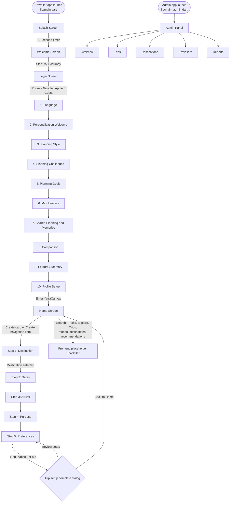
```mermaid
flowchart TD
    Launch([Traveller app launch<br/>lib/main.dart]) --> Splash[Splash Screen]
    Splash -->|1.9-second timer| Welcome[Welcome Screen]
    Welcome -->|Start Your Journey| Login[Login Screen]

    Login -->|Phone / Google / Apple / Guest| O1[1. Language]
    O1 --> O2[2. Personalisation Welcome]
    O2 --> O3[3. Planning Style]
    O3 --> O4[4. Planning Challenges]
    O4 --> O5[5. Planning Goals]
    O5 --> O6[6. Mini Itinerary]
    O6 --> O7[7. Shared Planning and Memories]
    O7 --> O8[8. Comparison]
    O8 --> O9[9. Feature Summary]
    O9 --> O10[10. Profile Setup]
    O10 -->|Enter YatraCanvas| Home[Home Screen]

    Home -->|Create card or Create navigation item| D[Step 1: Destination]
    D -->|Destination selected| Dates[Step 2: Dates]
    Dates --> Arrival[Step 3: Arrival]
    Arrival --> Purpose[Step 4: Purpose]
    Purpose --> Preferences[Step 5: Preferences]
    Preferences -->|Find Places For Me| Complete{Trip setup complete dialog}
    Complete -->|Review setup| Preferences
    Complete -->|Back to Home| Home

    Home -.->|Search, Profile, Explore, Trips,<br/>moods, destinations, recommendations| Placeholder[Frontend placeholder SnackBar]

    AdminLaunch([Admin app launch<br/>lib/main_admin.dart]) --> Admin[Admin Panel]
    Admin --> Overview[Overview]
    Admin --> Trips[Trips]
    Admin --> Destinations[Destinations]
    Admin --> Travellers[Travellers]
    Admin --> Reports[Reports]
```

### Workflow explanation

The traveller application starts at `SplashScreen`, automatically opens `WelcomeScreen`, and then goes to `LoginScreen`. Every login option currently demonstrates navigation only and opens `PersonalInterestsScreen`. That screen uses a locked `PageView` to show ten controlled personalisation steps. Completing the final profile step clears the earlier route stack and opens `HomeScreen`.

From Home, the **Create Trip** card and the central **Create** navigation item open the same five-step trip flow. One mutable `TripDraft` instance is passed through each screen, so the user's selections remain available without a backend or global state-management package. Finishing the flow displays a confirmation dialog and can return to Home.

The admin application has a separate entry point. Its five sections are switched inside one responsive `AdminPanelScreen`; they are not separate Navigator routes.

---

## 3. Complete screen documentation

### How screens are counted

The project contains **10 traveller route-level screen classes**. `PersonalInterestsScreen` internally contains **10 distinct onboarding step views**. The admin panel contains **5 distinct section views** inside one route. To explain all visible application states clearly, this document describes **24 screen/views**.

### 3.1 Splash Screen

#### Screenshot

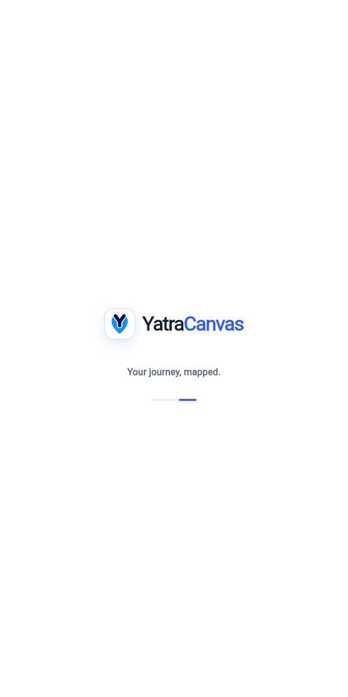

#### Purpose

Shows the brand while the app starts and provides a short animated transition into onboarding.

#### What is shown on the screen

- YatraCanvas logo and wordmark.
- “Your journey, mapped.” tagline.
- Small linear loading indicator.
- Fade and scale entrance animation on a white onboarding canvas.

#### Buttons and actions

| Button / element | What it does | Where it navigates |
| --- | --- | --- |
| Automatic timer | Waits about 1.9 seconds, then replaces the route with a fade transition. | Welcome Screen |

#### Widgets used

| Widget / component | Purpose |
| --- | --- |
| `Scaffold` | Provides the page structure. |
| `OnboardingCanvas` | Supplies the shared white onboarding background. |
| `FadeTransition`, `ScaleTransition` | Animate the brand entrance. |
| `YatraBrand` | Displays the SVG logo and wordmark. |
| `LinearProgressIndicator` | Communicates loading. |

#### Important file

`lib/screens/onboarding/splash_screen.dart`

---

### 3.2 Welcome Screen

#### Screenshot

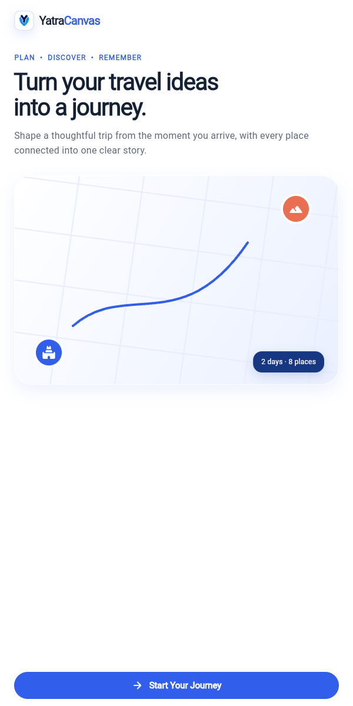

#### Purpose

Introduces the application and gives the user a clear starting action.

#### What is shown on the screen

- Compact YatraCanvas brand.
- “PLAN • DISCOVER • REMEMBER” label.
- Large travel-planning headline and supporting text.
- Custom-painted map-style illustration with two pins and a route.
- Fixed bottom call-to-action area.

#### Buttons and actions

| Button / element | What it does | Where it navigates |
| --- | --- | --- |
| Start Your Journey | Pushes the login route. | Login Screen |

#### Widgets used

| Widget / component | Purpose |
| --- | --- |
| `Scaffold`, `SafeArea` | Page and system-area structure. |
| `SingleChildScrollView` | Keeps the content usable on small screens. |
| `Stack`, `CustomPaint` | Draw the route illustration and map pins. |
| `YatraBrand` | Shows the application identity. |
| `PrimaryButton` | Displays the main start action. |

#### Important file

`lib/screens/onboarding/welcome_screen.dart`

---

### 3.3 Login Screen

#### Screenshot

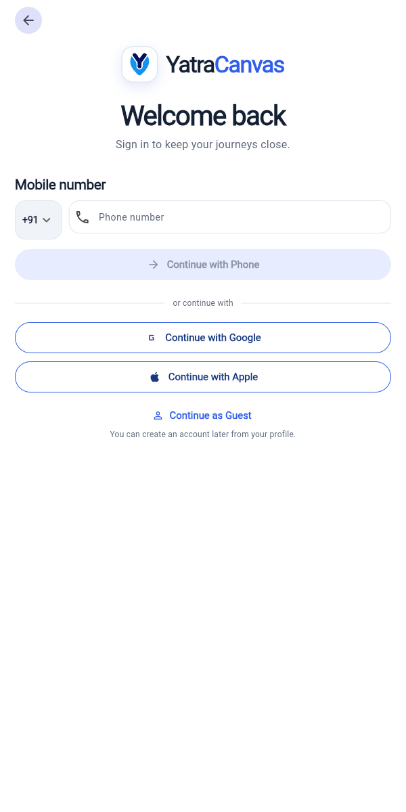

#### Purpose

Presents phone, Google, Apple, and guest entry options. Authentication is not implemented; all valid actions continue to onboarding.

#### What is shown on the screen

- Back button, centered brand, heading, and supporting text.
- Country-code dropdown with `+91`, `+1`, and `+44`.
- Phone-number text field accepting digits only.
- Phone, Google, Apple, and Guest actions.

#### Buttons and actions

| Button / element | What it does | Where it navigates |
| --- | --- | --- |
| Back icon | Pops the current route. | Welcome Screen |
| Country-code dropdown | Changes the displayed country code. | Same screen |
| Phone number field | Collects digits; submitting works when at least seven digits exist. | Same screen / onboarding on submit |
| Continue with Phone | Enabled at seven or more digits; opens onboarding. | Language onboarding view |
| Continue with Google | Demonstrates provider login navigation. | Language onboarding view |
| Continue with Apple | Demonstrates provider login navigation. | Language onboarding view |
| Continue as Guest | Skips account creation. | Language onboarding view |

#### Widgets used

| Widget / component | Purpose |
| --- | --- |
| `LayoutBuilder`, `SingleChildScrollView`, `ConstrainedBox` | Adapt the login layout and keyboard behaviour. |
| `DropdownButton` | Selects a country code. |
| `TextField` | Captures the phone number. |
| `PrimaryButton`, `SecondaryButton` | Render the login actions consistently. |
| `IconButton`, `TextButton` | Back and guest controls. |

#### Important file

`lib/screens/onboarding/login_screen.dart`

---

### 3.4–3.13 Personalisation Journey (`PersonalInterestsScreen`)

#### Shared screen structure

All ten views are hosted by one `PageView` with swipe disabled. `ProgressHeader` shows progress and Back/Skip controls, while `PrimaryButton` advances to the next view. The host uses `setState` for temporary selections.

#### Screenshot

| Step | Actual application screenshot |
| --- | --- |
| 1. Language | 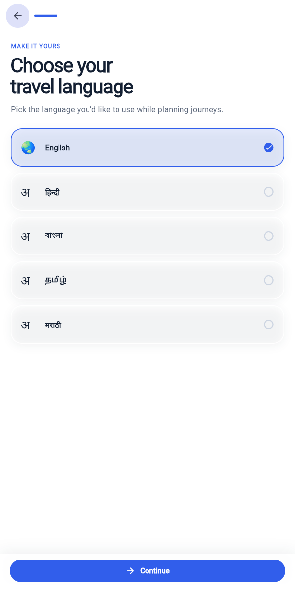 |
| 2. Personalisation Welcome | 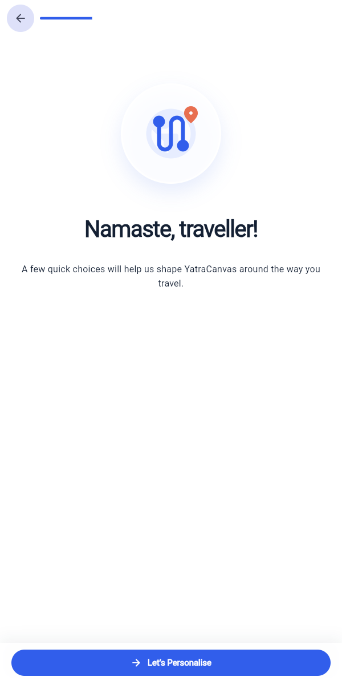 |
| 3. Planning Style | 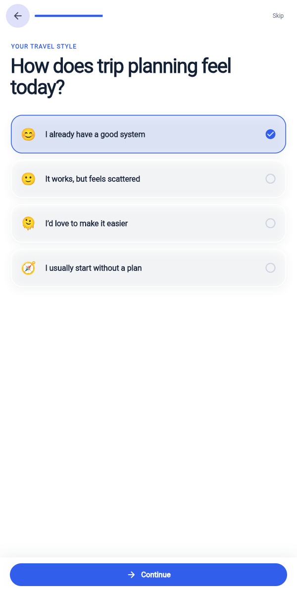 |
| 4. Planning Challenges | 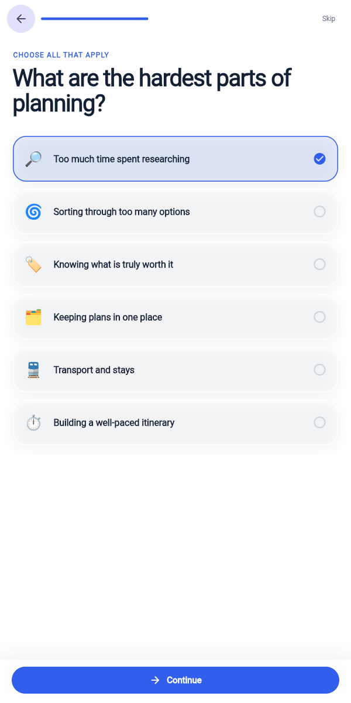 |
| 5. Planning Goals | 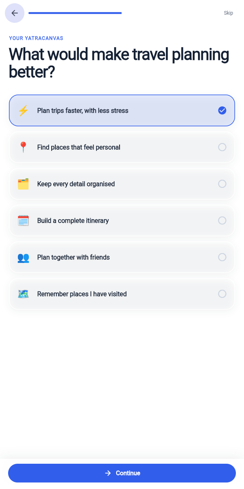 |
| 6. Mini Itinerary | 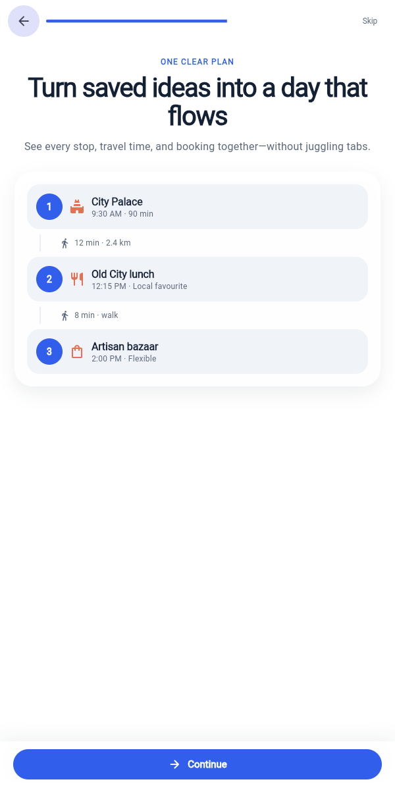 |
| 7. Shared Planning and Memories | 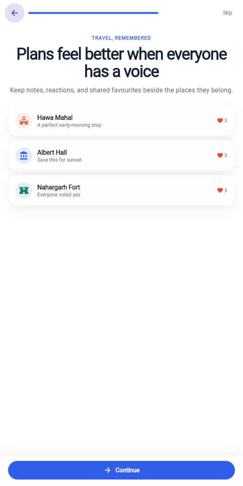 |
| 8. Comparison | 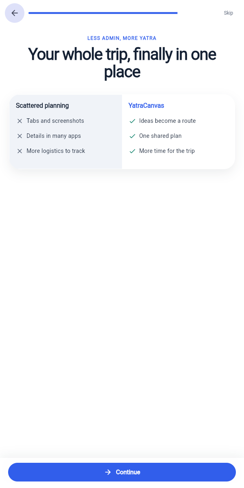 |
| 9. Feature Summary | 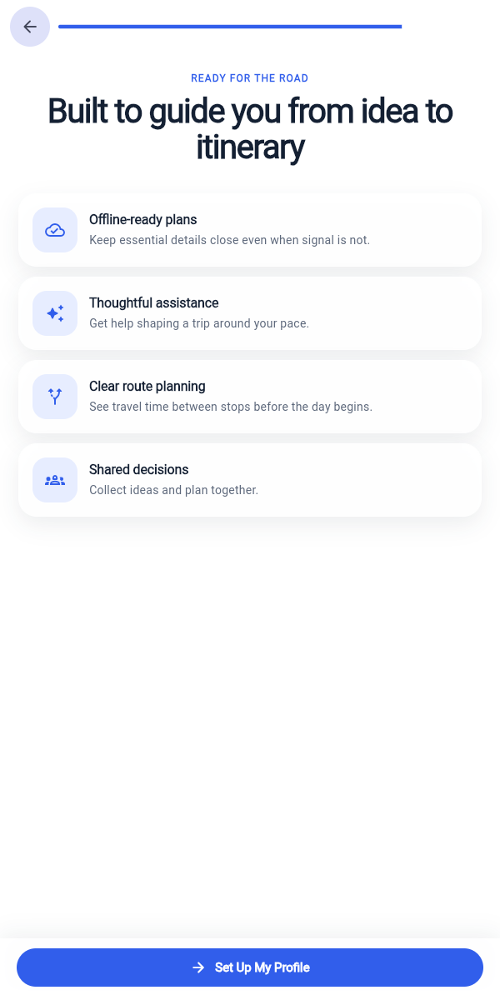 |
| 10. Profile Setup | 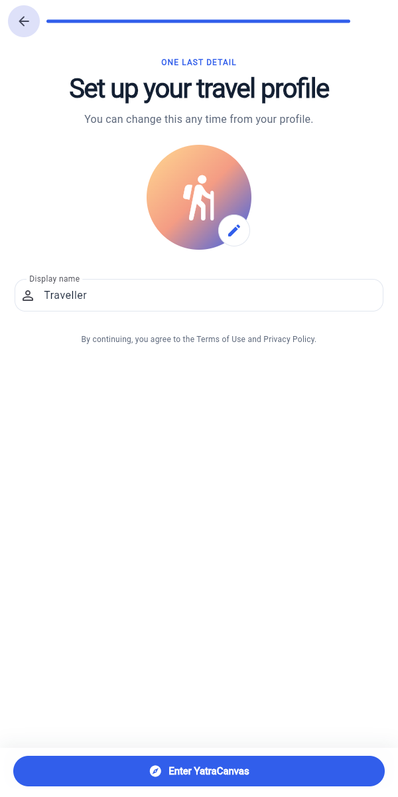 |

#### 3.4 Language selection — Step 1 of 10

**Purpose:** Select the preferred planning language.

**Shown:** English, हिन्दी, বাংলা, தமிழ், and मराठी choice cards.

| Button / element | What it does | Where it navigates |
| --- | --- | --- |
| Language card | Stores the selected language; English is selected initially. | Same view |
| Back | Pops back to Login. | Login Screen |
| Continue | Opens the next page. | Personalisation Welcome |

**Important widgets:** `PageView`, `_StepScroll`, `_ChoiceCard`, `AnimatedContainer`, `InkWell`, `ProgressHeader`, `PrimaryButton`.

#### 3.5 Personalisation welcome — Step 2 of 10

**Purpose:** Briefly explains why the app asks personalisation questions.

**Shown:** Journey medallion, “Namaste, traveller!” heading, and explanatory text.

| Button / element | What it does | Where it navigates |
| --- | --- | --- |
| Back | Returns to language selection. | Language selection |
| Let’s Personalise | Advances to planning style. | Planning Style |

**Important widgets:** `Stack`, `Icon`, `_JourneyMedallion`, `ProgressHeader`, `PrimaryButton`.

#### 3.6 Planning style — Step 3 of 10

**Purpose:** Learns how trip planning currently feels to the user.

**Shown:** Four single-select cards ranging from “I already have a good system” to “I usually start without a plan.”

| Button / element | What it does | Where it navigates |
| --- | --- | --- |
| Planning-style card | Stores one planning-style answer. | Same view |
| Skip | Jumps directly to profile setup. | Profile Setup |
| Continue | Enabled after a selection. | Planning Challenges |

**Important widgets:** `_ChoiceCard`, `Semantics`, `AnimatedSwitcher`, `ProgressHeader`, `PrimaryButton`.

#### 3.7 Planning challenges — Step 4 of 10

**Purpose:** Collects multiple difficulties such as research, too many options, transport, and pacing.

**Shown:** Six multi-select challenge cards.

| Button / element | What it does | Where it navigates |
| --- | --- | --- |
| Challenge card | Toggles an item in the `_challenges` set. | Same view |
| Skip | Jumps to profile setup. | Profile Setup |
| Continue | Enabled when at least one challenge is selected. | Planning Goals |

**Important widgets:** `_StepScroll`, `_ChoiceCard`, `Set<String>` state, `ProgressHeader`, `PrimaryButton`.

#### 3.8 Planning goals — Step 5 of 10

**Purpose:** Collects desired benefits such as faster planning, personal places, organisation, itineraries, collaboration, and memories.

**Shown:** Six multi-select goal cards.

| Button / element | What it does | Where it navigates |
| --- | --- | --- |
| Goal card | Toggles an item in the `_goals` set. | Same view |
| Skip | Jumps to profile setup. | Profile Setup |
| Continue | Enabled when at least one goal is selected. | Mini Itinerary |

**Important widgets:** `_ChoiceCard`, `AnimatedContainer`, `ProgressHeader`, `PrimaryButton`.

#### 3.9 Mini itinerary — Step 6 of 10

**Purpose:** Visually explains the benefit of combining stops, travel time, and bookings into one plan.

**Shown:** “Turn saved ideas into a day that flows” content and `_MiniItinerary` illustration.

| Button / element | What it does | Where it navigates |
| --- | --- | --- |
| Skip | Jumps to profile setup. | Profile Setup |
| Continue | Advances to shared planning. | Shared Planning and Memories |

**Important widgets:** `_MiniItinerary`, `Column`, `Row`, `Container`, `ProgressHeader`, `PrimaryButton`.

#### 3.10 Shared planning and memories — Step 7 of 10

**Purpose:** Shows how notes, reactions, and shared favourites could sit beside planned places.

**Shown:** “Plans feel better when everyone has a voice” content and `_MemoryStack` visual.

| Button / element | What it does | Where it navigates |
| --- | --- | --- |
| Skip | Jumps to profile setup. | Profile Setup |
| Continue | Advances to the comparison view. | Comparison |

**Important widgets:** `_MemoryStack`, `Stack`, `Container`, `ProgressHeader`, `PrimaryButton`.

#### 3.11 Comparison — Step 8 of 10

**Purpose:** Contrasts scattered trip administration with one organised YatraCanvas plan.

**Shown:** “Your whole trip, finally in one place” and `_ComparisonPanel`.

| Button / element | What it does | Where it navigates |
| --- | --- | --- |
| Skip | Jumps to profile setup. | Profile Setup |
| Continue | Advances to the feature summary. | Feature Summary |

**Important widgets:** `_ComparisonPanel`, `Row`, `Column`, `Container`, `ProgressHeader`, `PrimaryButton`.

#### 3.12 Feature summary — Step 9 of 10

**Purpose:** Summarises the product direction before profile setup.

**Shown:** Four feature tiles: offline-ready plans, thoughtful assistance, clear route planning, and shared decisions.

| Button / element | What it does | Where it navigates |
| --- | --- | --- |
| Set Up My Profile | Opens the final onboarding step. | Profile Setup |
| Back | Returns to comparison. | Comparison |

**Important widgets:** `_FeatureTile`, `Icon`, `Column`, `ProgressHeader`, `PrimaryButton`.

#### 3.13 Profile setup — Step 10 of 10

**Purpose:** Captures a display name before entering the traveller application.

**Shown:** Profile avatar, display-name field prefilled with “Traveller,” and Terms/Privacy text.

| Button / element | What it does | Where it navigates |
| --- | --- | --- |
| Display name field | Updates local name state. | Same view |
| Back | Returns to the feature summary. | Feature Summary |
| Enter YatraCanvas | Enabled when the name is not empty; clears the route stack. | Home Screen |

**Important widgets:** `_ProfileAvatar`, `TextField`, `ProgressHeader`, `PrimaryButton`.

#### Important file for all ten steps

`lib/screens/onboarding/personal_interests_screen.dart`

---

### 3.14 Home Screen

#### Screenshot

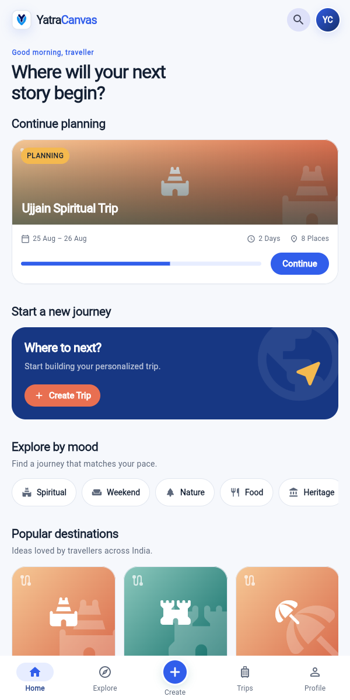

#### Purpose

Acts as the traveller dashboard and main entry to trip creation.

#### What is shown on the screen

- Compact brand, Search icon, and profile avatar.
- Greeting and large travel question.
- Continue Planning card for a sample Ujjain trip.
- Start a New Journey card.
- Mood chips: Spiritual, Weekend, Nature, Food, Heritage, Adventure, Relaxing.
- Popular destinations: Ujjain, Jaipur, Goa, Manali, and Varanasi.
- Recommended items: Spiritual Escapes, Food Trails, and Weekend Journeys.
- Five-item bottom navigation: Home, Explore, Create, Trips, Profile.

#### Buttons and actions

| Button / element | What it does | Where it navigates |
| --- | --- | --- |
| Search icon | Shows “Search is coming in the next phase.” | Same screen |
| Profile avatar | Shows a profile placeholder SnackBar. | Same screen |
| Continue | Shows a trip-planning placeholder SnackBar. | Same screen |
| Start journey card / Create Trip | Opens a new `TripDraft` flow. | Destination Selection |
| Mood chip | Shows a placeholder for the chosen mood. | Same screen |
| Destination card | Shows a destination placeholder. | Same screen |
| Recommendation row | Shows a recommendation placeholder. | Same screen |
| Home navigation item | Keeps Home selected. | Home Screen |
| Explore / Trips / Profile items | Show placeholder SnackBars. | Same screen |
| Create navigation item | Opens trip creation. | Destination Selection |

#### Widgets used

| Widget / component | Purpose |
| --- | --- |
| `CustomScrollView`, `SliverList` | Build the vertically scrolling dashboard efficiently. |
| `ListView.separated` | Creates horizontal mood and destination lists. |
| `Card`, `Stack`, `InkWell` | Build interactive trip, destination, and recommendation cards. |
| `SectionHeader`, `SelectionChip` | Standardise section labels and mood controls. |
| `AppBottomNavigation` | Displays the five Home navigation destinations. |
| `YatraBrand` | Displays the top-left brand. |

#### Important file

`lib/screens/home/home_screen.dart`

---

### 3.15 Destination Selection — Trip Step 1 of 5

#### Screenshot

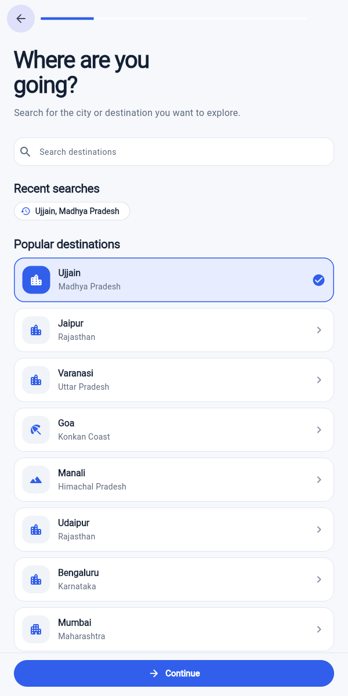

#### Purpose

Lets the user search and select the trip destination.

#### What is shown on the screen

- Five-step progress header.
- Destination search field.
- Recent-search chip for Ujjain when no query exists.
- Local result list filtered by name, region, or tags.
- Selected-destination preview with region and tags.
- No-results state for unmatched searches.

#### Buttons and actions

| Button / element | What it does | Where it navigates |
| --- | --- | --- |
| Back | Pops to Home. | Home Screen |
| Search field | Filters `MockData.destinations`. | Same screen |
| Clear-search icon | Clears the query. | Same screen |
| Recent Ujjain chip | Selects Ujjain. | Same screen |
| Destination result | Stores a `DestinationOption` in `TripDraft`. | Same screen |
| Continue | Enabled only after a destination is selected. | Select Dates |

#### Widgets used

| Widget / component | Purpose |
| --- | --- |
| `CreateTripScaffold` | Provides progress, title, scrolling body, and bottom CTA. |
| `SearchField` | Handles destination search and clear behaviour. |
| `ActionChip`, `InkWell`, `AnimatedContainer` | Create recent and selectable result controls. |
| `Stack` | Builds the selected destination preview. |

#### Important file

`lib/screens/create_trip/destination_selection_screen.dart`

---

### 3.16 Select Dates — Trip Step 2 of 5

#### Screenshot

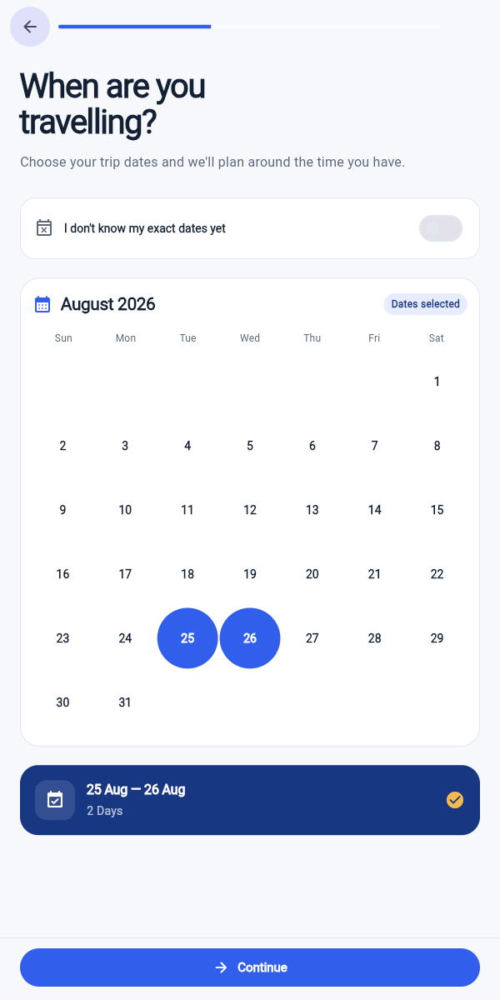

#### Purpose

Collects either exact August 2026 dates or a flexible trip duration.

#### What is shown on the screen

- Flexible-date toggle.
- Exact-date calendar or duration chips from one day to five-plus days.
- Date/duration summary card.

#### Buttons and actions

| Button / element | What it does | Where it navigates |
| --- | --- | --- |
| Back | Pops to destination selection. | Destination Selection |
| Flexible-date card / switch | Toggles between calendar and duration modes. | Same screen |
| Duration chip | Stores the chosen number of days. | Same screen |
| Calendar day | Selects a start date, then an end date. | Same screen |
| Continue | Writes dates, flexibility, and duration into `TripDraft`. | Arrival Details |

#### Widgets used

| Widget / component | Purpose |
| --- | --- |
| `CreateTripScaffold` | Shared five-step layout. |
| `Switch.adaptive` | Toggles flexible dates. |
| `AnimatedSwitcher` | Changes between calendar and duration picker. |
| `GridView.builder` | Displays the seven-column August 2026 calendar. |
| `SelectionChip` | Displays duration choices. |

#### Important file

`lib/screens/create_trip/select_dates_screen.dart`

---

### 3.17 Arrival Details — Trip Step 3 of 5

#### Screenshot

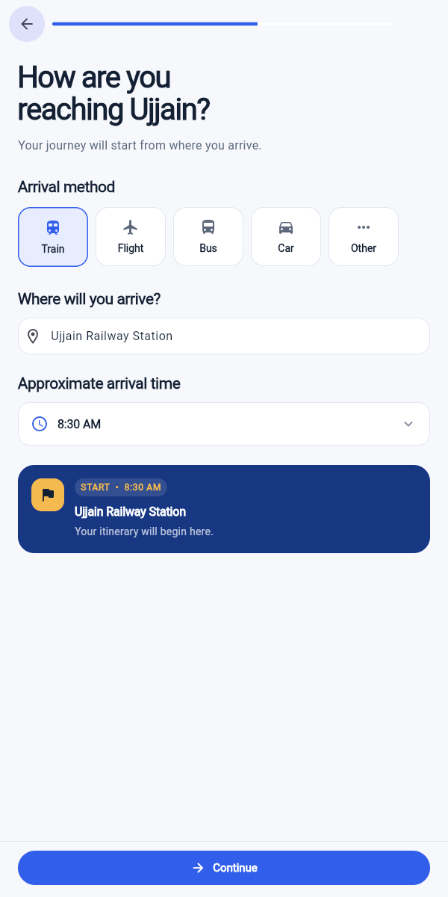

#### Purpose

Collects how, where, and approximately when the traveller arrives.

#### What is shown on the screen

- Arrival-method cards: Train, Flight, Bus, Car, and Other.
- Arrival-point text field with local Ujjain suggestions.
- Time field opening the platform time picker.
- Start-card summary.

#### Buttons and actions

| Button / element | What it does | Where it navigates |
| --- | --- | --- |
| Back | Pops to date selection. | Select Dates |
| Arrival-method card | Stores the method; Train resets the point to Ujjain Railway Station. | Same screen |
| Arrival-point field | Accepts text and filters local suggestions. | Same screen |
| Suggestion row | Copies the point into the field and closes focus. | Same screen |
| Time field | Opens `showTimePicker`. | Time picker / same screen |
| Continue | Enabled when arrival point is non-empty; updates `TripDraft`. | Trip Purpose |

#### Widgets used

| Widget / component | Purpose |
| --- | --- |
| `CreateTripScaffold` | Shared trip-step structure. |
| `Wrap` | Lays out transport method cards responsively. |
| `TextField`, `FocusNode`, `ListTile` | Implement arrival-point suggestions. |
| `showTimePicker` | Collects approximate time. |
| `InkWell`, `AnimatedContainer` | Build method and time controls. |

#### Important file

`lib/screens/create_trip/arrival_details_screen.dart`

---

### 3.18 Trip Purpose — Trip Step 4 of 5

#### Screenshot

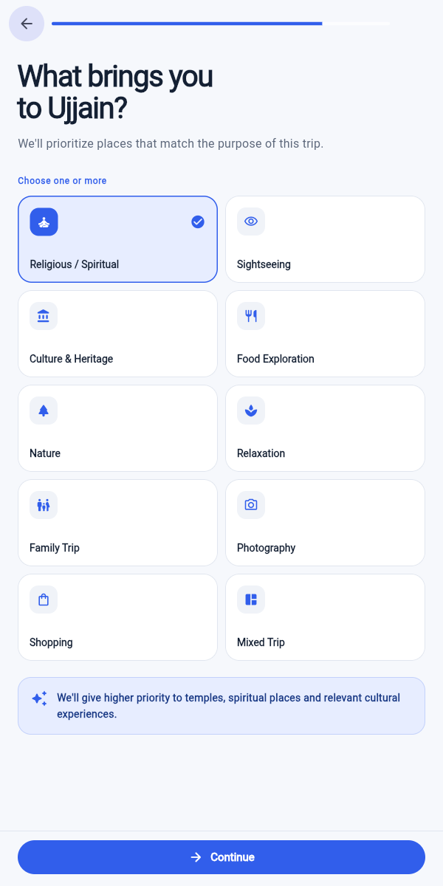

#### Purpose

Collects one or more reasons for the trip so future recommendations can be prioritised.

#### What is shown on the screen

- Ten selectable purpose cards.
- Special explanatory panel when Religious / Spiritual is selected.
- Destination name inside the heading.

#### Buttons and actions

| Button / element | What it does | Where it navigates |
| --- | --- | --- |
| Back | Pops to Arrival Details. | Arrival Details |
| Purpose card | Adds or removes a purpose from a set. | Same screen |
| Continue | Enabled when at least one purpose is selected; updates `TripDraft`. | Trip Preferences |

#### Widgets used

| Widget / component | Purpose |
| --- | --- |
| `CreateTripScaffold` | Shared trip layout. |
| `LayoutBuilder`, `Wrap` | Create a responsive two-column card layout. |
| `Semantics`, `InkWell`, `AnimatedContainer` | Make cards interactive, accessible, and animated. |

#### Important file

`lib/screens/create_trip/trip_purpose_screen.dart`

---

### 3.19 Trip Preferences — Trip Step 5 of 5

#### Screenshot

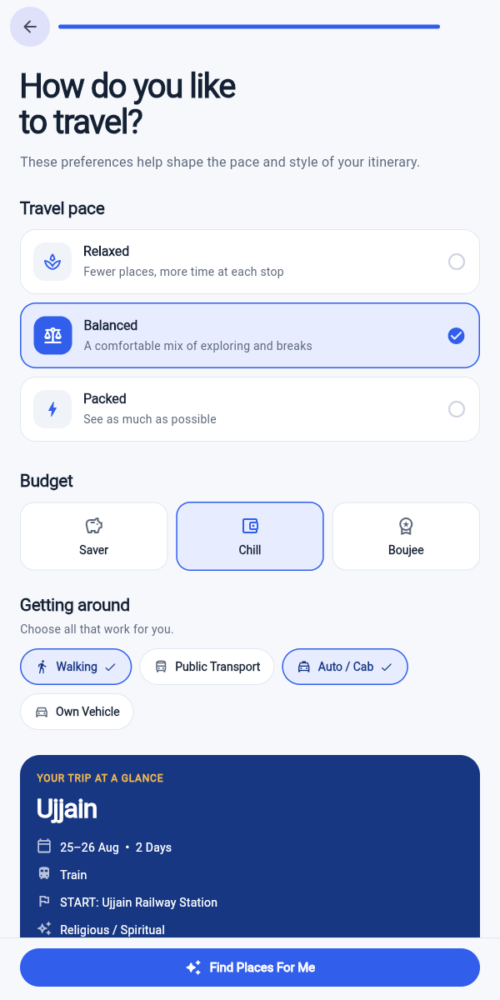

Completion dialog:

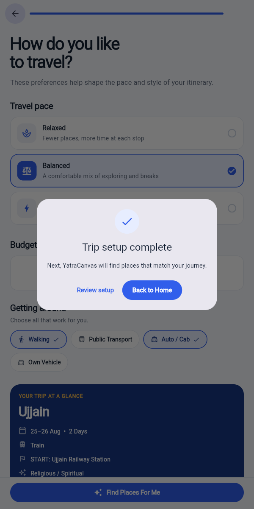

#### Purpose

Collects travel pace, budget, and preferred transport, then summarises the complete draft.

#### What is shown on the screen

- Pace cards: Relaxed, Balanced, Packed.
- Budget cards: Saver, Chill, Boujee.
- Getting-around chips: Walking, Public Transport, Auto / Cab, Own Vehicle.
- “Your Trip at a Glance” summary.
- Completion confirmation dialog.

#### Buttons and actions

| Button / element | What it does | Where it navigates |
| --- | --- | --- |
| Back | Pops to Trip Purpose. | Trip Purpose |
| Pace card | Stores one pace. | Same screen |
| Budget card | Stores one budget; default is Chill. | Same screen |
| Transport chip | Toggles one or more transport preferences. | Same screen |
| Find Places For Me | Enabled when at least one transport exists; saves preferences and opens dialog. | Completion dialog |
| Review setup | Closes the dialog. | Trip Preferences |
| Back to Home | Closes dialog, clears previous routes, and opens Home. | Home Screen |

#### Widgets used

| Widget / component | Purpose |
| --- | --- |
| `CreateTripScaffold` | Shared step and bottom CTA structure. |
| `AnimatedContainer`, `InkWell` | Build selectable pace and budget cards. |
| `SelectionChip`, `Wrap` | Support multiple transport choices. |
| `AlertDialog`, `TextButton`, `FilledButton` | Present completion actions. |

#### Important file

`lib/screens/create_trip/trip_preferences_screen.dart`

---

### 3.20 Admin Overview

#### Screenshot

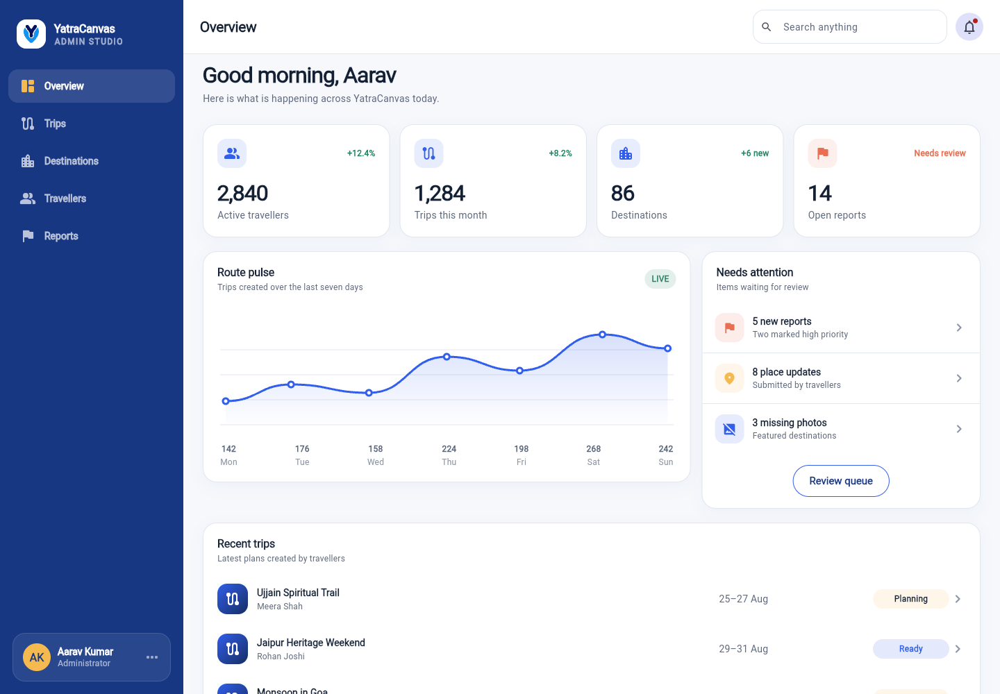

#### Purpose

Provides a dashboard summary of sample platform activity.

#### What is shown on the screen

- Responsive sidebar or mobile drawer.
- Top search and notification controls.
- Four metrics: active travellers, monthly trips, destinations, and open reports.
- Route Pulse custom-painted chart.
- Needs Attention panel and Recent Trips list.

#### Buttons and actions

| Button / element | What it does | Where it navigates |
| --- | --- | --- |
| Drawer menu icon | Opens admin navigation below 920 px. | Admin drawer |
| Sidebar item | Changes `_selectedIndex`. | Selected admin view |
| Search field submit | Displays “Searching for …” SnackBar. | Same view |
| Search icon on narrow layout | Present but has an empty callback. | Same view |
| Notifications | Present but has an empty callback. | Same view |
| Review queue | Present but has an empty callback. | Same view |
| Recent trip row | Displays “Opening [trip]” SnackBar. | Same view |

#### Widgets used

| Widget / component | Purpose |
| --- | --- |
| `LayoutBuilder`, `Drawer`, `Row` | Switch between desktop sidebar and mobile drawer. |
| `Wrap` | Makes metric cards responsive. |
| `CustomPaint` | Draws the Route Pulse line chart. |
| `Card`-style `_PanelCard` | Groups dashboard sections. |

#### Important file

`lib/admin/screens/admin_panel_screen.dart`

---

### 3.21 Admin Trips

#### Screenshot

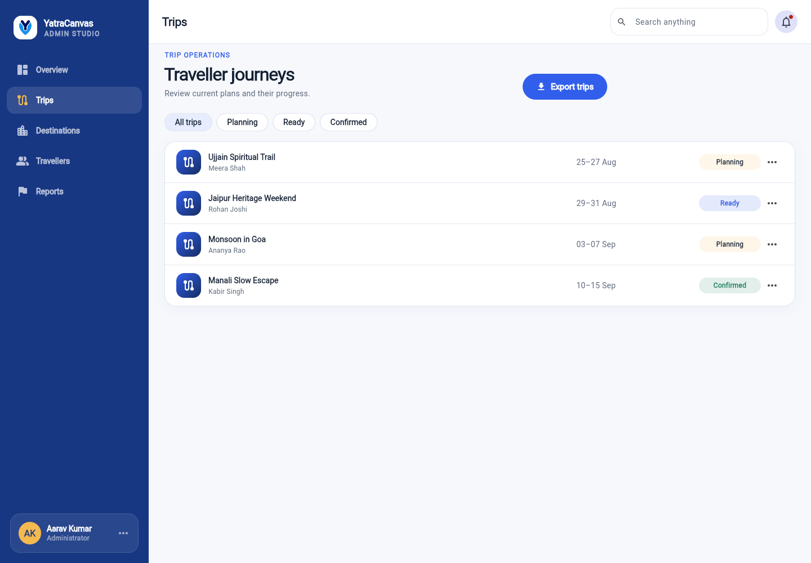

#### Purpose

Displays sample traveller journeys and their current planning status.

#### What is shown on the screen

- Trip Operations heading and Export Trips action.
- Filters: All Trips, Planning, Ready, Confirmed.
- Four sample trip rows with traveller, dates, and status.

#### Buttons and actions

| Button / element | What it does | Where it navigates |
| --- | --- | --- |
| Export trips | Shows a SnackBar only. | Same view |
| Filter chip | Changes the selected chip visually; data is not actually filtered. | Same view |
| Trip row | Shows “Opening [trip]” SnackBar. | Same view |
| More actions | Present with an empty callback. | Same view |

#### Widgets used

`_ManagementPage`, `ChoiceChip`, `_PanelCard`, `_TripListTile`, `ListTile`-style rows, `IconButton`.

#### Important file

`lib/admin/screens/admin_panel_screen.dart`

---

### 3.22 Admin Destinations

#### Screenshot

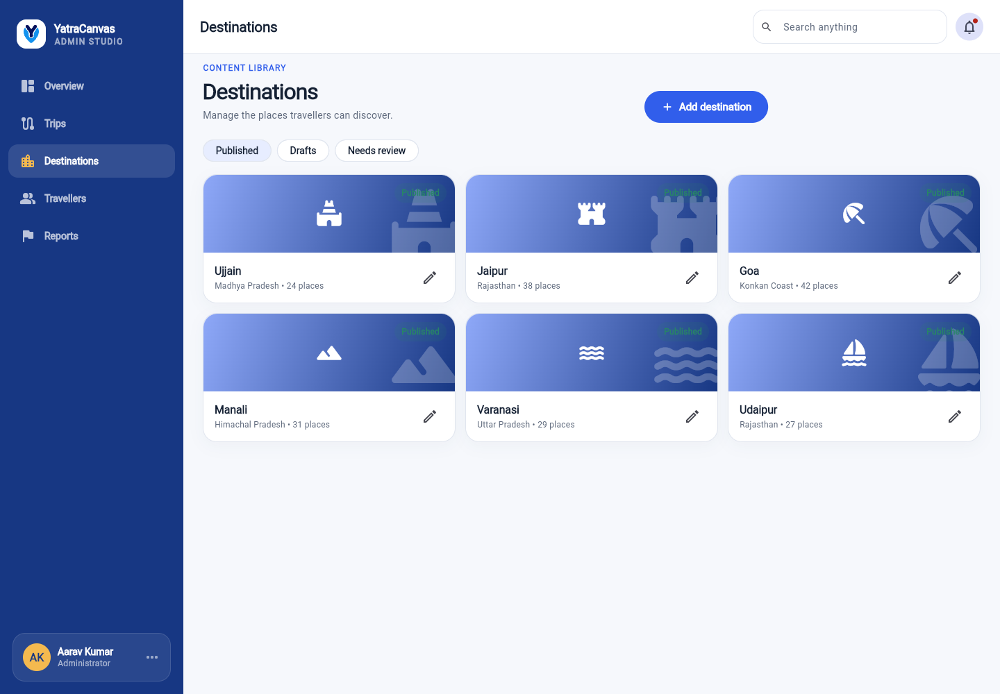

#### Purpose

Displays a responsive grid of destination records for future content management.

#### What is shown on the screen

- Content Library heading and Add Destination action.
- Published, Drafts, and Needs Review filters.
- Cards for Ujjain, Jaipur, Goa, Manali, Varanasi, and Udaipur.

#### Buttons and actions

| Button / element | What it does | Where it navigates |
| --- | --- | --- |
| Add destination | Shows a SnackBar only. | Same view |
| Filter chip | Changes selected visual state only. | Same view |
| Edit icon | Shows “Edit [destination]” SnackBar. | Same view |

#### Widgets used

`_ManagementPage`, `LayoutBuilder`, `Wrap`, `_DestinationAdminCard`, `Stack`, `IconButton`, `_StatusPill`.

#### Important file

`lib/admin/screens/admin_panel_screen.dart`

---

### 3.23 Admin Travellers

#### Screenshot

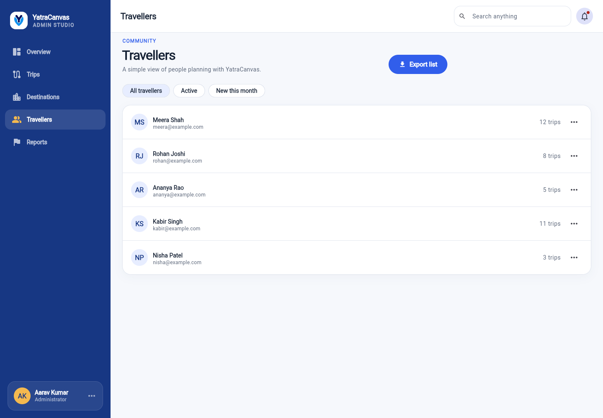

#### Purpose

Shows a sample list of travellers, contact details, and trip counts.

#### What is shown on the screen

- Community heading and Export List action.
- All Travellers, Active, and New This Month filters.
- Five sample traveller rows with avatar initials, email, and trip count.

#### Buttons and actions

| Button / element | What it does | Where it navigates |
| --- | --- | --- |
| Export list | Shows a SnackBar only. | Same view |
| Filter chip | Changes selected visual state only. | Same view |
| More actions | Present with an empty callback. | Same view |

#### Widgets used

`_ManagementPage`, `ChoiceChip`, `ListTile`, `CircleAvatar`, `IconButton`, `MediaQuery`.

#### Important file

`lib/admin/screens/admin_panel_screen.dart`

---

### 3.24 Admin Reports

#### Screenshot

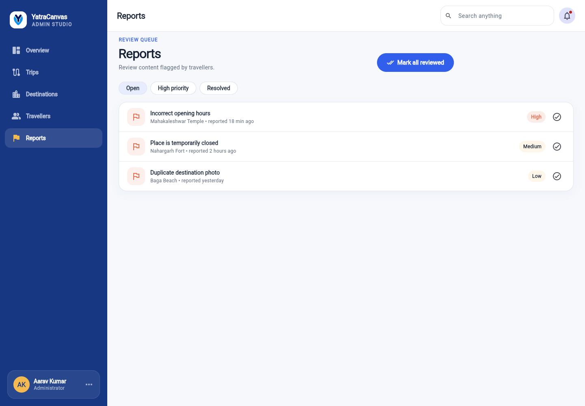

#### Purpose

Demonstrates a moderation queue for traveller-reported place information.

#### What is shown on the screen

- Review Queue heading and Mark All Reviewed action.
- Open, High Priority, and Resolved filters.
- Three reports with detail and priority pills.

#### Buttons and actions

| Button / element | What it does | Where it navigates |
| --- | --- | --- |
| Mark all reviewed | Shows a SnackBar only. | Same view |
| Filter chip | Changes selected visual state only. | Same view |
| Mark-reviewed icon | Shows “Report marked as reviewed” SnackBar. | Same view |

#### Widgets used

`_ManagementPage`, `ChoiceChip`, `_ReportTile`, `_StatusPill`, `IconButton`, `SnackBar`.

#### Important file

`lib/admin/screens/admin_panel_screen.dart`

---

## 4. Screenshots and UI references

### Actual application screenshots

This documentation now includes **25 screenshots captured from the running YatraCanvas Flutter web builds**. They cover the complete traveller flow, all ten personalisation views, the Home dashboard, every trip form, the completion dialog, and all five admin views.

Screenshot directory:

```text
docs/screenshots/
├── 01-splash-screen.png
├── 02-welcome-screen.png
├── 03-login-screen.png
├── 04-onboarding-language.png
├── ...
├── 20-trip-complete-dialog.png
├── 21-admin-overview.png
└── 25-admin-reports.png
```

The other raster files are platform icons:

- `web/favicon.png`
- `web/icons/*.png`
- `android/app/src/main/res/mipmap-*/ic_launcher.png`

These are launcher/browser assets, not screen captures.

### UI reference / inspiration screenshots

The `design_reference/` directory contains **31 JPG inspiration images**. The filenames and `AGENTS.md` identify them as Wanderlog UI references. They may have informed spacing, hierarchy, cards, progress controls, bottom CTA placement, navigation, and trip-planning layouts, but they are **not YatraCanvas screenshots** and are intentionally not embedded as proof of the implemented UI.

Reference directory:

```text
design_reference/
├── Screenshot_20260816_*_Wanderlog.jpg
├── Starting*.jpg
├── slecting_destination*.jpg
└── slecting_date*.jpg
```

YatraCanvas keeps its own logo, route-blue palette, copy, mock data, and component design.

---

## 5. Screen navigation diagram

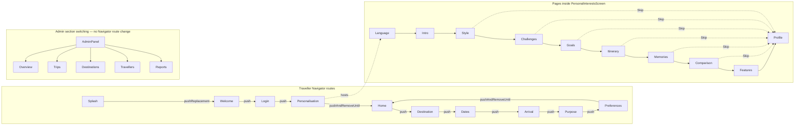
```mermaid
flowchart LR
    subgraph TravellerRoutes[Traveller Navigator routes]
        Splash -->|pushReplacement| Welcome
        Welcome -->|push| Login
        Login -->|push| Personalisation
        Personalisation -->|pushAndRemoveUntil| Home
        Home -->|push| Destination
        Destination -->|push| Dates
        Dates -->|push| Arrival
        Arrival -->|push| Purpose
        Purpose -->|push| Preferences
        Preferences -->|pushAndRemoveUntil| Home
    end

    subgraph PersonalisationPages[Pages inside PersonalInterestsScreen]
        Language --> Intro --> Style --> Challenges --> Goals --> Itinerary --> Memories --> Comparison --> Features --> Profile
        Style -. Skip .-> Profile
        Challenges -. Skip .-> Profile
        Goals -. Skip .-> Profile
        Itinerary -. Skip .-> Profile
        Memories -. Skip .-> Profile
        Comparison -. Skip .-> Profile
    end

    Personalisation -. hosts .-> Language

    subgraph AdminState[Admin section switching — no Navigator route change]
        AdminPanel --> Overview
        AdminPanel --> AdminTrips[Trips]
        AdminPanel --> AdminDestinations[Destinations]
        AdminPanel --> AdminTravellers[Travellers]
        AdminPanel --> AdminReports[Reports]
    end
```

### Navigation implementation notes

- Navigation uses direct `MaterialPageRoute` calls rather than named routes.
- Splash uses `pushReplacement`, so the user cannot return to the splash screen.
- Completing onboarding and finishing a trip use `pushAndRemoveUntil(..., (route) => false)` to clear previous routes.
- Trip-step Back controls call `Navigator.pop()` through `CreateTripScaffold`.
- Admin sidebar/drawer navigation changes an integer state index; it does not push routes.

---

## 6. Important buttons and controls

| Screen | Button / control | Function |
| --- | --- | --- |
| Splash | Automatic timer | Opens Welcome after about 1.9 seconds. |
| Welcome | Start Your Journey | Opens Login. |
| Login | Back | Returns to Welcome. |
| Login | Country code | Selects `+91`, `+1`, or `+44`. |
| Login | Phone field | Accepts digits and enables phone continuation at seven digits. |
| Login | Phone / Google / Apple / Guest | All open onboarding; no real authentication occurs. |
| Personalisation | Back | Moves to the previous page or pops Login from step 1. |
| Personalisation | Skip | From steps 3–8, jumps to Profile Setup. |
| Personalisation | Choice cards | Store language, planning style, challenges, and goals. |
| Personalisation | Continue / named CTA | Advances the controlled `PageView`. |
| Home | Search | Shows a future-phase SnackBar. |
| Home | Profile avatar | Shows a future-phase SnackBar. |
| Home | Continue planning | Shows a future-phase SnackBar. |
| Home | Create Trip card/button | Opens Destination Selection. |
| Home | Mood, destination, recommendation | Shows a corresponding placeholder SnackBar. |
| Home | Bottom Home | Remains on Home. |
| Home | Bottom Explore / Trips / Profile | Shows placeholder SnackBars. |
| Home | Bottom Create | Opens Destination Selection. |
| Destination | Search / clear | Filters or clears local destination results. |
| Destination | Recent/result row | Selects a `DestinationOption`. |
| Destination | Continue | Opens Select Dates when a destination exists. |
| Dates | Flexible toggle | Switches between exact calendar and duration. |
| Dates | Duration chip / calendar day | Stores trip length or date range. |
| Dates | Continue | Saves dates and opens Arrival Details. |
| Arrival | Method card | Selects Train, Flight, Bus, Car, or Other. |
| Arrival | Arrival field / suggestion | Captures the starting point. |
| Arrival | Time field | Opens the time picker. |
| Arrival | Continue | Saves arrival data and opens Trip Purpose. |
| Purpose | Purpose card | Toggles a trip purpose. |
| Purpose | Continue | Saves purposes and opens Preferences. |
| Preferences | Pace / budget card | Selects pace and budget. |
| Preferences | Transport chip | Toggles transport options. |
| Preferences | Find Places For Me | Saves selections and opens completion dialog. |
| Completion dialog | Review setup | Closes the dialog. |
| Completion dialog | Back to Home | Clears the stack and returns Home. |
| Admin shell | Sidebar/drawer items | Switch admin section. |
| Admin shell | Search submit | Shows a search SnackBar. |
| Admin Trips | Export / filters / row / more | Demo controls; SnackBars, visual state, or empty callback. |
| Admin Destinations | Add / filters / Edit | Demo controls; Add and Edit show SnackBars. |
| Admin Travellers | Export / filters / more | Demo controls; no data mutation. |
| Admin Reports | Mark all / filters / mark one | Demo controls; marking one shows a SnackBar. |

> There are no implemented Save, Delete, map-control, or floating-action buttons in the current source. They are not invented in this document.

---

## 7. Reusable and custom widgets

### `YatraBrand`

- **File:** `lib/widgets/yatra_brand.dart`
- **Purpose:** Displays the SVG logo beside the coloured YatraCanvas wordmark.
- **Used in:** Splash, Welcome, Login, and Home. The admin shell renders the same SVG directly.
- **Important parameters:** `compact`, `light`.
- **Appearance/behaviour:** Rounded logo tile, optional compact sizing, optional light wordmark, and a semantic “YatraCanvas” label.

### `PrimaryButton`

- **File:** `lib/widgets/primary_button.dart`
- **Purpose:** Standard full-width main action using `FilledButton`.
- **Used in:** Welcome, Login, personalisation, and all five trip steps through `CreateTripScaffold`.
- **Important parameters:** `label`, `onPressed`, `icon`, `isLoading`, `expand`, `semanticLabel`.
- **Appearance/behaviour:** Pill-shaped themed button, optional icon, disabled state, and animated loading spinner.

### `SecondaryButton`

- **File:** `lib/widgets/secondary_button.dart`
- **Purpose:** Standard outlined secondary action.
- **Used in:** Google and Apple login actions.
- **Important parameters:** `label`, `onPressed`, `icon`, `expand`.
- **Appearance/behaviour:** Themed full-width `OutlinedButton` with optional icon.

### `ProgressHeader`

- **File:** `lib/widgets/progress_header.dart`
- **Purpose:** Shows Back, animated progress, and optional Skip controls.
- **Used in:** Ten-step personalisation and five-step trip creation.
- **Important parameters:** `currentStep`, `totalSteps`, `onBack`, `onSkip`, `skipLabel`, `useSafeArea`.
- **Appearance/behaviour:** Back icon, animated linear progress bar, optional Skip text, and progress semantics.

### `CreateTripScaffold`

- **File:** `lib/widgets/create_trip_scaffold.dart`
- **Purpose:** Standardises all five trip-creation screens.
- **Used in:** Destination, Dates, Arrival, Purpose, and Preferences.
- **Important parameters:** `step`, `title`, `subtitle`, `child`, `onContinue`, `continueLabel`, `continueIcon`, `continueEnabled`, `onBack`.
- **Appearance/behaviour:** Five-step header, scrollable content, and fixed bottom `PrimaryButton`.

### `OnboardingCanvas`

- **File:** `lib/widgets/onboarding_canvas.dart`
- **Purpose:** Provides the shared pure-white first-run surface.
- **Used in:** Splash, Welcome, Login, and Personalisation.
- **Important parameter:** `child`.
- **Appearance/behaviour:** A simple white `ColoredBox` wrapper.

### `SearchField`

- **File:** `lib/widgets/search_field.dart`
- **Purpose:** Reusable search text field with optional external controller and clear action.
- **Used in:** Destination Selection.
- **Important parameters:** `controller`, `hintText`, `onChanged`, `onSubmitted`, `onClear`, `autofocus`, `readOnly`, `focusNode`.
- **Appearance/behaviour:** Search icon, themed input, and conditional clear icon.

### `SelectionChip`

- **File:** `lib/widgets/selection_chip.dart`
- **Purpose:** Selectable pill for single or multiple choices.
- **Used in:** Home moods, flexible trip duration, and transport preferences.
- **Important parameters:** `label`, `selected`, `onSelected`, `icon`, `enabled`.
- **Appearance/behaviour:** Animated border/background, optional icon, check mark, and accessibility state.

### `SectionHeader`

- **File:** `lib/widgets/section_header.dart`
- **Purpose:** Consistent title, subtitle, and optional text action for content sections.
- **Used in:** Home dashboard sections.
- **Important parameters:** `title`, `subtitle`, `actionLabel`, `onAction`.
- **Appearance/behaviour:** Left-aligned title/subtitle with an optional right-side action.

### `AppBottomNavigation`

- **File:** `lib/widgets/app_bottom_navigation.dart`
- **Purpose:** Reusable Material 3 navigation bar.
- **Used in:** Home, with a custom five-item list and prominent Create item.
- **Important parameters:** `currentIndex`, `onDestinationSelected`, `items`, `prominentIndex`.
- **Appearance/behaviour:** Safe-area `NavigationBar`; can render one icon as a raised circular action.

### `DestinationCard`

- **File:** `lib/widgets/destination_card.dart`
- **Purpose:** General reusable destination card with optional image, tag, and selected state.
- **Used in:** Available component library; the current Home and Destination screens use private specialised cards instead.
- **Important parameters:** `name`, `location`, `image`, `tag`, `selected`, `onTap`.
- **Appearance/behaviour:** 16:9 image/fallback area, destination text, optional tag, selection check, and semantics.

### `PlaceCard`

- **File:** `lib/widgets/place_card.dart`
- **Purpose:** Displays a selectable place with image, category, description, and metadata.
- **Used in:** Available for the planned place-finding phase; not instantiated by a current screen.
- **Important parameters:** `name`, `description`, `image`, `category`, `meta`, `selected`, `onTap`.
- **Appearance/behaviour:** Responsive thumbnail, text details, and circular selected indicator.

### `TripCard`

- **File:** `lib/widgets/trip_card.dart`
- **Purpose:** Displays a trip image/fallback, title, destination, dates, members, and planning progress.
- **Used in:** Available reusable component; Home currently uses a private `_ContinueTripCard` instead.
- **Important parameters:** `title`, `destination`, `dateRange`, `image`, `progress`, `memberCount`, `onTap`.
- **Appearance/behaviour:** Image overlay, trip metadata, optional progress bar, and tappable card.

**Reusable custom widget count: 13.** `AppBottomNavigationItem` is a supporting configuration class rather than a widget.

---

## 8. Flutter widget overview

| Flutter widget | Why it is used in this project |
| --- | --- |
| `MaterialApp` | Starts the traveller and admin applications and applies `AppTheme.light`. |
| `Scaffold` | Provides page structure for major screens and the admin panel. |
| `SafeArea` | Prevents content from overlapping device system areas. |
| `Column` | Builds most vertical screen layouts. |
| `Row` | Aligns icons, labels, cards, fields, and controls horizontally. |
| `Stack` / `Positioned` | Creates layered artwork, overlays, badges, and card decoration. |
| `Container` / `DecoratedBox` | Applies padding, colour, borders, gradients, and rounded shapes. |
| `SingleChildScrollView` | Makes forms and content usable on small displays and with keyboards. |
| `CustomScrollView` / `SliverList` | Builds the Home dashboard as a sliver-based scrolling page. |
| `ListView` | Creates horizontal mood and destination lists. |
| `GridView` | Builds the August 2026 calendar grid. |
| `PageView` | Hosts the ten controlled personalisation steps. |
| `LayoutBuilder` | Changes layouts according to available width, especially the admin panel. |
| `Wrap` | Reflows chips, cards, metrics, and admin grids responsively. |
| `Card` | Groups trip and destination information. |
| `TextField` | Collects phone, profile name, destination query, arrival point, and admin search. |
| `FilledButton` | Implements primary application and admin actions. |
| `OutlinedButton` | Implements secondary login and review controls. |
| `TextButton` | Implements Skip, Guest, dialog, and optional text actions. |
| `IconButton` | Implements Back, Search, notifications, edit, more, and mark-reviewed controls. |
| `InkWell` | Makes cards and custom surfaces tappable with Material feedback. |
| `NavigationBar` | Implements Home’s Material 3 bottom navigation. |
| `ChoiceChip` | Shows selectable admin filters. |
| `ActionChip` | Shows the recent destination shortcut. |
| `Switch.adaptive` | Toggles flexible date selection. |
| `AlertDialog` | Confirms completion of trip setup. |
| `CustomPaint` | Draws Welcome route artwork and the admin Route Pulse chart. |
| `Semantics` | Adds button, selection, label, and progress information for accessibility. |

`AppBar`, `ElevatedButton`, `FloatingActionButton`, `BottomNavigationBar`, and `GestureDetector` are not used in the inspected source and are therefore not claimed as project widgets.

---

## 9. Project file structure

```text
YatraCanvas/
├── lib/
│   ├── main.dart
│   ├── main_admin.dart
│   ├── Logo/
│   │   └── logo.svg
│   ├── admin/
│   │   ├── admin_app.dart
│   │   └── screens/
│   │       └── admin_panel_screen.dart
│   ├── data/
│   │   └── mock_data.dart
│   ├── models/
│   │   └── trip_draft.dart
│   ├── screens/
│   │   ├── onboarding/
│   │   │   ├── splash_screen.dart
│   │   │   ├── welcome_screen.dart
│   │   │   ├── login_screen.dart
│   │   │   └── personal_interests_screen.dart
│   │   ├── home/
│   │   │   └── home_screen.dart
│   │   └── create_trip/
│   │       ├── destination_selection_screen.dart
│   │       ├── select_dates_screen.dart
│   │       ├── arrival_details_screen.dart
│   │       ├── trip_purpose_screen.dart
│   │       └── trip_preferences_screen.dart
│   ├── theme/
│   │   ├── app_colors.dart
│   │   ├── app_text_styles.dart
│   │   └── app_theme.dart
│   └── widgets/
│       ├── app_bottom_navigation.dart
│       ├── create_trip_scaffold.dart
│       ├── destination_card.dart
│       ├── onboarding_canvas.dart
│       ├── place_card.dart
│       ├── primary_button.dart
│       ├── progress_header.dart
│       ├── search_field.dart
│       ├── secondary_button.dart
│       ├── section_header.dart
│       ├── selection_chip.dart
│       ├── trip_card.dart
│       └── yatra_brand.dart
├── test/
│   ├── widget_test.dart
│   ├── admin_panel_test.dart
│   └── flow_updates_test.dart
├── design_reference/
│   └── 31 Wanderlog inspiration JPG files
├── android/
├── web/
├── windows/
├── docs/
│   ├── screenshots/
│   │   └── 25 captured YatraCanvas PNG screenshots
│   ├── PROJECT_DOCUMENTATION.md
│   └── YatraCanvas_Project_Documentation.docx
├── analysis_options.yaml
├── pubspec.yaml
├── pubspec.lock
└── README.md
```

### Folder responsibilities

#### `lib/screens/`

Contains traveller-facing route screens grouped by onboarding, Home, and trip creation.

#### `lib/widgets/`

Contains public reusable UI building blocks. Screen-specific helper widgets remain private in their owning screen file.

#### `lib/admin/`

Contains the separate admin application shell and its responsive frontend panel.

#### `lib/models/`

Contains `DestinationOption`, mutable `TripDraft`, and `TimeOfDayValue` data classes.

#### `lib/data/`

Contains eight local destination records and three Ujjain arrival-point suggestions.

#### `lib/theme/`

Contains the central colour tokens, typography tokens, and Material 3 `ThemeData`.

#### `lib/Logo/`

Contains the SVG brand asset declared in `pubspec.yaml`.

#### `test/`

Contains widget tests for onboarding, login options, trip flow, search, Home navigation, admin navigation, removed check-in behaviour, and budget labels.

#### `design_reference/`

Contains external UI inspiration only. It is not an application-screenshot folder.

#### `docs/screenshots/`

Contains the 25 real application screenshots embedded throughout this Markdown documentation.

#### `android/`, `web/`, `windows/`

Contain Flutter-generated platform runners and configuration for supported targets present in the repository.

---

## 10. Important files

| File | Purpose |
| --- | --- |
| `lib/main.dart` | Traveller entry point; applies theme, constrains content to 600 px, and opens Splash. |
| `lib/main_admin.dart` | Separate admin entry point. |
| `lib/admin/admin_app.dart` | Creates the admin `MaterialApp` and opens `AdminPanelScreen`. |
| `lib/admin/screens/admin_panel_screen.dart` | Implements the responsive admin shell and all five admin views. |
| `lib/screens/onboarding/splash_screen.dart` | Animated timed startup screen. |
| `lib/screens/onboarding/welcome_screen.dart` | Product introduction and custom map illustration. |
| `lib/screens/onboarding/login_screen.dart` | Frontend-only phone/provider/guest entry screen. |
| `lib/screens/onboarding/personal_interests_screen.dart` | Hosts all ten personalisation pages and their local state. |
| `lib/screens/home/home_screen.dart` | Main traveller dashboard and trip-creation entry. |
| `lib/screens/create_trip/destination_selection_screen.dart` | Step 1: local destination search and selection. |
| `lib/screens/create_trip/select_dates_screen.dart` | Step 2: exact or flexible date choice. |
| `lib/screens/create_trip/arrival_details_screen.dart` | Step 3: method, arrival point, and time. |
| `lib/screens/create_trip/trip_purpose_screen.dart` | Step 4: multi-select trip purposes. |
| `lib/screens/create_trip/trip_preferences_screen.dart` | Step 5: pace, budget, transport, summary, and completion dialog. |
| `lib/models/trip_draft.dart` | Defines destination, trip draft, and time data structures. |
| `lib/data/mock_data.dart` | Supplies local destination and arrival-point data. |
| `lib/theme/app_colors.dart` | Defines route blue, navy, saffron, surfaces, text, border, and gradient tokens. |
| `lib/theme/app_text_styles.dart` | Defines display, heading, card, body, label, caption, and button styles. |
| `lib/theme/app_theme.dart` | Applies Material 3 colour, button, input, card, navigation, chip, divider, and progress themes. |
| `lib/widgets/create_trip_scaffold.dart` | Standard layout for the five trip steps. |
| `lib/widgets/progress_header.dart` | Shared progress, Back, and Skip header. |
| `lib/widgets/yatra_brand.dart` | Shared SVG logo and wordmark. |
| `lib/Logo/logo.svg` | YatraCanvas logo asset. |
| `pubspec.yaml` | Defines project metadata, Dart constraint, dependencies, and assets. |
| `analysis_options.yaml` | Configures Dart static analysis. |
| `test/widget_test.dart` | Tests core traveller startup, login, trip flow, search, and Home create navigation. |
| `test/admin_panel_test.dart` | Tests admin Overview rendering and Trips section navigation. |
| `test/flow_updates_test.dart` | Tests removed quick check-in and Saver/Chill/Boujee labels. |

The current project also includes `lib/config`, `lib/services`, and a FastAPI backend under `backend/`. Navigation remains implemented directly in screen files.

---

## 11. Technologies and tools

| Technology / tool | Purpose in project |
| --- | --- |
| Flutter SDK | Builds the traveller and admin interfaces for multiple platforms. |
| Dart SDK `^3.13.0` | Compiles the application and supports records, patterns, and modern syntax used by the code. |
| Material 3 | Supplies the design foundation through `ThemeData(useMaterial3: true)`. |
| SVG assets | Store the scalable YatraCanvas logo. |
| Flutter widget testing | Pumps widgets, simulates taps/text, and verifies visible UI and navigation. |
| Dart analyzer and `flutter_lints` | Provide static checks and recommended coding rules. |
| Android runner | Allows Android builds. |
| Web runner | Provides the HTML manifest, index, favicon, and web icons. |
| Windows runner | Provides a native Windows desktop host. |

The current source uses REST clients, FastAPI, and PostgreSQL. It does **not** include a Google Maps SDK, Firebase integration, Figma integration, or a third-party state-management package.

---

## 12. Packages used

Source: `pubspec.yaml`.

| Package | Type | Why it is used |
| --- | --- | --- |
| `flutter` | SDK dependency | Core widgets, Material UI, navigation, animation, state, and platform support. |
| `flutter_svg: ^2.3.0` | Runtime dependency | Renders `lib/Logo/logo.svg` in `YatraBrand` and the admin sidebar. |
| `flutter_test` | SDK dev dependency | Provides `testWidgets`, finders, pumps, and interaction simulation. |
| `flutter_lints: ^6.0.0` | Dev dependency | Adds recommended Flutter/Dart lint rules. |

The Flutter client also uses `http` for the YatraCanvas API and `geolocator` for device location; see `pubspec.yaml` for the current versions.

---

## 13. Application architecture

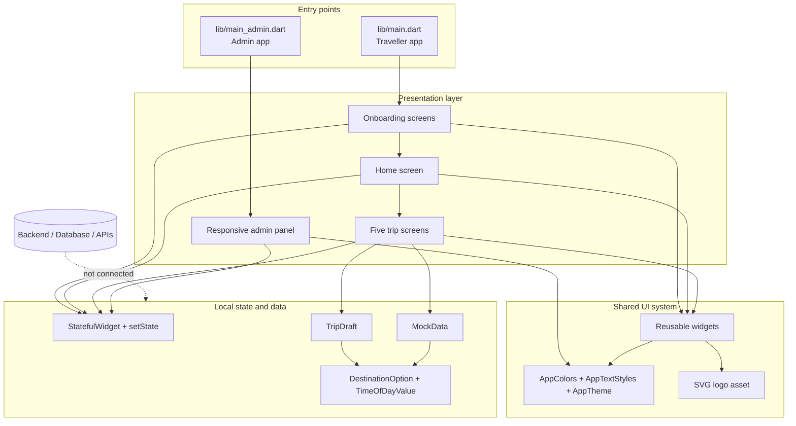
```mermaid
flowchart TD
    subgraph EntryPoints[Entry points]
        Main[lib/main.dart<br/>Traveller app]
        AdminMain[lib/main_admin.dart<br/>Admin app]
    end

    subgraph UI[Presentation layer]
        Onboarding[Onboarding screens]
        Home[Home screen]
        TripScreens[Five trip screens]
        AdminUI[Responsive admin panel]
    end

    subgraph Shared[Shared UI system]
        Widgets[Reusable widgets]
        Theme[AppColors + AppTextStyles + AppTheme]
        Logo[SVG logo asset]
    end

    subgraph StateData[Local state and data]
        SetState[StatefulWidget + setState]
        Draft[TripDraft]
        Models[DestinationOption + TimeOfDayValue]
        Mock[MockData]
    end

    Main --> Onboarding
    Onboarding --> Home
    Home --> TripScreens
    AdminMain --> AdminUI

    Onboarding --> Widgets
    Home --> Widgets
    TripScreens --> Widgets
    AdminUI --> Theme
    Widgets --> Theme
    Widgets --> Logo

    Onboarding --> SetState
    Home --> SetState
    TripScreens --> SetState
    AdminUI --> SetState
    TripScreens --> Draft
    Draft --> Models
    TripScreens --> Mock
    Mock --> Models

    Backend[(Backend / Database / APIs)]
    Backend -. not connected .-> StateData
```

### Architectural explanation

YatraCanvas currently follows a straightforward **screen + reusable widget + local model** structure:

1. `main.dart` and `main_admin.dart` create two independent application entry points.
2. Screens build the visible UI and own temporary state with `StatefulWidget` and `setState`.
3. Shared widgets and theme tokens prevent repeated visual code.
4. `TripDraft` is passed through constructors across all five trip screens.
5. `MockData` provides local destination and arrival records.
6. `Navigator` and `MaterialPageRoute` connect traveller screens.
7. No backend, dependency injection, service layer, or global state-management library is present.

### Main data model

| Model | Important fields / responsibility |
| --- | --- |
| `DestinationOption` | Name, region, country, tags, and computed `locationLabel`. |
| `TripDraft` | Destination, dates, flexibility, duration, arrival, purposes, pace, budget, and transport preferences. |
| `TimeOfDayValue` | Serializable-style hour and minute values independent of Flutter's `TimeOfDay` widget type. |

---

## 14. Final screen summary

| No. | Screen / view | Main purpose | Main file |
| ---: | --- | --- | --- |
| 1 | Splash | Animated brand startup. | `lib/screens/onboarding/splash_screen.dart` |
| 2 | Welcome | Introduce YatraCanvas and start the journey. | `lib/screens/onboarding/welcome_screen.dart` |
| 3 | Login | Offer frontend-only phone, provider, and guest entry. | `lib/screens/onboarding/login_screen.dart` |
| 4 | Language | Choose onboarding language. | `lib/screens/onboarding/personal_interests_screen.dart` |
| 5 | Personalisation Welcome | Explain the personalisation process. | `lib/screens/onboarding/personal_interests_screen.dart` |
| 6 | Planning Style | Record current planning experience. | `lib/screens/onboarding/personal_interests_screen.dart` |
| 7 | Planning Challenges | Select planning difficulties. | `lib/screens/onboarding/personal_interests_screen.dart` |
| 8 | Planning Goals | Select desired benefits. | `lib/screens/onboarding/personal_interests_screen.dart` |
| 9 | Mini Itinerary | Demonstrate one organised day plan. | `lib/screens/onboarding/personal_interests_screen.dart` |
| 10 | Shared Planning and Memories | Explain collaborative notes and favourites. | `lib/screens/onboarding/personal_interests_screen.dart` |
| 11 | Comparison | Compare scattered planning with one organised trip. | `lib/screens/onboarding/personal_interests_screen.dart` |
| 12 | Feature Summary | Present four product-direction features. | `lib/screens/onboarding/personal_interests_screen.dart` |
| 13 | Profile Setup | Collect the display name and enter the app. | `lib/screens/onboarding/personal_interests_screen.dart` |
| 14 | Home | Dashboard, discovery content, and trip-creation entry. | `lib/screens/home/home_screen.dart` |
| 15 | Destination Selection | Search and choose a local destination. | `lib/screens/create_trip/destination_selection_screen.dart` |
| 16 | Select Dates | Choose exact dates or flexible duration. | `lib/screens/create_trip/select_dates_screen.dart` |
| 17 | Arrival Details | Choose arrival method, point, and time. | `lib/screens/create_trip/arrival_details_screen.dart` |
| 18 | Trip Purpose | Select one or more trip purposes. | `lib/screens/create_trip/trip_purpose_screen.dart` |
| 19 | Trip Preferences | Choose pace, budget, transport, and complete setup. | `lib/screens/create_trip/trip_preferences_screen.dart` |
| 20 | Admin Overview | Show metrics, activity chart, alerts, and recent trips. | `lib/admin/screens/admin_panel_screen.dart` |
| 21 | Admin Trips | Display and filter sample trips. | `lib/admin/screens/admin_panel_screen.dart` |
| 22 | Admin Destinations | Display destination-management cards. | `lib/admin/screens/admin_panel_screen.dart` |
| 23 | Admin Travellers | Display sample traveller records. | `lib/admin/screens/admin_panel_screen.dart` |
| 24 | Admin Reports | Display and review sample reports. | `lib/admin/screens/admin_panel_screen.dart` |

---

## 15. Final verification and counts

### Verification checklist

- [x] Inspected current Dart source under `lib/`.
- [x] Inspected `pubspec.yaml` and documented only declared packages.
- [x] Traced real `Navigator` calls and admin index-based switching.
- [x] Included every major traveller route, onboarding view, and admin section.
- [x] Documented important controls and their real callbacks.
- [x] Documented all 13 public reusable widget classes.
- [x] Distinguished 31 reference JPGs from application screenshots.
- [x] Included complete workflow, screen navigation, and architecture diagrams.
- [x] Included real folder structure, important files, models, mock data, and tests.
- [x] Clearly identified placeholder and unimplemented actions.
- [x] Did not invent screens, APIs, packages, buttons, or backend functionality.

### Final totals

| Item | Total |
| --- | ---: |
| Screen/views documented | **24** |
| Traveller route-level screen classes | **10** |
| Onboarding step views inside `PersonalInterestsScreen` | **10** |
| Admin section views inside `AdminPanelScreen` | **5** |
| Actual application screenshots used | **25** |
| UI reference images identified | **31** |
| Reusable custom widget classes found | **13** |
| Mermaid diagrams created | **3** |

**Documentation file location:** `docs/PROJECT_DOCUMENTATION.md`
