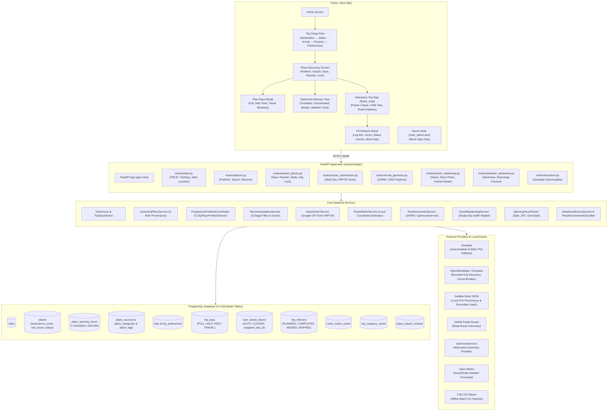

# YatraCanvas Project Status Audit

**Audit Date:** 2026-09-09  
**Branch:** `main` (clean, synchronized with `origin/main` at commit `b157233`)  
**Methodology:** Direct inspection of repository code, database models, SQL migrations, external provider adapters, Flutter widgets/services, and execution of both full test suites (`pytest` and `flutter test`, `flutter analyze`).

---

## 1. Executive Summary

YatraCanvas is in a **robust pre-alpha functional prototype stage for single-trip planning**. 

The core algorithmic and computational foundation is exceptionally healthy:
- **Test Health:** 100% passing across both platforms:
  - **Backend:** 367 passed, 0 failed, 4 deprecation warnings in 310.67s (`pytest`).
  - **Flutter:** 173 passed, 0 failed in 14s (`flutter test`).
  - **Flutter Analyzer:** 0 issues found in 62.4s (`flutter analyze`).
- **Core Trip Planning:** Fully operational end-to-end from destination autocomplete, date picking, arrival specification, purpose/preference selection, multi-source POI discovery (OSM + Audiala + Geoapify fallback), day-type scheduling (Full, Half, Rest, Travel), native AUTO/LOCKED day assignment, Google OR-Tools multi-day VRPTW itinerary optimization with opening hours and lunch breaks, Frame-1 progressive OSM map rendering with road-following geometry (OSRM/ORS), POI bottom sheet with travel leg metrics, status transitions (Completed/Missed/Skipped), and single-day partial replanning with completed-prefix immutability.
- **Provider Decoupling:** Complete elimination of runtime Google Places dependencies for the normal traveller journey. Runtime operations use Geoapify (autocomplete), OpenStreetMap/Overpass (POI discovery), Audiala (local seed POIs), OSRM (keyless road geometry), Open-Meteo (weather advisories), and local Haversine estimators (matrix).
- **Critical Architectural Gaps:**
  1. **Authentication & Multi-Tenancy:** Not implemented. The backend hardcodes all trips to a fixed development UUID (`00000000-0000-4000-8000-000000000001`). Flutter's login screen is a client-only UI shell.
  2. **Client-Side Trip Persistence:** `TripDraft` is widget-local in Flutter memory and is lost on app restart. The Home screen's "Continue planning" card is an inert placeholder.
  3. **Migration Automation:** Database schema management relies on startup `SQLModel.metadata.create_all` and manual unversioned `.sql` scripts. No Alembic runner exists.
  4. **Admin Panel:** The 1,263-line `AdminPanelScreen` is entirely populated with hardcoded mock data and zero API calls. No backend admin routes exist.
  5. **Onboarding Wizard:** The 9-step `PersonalInterestsScreen` collects onboarding preferences but discards them upon navigation to `HomeScreen`.

---

## 2. Current Architecture

---

## 3. Feature Status Table

| Feature | Status | Backend | Flutter | Tests | Notes |
|:---|:---:|:---:|:---:|:---:|:---|
| **City Autocomplete** | `[IMPLEMENTED]` | `GET /locations/autocomplete` (Geoapify) | `DestinationSelectionScreen` (debounced) | Passing | Resolves canonical city without Google Places. |
| **Trip Creation** | `[IMPLEMENTED]` | `POST /trips`, `GET /trips/{id}`, `PATCH /trips/{id}` | Steps 1–5 flow in `create_trip/` | Passing | Creates `Trip`, `TripPreference`, and sequential `TripDay`s. |
| **TripDay Configuration** | `[IMPLEMENTED]` | `GET/PATCH /trips/{id}/days/{day_num}` | `PlanDaysScreen` bottom modal | Passing | Configures FULL, HALF, REST, TRAVEL, start/end times. |
| **POI Discovery (OSM)** | `[IMPLEMENTED]` | `RecommendationService` + Overpass | `PlaceDiscoveryScreen` | Passing | 7 categories, circuit breaker, TTL cache, suitability filter. |
| **Audiala POI Seed** | `[IMPLEMENTED]` | `AudialaPlacesProvider` | Integrated in discovery | Passing | Local JSON seed with sitelinks & PageRank importance. |
| **Canonical Place Resolution** | `[IMPLEMENTED]` | `CanonicalPlaceService` | `PlaceDiscoveryScreen` manual search | Passing | 4-rule hierarchy: provider ID, Wikidata QID, geo/name match. |
| **Manual Place Search** | `[IMPLEMENTED]` | `GET /cities/{id}/places/search` | Debounced search bar | Passing | 350ms debounced search within 50km radius + local DB. |
| **Saved Places Management** | `[IMPLEMENTED]` | `routers/saved_places.py` CRUD | Place card actions & reorder list | Passing | Custom ordering, must-visit, priority, notes. |
| **Day Assignment (AUTO/LOCKED)** | `[IMPLEMENTED]` | `UserSavedPlace.assignment_mode` | Place options modal | Passing | Check constraints enforce consistent `assigned_day_id`. |
| **OR-Tools VRPTW Optimizer** | `[IMPLEMENTED]` | `VrptwSolverService` | Route button & progress | Passing | Opening hours, lunch breaks, visit duration, lock domains. |
| **Unscheduled Places Reporting** | `[IMPLEMENTED]` | `UnscheduledPlaceRead` | Cards in itinerary view | Passing | Reasons: `LOCKED_DAY_INFEASIBLE`, `CLOSED_ON_AVAILABLE_DAYS`, etc. |
| **Road Route Geometry** | `[IMPLEMENTED]` | `RouteGeometryService` (OSRM/ORS) | `PolylineLayer` on map | Passing | In-memory coordinate hash cache; degrades to markers. |
| **Interactive Map** | `[IMPLEMENTED]` | Endpoint for geometry & stops | `TripMapScreen` (`flutter_map`) | Passing | Frame-1 progressive render; day-filtering polylines. |
| **POI Map Bottom Sheet** | `[IMPLEMENTED]` | Backed by loaded state | `PoiBottomSheet` | Passing | Previous-stop travel metrics, opening hours, status actions. |
| **Stop Status Lifecycle** | `[IMPLEMENTED]` | `PATCH /itinerary/stops/{id}` | Buttons on POI sheet & itinerary | Passing | `PLANNED`, `COMPLETED`, `MISSED`, `SKIPPED`. |
| **Partial Single-Day Replan** | `[IMPLEMENTED]` | `POST /itinerary/move-place` | "Move to another day" modal | Passing | Target feasibility guard, immutable completed prefix. |
| **Google Maps External Links** | `[IMPLEMENTED]` | N/A (URL generation) | Directions & More Details buttons | Passing | `launchUrl` external intent for directions/details. |
| **Weather Advisories** | `[IMPLEMENTED]` | `WeatherAdvisoryService` (Open-Meteo) | `WeatherAdvisoryCard` | Passing | Advisory only; indoor/outdoor venue classifier; rearrange preview. |
| **User Authentication / JWT** | `[PLANNED]` | Fixed `DEVELOPMENT_USER_ID` | `LoginScreen` (UI stub only) | None | No OTP verification, no JWT header, no session storage. |
| **Multi-Trip Listing / Resume** | `[PLANNED]` | `GET /trips` (by user) missing | `HomeScreen` placeholder SnackBar | None | Trips exist in DB but cannot be reopened after app restart. |
| **Automated Migrations** | `[PARTIAL]` | `create_all` + manual `.sql` | N/A | None | No Alembic runner or version table in database. |
| **Admin Verification Portal** | `[PARTIAL]` | `PlaceImportReview` schema exists | `AdminPanelScreen` (100% mock data) | UI test only | No backend admin endpoints or connected review actions. |
| **Onboarding Preferences** | `[PARTIAL]` | `TripPreference` supported | `PersonalInterestsScreen` (9 steps) | UI test only | Data collected during onboarding is discarded. |

---

## 4. Core Trip Flow Status

| Step | Transition | Status | API Endpoint Called | Data Persisted | Potential Failures | Test Coverage |
|:---:|:---|:---:|:---|:---|:---|:---:|
| 1 | **Launch App → Home** | **PASS** | None | None | None | Unit & Widget tests pass |
| 2 | **Home → Select Destination** | **PASS** | `GET /locations/autocomplete` | In-memory `TripDraft.destination` | Geoapify timeout / invalid key | `widget_test.dart`, `trip_creation_test.dart` |
| 3 | **Select Dates** | **PASS** | None | In-memory `TripDraft.dates` | Validation (end < start) | `select_dates_test.dart` |
| 4 | **Arrival Details** | **PASS** | `GET /locations/autocomplete` | In-memory `TripDraft.startLocation` | Location not found | `start_location_test.dart` |
| 5 | **Trip Purpose** | **PASS** | `POST /places/prefetch` (async) | In-memory `TripDraft.purposes` | Background prefetch fails safely | `trip_creation_test.dart` |
| 6 | **Preferences → Create Trip** | **PASS** | `POST /trips` | `trips`, `trip_days`, `trip_preferences` | DB connection failure | `test_trip_creation.py`, `test_trip_days.py` |
| 7 | **Place Discovery** | **PASS** | `GET /cities/{id}/places/recommendations` | `city_category_cache`, `places`, `place_sources` | Overpass 504 / timeout (circuit breaker trips safely) | `test_live_discovery_reliability.py`, `place_discovery_test.dart` |
| 8 | **Select / Save Places** | **PASS** | `POST /trips/{id}/saved-places` | `user_saved_places` | Duplicate place handled safely | `test_saved_places_routes.py`, `saved_place_service_test.dart` |
| 9 | **Configure TripDays** | **PASS** | `PATCH /trips/{id}/days/{day_num}` | `trip_days` | Changing to REST with locked places rejected (422) | `test_trip_days.py`, `plan_your_days_test.dart` |
| 10 | **AUTO / LOCKED Assignment** | **PASS** | `PATCH /trips/{id}/saved-places/{p_id}` | `user_saved_places.assignment_mode` | Assigning to REST day rejected (422) | `test_place_day_assignment.py`, `plan_your_days_test.dart` |
| 11 | **Generate Itinerary** | **PASS** | `POST /trips/{id}/optimize-route` | `trip_itinerary`, `route_matrix_cache` | Over-constrained trip drops places to `unscheduled_places` | `test_vrptw_solver.py`, `test_day_aware_planner.py` |
| 12 | **View Itinerary** | **PASS** | `GET /trips/{id}/weather-advisories` | In-memory weather cache | Weather API timeout (falls back cleanly) | `test_weather_advisories.py`, `weather_advisory_test.dart` |
| 13 | **Open Map** | **PASS** | `GET /trips/{id}/route-geometry` | In-memory polyline cache | OSRM timeout (degrades to markers) | `test_route_geometry.py`, `trip_map_test.dart` |
| 14 | **Open POI Details** | **PASS** | None (reads local state) | None | None | `poi_bottom_sheet_test.dart` |
| 15 | **Mark Status (Completed/Missed/Skipped)** | **PASS** | `PATCH /trips/{id}/itinerary/stops/{id}` | `trip_itinerary.status` | DB error | `test_partial_replanning.py`, `plan_your_days_test.dart` |
| 16 | **Move Missed Place** | **PASS** | `POST /trips/{id}/itinerary/move-place` | `trip_itinerary`, `user_saved_places` | `TARGET_DAY_INFEASIBLE` returns structured failure | `test_partial_replanning.py`, `partial_replanning_test.dart` |
| 17 | **Partial Replan Synchronization** | **PASS** | None (callbacks in-memory) | Updated `_optimizedRoute` | Screen disposed before callback | `test_trip_flow_e2e.py`, `trip_map_test.dart` |

---

## 5. Backend Status

- **FastAPI Application (`app.main`):** `[IMPLEMENTED]`. Lifespan context manager, CORS configuration, modular routers for all functional areas, unified error handling.
- **Database Connection (`app.database`):** `[IMPLEMENTED]`. Connection pooling with `pool_pre_ping=True`, LRU cached engine, dependency-injected session generator.
- **SQLModel / SQLAlchemy Models (`app.models.entities`):** `[IMPLEMENTED]`. 14 models defining 13 application tables + 1 review table with explicit check constraints and unique constraints.
- **Trip & TripDay Services:** `[IMPLEMENTED]`. Transactional creation, date shifting, duration reconciliation, window validation, and protection against destructive cascades.
- **Canonical Place System (`CanonicalPlaceService`):** `[IMPLEMENTED]`. 4-rule hierarchy, provenance tracking with licensing (`ODbL-1.0`, `CC BY 4.0`), deduplication downstream.
- **Route Matrix & VRPTW Planner (`VrptwSolverService`):** `[IMPLEMENTED]`. Google OR-Tools multi-vehicle routing with active TripDay windows, lunch breaks, visit durations, interval unions, native day-lock domains, soft capacity span penalties, and unscheduled place categorization.
- **Opening Hours Ingestion & Normalization (`OpeningHoursParser`):** `[IMPLEMENTED]`. Normalizes complex raw strings into 7 daily interval rows; supports split schedules, overnight shifts, 24/7, and strict `UNKNOWN` distinction.
- **Smart Replanning Service (`SmartReplanningService`):** `[IMPLEMENTED]`. Centralized change impact analysis, selective matrix purging (`start_only` vs `all`), single-day suffix replanning with completed-prefix immutability.
- **Weather Advisory Engine (`WeatherAdvisoryService`):** `[IMPLEMENTED]`. Open-Meteo integration with touring window overlap detection and deterministic indoor/outdoor place environment classification.
- **Route Geometry Service (`RouteGeometryService`):** `[IMPLEMENTED]`. Keyless OSRM and openrouteservice adapters with in-memory coordinate-hash TTL caching.
- **FSQ OS Places Importer (`app.importers.fsq_os_places`):** `[IMPLEMENTED]`. Operator CLI for offline batch imports with candidate distance filtering and review generation.
- **Authentication Routes:** `[PLANNED]`. No auth router, JWT validation, or password/OTP handling exists in FastAPI.
- **Admin Endpoints:** `[PLANNED]`. No admin router exists in `app.main.py`.

---

## 6. Flutter Status

- **Home Screen (`home_screen.dart`):** `PARTIAL`. Renders top bar and "Start a new journey" card. "Continue planning" card is a placeholder SnackBar stub. No trip listing.
- **Destination Selection (`destination_selection_screen.dart`):** `IMPLEMENTED`. Debounced search against Geoapify/local DB, error recovery, clean selection state.
- **Date Selection (`select_dates_screen.dart`):** `IMPLEMENTED`. Material date range picker with validation.
- **Arrival Details (`arrival_details_screen.dart`):** `IMPLEMENTED`. Transport type selector, Geoapify arrival point search, start location coordinate resolution.
- **Trip Purpose (`trip_purpose_screen.dart`):** `IMPLEMENTED`. Multi-select purpose chips, asynchronous prefetch trigger.
- **Trip Preferences (`trip_preferences_screen.dart`):** `IMPLEMENTED`. Pace, budget, transport, extra interest chips, transactional `POST /trips` trigger.
- **Place Discovery (`place_discovery_screen.dart`):** `IMPLEMENTED`. Multi-category place cards, manual 350ms debounced search, save/remove/reorder, weather cards, optimize route button, and map launcher.
- **Plan Your Days Screen (`plan_days_screen.dart`):** `IMPLEMENTED`. Configures FULL, HALF, REST, TRAVEL, touring start/end times with time-pickers.
- **AUTO / LOCKED Place Scheduling:** `IMPLEMENTED`. Bottom modal allowing travellers to keep places AUTO or lock them to specific active sightseeing days.
- **Itinerary Presentation:** `IMPLEMENTED`. Timetable cards with arrival/departure times, lunch break cards, unscheduled place cards with structured failure reasons.
- **Interactive Map (`trip_map_screen.dart`):** `IMPLEMENTED`. `flutter_map` with OSM tiles, numbered markers, road-following polylines, progressive Frame-1 render, camera fitting.
- **POI Bottom Sheet (`poi_bottom_sheet.dart`):** `IMPLEMENTED`. Previous-stop travel metrics, opening hours status, Completed/Missed/Skipped buttons, Move to another day picker, external Google Maps links.
- **Move to Another Day & Partial Replan UI:** `IMPLEMENTED`. Modal excluding REST days and current day; triggers atomic backend replan and updates map and parent itinerary.
- **Admin Panel (`admin_panel_screen.dart`):** `NOT STARTED` (UI shell only). 1,263 lines of hardcoded mock graphs and tables with zero API connection.
- **Login / Authentication (`login_screen.dart`):** `NOT STARTED` (UI shell only). Collects phone number but skips authentication on continue.
- **Personal Interests Wizard (`personal_interests_screen.dart`):** `PARTIAL`. 9-step wizard collects data but discards it on completion.

---

## 7. Planner Status

The day-aware OR-Tools planner (`VrptwSolverService`) has been verified directly against active solver code and test regressions:

- **Actual TripDays:** `[IMPLEMENTED]`. Each non-REST TripDay with `end_time > start_time` is mapped to an independent OR-Tools vehicle route retaining its original date and day number.
- **REST Days:** `[IMPLEMENTED]`. Strictly excluded from solver vehicles (`active_days`). No route or visits can be scheduled on REST days.
- **HALF / TRAVEL / FULL Days:** `[IMPLEMENTED]`. Operates using the configured `start_time` and `end_time` of each specific day.
- **Configured Start/End Windows:** `[IMPLEMENTED]`. Vehicle Start and End cumul variables are bounded by the day's time window.
- **AUTO Places:** `[IMPLEMENTED]`. Unpinned places can be assigned to any feasible active day vehicle.
- **LOCKED Places:** `[IMPLEMENTED]`. Enforced via native vehicle-domain removal (`routing.VehicleVar(idx).RemoveValue(v)`), restricting the place strictly to its assigned day vehicle while allowing optional drops if infeasible.
- **Travel-Time Matrix:** `[IMPLEMENTED]`. Evaluates transit costs based on pairwise matrix lookups (distance and travel duration).
- **Visit Duration:** `[IMPLEMENTED]`. Category heuristics via `estimate_visit_duration` (45 to 180 minutes).
- **Opening Hours:** `[IMPLEMENTED]`. Evaluated against the day's weekday. Exact interval unions are created in OR-Tools, removing closed gaps with `cumul.RemoveInterval`. Latest arrival is bounded by `close_time - visit_duration`.
- **Split Opening Hours:** `[IMPLEMENTED]`. Multi-interval days (e.g., 09:00–12:00, 16:00–21:00) are fully supported.
- **Closed Days:** `[IMPLEMENTED]`. POIs closed on a specific weekday have that day removed from allowed vehicle domains.
- **UNKNOWN Opening Hours:** `[IMPLEMENTED]`. Schedulable across any active day window; flagged as `is_opening_hours_known=false` in API/Flutter.
- **Over-Packed Trips & Unscheduled Places:** `[IMPLEMENTED]`. Low-priority or infeasible places are dropped via disjunction penalties. Every selected place is partitioned into either `optimized_places` or `unscheduled_places` with explicit reasons (`LOCKED_DAY_INFEASIBLE`, `CLOSED_ON_AVAILABLE_DAYS`, `NO_FEASIBLE_DAY`, `DAILY_CAPACITY_EXCEEDED`, `NO_TIME_AVAILABLE`).
- **Time-Based Balancing:** `[IMPLEMENTED]`. Daily utilization is balanced using a soft route-span penalty beyond 75% of each day's capacity.
- **Day-Number Preservation:** `[IMPLEMENTED]`. Logical day sequence $\{1 \dots N\}$ is preserved even when intermediate days have 0 stops.
- **Partial Single-Day Replanning:** `[IMPLEMENTED]`. `POST /trips/{trip_id}/itinerary/move-place` evaluates target day insertion using a single-day suffix solver.
- **Completed-Prefix Protection:** `[IMPLEMENTED]`. Completed stops ($1 \dots K$) are strictly immutable; suffix re-optimization begins at the last completed stop.

---

## 8. External API / Provider Audit

| Provider | Purpose | Implementation File | Status | API Key Required? | Config Location | Fallback Mechanism | Caching |
|:---|:---|:---|:---:|:---:|:---|:---|:---|
| **Geoapify** | Autocomplete & 50km POI search fallback | `services/geoapify_service.py` `services/geoapify_places_provider.py` | Active | Yes | `GEOAPIFY_API_KEY` (backend `.env`) | Local database city/place search | In-memory TTL (300s) |
| **OpenStreetMap / Overpass** | Primary runtime POI discovery | `services/openstreetmap_places_service.py` `services/openstreetmap_discovery_service.py` | Active | No | `OVERPASS_API_URL` (public FOSSGIS default) | Stale usable DB cache + circuit breaker (3 failures/60s) | PostgreSQL `city_category_cache` (24h TTL, 7d stale) |
| **Audiala** | Local POI seed & prominence scoring | `services/audiala_places_provider.py` `services/place_importance_scorer.py` | Active | No | `AUDIALA_DATASET_PATH` (`app/data/audiala_places.json`) | N/A (local file) | Persisted in database tables |
| **OSRM** | Road route geometry polylines | `services/osrm_geometry_provider.py` `services/route_geometry_service.py` | Active (default) | No | `OSRM_ROUTER_URL` (public project-osrm default) | Degrades to marker-only map rendering | In-memory TTL (60m) by coordinate hash |
| **openrouteservice** | Alternative route geometry provider | `services/openrouteservice_geometry_provider.py` | Standby | Optional | `OPENROUTESERVICE_API_KEY` | Falls back to OSRM | In-memory TTL (60m) |
| **Local Route Estimator** | Route matrix travel duration/distance | `services/local_routes_service.py` | Active (default) | No | In-process code | Symmetrical pair & start node fallback | PostgreSQL `route_matrix_cache` |
| **Open-Meteo** | Weather forecasts & advisories | `services/open_meteo_weather_provider.py` `services/weather_service.py` | Active | No (free tier) | `OPEN_METEO_BASE_URL` (public API default) | Degrades to `weather_unavailable` safely | In-memory TTL (60m) |
| **FSQ OS Places** | Bulk open POI dataset importer | `app/importers/fsq_os_places.py` | Inactive (CLI only) | No | Local CSV/JSONL file path | Reviews created for ambiguous POIs | Database persistence |
| **Google Places (New)** | Legacy city autocomplete/details | `services/google_places_service.py` | `[DEPRECATED]` | Optional | `GOOGLE_PLACES_API_KEY` | Not used in normal flow | None |
| **Google Routes** | Legacy route matrix adapter | `services/google_routes_service.py` | `[DEPRECATED]` | Optional | `GOOGLE_ROUTES_API_KEY` | Not used in normal flow | `route_matrix_cache` |

*Google Places API is completely bypassed by the active traveller flow.*

---

## 9. Database Audit

- **Production Database Target:** PostgreSQL (Supabase-hosted).
- **Development/Test Database:** SQLite in-memory (`sqlite://` with `StaticPool`).
- **Database Tables (14 models in `app.models.entities`):**
  1. `cities`: Canonical destinations (unique `google_place_id`, coordinate checks).
  2. `places`: Canonical POIs (importance score, rating, category, `raw_opening_hours`, `opening_hours_status`).
  3. `city_category_cache`: Discovery cache tracker with `expires_at`.
  4. `place_tags`: Application tags unique per place/tag.
  5. `place_sources`: Provider provenance, external IDs, licensing (`ODbL-1.0`, `CC BY 4.0`), contact metadata.
  6. `place_categories`: Provider category IDs and labels (verified matching `label` contract).
  7. `place_opening_hours`: 7 daily rows per place, intervals JSON array, status (`KNOWN`, `CLOSED`, `UNKNOWN`).
  8. `place_import_reviews`: Ingestion review tracking (`pending`, `resolved`, `ignored`).
  9. `trips`: Trip records, start location coordinates, days, arrival details.
  10. `trip_preferences`: Weighted preferences (purpose 2.5x, secondary 1.0x, weather suppression).
  11. `user_saved_places`: Selected places, ordering, locks, `assignment_mode` (`AUTO` vs `LOCKED`), `assigned_day_id`.
  12. `route_matrix_cache`: Directional leg distance and duration estimates.
  13. `trip_itinerary`: Planned visits, arrival/departure times, distance/duration from previous, `status` (`PLANNED`, `COMPLETED`, `MISSED`, `SKIPPED`).
  14. `trip_days`: Configured trip days (`FULL_DAY`, `HALF_DAY`, `REST`, `TRAVEL`), daily start/end touring windows.
- **Migration System Health:**
  - **Runner:** `[PARTIAL]`. No automated versioned migration tool (Alembic) exists. Schema creation relies on `SQLModel.metadata.create_all` which cannot alter existing columns or constraints.
  - **SQL Scripts:** 11 forward scripts, 5 rollback scripts, 1 schema-parity script in `backend/sql/`.
  - **Applied State:** The configured Supabase database was verified to contain all current schema additions, including `trip_days`, `user_saved_places.assignment_mode`, `place_opening_hours`, and `trip_itinerary.status`.
  - **Risks:** Missing an immutable migration ledger (`alembic_version`). Future schema alterations run the risk of inconsistent application across environments.

---

## 10. Cache Status

1. **Route Matrix Cache (`route_matrix_cache`):**
   - **Key:** `(trip_id, from_key, to_key, travel_mode)` with unique constraint.
   - **Stored:** Distance (meters), static duration (seconds), traffic duration (seconds), location metadata.
   - **TTL:** `ROUTE_MATRIX_TRAFFIC_TTL_MINUTES` (30m) for traffic; static duration is permanent.
   - **Invalidation:** Selective. Trip start changes purge only `start_only` legs. Adding/removing places preserves all existing pairwise legs.
2. **Place Discovery Cache (`city_category_cache`):**
   - **Key:** `(city_id, category)` under `PLACE_DISCOVERY_CACHE_VERSION`.
   - **Stored:** `last_fetched_at`, `expires_at`.
   - **TTL:** 24 hours (`PLACE_DISCOVERY_CACHE_TTL_HOURS`), with 7-day (`DISCOVERY_STALE_USABLE_HOURS`) stale-while-revalidate serving.
   - **Concurrency Deduplication:** In-memory `ProgressivePrefetchCoordinator` deduplicates in-flight background requests.
3. **Location Autocomplete Cache:**
   - **Key:** `query.lower().strip()`.
   - **Stored:** List of `LocationAutocompleteResult`.
   - **TTL:** 300 seconds (`GEOAPIFY_AUTOCOMPLETE_CACHE_TTL_SECONDS`).
   - **Invalidation:** In-memory only; lost on process restart.
4. **Route Geometry Cache:**
   - **Key:** `(trip_id, day_number, coords_hash)`.
   - **Stored:** GeoJSON linestring coordinates.
   - **TTL:** 60 minutes (`ROUTE_GEOMETRY_CACHE_TTL_MINUTES`).
   - **Invalidation:** In-memory only; lost on process restart.
5. **Weather Forecast Cache:**
   - **Key:** `(round(lat, 2), round(lng, 2), start_date, end_date)`.
   - **Stored:** Raw Open-Meteo forecast JSON.
   - **TTL:** 60 minutes (`WEATHER_CACHE_TTL_MINUTES`).
   - **Invalidation:** In-memory only; lost on process restart.
6. **Flutter Client Cache:**
   - **Status:** In-memory `TripDraft` only. Disappears on app restart. No local SQLite / Hive / SharedPreferences caching exists on client.

---

## 11. Test Status

### Backend (`pytest backend/tests`)
- **Total Tests:** 367
- **Passing:** 367 (100%)
- **Failing:** 0
- **Skipped:** 0
- **Warnings:** 4 (FastAPI `TestClient` Starlette deprecation and SWIG import notices)
- **Execution Time:** 310.67s (05:10)

### Flutter Test (`flutter test`)
- **Total Tests:** 173
- **Passing:** 173 (100%)
- **Failing:** 0
- **Skipped:** 0
- **Execution Time:** 14s

### Flutter Analyze (`flutter analyze`)
- **Issues Found:** 0 (Clean analysis in 62.4s)

---

## 12. Known Bugs

1. **[MEDIUM] In-Memory Client Trip Loss on App Restart:**  
   `TripDraft` is maintained exclusively in Flutter widget state. If the mobile app is terminated or restarted, the traveller has no way to reopen their trip from `HomeScreen`, which currently displays a placeholder SnackBar ("Trip planning is coming in the next phase.").
2. **[LOW] Process-Local Prefetch Task Loss on Backend Restart:**  
   `ProgressivePrefetchCoordinator` tracks background prefetch tasks in Python memory. If the backend process restarts during an in-flight prefetch, pending tasks are dropped without a recovery queue.
3. **[LOW] Stale Unscheduled Flags during Replan Invalidation:**  
   When places are intentionally unscheduled due to solver time capacity limits, the change-detection logic in `SmartReplanningService` flags them as stale if subsequent edits alter the trip structure.

---

## 13. Technical Debt

1. **Hardcoded Development User ID:**  
   `backend/app/services/trip_service.py` hardcodes `DEVELOPMENT_USER_ID = UUID("00000000-0000-4000-8000-000000000001")`. All unauthenticated trips share this single identifier.
2. **Lack of Versioned Migration Tool:**  
   The project has no Alembic environment configured. Migrations in `backend/sql/` are manually applied raw SQL scripts.
3. **Discarded Onboarding Preferences:**  
   `PersonalInterestsScreen` runs a 9-step wizard asking travellers about their style, challenges, and goals, but discards this state entirely upon reaching `HomeScreen`.
4. **Mock-Only Admin Panel:**  
   `AdminPanelScreen` contains 1,263 lines of UI code with zero API integration, while `place_import_reviews` in PostgreSQL has no administrative interface to resolve conflicts.
5. **Dormant Google Client Code:**  
   `GooglePlacesService` and `GoogleRoutesService` remain in the repository along with legacy `/cities/google/*` endpoints, adding dead weight to the backend.

---

## 14. Not Implemented

1. **User Authentication & Authorization:** No Supabase Auth JWT verification, login endpoints, session storage, or user profile management.
2. **Trip Listing & Management:** No `GET /trips` (user trip list), delete trip, or archive trip endpoints in Flutter UI.
3. **Client-Side Offline Storage:** No local database (SQLite/Hive) in Flutter to store trips or maps offline.
4. **Admin Backend Endpoints:** No REST endpoints for listing, reviewing, approving, or ignoring `PlaceImportReview` records.
5. **Automated Migration Runner:** No CLI command (`alembic upgrade head`) to automatically bring database schemas up to date.

---

## 15. Priority Roadmap

### P0 — Required for Core Functionality & Security
1. **Supabase Auth & JWT Verification:** Implement JWT verification in FastAPI, derive `user_id` from claims, secure endpoints, and connect Flutter's login screen.
2. **Trip Persistence & Resume (Multi-Trip Listing):** Expose `GET /trips` on backend, persist active `trip_id` locally in Flutter (`shared_preferences`), and replace `HomeScreen`'s placeholder with a real trip list.
3. **Alembic Migration Runner:** Configure Alembic in `backend/`, stamp existing database state, and ensure automated, reversible schema updates.

### P1 — Important Before Public Demonstration / Release
4. **Onboarding Integration:** Store user preferences in a `UserProfile` / `UserPreference` table and pre-fill trip preferences from onboarding answers.
5. **Admin Ingestion & Review APIs:** Build backend routes (`GET/PATCH /admin/reviews`) and connect `AdminPanelScreen` to real review queues.
6. **Purge Dormant Google Adapters:** Safely delete `google_places_service.py`, `google_routes_service.py`, and legacy Google endpoints after verifying all tests remain green.

### P2 — Useful Improvements
7. **Durable Background Prefetch Queue:** Move `ProgressivePrefetchCoordinator` from in-process memory to a lightweight background task queue (e.g., Redis or Celery/ARQ) so server restarts don't drop tasks.
8. **Client Offline Caching:** Cache the current itinerary and base OSM map tiles in Flutter for offline access during travel.

### P3 — Optional / Later
9. **Wikimedia Image Enrichment:** Background worker to fetch curated Creative Commons images for prominent attractions.
10. **Self-Hosted Overpass / OSRM Deployment:** Deploy containerized Overpass and OSRM instances for production SLA guarantees.

---

## 16. Top 5 Next Tasks

### 1. Supabase Auth & Backend JWT Verification
- **Why it matters:** Currently all trips in the database share the hardcoded development UUID `00000000-0000-4000-8000-000000000001`. There is no multi-user security, session isolation, or trip ownership.
- **Dependency:** None (PostgreSQL and `Trip.user_id` are already structured for UUIDs).
- **Expected impact:** Enables genuine multi-user isolation, secure trip ownership, and connects the mobile login screen to the backend.

### 2. Trip Resume & Multi-Trip Listing on Home Screen
- **Why it matters:** Travellers lose access to their trips when the Flutter app restarts because `TripDraft` only exists in client RAM and `HomeScreen` has an inert "Continue planning" placeholder.
- **Dependency:** Task 1 (Auth) or device-level local storage.
- **Expected impact:** Travellers can close and reopen the app without losing in-progress trips, enabling realistic travel usage.

### 3. Alembic Database Migration Runner Setup
- **Why it matters:** Future schema updates risk corrupting or desynchronizing staging/production databases because database setup currently relies on `create_all` and manual unversioned `.sql` scripts.
- **Dependency:** None.
- **Expected impact:** Provides automated, verifiable, and reversible database migrations with an immutable version ledger (`alembic_version`).

### 4. Connect Onboarding Preferences to Trip Personalization
- **Why it matters:** The 9-step `PersonalInterestsScreen` collects rich traveller style, goals, and pace data, but completely discards it upon reaching `HomeScreen`.
- **Dependency:** Task 1 (Auth / User Profile).
- **Expected impact:** First-time user onboarding immediately influences trip purpose, pacing, budget, and recommendation scoring.

### 5. Real Admin Ingestion & Review API Connection
- **Why it matters:** The database accumulates `PlaceImportReview` rows for ambiguous POI matches, but the 1,263-line `AdminPanelScreen` displays hardcoded mock data and has no way to resolve or audit them.
- **Dependency:** Task 1 (Auth with admin role).
- **Expected impact:** Enables operators to review, merge, or dismiss ambiguous places, maintaining high canonical place data quality.
