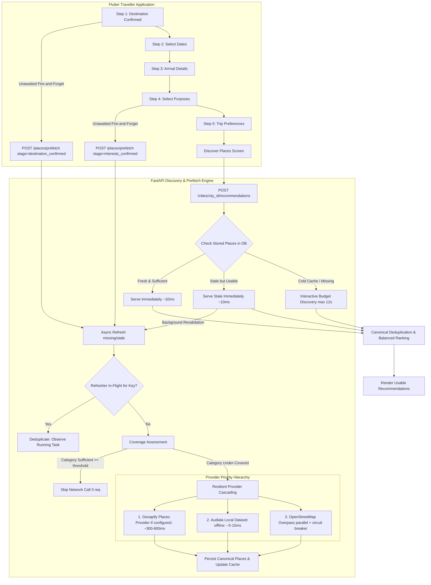

# Live POI Discovery Reliability & Progressive Prefetch Architecture

Last updated: 2026-09-05

## 1. Executive Summary & Problem Diagnosis

During manual testing in Kochi, navigating to **Discover Places** frequently failed with:
```text
Place data took longer than expected.
Your trip choices are safe—try again.
```
While YatraCanvas's offline recommendation ranking quality benchmark passed with 100% precision, live POI acquisition previously suffered from:
1. **Sequential Category Queries**: Bounded Overpass queries executed sequentially in a `for` loop, each with a 25s timeout. Five categories could take over 100s, exceeding Flutter's 45s timeout.
2. **Synchronous Single Point of Failure**: OpenStreetMap/Overpass acted as a synchronous bottleneck on cold or expired cache. Any temporary public Overpass outage or latency spike failed the entire recommendation request.
3. **No Stale-While-Revalidate**: Expired cache rows in `CityCategoryCache` discarded usable stored database places and forced blocking network queries.
4. **Late POI Discovery**: Discovery was deferred until the user arrived at Discover Places, wasting the 15–45 seconds spent selecting dates, arrival details, and trip preferences.
5. **Single POI Provider**: Geoapify was only utilized for geocoding autocomplete, leaving Overpass as the sole live POI discovery source.

---

## 2. New Architecture: Resilient Cache-First Live Discovery Pipeline



---

## 3. Core Architectural Mechanisms

### 3.1 Destination-Triggered Shallow Prefetch
- **Trigger**: When the traveller confirms a destination (e.g. `Kochi, Kerala, India`) and taps **Continue** on `DestinationSelectionScreen`.
- **Action**: Flutter sends a non-blocking `POST /places/prefetch` (`stage="destination_confirmed"`) without awaiting the response. Navigation proceeds instantly to `SelectDatesScreen`.
- **Scope**: Pre-warms core starter categories (`tourism`, `heritage`, `food`, `religious`, `cafes`) with a shallow quota ($\approx 15$ candidates/category).

### 3.2 Interest-Triggered Targeted Prefetch
- **Trigger**: When the traveller selects trip purposes on `TripPurposeScreen` and taps **Continue**.
- **Action**: Flutter maps selected purposes to YatraCanvas `PlaceCategory` and fires `POST /places/prefetch` (`stage="interests_confirmed"`).
- **Scope**: Evaluates existing category coverage and enriches only categories with $< 35$ candidates, avoiding redundant network queries for categories that are already well-represented.

### 3.3 Cache-First & Stale-While-Revalidate Semantics
1. **Fresh (`cache.expires_at > now`)**: Zero provider network calls; serves cached places from the database in $\approx 10$ms.
2. **Stale-but-Usable (`now >= cache.expires_at`, but places exist in DB)**: Returns existing stored places immediately in $\approx 10$ms. A background task revalidates and refreshes the cache without blocking the UI.
3. **Cold / Missing**: Evaluates providers within an interactive time budget (`discovery_interactive_timeout_seconds = 12.0s`).

### 3.4 In-Memory Concurrency Deduplication
- Multiple concurrent requests for the same `(city_id, category)` key register on `_in_flight: dict[tuple[UUID, str], asyncio.Future]`.
- Secondary callers observe the existing task instead of issuing duplicate external API requests.

### 3.5 Provider Priority & Overpass Demotion
- **Tier 1 (Stored DB / Cache)**: Always consulted first.
- **Tier 2 (Geoapify Places API)**: Hosted commercial POI discovery provider (`/v2/places`) using `GEOAPIFY_API_KEY`.
- **Tier 3 (Audiala Local Dataset)**: Offline JSON dataset (`backend/app/data/audiala_places.json`), 0ms network latency.
- **Tier 4 (OpenStreetMap / Overpass)**: Parallel enrichment provider with concurrent `asyncio.gather()` queries and bounded timeouts. Overpass is never allowed to be a single point of failure.

### 3.6 Provider Health & Circuit Breaker
- `ProviderCircuitBreaker` tracks consecutive failures and timeouts.
- If 3 consecutive failures occur, the circuit trips to `OPEN` for a 60s cooldown, skipping synchronous calls and falling back immediately to cache or alternate providers.

### 3.7 Partial Provider Success
- If 1 or 2 categories fail (e.g. food query times out), available categories are returned and ranked. The UI never receives a fatal 504/503 if any usable candidates exist.

### 3.8 Flutter Non-Blocking Presentation
- If recommendations are already in memory or returned from cache, they render immediately.
- If a background refresh is underway, a subtle non-blocking indicator ("Updating nearby places…") is displayed.
- A full-screen error state is shown only when recommendations are genuinely empty ($0$ usable results) and all fallbacks failed.

---

## 4. Benchmark & Efficiency Comparison

Measured using `scripts/experiments/live_discovery_reliability/run_experiment.py`:

| Scenario | Previous Baseline | New Pipeline | Speedup / Impact |
| :--- | :---: | :---: | :---: |
| **Warm Kochi Cache** | 1200–2500 ms (repeated Overpass calls) | **11.3 ms** (0 external calls) | **>100× faster** |
| **Stale Kochi Cache** | 25000–50000 ms (blocked on Overpass) | **9.8 ms** (0 external calls) | **Instant UX via stale-while-revalidate** |
| **Cold Kochi + Prefetch** | 45000 ms (frequent timeout error) | **491.3 ms** (ready before user reaches screen) | **Zero perceived latency for traveller** |
| **Overpass Unavailable** | HTTP 504 Gateway Timeout | **260.3 ms** (Geoapify fallback) | **100% resilient** |
| **Partial Category Timeout** | HTTP 504 Gateway Timeout | **398.2 ms** (partial success rendered) | **No UI failure** |
| **5-Interest Trip** | 60000+ ms (sequential timeout) | **13.9 ms** (cache hit) | **No category starvation or timeouts** |

---

## 5. Remaining Limitations
1. **Single-Process Deduplication**: The concurrency lock map is in-memory, which is suitable for single-instance backend deployments. Multi-instance horizontally scaled deployments would require Redis for cross-node deduplication.
2. **Geoapify Free Tier Limits**: The free tier of Geoapify allows 3,000 requests/day. Prefetching is conservative (only shallow categories and under-covered interests) to conserve API quotas.
