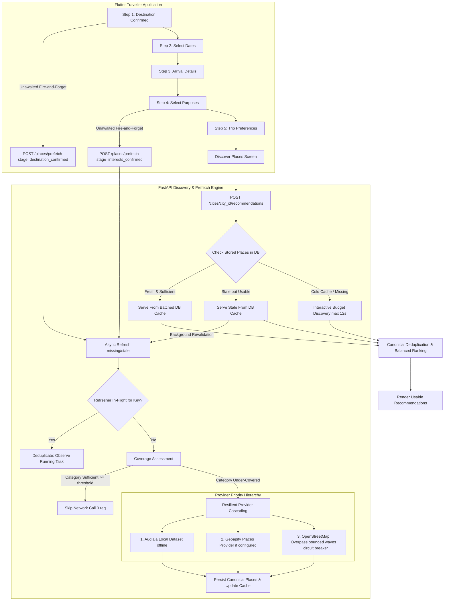

# Live POI Discovery Reliability & Progressive Prefetch Architecture

Last updated: 2026-09-05

## 1. Executive Summary & Problem Diagnosis

During manual testing in Kochi, navigating to **Discover Places** frequently failed with:
```text
Place data took longer than expected.
Your trip choices are safe—try again.
```
While YatraCanvas's offline recommendation ranking quality benchmark passed with 100% precision, live POI acquisition previously suffered from:
1. **Sequential Category Queries**: Bounded Overpass queries executed sequentially in a `for` loop, each with a 25s timeout. Five categories could take over 100s, exceeding Flutter's 45s timeout.
2. **Synchronous Single Point of Failure**: OpenStreetMap/Overpass acted as a synchronous bottleneck on cold or expired cache. Any temporary public Overpass outage or latency spike failed the entire recommendation request.
3. **No Stale-While-Revalidate**: Expired cache rows in `CityCategoryCache` discarded usable stored database places and forced blocking network queries.
4. **Late POI Discovery**: Discovery was deferred until the user arrived at Discover Places, wasting the 15–45 seconds spent selecting dates, arrival details, and trip preferences.
5. **Single POI Provider**: Geoapify was only utilized for geocoding autocomplete, leaving Overpass as the sole live POI discovery source.

---

## 2. New Architecture: Resilient Cache-First Live Discovery Pipeline



---

## 3. Core Architectural Mechanisms

### 3.1 Destination Background Prefetch
- **Trigger**: Flutter calls `POST /places/prefetch` with `stage="destination_confirmed"` before navigating from destination selection.
- **Action**: HTTP 202 returns after enqueue. A worker-thread event loop and independent database session pre-warm all supported categories (`tourism`, `heritage`, `food`, `religious`, `cafes`, `markets`, and `nature`) through the local Audiala and configured Geoapify layers while the traveller completes later screens. Speculative work does not query Overpass.
- **State**: `GET /places/prefetch/{city_id}` exposes coarse progress. Active city/category work is reused.

### 3.2 Dates, Interests, and Start Location
- Dates and start-location stages record readiness without route matrices, images, or weather provider calls.
- Interests map to supported categories, reuse fresh coverage, and enqueue targeted enrichment only for insufficient or stale categories.
- All state is keyed by canonical `city_id`; obsolete city work may finish into that city's reusable cache but cannot attach to another destination.

### 3.3 Cache-First & Stale-While-Revalidate Semantics
1. **Fresh (`cache.expires_at > now`)**: Zero provider network calls. Cache metadata and category places are fetched in two batched database queries rather than two queries per category.
2. **Stale-but-Usable (`now >= cache.expires_at`, but places exist in DB)**: Returns existing stored places without a foreground provider call. Speculative prefetch may refresh it separately.
3. **Cold / Missing**: Evaluates providers within an interactive time budget (`discovery_interactive_timeout_seconds = 12.0s`). A first full-city load canonicalizes the complete provider result in memory and persists places, provenance, tags, opening hours, and cache rows as a batch; later partial refreshes reuse preloaded identity hints.

### 3.4 In-Memory Concurrency Deduplication
- Overlapping endpoint requests for the same `(city_id, category)` key reuse the active task held by the process-wide `ProgressivePrefetchCoordinator`.
- Secondary prefetch calls report the reused categories and do not start another provider pipeline.
- Foreground recommendation requests join matching active prefetch work, then read the normalized cache instead of launching a duplicate provider pipeline.

### 3.5 Provider Priority & Overpass Demotion
- **Tier 1 (Stored DB / Cache)**: Always consulted first.
- **Tier 2 (Audiala Local Dataset)**: Offline JSON dataset (`backend/app/data/audiala_places.json`).
- **Tier 3 (Geoapify Places API)**: Hosted POI discovery provider (`/v2/places`) using `GEOAPIFY_API_KEY` when configured.
- **Tier 4 (OpenStreetMap / Overpass)**: Foreground fallback only for categories still below usable fast-provider coverage. Category-specific queries run in waves of at most three under one 12-second default phase budget. Later waves are skipped after the shared circuit opens.

### 3.6 Provider Health & Circuit Breaker
- `ProviderCircuitBreaker` tracks consecutive failures and timeouts.
- If 3 consecutive failures occur, the circuit trips to `OPEN` for a 60s cooldown, skipping synchronous calls and falling back immediately to cache or alternate providers.
- Bounded waves prevent categories queued behind the first three failures from reaching the provider after the circuit opens.

### 3.7 Partial Provider Success
- If 1 or 2 categories fail (e.g. food query times out), available categories are returned and ranked. The UI never receives a fatal 504/503 if any usable candidates exist.

### 3.8 Flutter Non-Blocking Presentation
- If recommendations are already in memory or returned from cache, they render immediately.
- If a background refresh is underway, a subtle non-blocking indicator ("Updating nearby places…") is displayed.
- A full-screen error state is shown only when recommendations are genuinely empty ($0$ usable results) and all fallbacks failed.

---

## 4. Benchmark & Efficiency Comparison

Measured on 2026-09-08 against the configured remote PostgreSQL database and the existing
Jaisalmer city row (71 canonical places), using five recommendation categories:

| Scenario | Measured result |
| :--- | :---: |
| Failing foreground request before event-loop isolation and batched reads | 55,473 ms |
| Fresh cache recommendation after batched cache reads | 2,811 ms |
| Foreground opened immediately after fresh prefetch and joined it | 5,548 ms |
| Five health requests issued while prefetch city lookup was active | 17.1–20.7 ms each, all HTTP 200 |
| Background prefetch acceptance | 1,360 ms; Flutter does not await it |

Deterministic provider-count tests verify one provider pipeline for simultaneous same-city work,
zero provider calls for a valid cache hit, and zero Overpass calls when Audiala/Geoapify already
meet usable category coverage. Canonicalization tests also verify that the cold-city batch merges
cross-provider identities while retaining both sources, category tags, and opening hours. Exact
timings vary with remote-database and provider latency.

---

## 5. Remaining Limitations
1. **Single-Process Deduplication**: The concurrency lock map is in-memory, which is suitable for single-instance backend deployments. Multi-instance horizontally scaled deployments would require Redis for cross-node deduplication.
2. **Geoapify Free Tier Limits**: The free tier of Geoapify allows 3,000 requests/day. Prefetching is conservative (only shallow categories and under-covered interests) to conserve API quotas.
