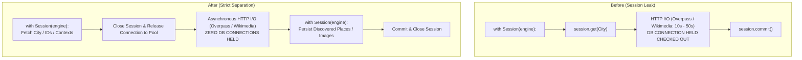

# Architectural Specification: Real-World Reliability & Concurrency Repair

**Document Status:** `[APPROVED]`  
**Author:** Antigravity Architect  
**Date:** 2026-09-21  
**Target Invariants:** Invariants 1 through 8  

---

## 1. Architectural Invariants

| Invariant | Principle | Enforcement Mechanism |
| --- | --- | --- |
| **Invariant 1** | **No DB session across provider I/O** | Explicit session detachment. External HTTP calls (Overpass, Geoapify, Wikimedia) run strictly between short DB sessions. |
| **Invariant 2** | **Foreground request paths stay short** | Foreground endpoints perform short DB read/write + in-memory processing only. Zero blocking on provider discovery or image resolution. |
| **Invariant 3** | **Recommendation remains cache/persistence-first** | Reads persisted POIs from database. Zero synchronous external place discovery in recommendation endpoint. |
| **Invariant 4** | **Background work cannot monopolize DB pool** | Prefetch queries batched in single session. Background threads do not hold connections during network I/O. |
| **Invariant 5** | **Image resolution is independently retryable** | Image lookups never block recommendation delivery or throw unhandled exceptions to client. |
| **Invariant 6** | **Queue waiting and network timeout are decoupled** | Total per-item timeout does NOT tick while waiting for `Semaphore` work slot. Network timeout applies only to active HTTP I/O. |
| **Invariant 7** | **Local fallbacks are deterministic** | Every normalized category has a mapped fallback asset. `generic_place.webp` acts as semantic safety net before neutral icon. |
| **Invariant 8** | **No city-specific implementation hacks** | Uniform logic across Shillong, Jaipur, Manali, Rishikesh, Goa, Varanasi, Udaipur. |

---

## 2. Component Architectural Designs

### A. Database Session Lifecycle & Ownership (Phases 6 & 12)



#### Detailed Transaction Protocol
1. **Durable Place Refresh**:
   - `request_refresh()`: Fetch all `PlaceRefreshJob` rows for requested categories in **one single `SELECT ... WHERE versioned_category IN (...)`** query. Compare in memory, batch updates, `session.commit()` once.
   - `execute_job()`:
     - Step 1: Open short session to acquire durable lease (`UPDATE ... WHERE state = 'queued' RETURNING ...`). Expunge/read plain `CityData(id, name, lat, lon)`. Close session.
     - Step 2: Await external provider discovery (`discover_places`).
     - Step 3: Open short session to persist places (`CanonicalPlaceService.ingest_places`) and update `PlaceRefreshJob` state to `COMPLETED`. Commit and close.
2. **Place Image Enrichment**:
   - `resolve_many()`:
     - Step 1: Open short session to query cache hits and place contexts (`_load_contexts`). Extract plain `PlaceImageContext` objects. Close session.
     - Step 2: Run `async with httpx.AsyncClient() as client: asyncio.gather(...)` for image lookups.
     - Step 3: Open short session, batch insert/update `PlaceImageCache` rows, commit, and close.

---

### B. Trip Creation Optimization (Phase 7)

#### Target Sequence
1. Check `City` exists (`session.get(City, request.city_id)`).
2. If `request.request_id` provided, check existing `Trip` for idempotency.
3. Pre-generate `effective_trip_id = request.request_id or uuid4()`.
4. Construct `Trip(id=effective_trip_id, ...)`.
5. Construct list of `TripPreference(trip_id=effective_trip_id, ...)`.
6. Construct list of `TripDay(trip_id=effective_trip_id, ...)` using in-memory helper `build_default_trip_days` without `session.flush()`.
7. Add all entities:
   ```python
   session.add(trip)
   session.add_all(preferences)
   session.add_all(days)
   session.commit()
   ```
8. Construct `TripRead` directly from in-memory objects without `session.refresh(trip)`.
9. Total round trips reduced from **6 sequential WAN operations to 2** (or 1 on warm cache), cutting latency from ~12,600 ms to < 1,500 ms.
10. Update Flutter client timeout in `lib/services/trip_service.dart` to 30.0s as defensive headroom.

---

### C. Recommendation Candidate Snapshot Reuse (Phase 8)

#### Target Sequence
1. In `RecommendationService`:
   - Expose `recommend_with_snapshot()` returning `tuple[list[RecommendationRead], PersistedPlaceCandidateSnapshot]`.
2. In `backend/app/routers/places.py:_recommend_in_worker()`:
   ```python
   recommendation_started = time.monotonic()
   result, snapshot = asyncio.run(
       recommendation.recommend_with_snapshot(
           session=worker_session,
           city=city,
           request=request,
       )
   )
   ```
3. Remove the redundant `PersistedPlaceReader().read()` call (line 128).
4. Eliminates ~7,500 ms of redundant WAN database queries per recommendation request.

---

### D. Image Resolution Concurrency & Queue Decoupling (Phase 9)

#### Target Sequence
1. Worker Concurrency: `semaphore = asyncio.Semaphore(settings.place_image_concurrency)`.
2. Inside `resolve_one`:
   - Acquire worker slot: `async with semaphore:`
   - Inside provider call: acquire `rate_controller` lock.
   - Decoupled timeout: The `timeout` in `asyncio.wait_for` wraps **only the provider network HTTP request**, NOT the waiting time in the semaphore queue:
     ```python
     async with semaphore:
         # Queue wait is complete; now execute provider lookup with bounded timeout
         candidate, had_error = await self._resolve_context_with_timeout(context, providers)
     ```
3. If Wikimedia times out or fails with 429, immediately fallback to Geoapify or Wikipedia without failing the place.
4. Only mark `status = 'failed', failure_reason = 'provider_error'` if all available providers fail with network/5xx errors.

---

### E. Image Cache Poisoning Recovery (Phase 10)

#### Target Protocol
- Implement `cleanup_poisoned_image_cache(session: Session, city_id: UUID | None = None) -> int`:
  ```sql
  DELETE FROM place_image_cache
  WHERE status = 'failed' AND failure_reason = 'provider_error';
  ```
- Leaves `resolved` and legitimate `not_found` rows completely untouched.
- Allows places previously starved by the lock bug to be resolved fresh.

---

### F. Semantic Category Fallback Architecture (Phase 11)

#### Target Mapping Table
| Normalized Backend Category | Target Flutter Fallback Asset | Verified Semantics |
| --- | --- | --- |
| `restaurant` | `assets/images/place_fallbacks/restaurant.webp` | Authentic food / restaurant setting (replaced) |
| `hotel` | `assets/images/place_fallbacks/hotel.webp` | Authentic hotel / lodging room/facade (replaced) |
| `cafe` | `assets/images/place_fallbacks/cafe.webp` | Cafe / coffee setting |
| `landmark` | `assets/images/place_fallbacks/fort_palace.webp` | Historic monument / landmark |
| `place_of_worship` | `assets/images/place_fallbacks/temple.webp` | Temple / spiritual |
| `museum` | `assets/images/place_fallbacks/museum.webp` | Museum / exhibition |
| `park_garden` | `assets/images/place_fallbacks/park_garden.webp` | Park / greenery |
| `waterfall` | `assets/images/place_fallbacks/waterfall.webp` | Waterfall / nature |
| `hill_viewpoint` | `assets/images/place_fallbacks/hill_viewpoint.webp`| Hill / viewpoint |
| `market_shopping` | `assets/images/place_fallbacks/market.webp` | Market / bazaar |
| `other` | `assets/images/place_fallbacks/generic_place.webp` | Generic travel scenery |

#### Fallback Priority Chain
1. Remote Image URL (from `place_image_cache` or CDN)
2. Normalized Category Asset (`_fallbackByCategory[normalizedCategory]`)
3. Raw Category / Name Keyword Alias Match
4. `assets/images/place_fallbacks/generic_place.webp` (Generic Photographic Asset)
5. `_NeutralPlaceFallback` (Only as absolute last resort when no asset is loadable)
